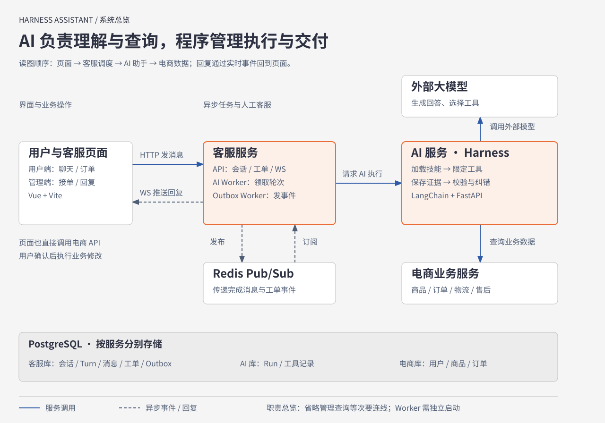

# Harness Assistant 项目说明

> 阅读目标：快速弄清楚“项目做什么、有哪些模块、消息如何处理、用了什么技术”。依据当前源码整理，未执行真实模型端到端验证。

## 1. 一句话认识项目

这是一个**支持 AI 与人工协作的电商客服系统**：用户可以问商品、订单、物流和售后问题，AI 查询业务数据后回答；需要人工处理时，由客服工作台接管。

项目中的 **Harness** 可以理解为“管理 AI 工作过程的一套程序”：规定 AI 能使用哪些工具，保存查询证据，检查回答，并决定结果是否还适合发送给用户。

## 2. 整体架构

[打开独立架构图页面](architecture.html)

图中按职责合并两个前端，以及客服 API 与两个独立 Worker；底部列出三个服务各自的数据归属。为了便于阅读，省略了页面直连电商 API、管理端查询 AI 运行记录等次要连线。

| 模块 | 通俗解释 | 核心职责 | 目录 / 默认端口 |
| --- | --- | --- | --- |
| 用户前端 | 顾客使用的页面 | 发消息、看订单、点击业务操作入口 | `frontend/user-frontend` / 5173 |
| 管理前端 | 人工客服工作台 | 接单、回复、结束人工服务、查看运行记录 | `frontend/admin-frontend` / 5174 |
| Customer Service | 客服调度中心 | 保存会话、组织轮次、处理人工工单、推送消息 | `customer-service` / 8000 |
| AI Service | 带规则约束的 AI 助手 | 调用模型、选择技能、查询工具、校验输出、记录运行 | `ai-service` / 8002 |
| E-commerce Service | 电商业务系统 | 商品、订单、物流、售后、演示登录及业务写接口 | `backend/ecommerce-service` / 8001 |

## 3. 一条消息如何得到回复

以“帮我看看订单到哪了”为例：

1. **收消息**：用户前端通过 HTTP 发送消息，客服服务先保存它。
2. **组成一轮**：短时间内连续发送的消息可以合并为一个 Turn，避免每个短句都触发一次 AI。
3. **后台处理**：AI Worker 从数据库领取到期 Turn，整理历史和本轮输入，请求 AI Service。
4. **查询业务**：Agent 加载物流相关技能，通过工具调用电商 API，得到订单或物流数据。
5. **检查回答**：校验结构化输出、部分业务事实和页面入口；可纠正的输出错误允许有限重试。
6. **检查时效**：客服服务检查用户是否已经发来更新的输入；过期结果会被淘汰。有效结果和待推送事件写入数据库。
7. **推送页面**：Outbox Worker 将事件发到 Redis，客服 API 的 WebSocket 把消息转发给前端。

**HTTP 负责提交请求，WebSocket 负责接收完成消息。** 当前模型调用使用 `ainvoke`，不是逐 token 输出。

如果 AI 返回转人工结果，客服服务创建工单，人工客服通过管理端接单、回复、结束服务，再回到 AI 模式。

## 4. 技术栈及作用

版本范围来自依赖声明，具体安装版本以各服务锁文件为准。

| 技术 | 在这里做什么 | 声明 / 说明 |
| --- | --- | --- |
| Python | 三个后端服务的开发语言 | ≥ 3.12 |
| FastAPI + Uvicorn | 提供 HTTP API、WebSocket 和服务运行入口 | FastAPI ≥ 0.116；Uvicorn ≥ 0.35 |
| Vue + Vite + JavaScript | 构建用户端与客服管理端 | manifest 使用 `latest`，由 npm 锁文件锁定版本 |
| LangChain | 创建 Agent，组织工具调用、中间件和结构化输出 | ≥ 1.0 且 < 2.0 |
| 模型适配层 | 连接 OpenAI 兼容接口、DeepSeek / Qwen 配置分支 | 模型与服务地址由配置决定，模型运行在外部服务 |
| Pydantic / pydantic-settings | 校验输入输出结构、读取配置 | 配置库 ≥ 2.10.1 |
| PostgreSQL | 保存业务数据、聊天记录、轮次、工单和 AI 运行记录 | 当前文档不指定数据库服务端版本 |
| SQLAlchemy + psycopg | 数据模型、事务和 PostgreSQL 连接 | SQLAlchemy ≥ 2.0.41；psycopg ≥ 3.2.9 |
| Redis Pub/Sub | 在后台发布者与 WebSocket 订阅者之间传递事件 | Redis Python 客户端 ≥ 6.2；不是 AI 任务队列 |
| HTTPX | 服务之间的 HTTP 请求 | 客服服务声明 ≥ 0.28.1 |
| PyJWT | 签发和校验访问令牌 | ≥ 2.10.1；当前登录是演示机制 |
| marked + DOMPurify | 用户端 Markdown 展示与 HTML 清理 | 见用户端依赖声明 |
| uv / npm | 分别管理 Python 与前端依赖 | 保留 `uv.lock` / `package-lock.json` |

## 5. AI 为什么不是“问模型后直接返回”

| 机制 | 解决的问题 | 当前边界 |
| --- | --- | --- |
| 领域技能 + 工具范围 | 限定 AI 当前可以查什么 | 五类业务技能：商品、订单、物流、平台政策、实际售后记录 |
| 工具调用记录 | 回答有可追查的数据来源 | 保存参数、结果和调用信息，不代表上游数据绝对正确 |
| 结构化输出 | 后端知道该回答、追问、拒绝还是转人工 | 四类结果：ANSWER / CLARIFY / DECLINE / REQUEST_HANDOFF |
| 回答与页面动作校验 | 拦截部分无依据事实和不合适的页面入口 | 规则覆盖有限，不能保证全部自然语言事实正确 |
| 有限重试 | 允许修正可纠正输出，限制无限调用 | 输出最多执行两次尝试；单次 Agent 调用工具上限为 8 |
| 输入版本核查 | 用户更新问题后，避免发送旧结果 | 比较轮次快照和会话最新输入版本 |

取消订单、修改地址、提交售后等操作由**用户在页面确认后调用电商写接口**完成。Agent 当前负责查询和页面引导，不能把它描述成已经自动完成退款。

## 6. 数据放在哪里

| 存储归属 | 主要数据 | 用途 |
| --- | --- | --- |
| 客服数据库 | Conversation、ConversationTurn、Message、Handoff、RealtimeOutbox | 保存会话、待处理任务、消息、人工工单与待发布事件 |
| AI 数据库 | AgentRun、AgentToolCall | 追查一次 AI 执行、工具证据、状态、耗时和 Token 统计 |
| 电商数据库 | User、Product、Order、OrderItem、Logistics、AfterSale、IdempotencyRecord | 保存真实业务对象与写操作相关记录 |
| Redis | 在线订阅频道中的实时事件 | 传递通知，不替代数据库历史记录 |

三个容易混淆的概念：**Conversation 是一段会话，Turn 是一次待处理的输入轮次，AgentRun 是一次 AI 服务执行记录。** 一段会话可以有多个轮次；失败重试也不能简单理解成从某个工具步骤原地恢复。

Outbox 可以理解为“先存在数据库里的待发送通知”。它改善消息落库与事件发布之间的衔接，但不代表客户端恰好收到一次；Redis Pub/Sub 本身也不保存离线消息积压。

## 7. 启动需要什么

开发环境需要 **PostgreSQL、Redis、可用的模型 API、Python 与 Node.js**。

应用侧共需启动 **7 个长驻进程**：三个后端 API、两个客服 Worker、两个前端开发服务器。只启动客服 API 不会自动启动 AI Worker 和 Outbox Worker。

三个后端共享一致的 JWT 密钥与算法；客服服务和 AI 服务共享内部调用令牌。两个 Python 服务都叫 `atguigu` 包，应使用各自的工作目录和虚拟环境。

配置示例、初始化和启动命令统一见 [README 本地运行说明](../README.md#本地运行)，避免多份命令发生漂移。不要将模型密钥放入前端 `VITE_*` 配置。

## 8. 已有能力与尚未完成的部分

**当前已有实现：** 多服务拆分、消息合并、数据库轮次领取、工具范围控制、输出校验、运行记录、人工接单和实时消息推送。

**仍需完善或验证：**

- 知识查询返回固定政策数据，尚未接入真实文档检索 / RAG。
- 管理端有知识库和评测界面，但不能据此认定对应后端已实现。
- 演示登录需要替换为正式身份认证；Run 归属与状态迁移检查也有改进空间。
- 租约竞争、重复发布、故障恢复和完整聊天链路仍需自动化与集成测试验证。

这是基于源码的架构说明，不是性能测试、生产稳定性或端到端运行成功的证明。

## 9. 看源码从哪里开始

推荐按一条消息的顺序阅读，而不是从所有目录依次翻阅：

| 想理解什么 | 源码入口 |
| --- | --- |
| 页面调用哪个服务 | [用户端 API](../frontend/user-frontend/src/api.js) |
| 消息如何形成轮次 | [TurnService](../customer-service/atguigu/app/services/chat/turn.py) |
| 谁在后台调用 AI | [AIWorker / TurnProcessor](../customer-service/atguigu/worker/ai/worker.py) |
| Agent 如何组装 | [Agent 工厂](../ai-service/atguigu/agent/factory.py) |
| 技能开放哪些工具 | [技能目录](../ai-service/atguigu/agent/harness/skills/catalog.py) |
| 如何执行与纠错 | [AgentExecutor](../ai-service/atguigu/agent/harness/run/executor.py) |
| 如何检查输出 | [输出校验入口](../ai-service/atguigu/agent/harness/validator/output.py) |
| 如何把消息送回前端 | [Outbox Worker](../customer-service/atguigu/worker/realtime.py)、[WebSocket 路由](../customer-service/atguigu/app/routers/realtime.py) |

希望逐步学习时，在本项目使用 `$harness-project-learner`；专用技能包含课程和互动练习。
