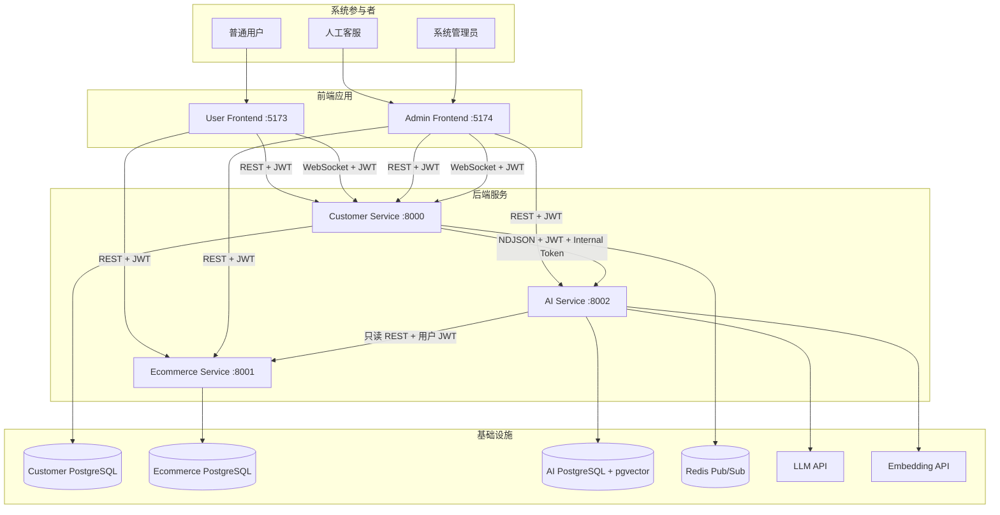
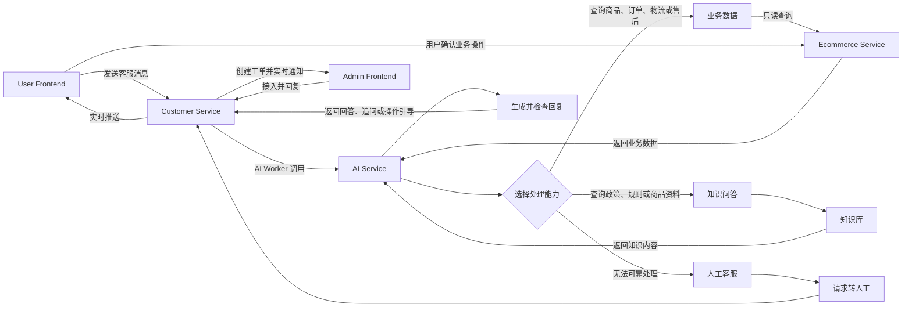
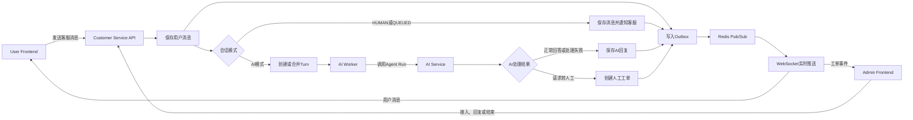
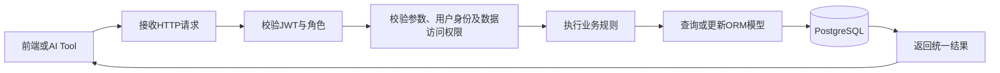
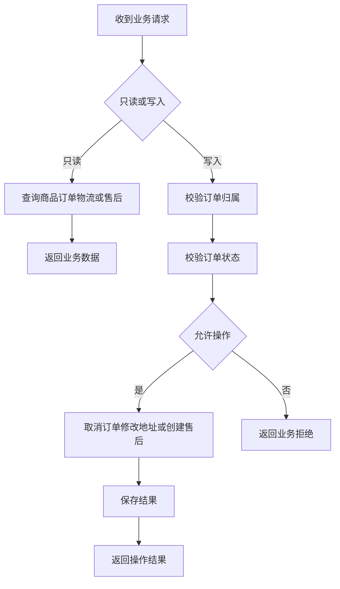
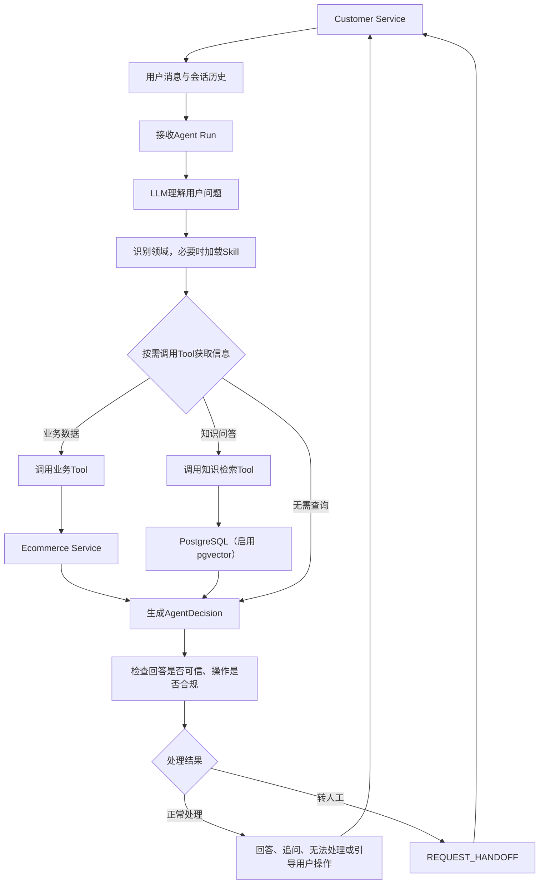
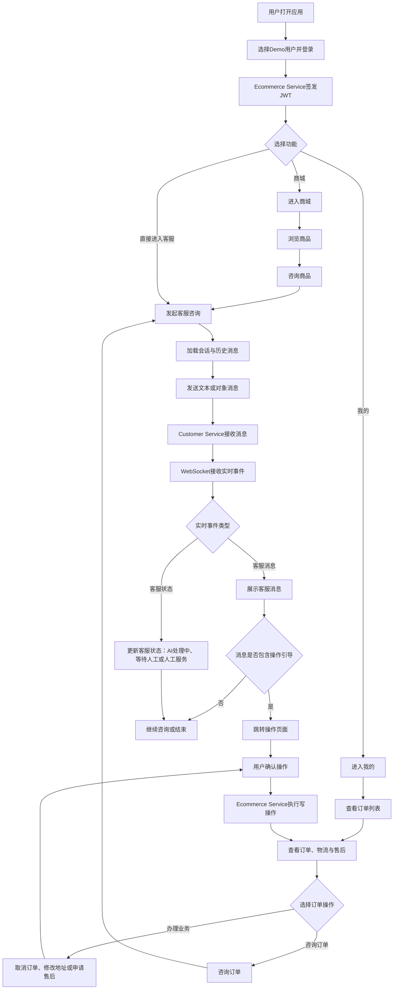
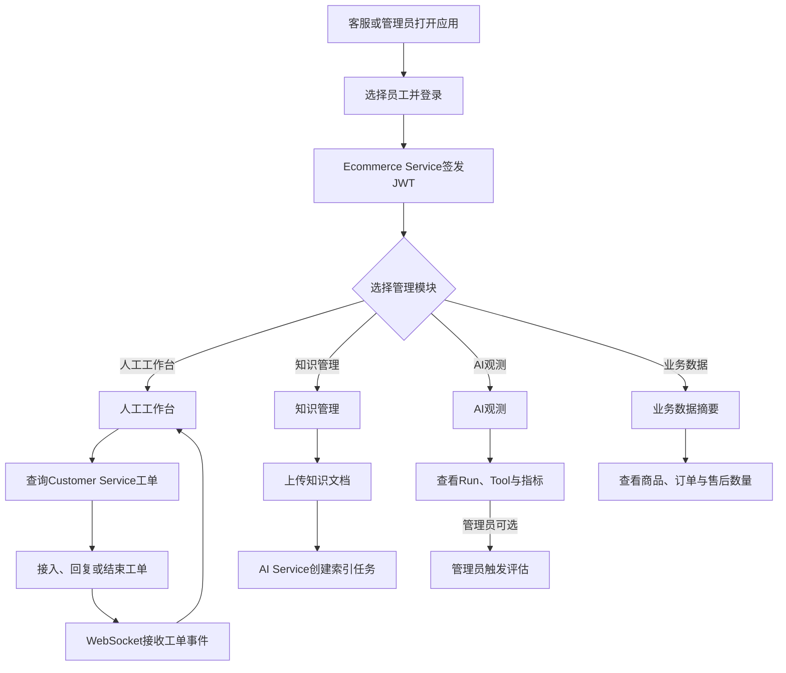
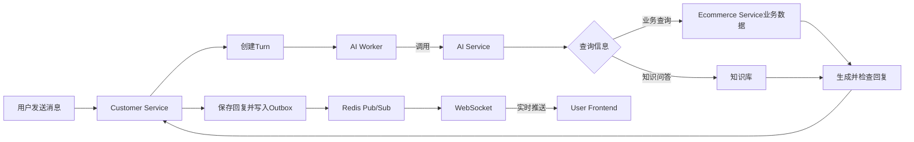
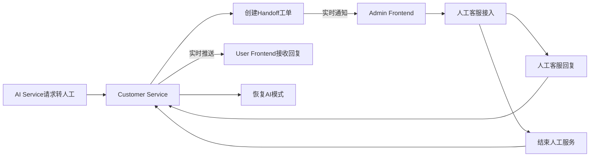

# Day 01：项目背景与架构

## 1. 项目背景

### 1.1 业务痛点

电商客服每天需要处理大量重复咨询，例如商品是否有货、订单当前状态、物流配送进度，以及订单能否取消或申请售后。完全依赖人工客服，会带来服务成本高、响应效率低和服务时间受限等问题。

为提高客服效率，本项目引入大模型处理重复咨询，帮助用户快速获得商品、订单、物流和售后相关信息。

但电商客服不同于普通问答。商品库存、订单状态和物流进度会不断变化，**回答必须以业务系统中的数据为准**；取消订单、修改地址和申请售后等操作还会修改业务数据，不能由大模型直接执行。

因此，大模型需要与业务数据、操作约束、运行审计和人工客服配合。如果缺少这些机制，可能产生以下风险：

- 回答内容与实际库存、订单状态或物流进度不一致；
- 错误理解业务规则；如果系统没有限制 AI 的写权限，还可能绕过用户确认修改业务数据；
- 无法追踪回答依据和处理过程；
- 对于复杂或不确定的问题，如果系统不能及时识别并转接人工客服，模型可能继续给出不可靠的回答。

### 1.2 解决方案

本项目采用 **“AI 优先、人工兜底、关键操作由用户确认”** 的解决方案：

1. Customer Service 接收并保存用户消息；
2. AI Service 理解问题，并按需查询 Ecommerce Service 或知识库；
3. AI Service 检查回复是否可靠，再返回回答、追问或操作引导；
4. 取消订单、修改地址和申请售后等操作，必须由用户在页面中确认；
5. AI 无法可靠处理时请求转人工，由 Customer Service 创建工单；
6. 管理端可以处理人工工单、维护知识库并查看 AI 运行情况。

### 1.3 核心场景

本项目覆盖四类核心场景：

1. 电商业务查询：查询商品、库存、订单、物流和售后信息；
2. 用户业务办理：用户确认后取消订单、修改地址或申请售后；
3. 智能客服：发送文本、商品或订单咨询，接收 AI 回答、追问和操作引导；
4. 人工与运营管理：人工客服接入会话，管理员维护知识库并观察 AI 运行情况。

### 1.4 用户角色

本项目包含三类角色：

- `customer`：普通用户，浏览商品、管理自己的订单并咨询客服；
- `agent`：人工客服，接入转人工工单、查看会话并回复用户；
- `admin`：系统管理员，除人工客服能力外，还可以接管工单、维护知识库和查看系统指标。

当前使用 Demo 用户体系，由 Ecommerce Service 根据预置用户签发 JWT。

---

## 2. 项目概览

### 2.1 系统组成

小满电商智能客服由两个前端项目和三个后端项目组成：

- User Frontend：面向普通用户，提供商城、订单和客服功能；
- Admin Frontend：面向人工客服和管理员，提供人工工作台、知识管理和 AI 观测；
- Customer Service：管理会话、消息、AI 调度、人工工单和实时通知；
- Ecommerce Service：管理商品、订单、物流和售后业务数据；
- AI Service：负责问题理解、业务查询、知识检索、回复生成和可靠性检查。

### 2.2 项目与端口

- `frontend/user-frontend`：用户端，默认端口 `5173`
- `frontend/admin-frontend`：客服与管理端，默认端口 `5174`
- `customer-service`：客服会话服务，默认端口 `8000`
- `ecommerce-service`：电商业务服务，默认端口 `8001`
- `ai-service`：AI 编排与知识服务，默认端口 `8002`

### 2.3 基础设施

- PostgreSQL：三个后端服务分别保存各自负责的数据；
- Redis：发布客服消息和人工工单等实时事件；
- LLM API：为 AI Service 提供大语言模型能力；
- Embedding API：将知识文档转换为可检索的向量。

### 2.4 业务边界

当前项目重点演示电商智能客服的完整协作流程，**不是完整电商交易平台**。以下能力尚未实现：

- 购物车、创建订单和在线支付；
- 发货管理以及库存扣减与回补；
- 售后审批和真实退款；
- 商品后台增删改；
- 正式用户注册、密码登录和刷新令牌。

Ecommerce Service 中的用户、商品和订单主要由种子数据生成，用于客服与 AI 功能联调。

---

## 3. 项目技术栈

### 3.1 后端基础栈

三个后端项目使用统一的 Python 技术体系：

- Python `3.12+`：后端运行环境；
- FastAPI + Uvicorn：构建和运行 HTTP API；
- Pydantic 2 + pydantic-settings：数据校验与配置管理；
- SQLAlchemy 2 + PostgreSQL + psycopg 3：数据持久化；
- PyJWT：用户身份认证。

### 3.2 Customer 技术栈

- SQLAlchemy AsyncSession：异步访问会话、消息和任务数据；
- Redis AsyncIO：通过 Pub/Sub 发布实时事件；
- WebSocket：向用户端和管理端推送消息；
- HTTPX：AI Worker 调用 AI Service。

### 3.3 Ecommerce 技术

- FastAPI REST API：提供商品、订单、物流和售后接口；
- SQLAlchemy Session：访问电商业务数据；
- PyJWT + 角色权限：限制不同用户的数据操作范围。

### 3.4 AI 技术

- LangChain `1.x`：模型、Tool 调用和结构化决策；
- langchain-openai、langchain-deepseek：连接 OpenAI 兼容、DeepSeek 或 Qwen 模型接口；
- HTTPX：调用 Ecommerce Service、Embedding API 等外部接口；
- NDJSON：向 Customer Service 分阶段返回 AI 运行结果；
- PostgreSQL + pgvector：保存知识内容并执行向量检索；
- Embedding API：生成知识文本向量；
- PyPDF：解析 PDF 知识文档。

---

## 4. 项目架构

### 4.1 架构总览

五个项目共同组成一条完整的电商客服业务链路。

`User Frontend` 是用户入口，`Customer Service` 负责会话编排，`AI Service` 提供业务数据查询与知识问答能力，`Ecommerce Service` 保存业务事实。

`Admin Frontend` 则承接人工服务和运营管理。

整个电商系统以“**业务数据**、**知识问答**、**人工客服**”三种能力响应用户请求。

### 4.2 五服务交互

主流程体现了三种核心服务能力：

1. **业务数据**：AI Service 通过只读 Tool 查询 Ecommerce Service 中的商品、订单、物流和售后事实，再生成可验证的回答；
2. **知识问答**：AI Service 从知识库检索政策、服务规则，由模型结合知识内容生成回答；
3. **人工客服**：当问题需要人工判断或 AI 无法可靠处理时，Customer Service 创建工单并通知 Admin Frontend，由客服接入原有会话。

三条能力链路都由 **Customer Service 统一承接用户会话**。AI 回复最终通过 Customer Service 返回用户；涉及取消订单、修改地址或申请售后时，AI 只返回操作引导，不直接修改业务数据，再由用户在 User Frontend 确认并直接调用 Ecommerce Service。

### 4.3 Customer Service

整个客服系统的会话中枢：向前承接用户端和管理端请求，向后调度 AI Service，并通过 PostgreSQL、Redis 和 WebSocket 保证消息持久化与实时送达。代码按接口、服务、仓储和基础设施分层，同时运行 API、AI Worker 与 Outbox Worker 三类进程。

#### 4.3.1 运行流程

#### 4.3.2 核心能力

Customer Service 由三个相互配合的进程组成：

1. FastAPI API 进程负责会话、消息和人工工单的请求接入；
2. AI Worker 领取到期 Turn，调用 AI Service，并将处理结果写回消息系统；
3. Outbox Worker 读取待发布事件，通过 Redis Pub/Sub 和 WebSocket 推送给前端。

三个进程共同提供会话管理、消息持久化、AI 调度、人工接管和实时通知等核心能力。它们共享 PostgreSQL 中的业务状态，但职责彼此独立。

#### 4.3.3 小结

**Customer Service 是整个客服系统的连接中心。**它既保存完整会话和消息，也负责把用户请求交给 AI 或人工处理，并将处理结果实时推送到对应前端。

### 4.4 Ecommerce Service

系统中的电商业务数据源，统一管理用户、商品、订单、物流与售后数据。用户端可以查询并执行受控写操作，AI Service 只能以当前用户身份通过 Tool 进行只读查询，从而将“事实查询”和“智能决策”清晰分开。

#### 4.4.1 运行流程

#### 4.4.2 核心能力

服务持有五类核心业务数据：

- 用户：提供用户身份和角色
- 商品：保存名称、分类、价格、规格、状态和库存
- 订单与订单项：保存订单归属、金额、地址和商品明细
- 物流：保存承运公司、运单号、状态和轨迹
- 售后单：保存退款、退货或换货申请

用户端和 AI Tool 都可以发起查询，但只有用户端可以在确认后执行写操作：

#### 4.4.3 小结

**Ecommerce Service 是系统中的业务事实来源。**它负责保存和管理业务数据，既为用户页面提供读写接口，也为 AI Tool 提供可信的只读数据；所有关键写操作仍由用户端确认后执行。

### 4.5 AI Service

它不是一个直接面向浏览器的普通聊天接口，而是由 Customer Service 调用的 AI 编排与审计服务。该服务把模型、Tool、Skill、知识库和确定性校验组织成完整 Harness，使最终回复不仅来自 LLM，还必须经过规则验证。

#### 4.5.1 运行流程

AI Service 接收 Customer Service 提交的用户消息和会话历史，使用领域 Skill 辅助处理问题，并按需通过 Tool 查询电商数据或知识库，最后检查回复是否可靠：能够处理时返回回答、追问或操作引导；无法可靠处理时通知 Customer Service 转接人工客服。

#### 4.5.2 核心能力

AI Service 主要提供以下能力：

1. 使用 Skill 为商品、订单、物流和售后问题提供处理指导
2. 使用 Tool 查询 `Ecommerce Service` 中的业务数据
3. 从知识库检索平台服务政策
4. 检查回答是否可信、操作引导是否合规
5. 无法可靠处理时请求转人工客服

AI Service 会记录每次 AI 运行和 Tool 调用，方便管理员查看处理过程和排查问题。Knowledge Worker 负责在后台处理上传的知识文档，并将文档转换为可检索的知识内容。

#### 4.5.3 小结

**AI Service 是系统的智能处理中心。**它负责理解问题、查询信息、生成回复和判断是否需要转人工。它只读取 Ecommerce Service 中的业务数据，不直接取消订单、修改地址或申请售后；这些操作仍需用户在 User Frontend 中确认。

### 4.6 User Frontend

它是普通用户访问商城和客服系统的统一入口，一侧连接 Customer Service 完成会话与实时消息，另一侧连接 Ecommerce Service 完成登录、业务查询和用户确认后的写操作。

#### 4.6.1 用户流程

#### 4.6.2 核心能力

User Frontend 主要提供以下能力：

1. 选择用户并完成登录
2. 浏览商城商品，并携带商品信息发起咨询
3. 查看订单、物流和售后信息，并携带订单信息发起咨询
4. 发送客服消息，查看会话历史
5. 实时接收客服回复和处理状态
6. 根据客服引导确认取消订单、修改地址或申请售后。

#### 4.6.3 小结

**User Frontend 是普通用户的统一入口。**它同时承担电商页面和客服入口，但不直接调用 AI Service。聊天消息统一经过 Customer Service，关键业务写操作则必须回到前端页面由用户确认，再提交给 Ecommerce Service。

### 4.7 Admin Frontend

它是人工客服与管理员共用的运营入口，通过 Customer Service 处理人工工单，通过 AI Service 管理知识和观察 Agent Run，并通过 Ecommerce Service 完成登录和查看基础业务摘要。

#### 4.7.1 管理流程

#### 4.7.2 核心能力

Admin Frontend 主要提供以下能力：

1. 选择客服或管理员账号并完成登录
2. 查看人工工单，执行接入、回复、结束或管理员接管
3. 实时接收新工单和会话消息
4. 上传和查看知识文档
5. 查看 Agent Run、Tool 调用和运行指标
6. 触发 AI 评估，并查看商品、订单和售后数量摘要。

#### 4.7.3 小结

**Admin Frontend 是人工客服与管理员的统一工作台。**它把人工服务、知识运营和 AI 可观测性集中在一个管理界面中。`agent` 主要处理工单并查看运行信息，`admin` 还可以上传知识、接管工单和触发评估。

### 4.8 架构原则

1. **职责分离**：Ecommerce Service 管理业务数据，Customer Service 管理会话与消息，AI Service 负责智能处理，两个前端分别服务用户和客服人员；
2. **事实驱动**：AI 通过 Tool 查询真实电商数据或知识库，并检查回复是否可靠，避免仅依赖模型自身生成答案；
3. **写操作受控**：AI 只查询业务数据，不直接取消订单、修改地址或申请售后，关键操作必须由用户确认；
4. **AI 优先、人工兜底**：常见问题由 AI 自动处理，无法可靠回答时转接人工客服，并保留原有会话内容；
5. **异步解耦与实时通知**：耗时的 AI 处理和事件发布由 Worker 完成，前端通过 WebSocket 实时接收回复与工单状态。

### 4.9 本章小结

从整体上看，五个项目不是简单地并列部署，而是围绕一次客服请求形成协作闭环：User Frontend 提供用户入口，Customer Service 维持会话并协调实时消息，AI Service 完成推理与校验，Ecommerce Service 提供可信业务数据，Admin Frontend 则处理人工接管、知识维护和运行观测。

这种结构把界面交互、会话状态、AI 能力和电商事实分配给不同项目。每个项目只处理自身边界内的职责，又通过 JWT、REST、 WebSocket 串联起来，从而形成“AI 自动处理、人工及时兜底、业务操作受控执行”的完整客服流程。

---

## 5. 数据与异步任务

### 5.1 Customer Service 数据

Customer Service 使用独立数据库，核心表包括：

- `conversations`
- `messages`
- `conversation_turns`
- `handoffs`
- `realtime_outbox`

Redis 仅用于 Pub/Sub，不作为会话或业务数据缓存。

### 5.2 AI Service 数据

AI Service 使用独立 PostgreSQL，并启用 pgvector，核心表包括：

- `agent_runs`
- `agent_tool_calls`
- `agent_conversation_cursors`
- `knowledge_jobs`
- `knowledge_documents`
- `knowledge_chunks`

AI Service 不负责保存用户会话和聊天消息，这些数据由 Customer Service 管理。AI Service 只保存每次 AI 处理的运行记录、Tool 调用记录和知识库数据，方便后续查询与审计。

### 5.3 Ecommerce Service 数据

Ecommerce Service 使用独立数据库，核心表包括：

- `users`
- `products`
- `orders`
- `order_items`
- `logistics`
- `after_sales`

### 5.4 异步机制

项目没有引入 Kafka、RabbitMQ 等独立消息队列，而是使用 PostgreSQL、Worker 和 Redis 完成三类后台任务：

1. **AI 消息处理**

   用户消息 → Turn 任务 → AI Worker → AI Service

   Customer Service 将需要 AI 处理的消息保存为 Turn，由 AI Worker 在后台领取并调用 AI Service，避免用户请求一直等待 AI 完成。

2. **实时消息通知**

   业务事件 → Outbox → Outbox Worker → Redis → WebSocket

   用户消息、AI 回复和人工工单等事件先写入 Outbox，再由 Worker 发布到 Redis，最后通过 WebSocket 通知用户端或管理端。

3. **知识文档处理**

   上传文档 → Knowledge Job → Knowledge Worker → 知识库

   AI Service 将上传的文档保存为后台任务，由 Knowledge Worker 完成解析、分块和向量化，避免上传请求长时间阻塞。

---

## 6. 通信与安全

### 6.1 通信方式

五个项目主要使用三种通信方式：

1. **REST**：用于登录、商品和订单查询、业务写操作、知识管理与人工工单操作；
2. **流式 JSON（NDJSON）**：用于 AI Service 分阶段返回处理结果，Customer Service 的 AI Worker 可以逐条接收并处理；
3. **WebSocket**：用于向用户端和管理端实时推送客服消息、处理状态和人工工单事件。

User Frontend 不直接调用 AI Service，用户聊天统一经过 Customer Service，再由 AI Worker 调用 AI Service。Admin Frontend 仅在知识管理和运行观测等管理场景中直接调用 AI Service。

### 6.2 认证与权限

- Ecommerce Service 负责签发演示账号 JWT；
- 用户端和管理端携带 JWT 调用后端接口；
- 三个后端使用相同的 JWT 配置识别用户身份；
- Customer Service 调用 AI Service 时额外携带内部服务令牌；
- AI Service 使用当前用户身份查询 Ecommerce Service；
- 系统包含三种角色，不同角色只能访问与自身职责对应的功能：
  - `customer`：普通用户，可以浏览商品、查看自己的订单、咨询客服和确认业务操作；
  - `agent`：人工客服，可以接入人工工单、回复用户和结束人工服务；
  - `admin`：系统管理员，可以接管人工工单、上传知识文档、查看系统指标和触发 AI 评估。

### 6.3 可靠性

系统通过以下机制减少重复处理和消息丢失：

1. 消息和业务写操作使用唯一标识，避免重复提交；
2. Worker 领取后台任务，避免同一任务被重复处理；
3. AI 运行使用版本检查，避免旧回复覆盖用户的新消息；
4. 业务事件先写入 Outbox，再发布到 Redis。

---

## 7. 总结

小满电商智能客服由两个前端和三个后端组成：

- Ecommerce Service 保存商品、订单、物流和售后事实；
- Customer Service 管理会话、消息、AI Turn、人工接管和实时推送；
- AI Service 负责模型推理、只读工具、知识库、校验与审计；
- User Frontend 承载用户商城、订单和客服体验；
- Admin Frontend 承载人工接待、知识管理与 AI 观测。

系统最重要的主链路是：

当 AI 无法可靠处理时，系统进入：

这一架构的核心思想是：**让业务系统提供事实，让 AI 负责理解与编排，让用户确认关键写操作，让人工客服处理不确定问题。**
