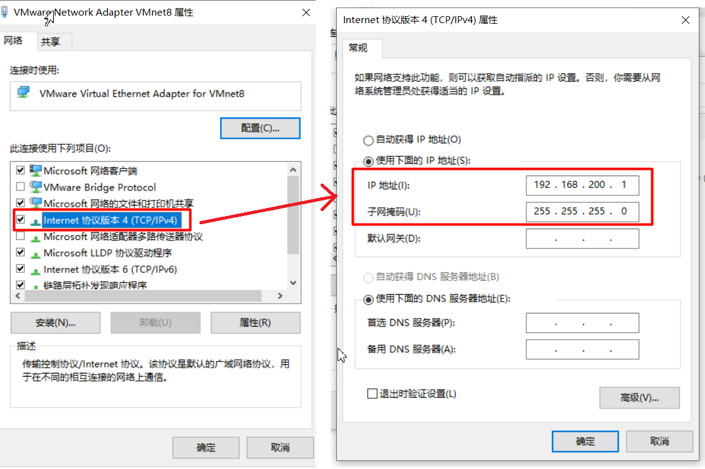
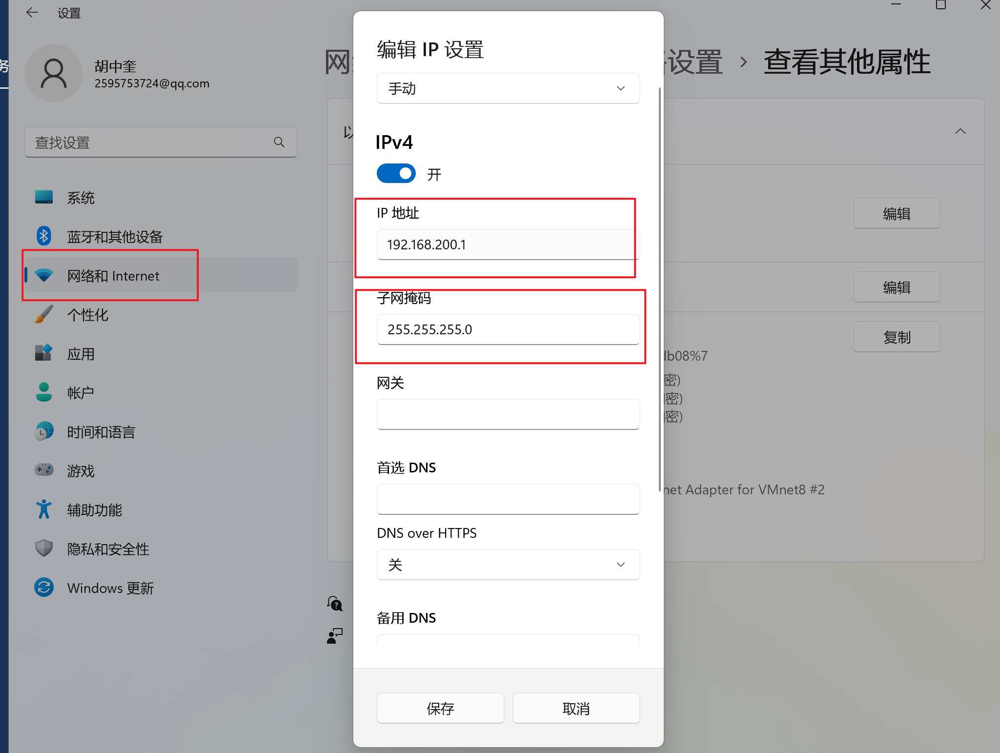
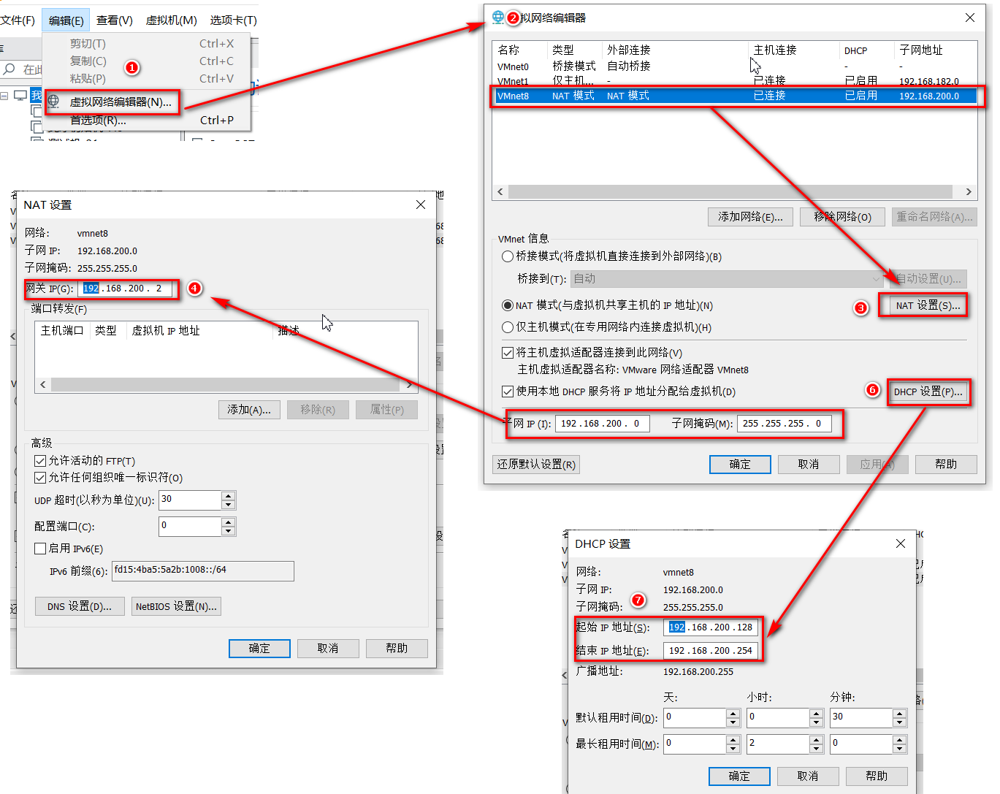
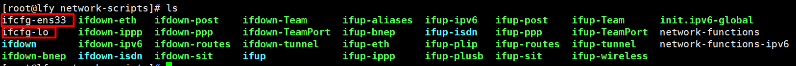
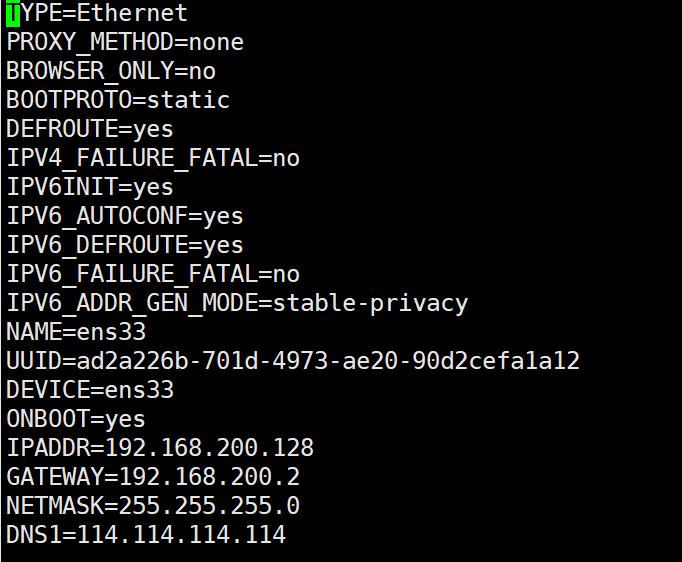

# 	Docker环境安装


## 一、统一虚拟机设置

### 1、修改VMnet8网卡

**windows10**



**windows11**




### 2、确认网卡信息




### 3、修改静态Ip

```sh
网卡所在目录
cd  /etc/sysconfig/networks-scripts

ls
```




```sh
# 如上图，则修改ens33即可，下面为模板，
# 需要注意的字段。
#  ONBOOT=yes               IPADDR=192.168.200.128      GATEWAY=192.168.200.2 
#  NETMASK=255.255.255.0    DNS1=114.114.114.114        BOOTPROTO=static
TYPE=Ethernet
PROXY_METHOD=none
BROWSER_ONLY=no
BOOTPROTO=static
DEFROUTE=yes
IPV4_FAILURE_FATAL=no
IPV6INIT=yes
IPV6_AUTOCONF=yes
IPV6_DEFROUTE=yes
IPV6_FAILURE_FATAL=no
IPV6_ADDR_GEN_MODE=stable-privacy
NAME=ens33
UUID=ad2a226b-701d-4973-ae20-90d2cefa1a12
DEVICE=ens33
ONBOOT=yes
IPADDR=192.168.200.128
GATEWAY=192.168.200.2
NETMASK=255.255.255.0
DNS1=114.114.114.114

### 你的网卡至少可以为
BOOTPROTO=static
DEFROUTE=yes
NAME=ens33
UUID=b8fd5718-51f5-48f8-979b-b9f1f7a5ebf2
DEVICE=ens33
ONBOOT=yes
IPADDR=192.168.200.128
GATEWAY=192.168.200.2
NETMASK=255.255.255.0
DNS1=114.114.114.114

```




### 4、用xshell等工具连接

> 设置完静态Ip后，使用Xshell等连接工具连接即可。


## 二、安装**Docker**

> 官方文档：https://docs.docker.com/engine/reference/commandline/docker/

### 1、修改yum源

```sh
yum clean all   # 清除旧缓存
yum makecache   # 构建新缓存
```

### 2、移除之前的Docker和有关依赖

```sh
sudo yum remove docker *
```

### 3、安装Docker repository

```sh
sudo yum install -y yum-utils
sudo yum-config-manager \
    --add-repo \
    http://mirrors.aliyun.com/docker-ce/linux/centos/docker-ce.repo
# 从国内阿里云镜像站，同步 Docker 官方的所有安装包
```

### 4、安装Docker Engine

```sh
sudo yum install docker-ce docker-ce-cli containerd.io docker-compose-plugin -y
# docker-ce: Docker 后台核心守护进程，负责处理高级业务（如网络、存储）并调度底层
# docker-ce-cli: Docker 命令行工具，负责在终端接收并传达用户输入的命令
# containerd.io: 底层容器运行时，负责真正去执行容器的生命周期管理和镜像存储
# docker-compose-plugin: 多容器编排插件，支持用 docker compose 一键运行多个容器
```

### 5、开启Docker

```sh
sudo systemctl enable docker --now

#和上面等价
sudo systemctl start docker
systemctl enable docker
```


