# 第二天：客服会话建模与分层实现

第一天从项目背景出发，梳理了用户端、管理端、客服服务、电商服务和智能服务之间的协作关系，也明确了**客服服务是整条对话链路的会话中枢**。第二天开始进入客服服务内部，围绕“当前会话”和“会话详情”两个接口，完成会话模块的数据建模、分层查询与业务流程设计。

本章不会孤立地介绍某一个类，而是沿着一次真实请求经过的路径展开：请求先进入路由层，经过身份校验后调用业务服务层；业务服务层再通过数据访问层读取或写入数据库，最终由响应模型约束返回给前端的数据。

---

## 1. 从系统架构进入会话模块

第一天已经明确，用户端不会直接调用智能服务，而是先把客服请求提交给客服服务。客服服务要继续完成消息接收、智能处理和人工接管，**首先必须知道用户当前处于哪一个会话**。因此，会话模块是后续消息模块和处理轮次模块的基础。

### 1.1 本章学习目标

本章完成后，需要能够理解并说明以下问题：

2. 会话、消息和处理轮次分别负责保存什么数据；
3. 如何保证一个用户同一时间只有一个未结束会话；
4. 如何查询用户当前有效的会话；
5. 如何向客服工作台返回指定会话的完整消息记录；
6. 路由层、响应模型、业务服务层和数据访问层如何协作；

这些目标共同指向一个结果：让前端能够稳定地获得当前会话状态，同时让客服人员能够查看一段会话的完整历史。

### 1.2 本章代码范围

本章主要涉及持久层模型，以及会话模块中的数据访问、响应模型、业务服务和路由文件。持久层定义会话、消息和处理轮次，数据访问部分只讲解会话与消息两个对象，接口部分包括当前会话和会话详情两个入口。

这些文件按照“持久化模型—数据访问—响应约束—业务实现—接口接入”的顺序组成会话模块。下面先从业务概念入手，再逐层落到代码。

---

## 2. 客服会话领域分析

在编写数据库模型之前，需要先区分会话系统中的三个核心概念。它们虽然都与聊天有关，但承担的职责完全不同。

### 2.1 为什么需要客服会话

**消息只能描述一次发送行为，例如谁发送了什么内容，却不适合保存整段客服对话的状态。**如果没有独立的会话模型，会话模式、开始结束时间和当前处理状态就需要重复保存在每条消息中，或者每次通过消息临时推断。

因此，系统需要**使用会话作为一段连续客服对话的业务容器**：

- 将同一次对话中的消息归为一组；
- 统一保存整段对话的处理模式和生命周期；
- 为消息、处理轮次和人工工单提供共同的关联标识；
- 区分当前有效会话与已经结束的历史会话；
- 保证同一用户同一时间只有一个有效会话。

因此，**消息记录“说了什么”，会话记录“这段对话目前处于什么状态”**。在明确会话的作用后，还需要进一步区分会话与处理轮次。

### 2.2 会话、消息与处理轮次的关系

`Conversation` 表示一段客服对话，`Message` 表示这段对话中的一条聊天消息，`ConversationTurn` 表示一批等待或正在交给智能客服处理的用户输入。<span style="color:red">人工客服领取的是 `Handoff` 人工工单，查看和回复的是 `Message`，与 `ConversationTurn` 无关。</span>

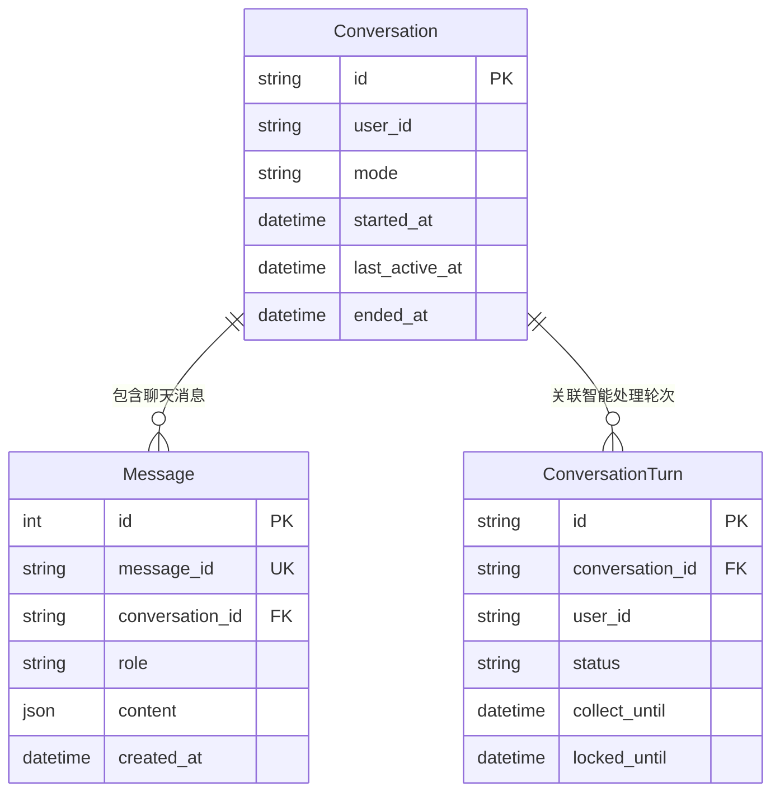
```mermaid
erDiagram
    Conversation ||--o{ Message : "包含聊天消息"
    Conversation ||--o{ ConversationTurn : "关联智能处理轮次"

    Conversation {
        string id PK
        string user_id
        string mode
        datetime started_at
        datetime last_active_at
        datetime ended_at
    }

    Message {
        int id PK
        string message_id UK
        string conversation_id FK
        string role
        json content
        datetime created_at
    }

    ConversationTurn {
        string id PK
        string conversation_id FK
        string user_id
        string status
        datetime collect_until
        datetime locked_until
    }
```

三者的职责可以概括为：

- 一条会话可以包含多条消息；
- 一条用户消息只能属于一个会话；
- 一个会话在整个生命周期中可以产生多个处理轮次；
- 一个处理轮次可以关联一条或多条用户消息；
- 会话负责长期状态，处理轮次负责一次智能客服处理任务。

有了这个关系，系统既能还原完整聊天记录，也能独立管理智能客服的状态。接下来需要明确会话自身有哪些处理模式。

### 2.3 四种会话处理模式

会话的 `mode` 字段共有四种业务值：

- `AI`：当前由智能客服处理。用户消息会进入处理轮次；
- `QUEUED`：已经请求转人工，正在等待客服接入；
- `HUMAN`：人工客服已经接入并正在服务；
- `CLOSED`：当前会话已经关闭，不能再作为有效会话继续使用。

<span style="color:red">这四种模式不是四种消息角色，而是整段会话当前由谁负责处理。</span>消息角色保存在 `Message.role` 中，两者不能混淆。

### 2.4 会话生命周期

新创建的会话默认进入智能客服模式。智能客服无法可靠解决问题时，可以请求转人工；人工客服接入后进入人工服务模式；人工服务结束后可以重新回到智能客服模式。长时间没有活动的智能客服会话则会被关闭。

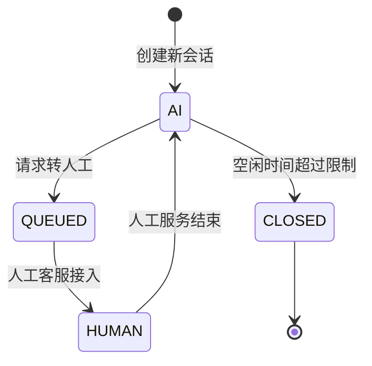
```mermaid
stateDiagram-v2
    [*] --> AI: 创建新会话
    AI --> QUEUED: 请求转人工
    QUEUED --> HUMAN: 人工客服接入
    HUMAN --> AI: 人工服务结束
    AI --> CLOSED: 空闲时间超过限制
    CLOSED --> [*]
```

`AI`、`QUEUED` 和 `HUMAN` 都表示尚未结束的会话，而 `CLOSED` 表示历史会话。正因为存在这个区别，<span style="color:red">数据库才能限制一个用户只能拥有一个未结束会话，同时允许该用户保留多条历史会话。</span>

---

## 3. 数据持久层模型

领域概念明确后，就可以把会话、消息和处理轮次映射到数据库。**持久层模型不仅保存字段，还通过外键、唯一约束和索引维护并发场景下的数据正确性。**

### 3.1 会话模型

`Conversation` 对应 `conversations` 表，保存一次客服服务的总体状态。

各字段承担的职责如下：

- `id` 是会话业务标识，使用 `conv` 前缀生成；
- `user_id` 标识会话所属用户；
- `mode` 保存当前处理模式；
- `started_at` 保存会话创建时间；
- `last_active_at` 保存最后活动时间，**是判断会话是否超时的依据**；
- `ended_at` 保存会话结束时间。

会话是本章其他模型的业务入口。接下来，消息模型通过外键归属于具体会话。

### 3.2 消息模型

`Message` 对应 `messages` 表，保存用户、智能客服和人工客服发送的消息。

这里同时存在 `id` 和 `message_id`：

- `id` 是数据库自增主键，适合根据主键查询
- `message_id` 是业务消息标识，可以在接口、事件和其他服务之间传递。

`role` 区分消息发送方，当前响应模型允许 `user`、`ai` 和 `human`。`content` 使用 `JSONB`，因此既能保存普通文本，也能保存带导航操作提示或结构化信息的消息。

消息解决了聊天内容的持久化问题，但智能客服还需要一个可以被后台工作进程领取和执行的任务模型。

### 3.3 会话处理轮次模型

`ConversationTurn` 对应 `conversation_turns` 表。它不代表前端看到的一条聊天消息，而是后台智能处理的一次任务。

本章只需要知道处理轮次属于某个会话，并通过 `status` 保存当前状态。消息范围、收集窗口、工作进程锁定和重试等字段将在下一天实现具体处理逻辑时再分析。

### 3.4 数据实体之间的关系

会话模型通过 `messages` 属性建立与消息模型的一对多关系。消息模型使用 `conversation_id` 外键指向会话，并通过 `conversation` 属性建立反向关系。

`cascade="all, delete-orphan"` 表示消息的生命周期依附于会话；`lazy="selectin"` 表示查询 `Conversation` 时，SQLAlchemy 会用 `IN (...)` 批量把所有对应的 `Message` 一次性全查出来。

`cascade="all, delete-orphan"` （级联删除与孤儿删除）

**含义**：控制当“会话（父）”发生变动时，“消息（子）”该如何联动处理。

- **`all`**：最直接的效果是：**删除了主表 `Conversation`，ORM 会自动把关联的所有 `Message` 记录一并删掉**。
- **`delete-orphan`（孤儿删除）**：如果把某条消息从会话的列表里移除了，ORM会识别出 某条消息 已经成为了“孤儿（不再属于任何会话）”，执行 `session.commit()` 时**直接从数据库中将其 `DELETE` 掉**，防止产生垃圾残留数据。


### 3.5 唯一约束与索引设计

应用代码中的“先查询再新增”不能完全解决并发问题。两个请求可能同时完成查询，并且都认为数据不存在，随后分别写入重复记录。<span style="color:red">因此，关键的唯一性规则最终必须由数据库保证。</span>

当前三个模型共包含三组业务唯一性规则。它们解决的问题不同，使用的数据库约束也不同。

**第一组：保证一个用户只有一个当前有效会话**

会话表使用 PostgreSQL 部分唯一索引，只在会话模式为 `AI`、`QUEUED` 或 `HUMAN` 时约束 `user_id` 唯一。

这三种模式虽然名称不同，但都表示会话尚未结束，共同占用“当前有效会话”这一个名额。因此：

- <span style="color:red">同一用户只能存在一个未结束会话；</span>
- 会话可以在三种模式之间切换，不需要创建新的有效会话；
- `CLOSED` 不参与这个唯一约束，同一用户可以保留多个历史会话。

**第二组：防止消息和智能处理结果被重复写入**

消息表使用 `UniqueConstraint` 定义三个不带状态条件的唯一约束：

- **`message_id` 全局唯一，防止同一条业务消息被重复保存；**
- `conversation_id` 与 `input_revision` 的组合唯一，防止同一会话中的同一个输入版本重复保存。输入版本的具体生成和使用将在下一天讲解；
- `agent_run_id` 与 `agent_outcome_seq` 的组合唯一，防止同一次智能处理中的同一个结果因重复事件而写入多次。

两个组合约束中包含允许为空的字段。PostgreSQL 默认把不同记录中的空值视为彼此不同，因此未填写输入版本或智能处理标识的消息可以正常保存；当组合字段都有实际值时，约束才会阻止相同组合重复写入。

**第三组：限制同一会话中两种活动轮次的数量**

处理轮次表使用两个独立的部分唯一索引：

- 第一个索引只约束 `COLLECTING` 状态，保证同一会话最多有一个正在收集的轮次；
- 第二个索引只约束 `RUNNING` 状态，保证同一会话最多有一个正在运行的轮次。

<span style="color:red">这里不能把两个状态合并到同一个部分唯一索引中。</span>正在运行的轮次已经确定了本次要处理的消息，此时用户新发送的消息需要由另一个收集轮次接收。如果合并约束，只要存在 `RUNNING` 轮次，数据库就会禁止创建 `COLLECTING` 轮次，系统便无法在生成上一轮回答的同时收集下一轮消息。

所以，<span style="color:red">同一会话可以同时存在一个 `RUNNING` 轮次和一个 `COLLECTING` 轮次，但不能同时存在两个 `RUNNING` 轮次，也不能同时存在两个 `COLLECTING` 轮次。</span>

三组规则可以归纳为：会话约束防止出现多个当前未结束会话，消息约束防止结果重复写入，处理轮次约束保证两个并行处理阶段各自最多只有一个任务。


### 3.6 消息收集与任务执行状态约束

轮次最重要的两个中间状态是：

- `COLLECTING`：正在防抖窗口内收集用户消息；
- `RUNNING`：消息范围已经确定，工作进程正在调用智能服务。

“防抖”指的是：**当用户连续发送多条消息时，系统不立即触发 AI 响应，而是先“等一会儿”，把这段时间内连续发出的所有短消息合并为一次完整的上下文，再统一打包交给 AI 处理。**


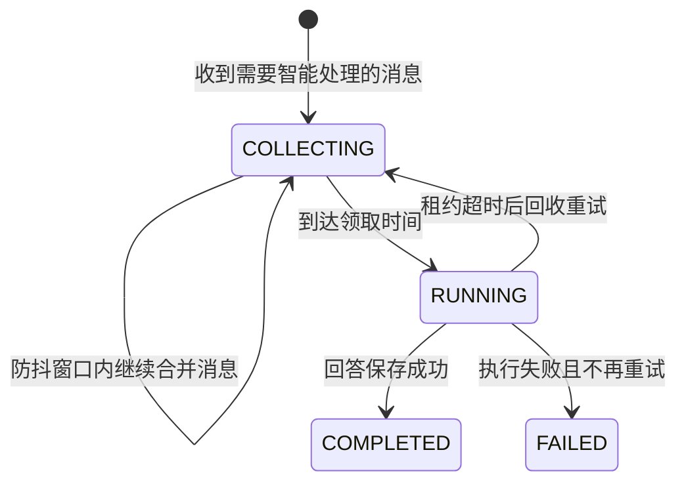
```mermaid
stateDiagram-v2
    [*] --> COLLECTING: 收到需要智能处理的消息
    COLLECTING --> COLLECTING: 防抖窗口内继续合并消息
    COLLECTING --> RUNNING: 到达领取时间
    RUNNING --> COMPLETED: 回答保存成功
    RUNNING --> FAILED: 执行失败且不再重试
    RUNNING --> COLLECTING: 租约超时后回收重试
```

“租约超时后回收重试”指的是：**工作进程领取一个处理轮次后，将其改为 `RUNNING`。同时记录：`locked_by`：由哪个工作进程处理；`locked_until`：该工作进程最晚拥有到什么时间。**<span style="color:red">如果工作进程崩溃、卡死或没有及时完成，超过 `locked_until` 后，这个轮次不能永远停留在 `RUNNING`。</span>系统会解除原工作进程的占用，把轮次重新放回待处理状态，交给其他工作进程重试。

本章只完成处理轮次的数据结构设计，暂不实现处理轮次的数据访问、领取和执行逻辑。这些内容将在后面的消息发送和后台工作进程课程中继续展开。

---

## 4. 数据访问层

持久层模型定义数据结构，数据访问层负责集中编写查询。**业务服务不直接拼接 SQLAlchemy 查询，而是通过语义明确的方法获取所需数据。**

### 4.1 数据访问层的职责

数据访问层主要承担以下职责：

- 封装数据库查询条件；
- 把查询结果转换成实体或实体列表；
- 将新实体加入当前数据库会话；
- 避免业务服务与具体查询语句耦合。

数据访问对象持有同一个 `AsyncSession`。它们可以执行查询和 `add`，但本章由业务服务决定何时刷新或提交事务。

### 4.2 会话数据访问对象

`ConversationRepository` 提供四个与本章相关的方法。

`list_ai_conversation()` 查询指定用户的全部智能客服会话，专门服务于空闲超时检查。<span style="color:red">它只查询 `AI` 模式，是因为人工排队或人工服务中的会话不能由智能客服空闲规则直接关闭。</span>

`find_active_conversation()` 查询用户最近的有效会话。业务服务传入 `("AI", "QUEUED", "HUMAN")`，从而排除已经关闭的历史会话。查询按最后活动时间倒序并限制一条，使业务意图更加明确。

另外，`get_by_id()` 负责按主键查询指定会话，`add()` 负责把新会话实体加入当前数据库事务。

会话数据访问对象解决了会话查询问题，消息详情则交给消息数据访问对象完成。

### 4.3 消息数据访问对象

`MessageRepository.list_by_conversation_id()` 根据 `conversation_id` 查询指定会话的全部消息，并在数据库查询中按 `Message.id` 升序排列。

**排序直接放在数据库查询中，业务服务收到的结果已经具有稳定顺序，因此不需要在外层再次调用 `sorted()`。**

这里选择自增主键 `Message.id`，是因为本接口需要按数据库写入顺序还原聊天记录。若只按 `created_at` 排序，多条消息时间相同时可能无法得到稳定结果。

### 4.4 数据访问与事务边界

**数据访问对象负责查询和登记实体，业务服务负责控制事务。**<span style="color:red">底层数据访问方法不能各自提交，否则一个完整业务操作会被拆成无法统一回滚的多个片段。</span>

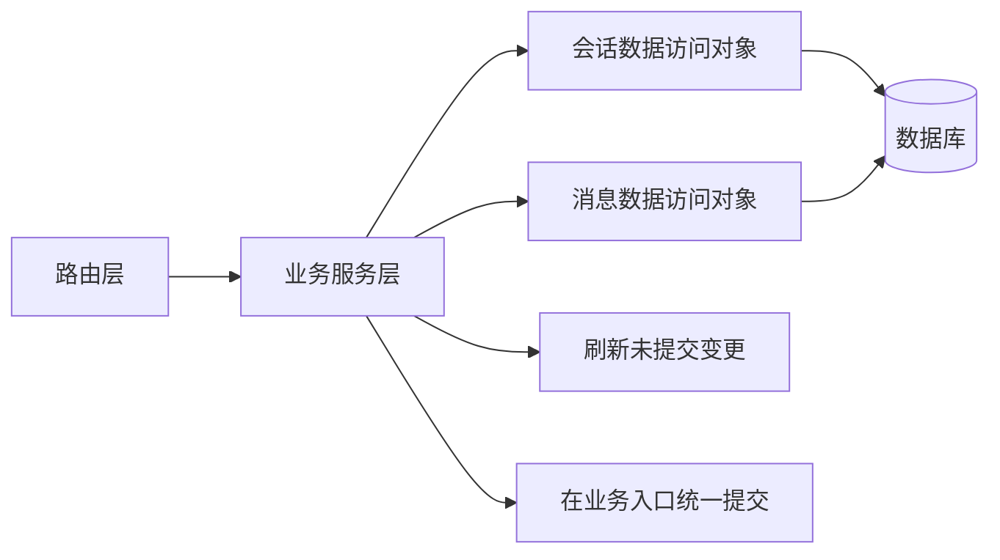
```mermaid
flowchart LR
    R["路由层"] --> S["业务服务层"]
    S --> C["会话数据访问对象"]
    S --> M["消息数据访问对象"]
    C --> D[(数据库)]
    M --> D
    S --> F["刷新未提交变更"]
    S --> K["在业务入口统一提交"]
```

**`flush()` 与 `commit()`** **核心差异对照**：

| **维度**       | **flush() 之后**                                           | **commit() 之后**                          |
| -------------- | ---------------------------------------------------------- | ------------------------------------------ |
| **SQL 执行**   | 数据库已经接收并执行了 `INSERT/UPDATE/DELETE`              | 数据库接收并执行了 `COMMIT`                |
| **主键与约束** | **立刻拿到自增 `id`**，数据库立刻校验外键/唯一索引冲突     | 变更彻底完成，无法再触发该事务内的约束报错 |
| **数据可见性** | **仅当前数据库连接/事务可见**，其他并发请求/连接完全看不到 | **对所有事务可见**                         |
| **锁与资源**   | **继续持有行锁/排他锁**，阻塞其他试图修改该行数据的事务    | **释放所有锁**，归还数据库连接资源         |

**本质区别：**

- `flush()` 的本质： 把 ORM 内存中的变化**转成 SQL 语句**发送给数据库引擎执行，但**保持事务开启、持有行锁**。

  `commit()` 的本质： 向数据库发送 `COMMIT` 指令，**写日志落盘、释放锁、结束事务**，使修改对所有其他数据库连接可见。

- 对外接口的业务入口适合在所有步骤成功后统一 `commit()`。

## 5. 会话响应数据模型

数据库模型面向持久化，字段较多；接口响应模型面向前端，只应返回当前页面真正需要的数据。<span style="color:red">两类模型职责不同，不能直接把数据库实体完整暴露给前端。</span>

### 5.1 响应模型的职责

响应模型使用 Pydantic 定义，主要作用包括：

- 限制接口可以返回的字段；
- 校验字段类型和值域；
- 自动生成接口文档；
- 避免内部调度字段泄漏；
- 让前后端围绕稳定的数据契约协作。

本章包含当前会话响应、单条消息响应和会话详情响应三个模型。在定义具体响应之前，先约束会话模式。

### 5.2 会话模式枚举

`ConversationMode` 使用字符串枚举约束模式值：

```python
class ConversationMode(StrEnum):
    AI = "AI"				 # 用户端显示“AI 客服”
    QUEUED = "QUEUED"		 # 用户端显示“等待人工”	
    HUMAN = "HUMAN"          # 用户端显示“人工服务中”
    CLOSED = "CLOSED"		 # 用户端显示“已结束” 	
```

使用枚举以后，接口不会把任意字符串作为合法会话模式。它既保留字符串在 JSON 中易于传输的特点，又让代码和接口文档明确展示允许值。

虽然“当前有效会话”正常只会返回前三种模式，但保留 `CLOSED` 能表达完整的会话状态集合，也便于其他响应模型复用。

### 5.3 当前会话响应模型

用户端加载客服页面时需要获得当前会话的状态：

```python
class CurrentConversationResponse(BaseModel):
    id: str
    mode: ConversationMode
    is_processing: bool
```

三个字段分别用于：

- `id`：标识当前会话，用于筛选该会话的历史消息
- `mode`：显示当前由智能客服、排队或人工处理；
- `is_processing`：用户端刷新后恢复“AI 正在处理”提示

### 5.4 单条会话消息响应模型

客服工作台需要展示会话中的每一条消息：

```python
class ConversationMessageResponse(BaseModel):
    message_id: str
    role: Literal["user", "ai", "human"]
    content: dict[str, Any]
    created_at: datetime
```

各字段面向管理端的用途是：

- `message_id`：作为消息列表中的稳定唯一标识；
- `role`：管理端决定用户、智能客服或人工客服的标签和样式；
- `content`：提供需要展示的文本或结构化内容；
- `created_at`：保留消息发送时间，便于后续展示。

### 5.5 会话详情响应模型

会话详情响应只包含消息列表：

```python
class ConversationDetailResponse(BaseModel):
    messages: list[ConversationMessageResponse]
```

管理端调用接口时已经持有目标 `conversation_id`，遍历消息记录

### 5.6 持久层模型与响应模型的区别

**持久层模型描述“数据库必须保存什么”，响应模型描述“当前接口允许返回什么”。**一次接口响应通常需要经过转换，而不是直接返回完整实体。

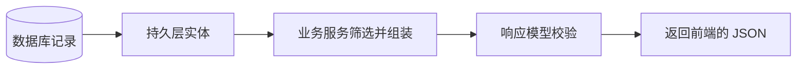
```mermaid
flowchart LR
    D[(数据库记录)] --> O["持久层实体"]
    O --> S["业务服务筛选并组装"]
    S --> P["响应模型校验"]
    P --> J["返回前端的 JSON"]
```

这种分离使数据库可以保存工作进程租约和审计标识，而前端仍然获得简单、稳定的数据结构。接下来进入本章的核心：会话业务服务如何组织这些查询与状态变化。

---

## 6. 会话业务服务实现

会话业务服务位于接口与数据访问之间。它不负责解析请求头，也不直接编写查询，而是根据业务规则组织多个数据访问对象，并控制事务提交。

### 6.1 业务服务层的职责

`ConversationService` 持有数据库会话，以及会话和消息数据访问对象。它通过这些对象组织跨表查询和状态变更。

它承担以下职责：

- 确保用户拥有一个当前有效会话；
- 关闭已经空闲超时的智能客服会话；
- 在没有有效会话时创建新会话；
- 查询并组装客服工作台所需的会话详情；
- 在接口业务完成后统一提交事务。

业务服务的总体调用关系如下：

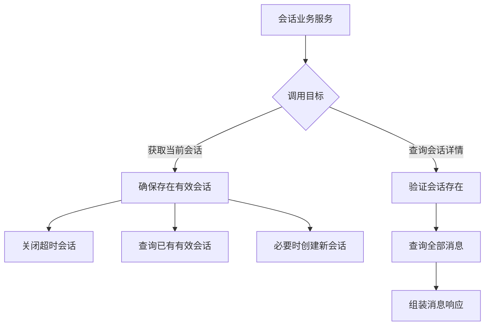
```mermaid
flowchart TD
    A["会话业务服务"] --> B{"调用目标"}
    B -->|"获取当前会话"| C["确保存在有效会话"]
    C --> D["关闭超时会话"]
    C --> E["查询已有有效会话"]
    C --> F["必要时创建新会话"]
    B -->|"查询会话详情"| G["验证会话存在"]
    G --> H["查询全部消息"]
    H --> I["组装消息响应"]
```

下面分别展开两条业务链路，先从用户端进入客服页面时调用的当前会话逻辑开始。

### 6.2 获取或创建当前有效会话

`get_current_conversation()` 是当前会话接口的业务入口。它先调用 `ensure_active_conversation()` 获得可继续使用的会话，<span style="color:red">随后统一提交本次事务</span>，最后返回当前会话信息。

完整流程如下：

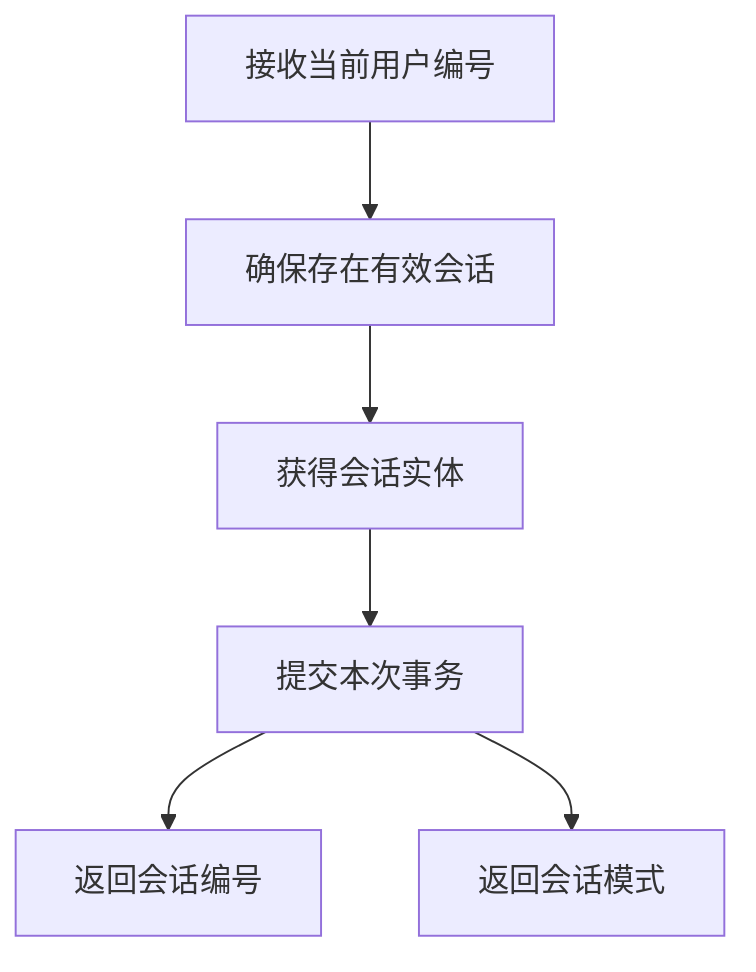
```mermaid
flowchart TD
    A["接收当前用户编号"] --> B["确保存在有效会话"]
    B --> C["获得会话实体"]
    C --> E["提交本次事务"]
    E --> F["返回会话编号"]
    E --> G["返回会话模式"]
```

执行顺序不能随意交换：

1. 必须先处理超时会话，才能确定旧会话是否仍然有效；
2. 必须获取已有会话或创建新会话，才能得到当前会话；
3. 必须完成所有状态变化后再统一提交；
4. 最后才组装当前会话响应。

### 6.3 查询会话详情

`get_conversation_detail()` 面向客服和管理员，负责查询指定会话的全部消息。它先按主键查询会话；会话不存在时抛出异常，存在时再调用消息数据访问对象加载全部消息，并逐条转换为响应结构。

这条业务链路只读取数据，不修改会话状态：

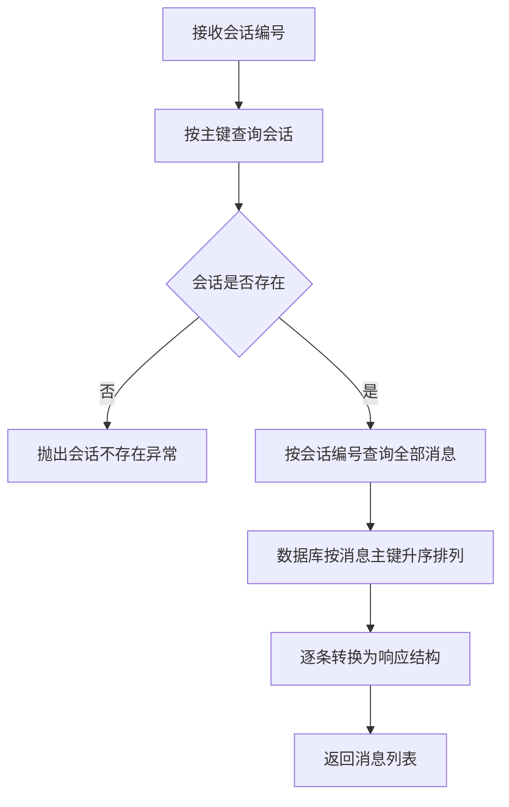
```mermaid
flowchart TD
    A["接收会话编号"] --> B["按主键查询会话"]
    B --> C{"会话是否存在"}
    C -->|"否"| D["抛出会话不存在异常"]
    C -->|"是"| E["按会话编号查询全部消息"]
    E --> F["数据库按消息主键升序排列"]
    F --> G["逐条转换为响应结构"]
    G --> H["返回消息列表"]
```


### 6.4 组装前端消息结构

持久层消息实体包含许多内部字段，而会话详情只需要 `message_id`、`role`、`content` 和 `created_at` 四个字段。模块级辅助函数 `_build_conversation_message()` 负责从消息实体中提取这些字段。

### 6.5 关闭空闲超时的智能客服会话

在查询当前有效会话之前，系统先加载用户已有的智能客服会话，并逐个判断是否空闲超时。超时后将会话模式修改为 `CLOSED`，把 `ended_at` 记录为最后活动时间；只有发生状态变化时才刷新数据库事务。

超时判断流程如下：

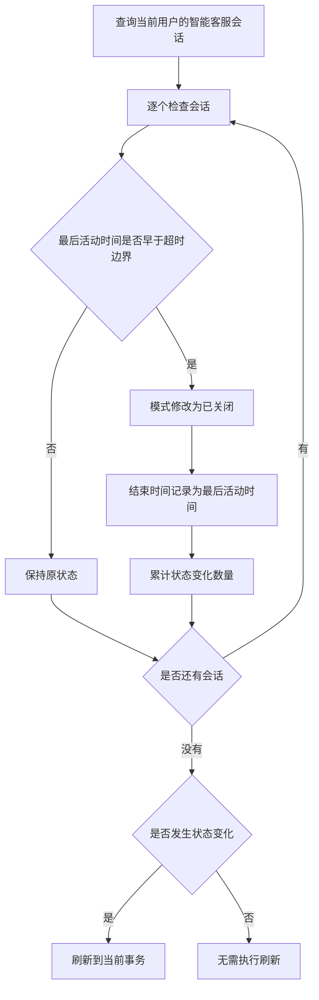
```mermaid
flowchart TD
    A["查询当前用户的智能客服会话"] --> B["逐个检查会话"]
    B --> C{"最后活动时间是否早于超时边界"}
    C -->|"否"| D["保持原状态"]
    C -->|"是"| E["模式修改为已关闭"]
    E --> F["结束时间记录为最后活动时间"]
    F --> G["累计状态变化数量"]
    D --> H{"是否还有会话"}
    G --> H
    H -->|"有"| B
    H -->|"没有"| I{"是否发生状态变化"}
    I -->|"是"| J["刷新到当前事务"]
    I -->|"否"| K["无需执行刷新"]
```

具体超时条件由 `_has_idle_timeout()` 完成：当前时间与最后活动时间之差大于或等于 30 分钟时，会话达到超时条件。

这里使用 `>=` 表示达到 30 分钟边界就视为超时。`ended_at` 使用 `last_active_at`，表达会话实际停止活动的时刻，而不是用户下一次打开页面、系统发现超时的时刻。

### 6.6 创建新会话

当用户不存在 `AI`、`QUEUED` 或 `HUMAN` 模式的会话时，业务服务创建一个模式为 `AI` 的新会话，把它加入当前数据库事务，然后执行 `flush()` 并返回会话实体。

此处调用 `flush()` 后，数据库会生成会话主键，使后续代码可以立即使用 `conversation.id`，<span style="color:red">但事务仍由外层业务入口统一提交。</span>

创建方法不自行 `commit()`，是因为它还会被消息接收等更大的业务流程复用。如果底层方法提前提交，就无法保证“创建会话”和“保存首条消息”处于同一个原子事务。

### 6.7 数据提交与事务处理

当前会话的完整事务关系可以表示为：

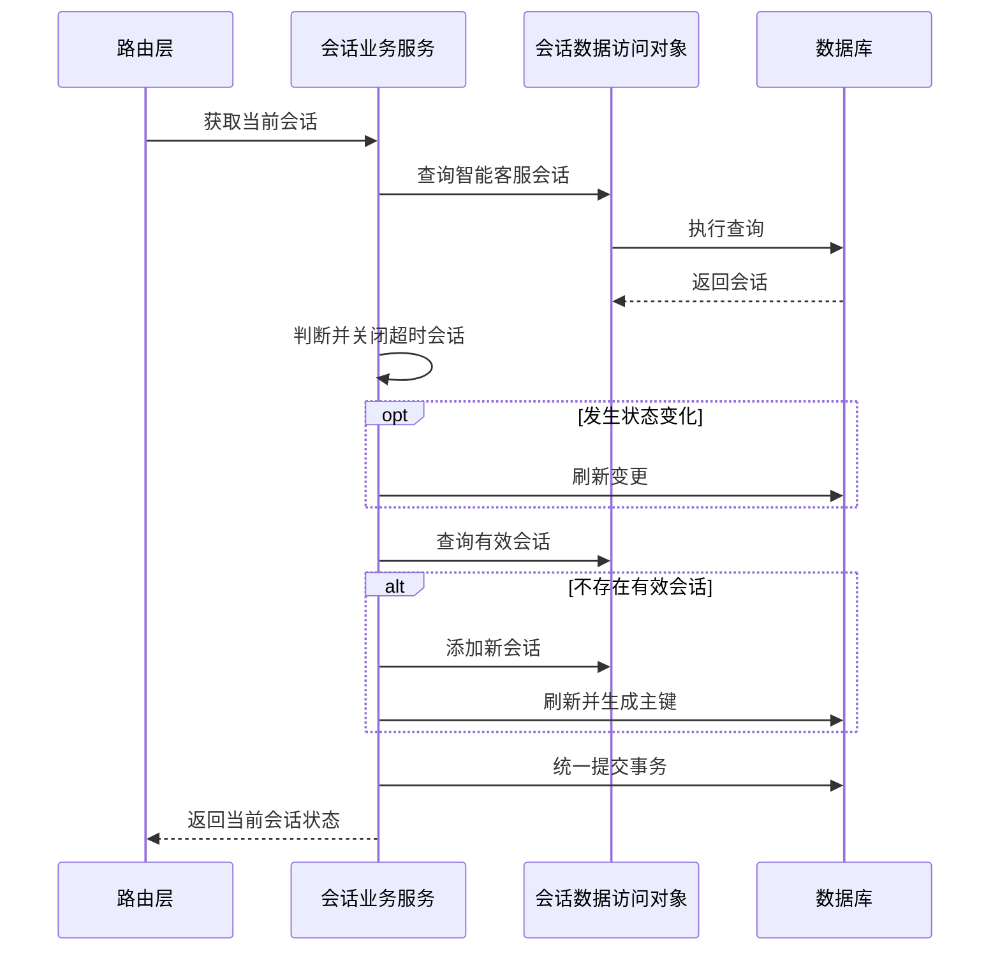
```mermaid
sequenceDiagram
    participant R as 路由层
    participant S as 会话业务服务
    participant C as 会话数据访问对象
    participant D as 数据库

    R->>S: 获取当前会话
    S->>C: 查询智能客服会话
    C->>D: 执行查询
    D-->>C: 返回会话
    S->>S: 判断并关闭超时会话
    opt 发生状态变化
        S->>D: 刷新变更
    end
    S->>C: 查询有效会话
    alt 不存在有效会话
        S->>C: 添加新会话
        S->>D: 刷新并生成主键
    end
    S->>D: 统一提交事务
    S-->>R: 返回当前会话状态
```

<span style="color:red">这里最重要的边界是：内部方法只刷新，当前接口的公开业务方法统一提交。</span>这样能够同时满足主键生成、组合业务和异常回滚三方面需求。

---

## 7. 会话接口实现

业务服务完成后，路由层负责把 HTTP 请求转换为业务方法调用。路由层应保持轻量，只处理路径、请求头、依赖注入、权限和响应模型，不重复实现会话规则。

### 7.1 路由层的职责

会话路由统一使用 `/api/v1` 前缀。本章提供两个接口：`POST /api/v1/conversations/current` 用于获取当前有效会话，`GET /api/v1/conversations/{conversation_id}` 用于读取指定会话详情。

第一个接口面向普通用户，第二个接口面向客服和管理员。两者复用同一个会话业务服务，但权限和返回结构不同。

### 7.2 获取当前有效会话接口

当前会话接口从请求头中取得认证令牌，通过认证服务校验 `customer` 角色并获得当前用户编号，然后调用会话业务服务的 `get_current_conversation()` 方法。接口使用 `CurrentConversationResponse` 约束最终响应。

接口执行流程如下：

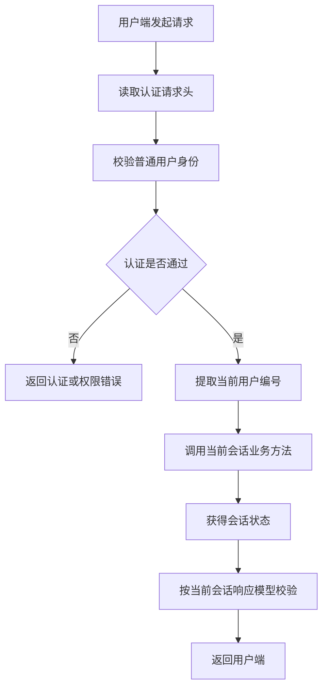
```mermaid
flowchart TD
    A["用户端发起请求"] --> B["读取认证请求头"]
    B --> C["校验普通用户身份"]
    C --> D{"认证是否通过"}
    D -->|"否"| E["返回认证或权限错误"]
    D -->|"是"| F["提取当前用户编号"]
    F --> G["调用当前会话业务方法"]
    G --> H["获得会话状态"]
    H --> I["按当前会话响应模型校验"]
    I --> J["返回用户端"]
```

**路径使用 `POST` 是因为这个接口不只是单纯读取数据。**用户没有有效会话时，它会创建新会话；智能客服会话超时时，它还会修改旧会话状态。因此该调用可能产生数据库写入。

### 7.3 获取指定会话详情接口

会话详情接口从路径参数中取得 `conversation_id`，并通过认证服务校验 `agent` 或 `admin` 角色。权限通过后，它调用业务服务的 `get_conversation_detail()` 方法，并使用 `ConversationDetailResponse` 约束返回的消息列表。

这条接口只读取指定会话及其消息，所以使用 `GET`。`conversation_id` 来自路径参数，由管理端在进入具体会话时提供。

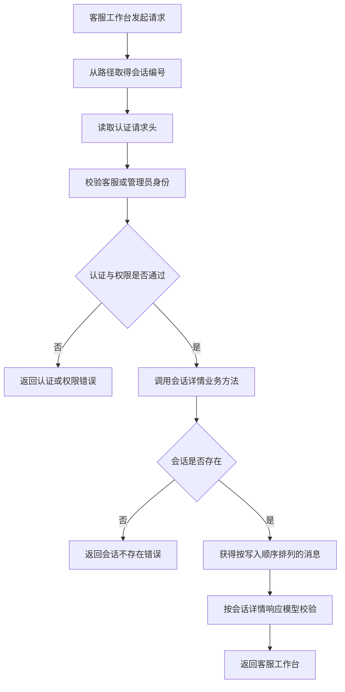
```mermaid
flowchart TD
    A["客服工作台发起请求"] --> B["从路径取得会话编号"]
    B --> C["读取认证请求头"]
    C --> D["校验客服或管理员身份"]
    D --> E{"认证与权限是否通过"}
    E -->|"否"| F["返回认证或权限错误"]
    E -->|"是"| G["调用会话详情业务方法"]
    G --> H{"会话是否存在"}
    H -->|"否"| I["返回会话不存在错误"]
    H -->|"是"| J["获得按写入顺序排列的消息"]
    J --> K["按会话详情响应模型校验"]
    K --> L["返回客服工作台"]
```


### 7.4 身份认证与角色校验

两个接口都从 `Authorization` 请求头读取令牌，但<span style="color:red">允许的角色不同</span>：

- 当前会话接口只允许 `customer`；
- 会话详情接口只允许 `agent` 和 `admin`。

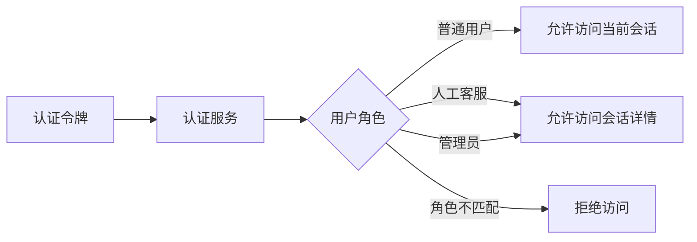
```mermaid
flowchart LR
    T["认证令牌"] --> A["认证服务"]
    A --> R{"用户角色"}
    R -->|"普通用户"| C["允许访问当前会话"]
    R -->|"人工客服"| D["允许访问会话详情"]
    R -->|"管理员"| D
    R -->|"角色不匹配"| X["拒绝访问"]
```

<span style="color:red">角色校验必须放在调用业务服务之前。</span>这样可以防止普通用户通过猜测会话编号读取其他用户的聊天记录。

### 7.5 接口响应模型约束

**路由装饰器中的 `response_model` 不只是接口文档说明，还会对业务服务返回值进行校验和过滤。**当前会话接口使用 `CurrentConversationResponse`，会话详情接口使用 `ConversationDetailResponse`。

如果业务服务遗漏必填字段、返回错误类型，或者返回了不符合枚举和值域约束的数据，响应校验会暴露问题。例如，`is_processing` 必须提供布尔值，不能返回 `None`。

### 7.6 路由层、业务服务层与数据访问层的调用关系

两个接口共用相同分层，但调用的数据访问方法不同：

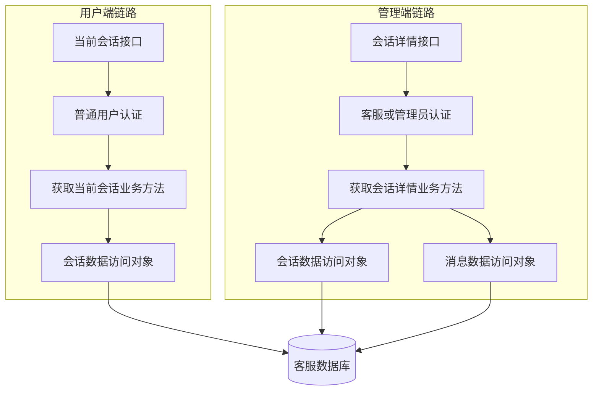
```mermaid
flowchart TB
    subgraph 用户端链路
        U["当前会话接口"] --> UA["普通用户认证"]
        UA --> US["获取当前会话业务方法"]
        US --> UC["会话数据访问对象"]
    end

    subgraph 管理端链路
        A["会话详情接口"] --> AA["客服或管理员认证"]
        AA --> AS["获取会话详情业务方法"]
        AS --> AC["会话数据访问对象"]
        AS --> AM["消息数据访问对象"]
    end

    UC --> D[(客服数据库)]
    AC --> D
    AM --> D
```

路由层解决“谁可以调用”，业务服务层解决“应该执行哪些步骤”，数据访问层解决“怎样查询数据库”。职责划分清楚后，每一层都可以独立测试和推进。

---

## 8. 两个接口的完整执行流程

前面的章节分别介绍了模型和分层实现，本节从页面行为出发，把两个接口重新串成用户能够感知的完整流程。

### 8.1 页面初始化流程

用户进入或刷新客服页面时，前端首先请求当前会话。接口返回当前会话信息，前端再根据会话编号恢复对应的历史和实时状态。

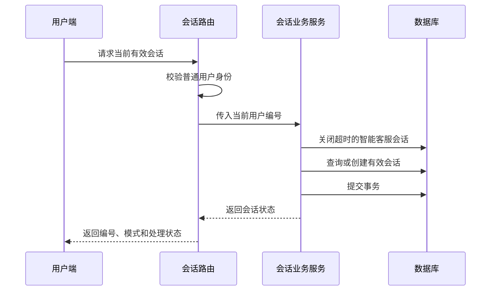
```mermaid
sequenceDiagram
    participant U as 用户端
    participant R as 会话路由
    participant S as 会话业务服务
    participant D as 数据库

    U->>R: 请求当前有效会话
    R->>R: 校验普通用户身份
    R->>S: 传入当前用户编号
    S->>D: 关闭超时的智能客服会话
    S->>D: 查询或创建有效会话
    S->>D: 提交事务
    S-->>R: 返回会话状态
    R-->>U: 返回编号、模式和处理状态
```

这个接口是整个用户端聊天流程的入口。前端获得当前会话后，后续发送消息和接收实时事件才有明确的会话归属。

### 8.2 获取当前会话流程

获取当前会话包含三个连续决策：

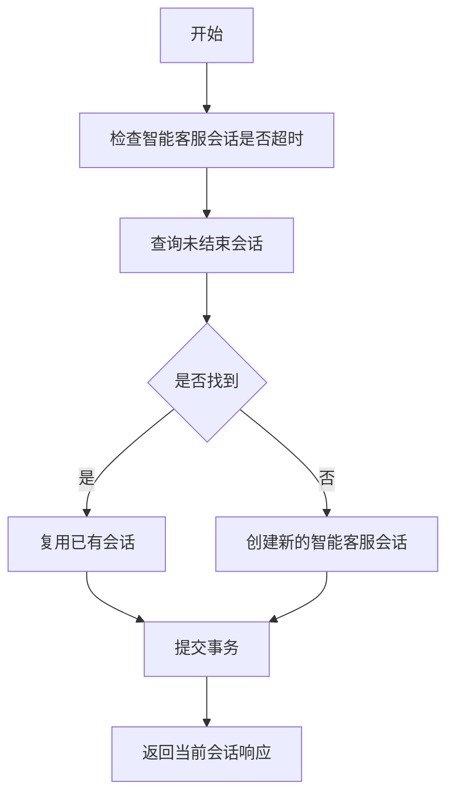
```mermaid
flowchart TD
    A["开始"] --> B["检查智能客服会话是否超时"]
    B --> C["查询未结束会话"]
    C --> D{"是否找到"}
    D -->|"是"| E["复用已有会话"]
    D -->|"否"| F["创建新的智能客服会话"]
    E --> H["提交事务"]
    F --> H
    H --> I["返回当前会话响应"]
```

这里的“复用”很重要。如果用户刷新页面就创建新会话，历史消息会被切断，正在执行的处理轮次也无法正确恢复。

### 8.3 加载历史消息流程

客服或管理员进入人工工作台中的某个会话时，管理端使用会话编号调用详情接口。

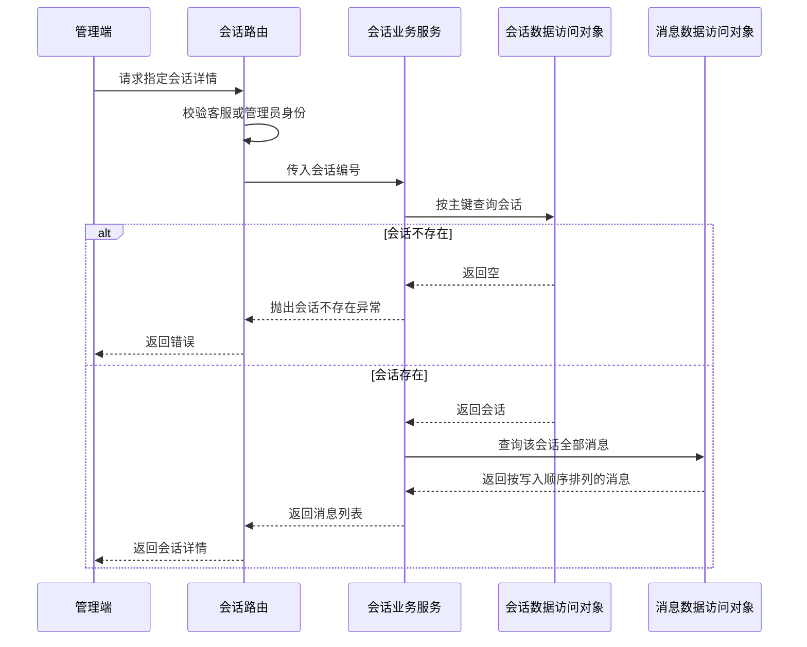
```mermaid
sequenceDiagram
    participant A as 管理端
    participant R as 会话路由
    participant S as 会话业务服务
    participant C as 会话数据访问对象
    participant M as 消息数据访问对象

    A->>R: 请求指定会话详情
    R->>R: 校验客服或管理员身份
    R->>S: 传入会话编号
    S->>C: 按主键查询会话
    alt 会话不存在
        C-->>S: 返回空
        S-->>R: 抛出会话不存在异常
        R-->>A: 返回错误
    else 会话存在
        C-->>S: 返回会话
        S->>M: 查询该会话全部消息
        M-->>S: 返回按写入顺序排列的消息
        S-->>R: 返回消息列表
        R-->>A: 返回会话详情
    end
```

消息查询在数据库层完成排序，业务服务只负责转换字段，响应模型再保证每条消息都满足前端契约。

### 8.4 会话不存在或超时后的处理

两个接口面对“会话不可用”时的行为不同：

- 当前会话接口发现旧会话超时，会关闭旧会话并创建新会话；
- 会话详情接口按编号查不到会话时，应返回会话不存在错误；
- 当前会话接口不会把 `CLOSED` 会话作为有效会话返回；
- 会话详情接口可以按编号读取历史会话，只要该记录仍然存在。

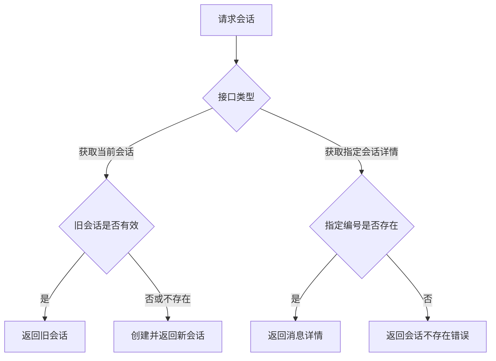
```mermaid
flowchart TD
    A["请求会话"] --> B{"接口类型"}
    B -->|"获取当前会话"| C{"旧会话是否有效"}
    C -->|"是"| D["返回旧会话"]
    C -->|"否或不存在"| E["创建并返回新会话"]
    B -->|"获取指定会话详情"| F{"指定编号是否存在"}
    F -->|"是"| G["返回消息详情"]
    F -->|"否"| H["返回会话不存在错误"]
```

这个差异来自两个接口不同的业务目标：<span style="color:red">用户端必须始终获得一个可继续聊天的会话，而管理端详情接口必须查询指定会话，不能创建其他会话。</span>

---

## 9. 会话模块分层设计总结

经过前面的实现，会话模块已经形成从数据库到接口的完整分层。最后需要重新审视各层边界和数据流向，为后续消息发送功能做好衔接。

### 9.1 各层职责对照

持久层模型负责定义会话、消息和轮次的数据结构以及数据库约束。

数据访问层负责按用户、会话编号和状态查询实体。

响应模型负责定义前端真正能够收到的字段和值域。

业务服务层负责关闭超时会话、查询或创建有效会话、判断处理状态、加载消息以及控制事务。

路由层负责接收请求、读取认证信息、限制访问角色并声明响应模型。

这些职责沿调用方向逐层收敛：

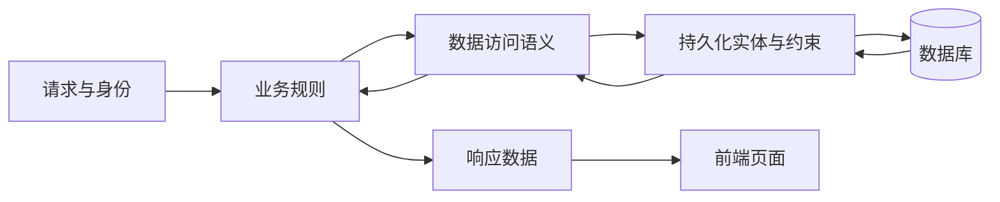
```mermaid
flowchart LR
    A["请求与身份"] --> B["业务规则"]
    B --> C["数据访问语义"]
    C --> D["持久化实体与约束"]
    D --> E[(数据库)]
    E --> D
    D --> C
    C --> B
    B --> F["响应数据"]
    F --> G["前端页面"]
```

任何一层都不应该越过相邻层承担全部工作，否则会导致接口函数过大、查询散落或内部字段泄漏。

### 9.2 数据流转过程

当前会话的数据从认证令牌开始。路由层取得当前用户编号后，业务服务查询或创建会话实体，组装当前会话数据并经过响应模型校验，最后返回用户端。

会话详情的数据从路径中的会话编号开始。业务服务先查询会话实体，再查询按写入顺序排列的消息实体，将每条消息转换为响应字段，经过会话详情响应模型校验后返回管理端。

**两条链路都没有直接把数据库实体原样返回。**这保证了数据访问结构与接口契约之间存在清晰边界。

---

## 10. 本章总结

本章从第一天的整体架构进入客服服务内部，围绕会话模块完成了以下内容：

1. 使用会话、消息和处理轮次三个模型表达客服业务；
2. 使用会话模式描述智能客服、人工排队、人工服务和关闭状态；
3. 使用部分唯一索引保证一个用户只有一个未结束会话；
4. 使用两个轮次索引支持“一个正在运行、一个继续收集”的处理方式；
5. 使用数据访问层封装当前会话和会话详情查询；
6. 使用业务服务组织超时关闭、查询、创建和事务提交；
7. 使用两个路由分别服务普通用户和客服工作台。

**当前会话接口解决“用户现在应该继续使用哪个会话”，会话详情接口解决“客服人员应该看到哪些历史消息”。**这两个接口共同建立了客服系统最基础的会话读取能力。

在此基础上，下一阶段可以继续实现用户消息接收、处理轮次的防抖涉及与合并、后台工作进程领取任务，以及智能回复写回与实时通知，从而把静态会话管理扩展成完整的异步客服对话链路。
