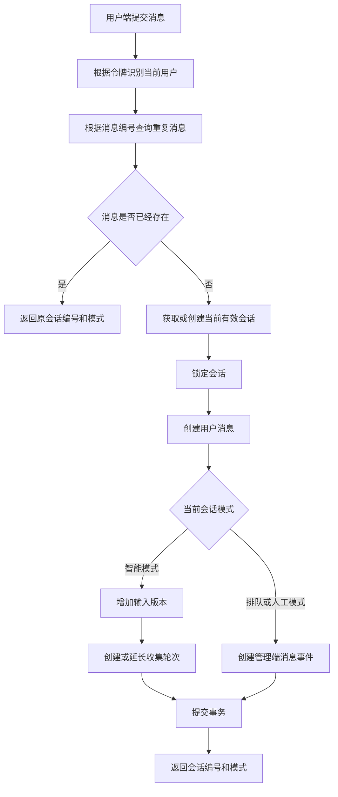
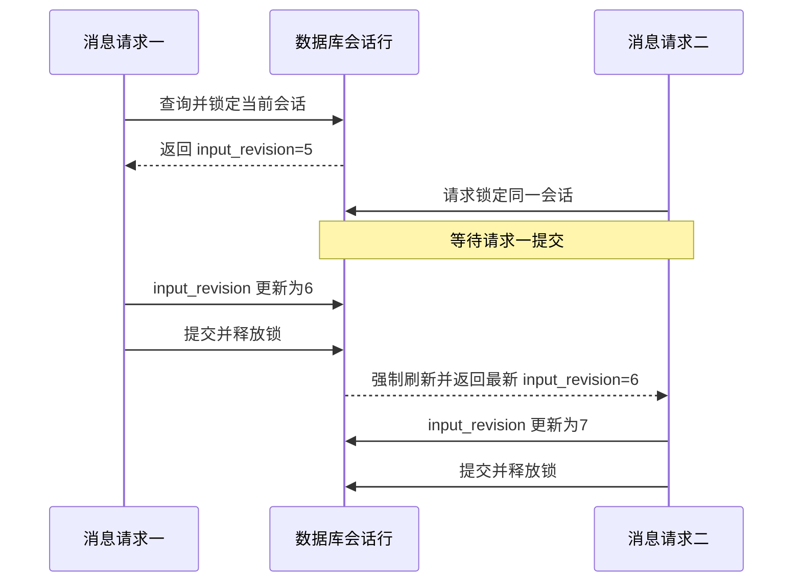
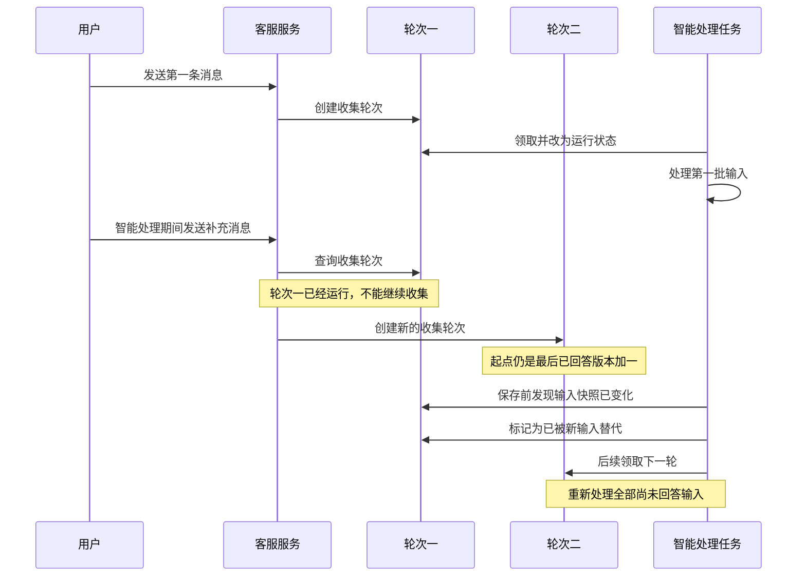
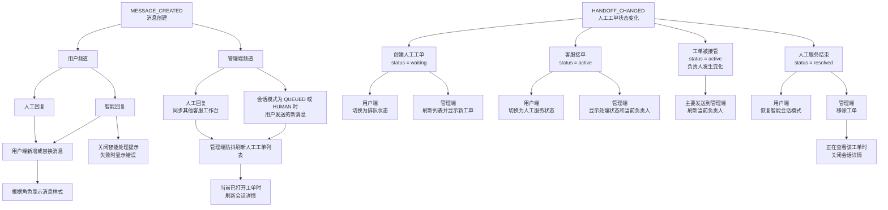
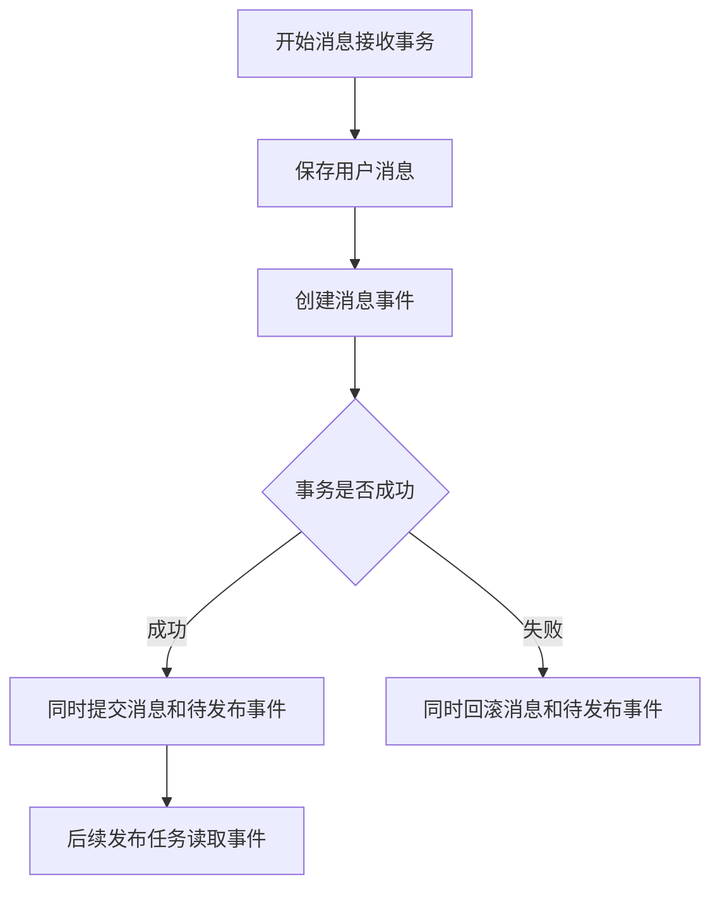
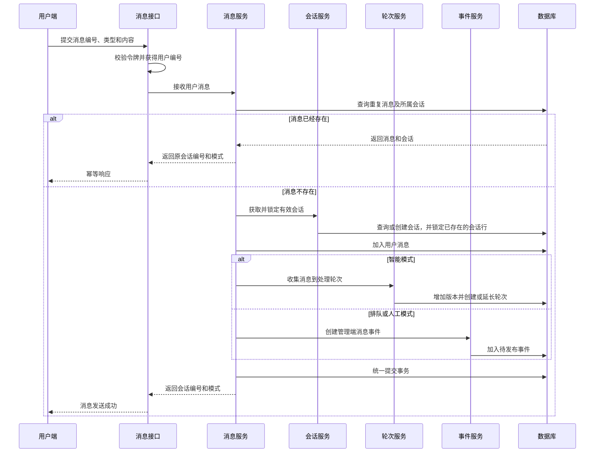

# 第三天：用户消息接收与轮次收集

第二天完成了客服会话的数据建模、当前会话查询和会话详情查询。此时，用户进入客服页面后已经能够获得当前会话，客服人员也能够查看指定会话的历史消息，但系统还不能真正接收一条新的用户消息。

第三天继续沿着同一条业务链路向后实现：用户提交消息后，客服服务先识别重复请求，再获取并锁定当前有效会话，随后保存消息，并根据会话模式决定是收集到智能处理轮次，还是创建一条等待推送给人工客服工作台的消息事件。

本章的重点不是单独完成一次数据库新增，而是保证**消息、会话状态、智能处理轮次和待发布事件在同一个业务事务中保持一致**。

---

## 1. 从会话查询进入消息接收

第二天实现的当前会话接口解决了“用户现在属于哪个会话”的问题。第三天的消息接收接口需要在这个基础上继续回答三个问题：

1. 这条消息是否已经提交过；
2. 这条消息应该进入哪个当前有效会话；
3. 这条消息后续应该交给智能客服还是人工客服。

只有把这三个问题按照稳定顺序处理，才能避免消息重复、会话状态错乱以及智能处理轮次遗漏。

### 1.1 本章学习目标

完成本章后，需要能够理解并说明

3. 为什么保存用户消息前需要锁定当前会话；
4. 如何通过输入版本标记等待智能客服处理的消息；
5. 如何把短时间内连续发送的消息合并到同一个处理轮次；
6. 为什么收集轮次需要同时设置短等待时间和最大等待时间；
7. 智能模式、排队模式和人工模式下的消息处理有什么区别；
8. 为什么消息和待发布事件必须在同一个事务中提交。

这些目标最终组成一条完整的用户消息接收链路。

### 1.2 本章代码范围

本章主要涉及以下内容：

- 用户消息的请求模型与响应模型；
- 消息、会话和处理轮次的数据访问；
- 当前有效会话的锁定；
- 用户消息保存；
- 智能处理轮次的防抖收集；
- 待发布事件模型与写入服务；
- 消息接收接口和依赖注入。

处理轮次的领取、智能服务调用、租约、失败重试和智能回复保存不属于本章，它们将在下一天展开。

### 1.3 用户消息接收链路概览

一条用户消息进入客服服务后，会按照下面的顺序流转：



---

## 2. 用户消息请求与响应

消息接收链路从接口数据开始。请求模型负责限制前端可以提交什么，响应模型只返回前端在消息发送完成后继续维护页面状态所需的数据。

### 2.1 用户消息请求结构

用户发送消息时提交三个字段：

```python
class ChatMessageRequest(BaseModel):
    message_id: str = Field(min_length=4, max_length=80)
    type: MessageType
    content: dict[str, Any]
```

三个字段分别承担不同职责：

- `message_id`：由用户端提前生成，用于标识同一次消息提交；
- `type`：说明消息是普通文本还是业务对象；
- `content`：保存消息的实际内容。

文本消息可以使用下面的结构：

```json
{
  "message_id": "msg_1001",
  "type": "text",
  "content": {
    "text": "我的订单什么时候发货？"
  }
}
```

消息内容使用对象结构，而不是直接使用字符串，是为了兼容订单、商品等业务对象消息，也为后续智能服务返回操作按钮和选择项保留扩展空间。

### 2.2 消息类型与消息角色

消息类型描述内容结构：

```python
class MessageType(StrEnum):
    TEXT = "text"
    OBJECT = "object"
```

消息角色描述发送者：

```python
class MessageRole(StrEnum):
    USER = "user"
    AI = "ai"
    HUMAN = "human"
```

二者不能混为一谈。例如，一条用户发送的订单卡片消息，其角色是 `user`，类型是 `object`；一条智能客服返回的文本消息，其角色是 `ai`，类型是 `text`。

第三天接收的是用户消息，因此保存时角色固定为 `user`，类型和内容来自前端请求。

### 2.3 消息编号的作用

用户端在发起请求前生成消息编号，并在网络重试时继续使用同一个编号。这样即使同一个请求因为超时、重复点击或重试到达服务端多次，服务端也能够识别它们属于同一次业务提交。

<span style="color:red">消息编号标识的是一次业务消息，不是数据库自增主键。</span>

数据库主键用于表内存储和排序，消息编号用于前后端共同识别消息。二者职责不同，不能相互替代。

### 2.4 消息接收响应结构

消息接收成功后只返回两个字段：

```python
class AcceptUserMessageResponse(BaseModel):
    conversation_id: str
    mode: ConversationMode
```

- `conversation_id`：让用户端确认这条消息所属的会话，比如加载历史消息就是使用这个最新会话 ID。
- `mode`：让用户端确认消息提交后仍由智能客服、排队流程还是人工客服处理，比如页面右上角区域的样式变化。

---

## 3. 消息幂等与数据访问

请求模型解决了消息编号从哪里来，数据访问层接下来需要根据这个编号判断消息是否已经保存。

### 3.1 为什么需要消息幂等

假设用户端发送一条消息，服务端已经成功提交，但响应在网络中丢失。用户端无法判断消息是否保存，只能使用同一个消息编号重新请求。

如果服务端每次都直接新增，就会出现两条内容相同的消息，完整的接口幂等要求：

> 同一个消息编号无论提交多少次，都只能对应同一条数据库消息，并返回相同的会话结果。

### 3.2 联表查询消息及所属会话

消息数据访问对象通过一次联表查询同时返回消息和会话：

```python
async def find_with_conversation_by_message_id(
    self,
    message_id: str,
) -> tuple[Message, Conversation] | None:
    result = await self.session.execute(
        select(Message, Conversation)
        .join(
            Conversation,
            Conversation.id == Message.conversation_id,
        )
        .where(Message.message_id == message_id)
    )
    return result.tuples().one_or_none()
```

如果只查询消息，业务服务为了返回会话模式还要再查询一次会话。联表查询把两次数据库访问合并为一次，直接获取结果。

### 3.3 重复消息的返回处理

业务服务收到查询结果后，先判断消息所属会话是否属于当前用户，再直接返回原结果：

```python
duplicate_result = (
    await self.message_repository.find_with_conversation_by_message_id(
        chat_message.message_id
    )
)
if duplicate_result:
    duplicate, conversation = duplicate_result
    return {
        "conversation_id": duplicate.conversation_id,
        "mode": conversation.mode,
    }
```

这个分支不会再次保存消息、增加输入版本或创建处理轮次。重复请求因此不会产生新的业务副作用。

### 3.4 消息唯一约束的最终保证

应用代码中的查询能够处理先后到达的普通重试，数据库唯一约束则负责保证相同消息编号不能重复落库：

```python
UniqueConstraint("message_id", name="uq_message_id")
```

这个约束保证任意两条数据库消息都不能使用相同的消息编号，但它本身只能保证数据不重复，不能保证并发请求都得到正常的幂等响应。

因此，两个完全并发的相同消息请求仍可能同时通过应用层查询，其中一个最终会被数据库唯一约束拒绝。这里保留这一取舍，是为了把本章重点放在消息接收主链路；生产版本可以增加用户级事务锁，或者捕获唯一约束异常后重新查询。

完成重复消息识别后，下一步才进入会话获取和消息保存。

---

## 4. 当前会话的获取与锁定

消息不能脱离会话独立存在。业务服务需要先确保当前用户拥有一个有效会话，再锁定这条会话记录，才能安全地修改输入版本和最后活跃时间。

### 4.1 获取或创建当前有效会话

第二天实现的 `ensure_active_conversation()` 已经能够：

1. 检查并关闭空闲超时的智能会话；
2. 查询 `AI`、`QUEUED`、`HUMAN` 三种模式下的当前有效会话；
3. 没有有效会话时创建新的智能会话。

第三天在这个能力上增加锁定步骤：

```python
async def ensure_locked_active_conversation(
    self,
    user_id: str,
) -> Conversation:
    conversation = await self.ensure_active_conversation(user_id)
    await self.session.refresh(
        conversation,
        with_for_update=True,
    )
    return conversation
```

这里使用 `refresh()` 重新读取已经加载的会话对象，并通过 `with_for_update=True` 在读取时取得数据库行锁。它同时解决两个问题：

- 覆盖当前 Session 身份映射中可能存在的旧字段值；
- 阻止其他事务在当前消息事务结束前修改同一条会话。

如果只在第二次查询中使用 `SELECT ... FOR UPDATE`，SQLAlchemy 虽然会取得数据库锁，但可能继续返回当前 Session 中已经加载的同一个 Python 对象，不自动覆盖旧的输入版本。`refresh()` 明确要求重新加载字段，因此等待锁结束后可以获得数据库中的最新会话状态。

### 4.2 为什么需要锁定会话

智能模式下，每条用户消息都会执行：

```python
conversation.input_revision += 1
```

如果两个请求同时读取到 `input_revision = 5`，又都把它修改为 `6`，两条不同消息就会得到相同的输入版本。

加锁查询能够刷新最新状态后，请求会按顺序修改：

```text
请求一：5 → 6
请求二：等待请求一提交，再执行 6 → 7
```

因此，会话锁保护的不是消息内容本身，而是同一会话中需要连续变化的公共状态。

### 4.3 会话锁保护的业务数据

消息接收期间主要修改以下会话字段：

- `input_revision`：智能客服尚待处理的最新输入版本；
- `last_active_at`：会话最近一次活动时间；
- `mode`：决定消息进入智能处理还是人工处理分支。

锁定后读取会话模式，还能避免消息处理过程中会话模式被同时切换，导致同一条消息既进入智能轮次又被推送给人工客服。

### 4.4 会话锁定流程图



会话锁会一直持有到消息接收事务提交或回滚。对于数据库中已经存在的会话，正确刷新加锁查询结果后，业务服务才能获得稳定的最新状态。

首次创建会话是另一种并发场景：会话记录尚不存在时没有可锁定的行，两个首次消息请求仍可能同时尝试创建有效会话。最终由“同一用户只能有一个有效会话”的部分唯一索引阻止重复创建。当前没有捕获并恢复该唯一约束异常，这与完全并发消息的幂等处理一样，属于生产版本需要补充的并发异常恢复。

---

## 5. 用户消息保存

用户消息保存方法负责创建消息实体并把它加入当前事务，但不负责决定消息交给谁处理，也不负责提交事务。这样同一个方法未来可以继续保存智能回复和人工回复。

### 5.1 创建并保存用户消息

通用消息保存方法接收会话、角色、类型和内容：

```python
def add_message(
    self,
    conversation: Conversation,
    role: MessageRole,
    content: dict[str, Any],
    *,
    message_id: str | None = None,
    message_type: str = "text",
) -> Message:
    message = Message(
        message_id=message_id or get_uid("msg"),
        conversation_id=conversation.id,
        role=role,
        message_type=message_type,
        content=content,
    )
    self.message_repository.add(message)
    conversation.last_active_at = get_utcnow()
    return message
```

消息接收服务调用时，把角色固定为用户：

```python
message = self.add_message(
    conversation,
    MessageRole.USER,
    chat_message.content,
    message_id=chat_message.message_id,
    message_type=chat_message.type,
)
```

### 5.2 更新会话最后活跃时间

用户发送新消息代表会话仍在活动，因此保存消息时同步更新：

```python
conversation.last_active_at = get_utcnow()
```

后续判断智能会话是否空闲超时，会以该字段为依据。如果只保存消息而不更新会话时间，仍在持续聊天的会话可能被错误关闭。

### 5.3 消息保存与事务边界

`add_message()` 只执行：

```python
self.message_repository.add(message)
```

它不调用 `flush()` 或 `commit()`。原因是此时业务流程还没有结束：

- 智能模式还需要更新输入版本和处理轮次；
- 排队或人工模式还需要创建待发布事件；
- 任意一步失败时，前面创建的消息也必须一起回滚。

<span style="color:red">如果在消息保存方法中提前提交，后续轮次或事件创建失败时，就会留下“消息已经存在，但没有后续处理任务”的不完整状态。</span>

### 5.4 为什么输入版本不在通用消息方法中

通用方法只负责消息实体本身，因此输入版本的增加没有放在这里。

输入版本只属于“智能模式下的用户输入”。人工回复、智能回复以及人工模式下的用户消息都不应该增加智能输入版本。把版本逻辑放到处理轮次服务中，可以保证只有真正进入智能处理链路的用户消息才会获得输入版本。

保存消息后，业务服务开始根据会话模式选择不同的后续处理路径。

---

## 6. 智能处理轮次收集

智能客服不需要用户每输入一个字或连续发送一句补充，就立即发起一次模型调用。系统会先在一个很短的时间窗口内收集消息，再把这一批消息作为一个处理轮次交给后续 Worker。

### 6.1 会话输入版本

`Conversation.input_revision` 表示当前会话已经接收到的最新智能输入版本，`Conversation.answered_revision` 表示智能客服已经处理完成的输入版本。

例如：

```text
input_revision = 5
answered_revision = 3
```

说明版本 `4～5` 的用户输入还没有处理完成。

每收到一条智能模式下的用户消息，就先增加输入版本：

```python
conversation.input_revision += 1
message.input_revision = conversation.input_revision
```

这样每条等待智能处理的用户消息都有唯一且连续的版本。

### 6.2 消息与输入版本绑定

消息表使用下面的组合唯一约束：

```python
UniqueConstraint(
    "conversation_id",
    "input_revision",
    name="uq_conversation_input_revision",
)
```

它保证同一会话中的一个输入版本最多对应一条用户消息。

排队模式和人工模式下的消息不进入智能处理轮次，因此 `input_revision` 保持为空。PostgreSQL 允许唯一约束中存在多条空值记录，所以人工消息不会受到输入版本唯一约束影响。

### 6.3 查询并锁定收集轮次

增加输入版本后，系统查询当前会话是否已经存在 `COLLECTING` 轮次：

```python
async def find_and_lock_collecting_by_conversation_id(
    self,
    conversation_id: str,
) -> ConversationTurn | None:
    return await self.session.scalar(
        select(ConversationTurn)
        .where(
            ConversationTurn.conversation_id == conversation_id,
            ConversationTurn.status == "COLLECTING",
        )
        .with_for_update()
    )
```

这里的行锁用于协调消息请求与未来的 Worker。二者都会根据 Turn 当前状态做出不同修改：

- 消息请求看到 `COLLECTING` 后，会延长 `collect_until`；
- Worker 看到已经到期的 `COLLECTING` 后，会将其改为 `RUNNING` 并固定输入快照。

如果不加锁，消息请求可能先查到 `COLLECTING`，随后 Worker 已经把它改成 `RUNNING`，消息请求仍然按照之前的判断延长 collect_until，这样消息请求会误以为新消息已经加入当前收集轮次，不再创建新 Turn，但 Worker 固定的输入快照可能不包含这条新消息。

这就是典型的“**查询时状态有效，修改时状态已经变化**”。

**`with_for_update()` 的核心作用，是把“确认状态仍为 `COLLECTING`”和“决定延长当前 Turn”保护成一个不可被其他事务插入的整体。**最终只允许两种正确结果：

- 消息请求先获得锁：延长当前 `COLLECTING` Turn，Worker 等待；
- Worker 先获得锁：原 Turn 变成 `RUNNING`，消息请求随后查询不到它，并创建下一条 `COLLECTING` Turn。

行锁会一直持有到整个消息事务 `commit()` 或 `rollback()`，并不是查询方法返回后立即释放。虽然 Worker 要到下一天才实现，但第三天必须先把这个并发边界设计正确。

### 6.4 延长消息收集时间

如果已经存在收集轮次，新消息不再创建重复轮次，而是延长等待时间：

```python
turn.collect_until = min(
    now + delay,
    turn.max_collect_until,
)
```

`now + delay` 表示从最新消息到达时间开始，再等待一个短暂防抖时间。只要用户继续输入，收集时间就会向后延长。

### 6.5 限制最大等待时间

如果每条新消息都无限延长等待时间，持续输入的用户可能永远得不到回复。因此每个轮次创建时还会固定：

```python
max_collect_until
```

`min()` 会选择短等待截止时间和最大等待截止时间中更早的一个。

例如：

```text
当前时间：10:00:09
防抖延迟：3秒
短等待截止时间：10:00:12
最大等待截止时间：10:00:10
最终 collect_until：10:00:10
```

这样既能合并连续消息，又能保证用户不会等待过久。

### 6.6 创建新的收集轮次

如果不存在可复用的收集轮次，就创建新轮次：

```python
turn = ConversationTurn(
    conversation_id=conversation.id,
    user_id=conversation.user_id,
    start_revision=conversation.answered_revision + 1,
    collect_until=now + delay,
    max_collect_until=now
    + timedelta(
        milliseconds=self.settings.message_merge_max_wait_ms
    ),
)
self.turn_repository.add(turn)
```

`start_revision` 从上一次已经回答的版本之后开始，表示这个轮次未来需要覆盖的最早未回答输入。

新轮次默认状态为 `COLLECTING`。此时只完成消息收集，不会调用智能服务。

### 6.7 消息防抖流程图

```mermaid
flowchart TD
    A["收到智能模式用户消息"] --> B["会话输入版本加一"]
    B --> C["消息绑定输入版本"]
    C --> D["查询并锁定收集轮次"]
    D --> E{"是否存在收集轮次"}
    E -- "存在" --> F["计算当前时间加防抖延迟"]
    F --> G["与最大等待时间取较早值"]
    G --> H["更新收集截止时间"]
    E -- "不存在" --> I["创建新的收集轮次"]
    I --> J["设置起始输入版本"]
    J --> K["设置短等待与最大等待时间"]
    H --> L["等待事务统一提交"]
    K --> L
```



这一流程完成后，一条或多条连续消息就被组织成了下一天可以领取的处理任务。

---

## 7. 智能处理期间继续接收消息

防抖收集不仅解决短时间连续输入，还为“智能客服正在处理时，用户继续发送消息”提供了基础。第三天只负责接收新消息并创建下一条收集轮次，但必须理解它为什么从上一次已经回答的版本开始收集。

### 7.1 运行轮次与收集轮次并存

轮次表分别使用两个部分唯一索引：

```text
同一会话最多一个 COLLECTING
同一会话最多一个 RUNNING
```

两个索引相互独立，因此下面的状态是允许的：

```text
Turn 1：RUNNING
Turn 2：COLLECTING
```

但下面的状态不允许：

```text
Turn 1：RUNNING
Turn 2：RUNNING
```

也不允许同时存在两个 `COLLECTING` 轮次。

### 7.2 智能处理期间继续接收消息

假设第一批消息已经被 Worker 领取，轮次状态从 `COLLECTING` 变成 `RUNNING`。此时用户又发送一条补充消息。

消息请求只查询 `COLLECTING` 轮次，因此不会把新消息继续追加到已经固定输入快照的 `RUNNING` 轮次，而是创建新的 `COLLECTING` 轮次。

这保证正在执行的输入范围不再变化，同时新消息也不会被拒绝。

### 7.3 下一轮覆盖全部尚未回答输入

两个轮次分别承担不同职责：

- `RUNNING`：尝试处理领取时已经固定的输入快照；
- `COLLECTING`：记录运行期间又有新输入到达，并准备下一次处理。

新轮次使用：

```python
start_revision = conversation.answered_revision + 1
```

因此，它不是只包含运行期间新增加的消息，而是从“最后一次已经成功回答的版本”开始，覆盖当前仍未回答的全部输入。

下一天 Worker 在保存旧轮次结果前会校验输入快照。如果运行期间输入版本已经增加，旧快照会被标记为 `SUPERSEDED`，旧结果不会作为最终回复保存；随后新的收集轮次重新处理全部尚未回答输入。这里提前说明这一点，是为了准确解释第三天 `start_revision` 的计算方式，具体校验和状态修改将在下一天实现。

### 7.4 两类轮次的协调流程图



第三天的职责仍然止于保存新消息和创建收集轮次。图中的快照淘汰只用于说明为什么下一轮不能仅处理补充消息，其具体代码属于下一天。

---

## 8. 人工模式与待发布事件

并不是所有用户消息都需要进入智能处理轮次。会话进入排队或人工模式后，用户消息应该通知客服工作台，而不是继续调用智能客服。

### 8.1 排队模式与人工模式

两种模式分别表示：

- `QUEUED`：用户已经请求人工服务，正在等待客服接入；
- `HUMAN`：人工客服已经接入，当前会话由人工处理。

这两种模式仍然属于同一个有效会话，只是会话的处理方式发生了变化。

### 8.2 人工模式下不创建智能处理轮次

消息接收服务按照会话模式分支：

```python
if conversation.mode == "AI":
    await self.turn_service.add_message_to_turn(
        conversation,
        message,
    )
elif conversation.mode in {"QUEUED", "HUMAN"}:
    # 创建管理端消息事件
```

排队和人工模式下：

- 消息仍然保存到消息表；
- 消息角色仍然是 `user`；
- 不增加智能输入版本；
- 不创建处理轮次；
- 创建发往客服工作台的消息事件。

### 8.3 消息创建事件

前端实时业务事件为两种：

```python
class RealtimeEventType(StrEnum):
    MESSAGE_CREATED = "message_created"
    HANDOFF_CHANGED = "handoff_changed"
```

第三天只实际创建 `MESSAGE_CREATED`。`HANDOFF_CHANGED` 为后续人工工单状态变化预留。



<span style="color:red">第三天只实现：`QUEUED` 或 `HUMAN` 会话中的用户消息通过 `MESSAGE_CREATED` 发送到管理端频道。</span>

### 8.4 事件数据与接收频道

消息创建事件使用统一数据结构：

```python
def build_message_created_data(
    message: Message,
) -> dict[str, Any]:
    return {
        "message": {
            "message_id": message.message_id,
            "role": message.role,
            "content": message.content,
        }
    }
```

当前前端只需要：

- `message_id`：识别和去重消息；
- `role`：决定用户、智能客服或人工客服样式；
- `content`：展示消息内容。

排队或人工模式下写入管理端频道：

```python
self.realtime_service.add_outbox_event(
    STAFF_CHANNEL,
    RealtimeEventType.MESSAGE_CREATED,
    build_message_created_data(message),
    conversation_id=conversation.id,
    request_message_id=chat_message.message_id,
)
```

### 8.5 消息和事件的原子提交

待发布事件不会在当前请求中直接发送到网络，而是先写入 `realtime_outbox` 表。事件发布 Worker、Redis 和 WebSocket 属于后续内容。

第三天需要保证：

```text
消息保存成功，事件也必须保存成功；
事件保存失败，消息也必须一起回滚。
```



`add_outbox_event()` 只把事件加入当前 Session，不执行 `flush()`、`commit()` 或实际网络发布。最终提交权仍然属于消息接收服务。

---

## 9. 消息接收接口完整实现

前面的章节分别完成了请求约束、幂等查询、会话锁定、消息保存、轮次收集和待发布事件。本章把它们重新组合成完整接口，观察每一层如何协作。

### 9.1 消息服务依赖组装

消息服务依赖四个对象：

- 当前数据库 Session；
- 会话服务；
- 处理轮次服务；
- 实时事件服务。

依赖注入必须保证它们共享同一个 Session，才能让消息、会话、轮次和事件参与同一个数据库事务。

```python
async def get_chat_message_service(
    session: Annotated[AsyncSession, Depends(get_db)],
    conversation_service: ConversationServiceDep,
    turn_service: TurnServiceDep,
    realtime_service: RealtimeServiceDep,
) -> ChatMessageService:
    return ChatMessageService(
        session,
        conversation_service,
        turn_service,
        realtime_service,
    )
```

如果每个服务各自创建 Session，就无法通过一次提交保证所有数据同时成功。

### 9.2 根据会话模式选择处理分支

消息服务的主流程可以归纳为六步：

1. 根据消息编号识别重复请求；
2. 获取并锁定当前有效会话；
3. 创建用户消息；
4. 根据会话模式创建处理轮次或待发布事件；
5. 统一提交事务；
6. 返回会话编号和模式。

核心实现如下：

```python
async def accept_user_message(
    self,
    user_id: str,
    chat_message: ChatMessageRequest,
) -> dict[str, Any]:
    duplicate_result = (
        await self.message_repository
        .find_with_conversation_by_message_id(
            chat_message.message_id
        )
    )
    if duplicate_result:
        duplicate, conversation = duplicate_result
        if conversation.user_id != user_id:
            raise ValueError("会话不存在")
        return {
            "conversation_id": duplicate.conversation_id,
            "mode": conversation.mode,
        }

    conversation = (
        await self.conversation_service
        .ensure_locked_active_conversation(user_id)
    )

    message = self.add_message(
        conversation,
        MessageRole.USER,
        chat_message.content,
        message_id=chat_message.message_id,
        message_type=chat_message.type,
    )

    if conversation.mode == "AI":
        await self.turn_service.add_message_to_turn(
            conversation,
            message,
        )
    elif conversation.mode in {"QUEUED", "HUMAN"}:
        self.realtime_service.add_outbox_event(
            STAFF_CHANNEL,
            RealtimeEventType.MESSAGE_CREATED,
            build_message_created_data(message),
            conversation_id=conversation.id,
            request_message_id=chat_message.message_id,
        )
    else:
        raise RuntimeError(
            f"不支持的有效会话模式：{conversation.mode}"
        )

    await self.session.commit()

    return {
        "conversation_id": conversation.id,
        "mode": conversation.mode,
    }
```

### 9.3 消息接收接口

路由层只负责身份校验、接收请求和调用业务服务：

```python
@router.post(
    "/messages",
    response_model=AcceptUserMessageResponse,
)
async def accept_user_message(
    chat_message: ChatMessageRequest,
    message_service: ChatMessageServiceDep,
    authorization: Annotated[str | None, Header()] = None,
):
    current_user = get_auth_service().get_authorized_user(
        authorization,
        "customer",
    )
    return await message_service.accept_user_message(
        current_user.user_id,
        chat_message,
    )
```

路由层不直接查询数据库，也不判断消息应该进入哪个处理分支。业务规则全部集中在消息服务中。

### 9.4 身份认证与用户校验

消息请求中的用户编号不能由前端自由提交。路由层从 Bearer Token 中解析当前用户，再把可信的 `user_id` 传给消息服务。

重复消息分支还会校验消息所属会话的用户编号，避免用户通过猜测其他人的消息编号获取会话状态。

因此，消息编号负责幂等，Token 中的用户身份负责数据归属，二者不能相互替代。

### 9.5 消息接收完整流程图



## 10. 本章总结

第三天从第二天已经存在的会话模块继续向后，实现了用户消息从接口进入数据库，再进入智能处理轮次或人工消息事件的完整接收链路。

### 10.1 用户消息接收链路总结

消息接收的稳定顺序是：

```text
身份校验
→ 消息幂等查询
→ 获取并锁定有效会话
→ 保存用户消息
→ 按会话模式选择后续处理
→ 统一提交事务
```

任何一步都不能脱离整个业务事务单独提交。

### 10.2 会话锁与轮次锁总结

两种锁保护的对象不同：

- 会话锁：保护输入版本、最后活跃时间和会话模式，加锁查询还必须刷新 Session 中已经存在的实体；
- 收集轮次锁：协调消息防抖延时与未来 Worker 领取。

### 10.3 事务一致性总结

智能模式下需要保证：

```text
用户消息 + 会话输入版本 + 收集轮次
```

同时提交。

排队或人工模式下需要保证：

```text
用户消息 + 管理端消息事件
```

同时提交。

待发布事件表把业务事务与网络发布解耦，避免数据库已经提交但实时通知丢失。

### 10.4 下一天内容预告

第三天结束时，数据库中已经存在等待处理的 `COLLECTING` 轮次。下一天将继续实现：

1. 查询并领取已经结束收集的轮次；
2. 将轮次从收集状态改为运行状态；
3. 固定本轮输入快照；
4. 设置 Worker 租约；
5. 构造智能服务请求；
6. 调用智能服务；
7. 处理失败重试和超时恢复；
8. 保存智能回复和消息创建事件。

至此，第三天负责的“接收并组织用户输入”与第四天负责的“领取并处理输入”形成清晰边界。
