# 第四天：智能处理任务的领取、调用与结果保存

第三天完成了用户消息接收链路：客服服务保存用户消息、增加输入版本，并通过短暂的防抖窗口把连续消息组织成 `COLLECTING` 轮次。第四天继续处理这些已经收集完成的轮次，实现后台任务领取、智能服务调用、结果保存、失败重试和租约恢复。

本章重点不是模型如何生成答案，而是客服服务如何可靠地组织一次智能处理。模型能力属于后续智能服务课程；当前客服服务只负责准备输入、调用接口、校验结果是否仍然有效，并把最终结果保存到会话中。

---

## 1. 从消息收集进入后台处理

第三天结束时，数据库中已经存在等待处理的轮次。它们不会自动执行，需要独立后台任务持续查询并领取。本章从这条边界开始，把“等待处理的输入”转换为“用户最终能够看到的智能回复”。

### 1.1 本章学习目标

完成本章后，需要能够说明：

1. 为什么消息接口不直接等待智能服务；
2. 什么样的轮次可以被后台任务领取；
3. 如何固定本次处理的输入快照；
4. 租约如何记录当前处理权；
5. 如何构造当前输入和历史上下文；
6. 普通回复与业务写操作为什么使用不同流程；
7. 为什么最终保存结果前还要再次校验版本；
8. 失败重试和租约恢复分别解决什么问题；
9. 消息和待发布事件如何在同一事务中提交。

这些问题共同构成智能处理任务的完整生命周期。

### 1.2 本章代码范围

本章涉及以下模块：

- 处理轮次的数据访问与业务服务；
- 后台轮询任务与单轮处理器；
- 智能服务调用网关；
- 智能事件解析器；
- 智能结果保存服务；
- 用户身份令牌与内部服务令牌；
- 消息、轮次和待发布事件模型。

人工工单的创建、接单、回复和结束暂不实现。`RUN_HANDOFF_REQUESTED` 只作为后续协议预留。

### 1.3 第三天与第四天的职责边界

第三天负责接收并组织输入，第四天负责领取并处理输入：

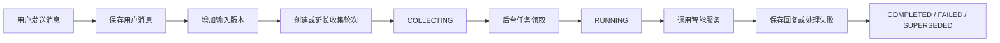

消息接口提交成功后立即返回，不等待右半部分完成。用户端先显示“智能客服正在处理”，最终回复通过消息创建事件到达。

---

## 2. 后台处理模块的职责划分

智能处理包含轮询、远程调用、版本校验和结果保存。如果全部放在一个方法中，调度规则与单轮业务会互相混杂。因此将其拆成以下职责明确的组件：

- `AIWorker`：负责持续轮询、回收租约过期的 Turn，并领取下一个可以处理的 Turn；
- `TurnProcessor`：负责处理单个 Turn，组织智能服务调用、版本校验、两阶段提交和最终结算；
- `TurnService`：负责 Turn 的领取、请求数据构造、状态转换、重试和租约释放等业务规则；
- `ConversationTurnRepository`：负责查询 Turn、执行行锁和读取租约过期的 Turn；
- `AIServiceGateway`：负责携带用户令牌和内部服务令牌，通过 HTTP 调用 AI Service；
- `AIEventParser`：负责识别 AI Service 返回的事件类型，并提取 Run ID 和最终处理结果；
- `AIResultService`：负责在当前事务中保存 AI 消息，并创建发送给用户端的 Outbox 事件；
- `AuthService`：负责为 Worker 生成代表当前用户身份的访问令牌。

其中，`AIWorker` 负责“什么时候处理”，`TurnProcessor` 负责“如何完成一次处理”，其余组件分别提供轮次业务、数据访问、远程通信、协议解析、结果保存和身份认证能力。

### 2.1 消息接口不直接调用智能服务

智能服务调用通常需要数秒甚至更久。如果消息接口直接调用，会带来以下问题：

- HTTP 请求长时间占用；
- 用户连续消息难以防抖合并；
- 网络失败后难以独立重试；
- 服务进程中断后无法恢复未完成任务；
- 数据库事务可能跨越远程调用。

因此，消息接口只负责把输入可靠地写入数据库，后台任务异步完成后续处理。

### 2.2 轮询调度与单轮处理分离

`AIWorker` 负责调度：

```text
回收过期租约
→ 领取一个到期轮次
→ 交给 TurnProcessor
→ 没有任务时短暂等待
```

`TurnProcessor` 负责单个轮次：

```text
创建身份令牌
→ 调用智能服务
→ 处理两阶段业务操作
→ 结算轮次并保存结果
```

这样，`AIWorker` 不需要了解智能事件细节，`TurnProcessor` 也不需要管理无限轮询。

### 2.3 网关、事件解析与结果保存

单轮处理又拆成三个协作组件：

- `AIServiceGateway`：负责 HTTP 请求和鉴权请求头；
- `AIEventParser`：负责识别智能服务返回的事件；
- `AIResultService`：负责保存智能消息和用户端 Outbox 事件。

这三个组件分别对应外部通信、协议解析和本地持久化，避免后台任务直接承担所有细节。

### 2.4 后台处理模块整体结构图

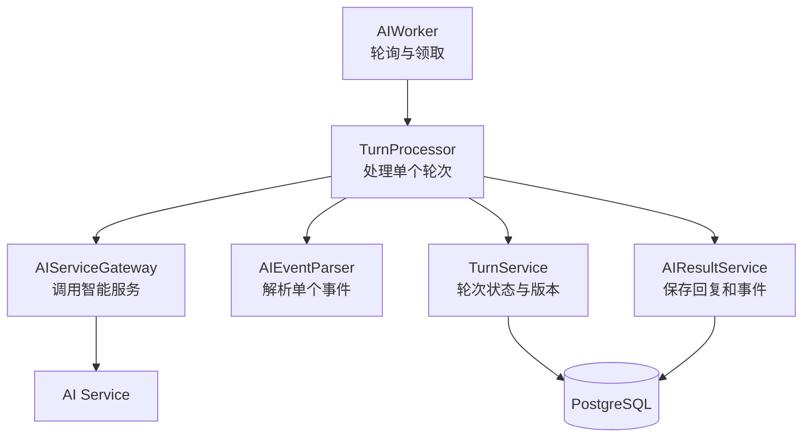

组件拆分没有改变事务边界。每次数据库操作仍然使用当前短事务中的同一个 `AsyncSession`。

---

## 3. 领取等待处理的轮次

后台任务不能领取所有 `COLLECTING` 轮次。只有收集时间已经结束、会话仍由智能客服处理，并且同一会话没有其他运行任务时，轮次才真正可执行。

### 3.1 哪些轮次可以被领取

候选轮次需要同时满足：

```text
status = COLLECTING
collect_until <= 当前时间
Conversation.mode = AI
同一会话不存在 RUNNING Turn
```

查询按 `collect_until` 和 `created_at` 排序，每次只领取最早到期的一条。这让等待时间更长的任务优先执行。

### 3.2 排除已有运行轮次的会话

同一会话允许同时存在：

```text
Turn 1：RUNNING，处理上一批输入
Turn 2：COLLECTING，收集运行期间的新输入
```

但不能让 Turn 2 在 Turn 1 结束前也变成 `RUNNING`。相关条件是：

```python
~exists(
    select(1).where(
        running_turn.conversation_id
        == ConversationTurn.conversation_id,
        running_turn.status == "RUNNING",
    )
)
```

它表示“候选轮次所属会话不存在运行中的另一条轮次”。数据库唯一索引是最后保障，这个查询条件则主动跳过当前不可领取的任务，避免依赖唯一约束异常控制流程。

### 3.3 锁定轮次与会话

领取查询使用：

```python
.with_for_update()
```

它需要协调两类并发操作：

- 用户消息请求可能延长 `COLLECTING` 轮次的 `collect_until`；
- 后台任务准备把同一轮次改成 `RUNNING`。

用户消息先获得锁时，轮次收集时间被延长，后台任务不应继续领取。后台任务先获得锁时，轮次变成 `RUNNING`，后续用户消息会创建下一条 `COLLECTING` 轮次。

### 3.4 固定输入快照

领取成功后执行：

```python
turn.status = "RUNNING"
turn.snapshot_revision = conversation.input_revision
```

`snapshot_revision` 表示本次处理最多覆盖到哪个输入版本。后续即使用户继续发送消息，这个值也不再改变。

例如：

```text
start_revision = 4
snapshot_revision = 6
```

表示本轮处理版本 4、5、6。版本 7 以后到达的消息属于下一次处理。

### 3.5 设置处理租约

领取时还会记录：

```python
turn.locked_by = worker_id
turn.locked_until = now + timedelta(
    seconds=settings.ai_worker_lease_seconds
)
turn.attempts += 1
turn.started_at = turn.started_at or now
```

从业务含义上说，租约表示某个后台进程在指定时间内拥有本轮处理权：

- `locked_by`：当前处理者，由主机名和进程号组成；
- `locked_until`：处理权截止时间；
- `attempts`：已经领取并尝试处理的次数；
- `started_at`：第一次开始处理的时间。

### 3.6 领取轮次流程图

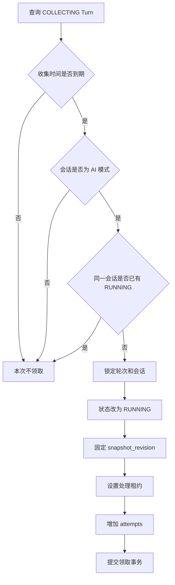

领取事务提交后立即释放数据库行锁，但租约字段继续保存在数据库中，覆盖后续远程调用阶段。

---

## 4. 构造智能服务请求

领取轮次后，后台任务需要根据固定的版本范围查询当前输入，同时补充之前的会话历史。这两部分数据承担不同职责。

### 4.1 查询本轮输入版本范围

当前输入按照下面的范围查询：

```text
conversation_id 相同
role = user
input_revision >= start_revision
input_revision <= snapshot_revision
```

并按 `input_revision` 正序排列。这样，即使一轮合并了多条连续消息，智能服务也能按照用户实际发送顺序理解输入。

### 4.2 查询本轮之前的历史消息

系统先找到本轮第一条用户消息的数据库序号，再查询它之前最近的 30 条消息：

```text
Message.id < 本轮第一条消息的 id
按 id 倒序查询
限制 30 条
最后重新翻转为正序
```

历史消息可以包含 `user`、`ai` 和 `human` 三种角色，帮助智能服务理解之前已经讨论过什么。

### 4.3 生成请求编号

请求编号使用：

```python
request_id = f"{turn.id}:attempt:{turn.attempts}"
```

同一轮重试时 `attempts` 会增加，因此每次处理尝试都有不同请求编号：

```text
turn_001:attempt:1
turn_001:attempt:2
turn_001:attempt:3
```

这个编号用于区分重试尝试；`turn.id` 标识逻辑任务，`run_id` 则由智能服务在真正启动运行后生成。

### 4.4 当前消息与历史消息的区别

发送给智能服务的数据分成：

```text
messages：本轮尚未回答的用户输入
history：本轮之前已经存在的上下文
```

`messages` 只包含用户角色，因为它表示本轮需要回答的内容。`history` 保留角色和创建时间，因为它用于还原完整对话背景。

`build_agent_request_data()` 最终返回的完整字典结构如下：

```python
{
    "conversation_id": claimed_turn.conversation_id,
    "user_id": claimed_turn.user_id,
    "turn_id": claimed_turn.id,
    "request_id": f"{claimed_turn.id}:attempt:{claimed_turn.attempts}",
    "input_revision": snapshot_revision,
    "messages": [
        {
            "message_id": message.message_id,
            "type": message.message_type,
            "content": message.content,
        }
        for message in current_messages
    ],
    "history": [
        {
            "message_id": message.message_id,
            "role": message.role,
            "type": message.message_type,
            "content": message.content,
            "created_at": message.created_at.isoformat()
        }
        for message in history_messages
    ],
}, current_messages[-1].message_id
```

### 4.5 请求数据构造流程图

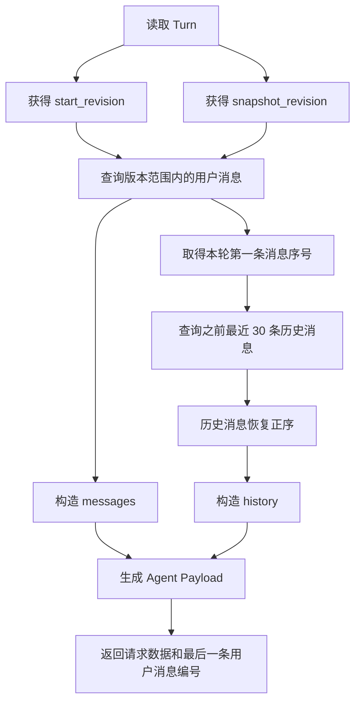

请求构造仍在领取事务中完成。消息读取完成并提交后，后台任务才离开数据库事务去调用智能服务。

---

## 5. 调用智能服务

客服服务不会直接执行模型，也不会直接修改订单数据库。它通过网关调用智能服务，由智能服务完成意图理解和工具编排。

### 5.1 生成用户身份令牌

后台任务根据请求中的用户编号创建客户身份令牌：

```python
token = auth_service.create_access_token(
    CurrentUser(user_id=request["user_id"])
)
```

智能服务调用电商工具时需要知道操作属于哪个用户。该令牌用于传递用户身份，防止只依靠请求体中的自由字段执行跨用户操作。

### 5.2 内部服务令牌的作用

网关同时发送：

```text
Authorization: Bearer <客户身份令牌>
X-Internal-Service-Token: <内部服务令牌>
```

两种令牌回答不同问题：

- 客户身份令牌：这次请求代表哪个用户；
- 内部服务令牌：调用方是否为可信的客服服务。

智能服务需要同时校验服务身份和用户身份。

### 5.3 单个事件响应协议

单个 JSON 事件，每次启动或提交请求只返回一个业务事件：

```json
{
  "event_type": "run_completed",
  "event_data": {
    "run_id": "run_001",
    "message_id": "msg_001",
    "content": {
      "text": "这是智能客服回复"
    }
  }
}
```

因此，网关返回 `dict[str, Any]`，事件解析器也只处理一个字典。

### 5.4 启动、提交与取消接口

网关提供三个入口：

```text
start_run   → 启动一次智能处理并返回事件
commit_run  → 提交已经准备好的业务写操作
cancel_run  → 取消尚未提交的业务决策
```

对应接口为：

```text
POST /internal/v1/agent/runs
POST /internal/v1/agent/runs/{run_id}/commit
POST /internal/v1/agent/runs/{run_id}/cancel
```

启动和提交返回单个 JSON 事件，取消成功不需要响应内容，使用 `204 No Content` 即可。

### 5.5 网关调用流程图

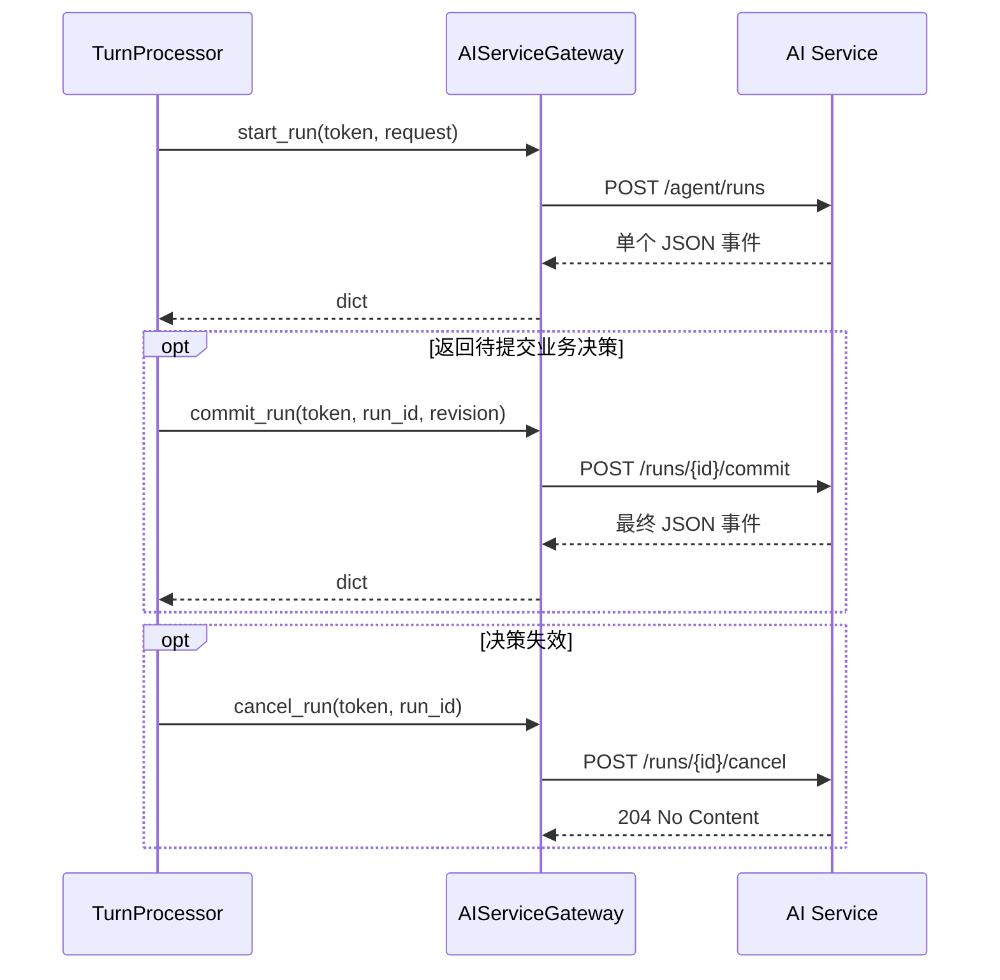

网关只负责通信协议，不判断轮次版本，也不修改本地数据库。

---

## 6. 解析智能处理事件

智能服务返回的事件不能直接交给持久化逻辑。事件解析器先识别类型，再提取运行编号和最终数据。

### 6.1 四种内部事件类型

定义了四种内部事件：

```text
RUN_DECISION_PREPARED
RUN_COMPLETED
RUN_FAILED
RUN_HANDOFF_REQUESTED
```

前三种参与当前智能回复和业务写操作流程，第四种仅为后续人工工单模块预留。

### 6.2 普通完成事件

`RUN_COMPLETED` 表示已经获得可保存的最终结果：

```json
{
  "event_type": "run_completed",
  "event_data": {
    "run_id": "run_001",
    "message_id": "msg_ai_001",
    "content": {
      "text": "订单预计明天发货"
    }
  }
}
```

普通知识回答和只读查询可以在第一阶段直接返回该事件；业务写操作则在提交成功后返回。

### 6.3 待提交业务决策事件

`RUN_DECISION_PREPARED` 表示：

```text
智能服务已经理解用户意图
已经准备好业务操作参数
但还没有真正执行写操作
```

例如取消订单、申请退款和修改地址。客服服务必须先校验输入快照，再决定提交还是取消。

### 6.4 失败事件

`RUN_FAILED` 表示智能处理失败。解析器把事件转换为异常：

```python
if event_type == AgentEventType.RUN_FAILED:
    raise RuntimeError(message)
```

异常由 `TurnProcessor` 捕获，再进入重试或最终失败流程。这样事件解析器只负责协议语义，不负责修改数据库状态。

### 6.5 转人工事件的预留

`RUN_HANDOFF_REQUESTED` 计划用于表示智能服务判断当前问题需要人工处理。未来它可以作为第一阶段直接返回的终态决策，因为真正的人工工单应由客服服务本地事务创建。

当前课程尚未实现人工工单模型和业务服务，`AIEventParser.parse_outcome()` 也不支持该事件。如果现在收到它，会被当成协议错误进入失败重试。后续需要同时补充解析和工单处理：

```text
解析转人工原因
→ 创建 waiting 工单
→ Conversation.mode 改为 QUEUED
→ 创建 HANDOFF_CHANGED 事件
```

### 6.6 事件解析流程图

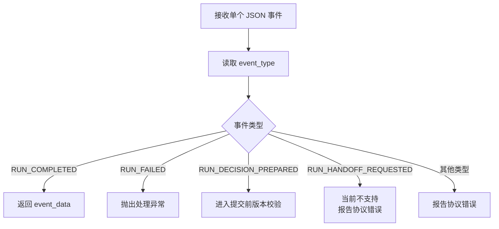

事件类型只描述智能运行结果，发送给用户端和管理端的 `MESSAGE_CREATED`、`HANDOFF_CHANGED` 属于另一套实时业务事件。

---

## 7. 业务写操作的两阶段处理

普通回答只产生文本，过期后丢弃即可。取消订单、退款等操作会改变真实业务数据，不能在客服服务确认输入仍然有效前直接执行。

### 7.1 为什么写操作不能立即执行

假设用户先发送：

```text
取消我的订单
```

智能服务分析期间，用户又发送：

```text
先不要取消
```

如果智能服务第一阶段已经真正取消订单，客服服务即使发现旧输入过期，也无法通过丢弃回复撤销业务影响。因此，第一阶段只能准备决策，不能执行写操作。

### 7.2 第一阶段准备业务决策

第一阶段调用：

```python
event = await ai_gateway.start_run(token, request)
```

涉及写操作时返回：

```text
RUN_DECISION_PREPARED
```

智能服务保存待提交决策及其参数，等待客服服务调用 `commit_run()` 或 `cancel_run()`。

### 7.3 提交前校验输入快照

只有待提交业务决策才执行第一次版本校验：

```text
conversation.input_revision
==
turn.snapshot_revision
```

校验时锁定 `Conversation`，避免比较版本与作出提交决定之间被用户消息请求插入。

如果版本已经变化，Turn 被标记为 `SUPERSEDED`，客服服务会尽力取消待提交决策。普通 `RUN_COMPLETED` 没有外部写操作，因此不需要这次提前校验，只在最终保存前校验。

### 7.4 第二阶段提交业务操作

版本有效时调用：

```python
event = await ai_gateway.commit_run(
    token,
    run_id,
    input_revision,
)
```

智能服务再调用对应电商业务接口。真正修改订单数据的是订单或电商服务，智能服务只是工具调用编排者，客服服务则是对话流程协调者。

### 7.5 输入过期时取消待提交决策

只有同时满足下面两个条件时才调用取消：

```python
if prepared and not committed:
    await self._safe_cancel_run(token, run_id)
```

- `prepared`：智能服务已经准备了业务写操作；
- `not committed`：客服服务尚未确认提交成功。

`cancel_run()` 只是尽力取消，果远端操作实际已经提交，取消也不能撤销业务副作用。普通完成和失败都是终态，不存在等待提交的操作。

### 7.6 普通回复不需要两阶段

普通回答、知识检索和只读订单查询不会修改外部业务数据。它们可以在第一阶段直接返回 `RUN_COMPLETED`：

```text
start_run
→ 得到最终回复
→ 最终保存前校验版本
→ 有效则保存，过期则丢弃
```

即使结果过期，也只是不保存旧回复，不会留下外部业务副作用。

### 7.7 两阶段处理流程图

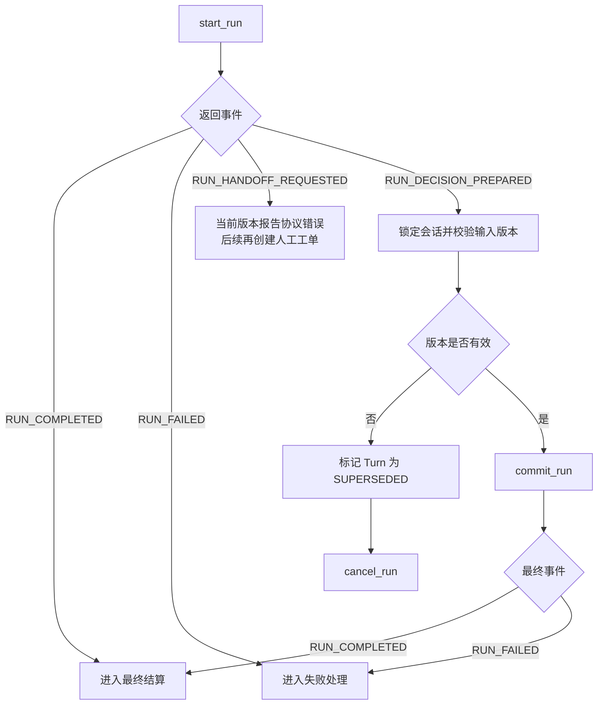

这张图体现了两次校验的不同职责：**提交前校验只保护待执行写操作，最终保存前校验保护所有本地结果落库。**

---

## 8. 结算轮次并保存智能回复

智能调用结束后，后台任务重新打开短事务，锁定会话并结算轮次。无论普通回复、业务操作结果还是最终失败消息，都在这里完成本地持久化。

### 8.1 为什么保存前还要校验版本

第一次校验事务提交后，会话锁已经释放。调用 `commit_run()`、解析响应期间，用户仍可能发送新消息。因此，最终保存前必须再次比较：

```text
conversation.input_revision
与
turn.snapshot_revision
```

用户消息先提交时，后台任务会读到新版本并淘汰旧 Turn；后台任务先提交时，当前回复先保存，新消息随后进入下一轮。最终结果的有效性因此具有确定顺序。

### 8.2 记录智能运行编号

智能服务在事件中返回 `run_id`。最终结算时写入：

```python
turn.run_id = run_id
```

普通回复不会经过提交前校验，因此必须在最终结算中记录 Run ID。业务写操作虽然已经在提交前记录过，再次赋值仍保持相同结果。

Run ID 还会写入最终 AI 消息，用于关联智能服务运行记录并支持结果幂等。

### 8.3 保存智能回复消息

`AIResultService` 创建角色为 `ai` 的消息：

```text
message_id：智能服务提供，缺省时由客服服务生成
conversation_id：所属会话
role：ai
message_type：text
content：最终展示内容
agent_run_id：智能运行编号
agent_outcome_seq：当前固定为1
```

当前协议规定一个 Run 只产生一条最终消息，所以结果序号固定为 1。未来若一个 Run 支持多个结果，应由智能服务返回真实序号。

### 8.4 推进会话已处理版本

正常回复或最终失败消息保存后，执行：

```python
conversation.answered_revision = turn.snapshot_revision
```

这里的“已回答”包含正常回复和最终失败提示，准确含义是这批输入已经得到终态处理结果。推进版本后，后续新轮次不会再次包含已经达到最大重试次数的旧输入。

### 8.5 创建用户端消息事件

保存 AI 消息后，同时创建：

```text
频道：customer-service:user:{user_id}
事件：MESSAGE_CREATED
数据：message_id、role、content
关联：conversation_id
```

用户端收到后新增或替换消息，根据 `role="ai"` 显示智能客服样式，并关闭“正在处理”提示；失败内容还会切换为失败状态。

普通 AI 回复不发送管理端。管理端主要处理 `QUEUED` 和 `HUMAN` 会话，未来发生转人工时由 `HANDOFF_CHANGED` 通知。

### 8.6 消息与事件的原子提交

`AIResultService` 中的 `MessageRepository` 和 `RealtimeService` 使用同一个 Session：

```text
保存 AI Message
创建 RealtimeOutbox
更新 Conversation
更新 ConversationTurn
→ 最外层统一 commit
```

任意 SQL 失败时，消息、轮次状态、已处理版本和 Outbox 事件都会一起回滚，避免用户消息已经保存但实时通知缺失。

### 8.7 结果结算流程图

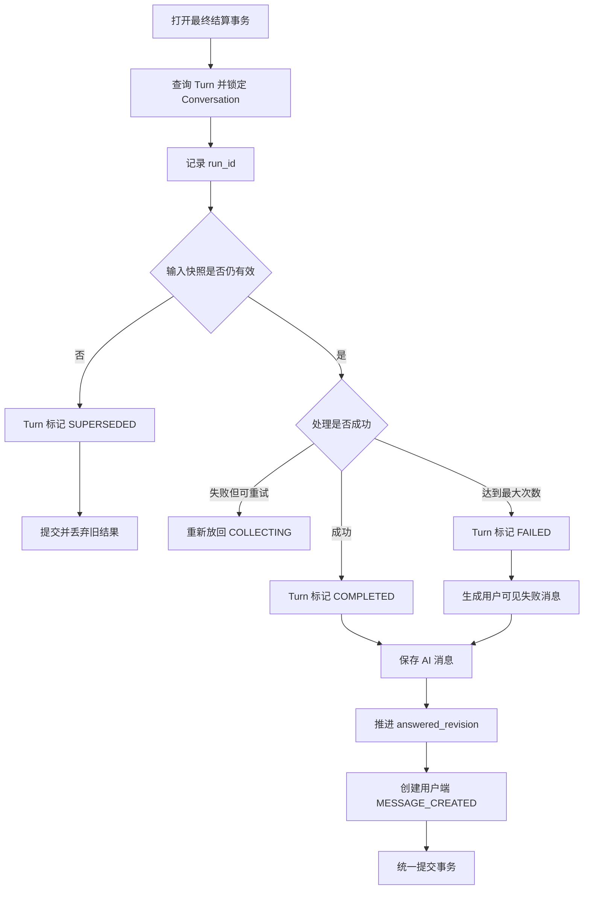


## 9. 失败重试与租约恢复

远程调用失败不一定表示用户问题永远无法处理。短暂网络异常可以重试，进程意外中断则需要租约恢复。两者触发时机和处理方式不同。

### 9.1 普通调用失败如何重试

智能调用抛出异常后，`TurnProcessor` 进入最终结算，调用：

```python
turn_service.retry_or_fail(turn, error)
```

只要尝试次数没有达到上限，Turn 就会：

```text
RUNNING → COLLECTING
collect_until → 当前时间 + 重试延迟
run_id → None
```

它不会立即再次执行，而是在短暂等待后重新进入领取队列。

### 9.2 最大重试次数

每次领取都会增加 `attempts`。对于能够被当前进程捕获的普通处理异常，当前默认最多尝试 3 次：

```text
attempt 1 失败 → 重新排队
attempt 2 失败 → 重新排队
attempt 3 失败 → 标记 FAILED
```

请求编号包含尝试次数，智能服务可以区分同一 Turn 的不同调用。


### 9.3 最终失败消息

达到最大次数后，系统不会静默结束，而是保存：

```json
{
  "kind": "error",
  "text": "AI 处理失败，请稍后重试。"
}
```

这条消息的角色仍然是 `ai`，通过用户频道发送。用户能够明确知道处理失败，而不是一直停留在“正在处理”状态。

最终失败也会推进 `answered_revision`，表示当前输入已经得到终态结果，避免后续新消息再次自动带上这批失败输入。

### 9.4 为什么需要释放租约

租约只属于当前一次处理尝试。无论重新排队还是最终失败，当前 Worker 都已经结束本次处理，因此需要清空：

```python
turn.locked_by = None
turn.locked_until = None
```

正确状态约束是：

```text
只有 RUNNING Turn 持有租约
其他状态的租约字段为空
```

重试时下一次领取会重新设置新的租约。

### 9.5 查询租约过期轮次

```text
status = RUNNING
locked_until <= 当前时间
```

### 9.7 重新排队与标记失效

恢复时先比较输入版本：

```text
当前输入版本 != 旧快照版本
→ 旧 Turn 标记 SUPERSEDED

当前输入版本 == 旧快照版本
→ 旧 Turn 重新放回 COLLECTING
```

版本变化说明运行期间已经出现新消息，新的收集轮次会重新覆盖全部未回答输入；版本没变则说明原任务仍然有效，可以立即重新领取。

完整的租约恢复代码如下：

```python
async def _recover_expired_turns(self) -> None:
    """回收 Worker 中断遗留的过期租约。"""
    async with self.session_factory() as session:
        turn_service = ConversationTurnService(session)
        contexts = await turn_service.list_expired_running_turns_with_conversations()

        for turn, conversation in contexts:
            if conversation.input_revision != turn.snapshot_revision:
                turn_service.mark_superseded(turn)
            else:
                turn_service.requeue(
                    turn,
                    RuntimeError("Worker 租约超时"),
                )

        if contexts:
            await session.commit()
```

### 9.8 过期 Turn 中的消息去了哪里

Turn 本身不保存消息，只通过 `start_revision` 和 `snapshot_revision` 引用 `messages` 表中的一段用户消息。因此，Turn 过期或失效时，用户消息不会被删除。

这里需要区分两种“过期”：

1. **租约过期，但输入版本没有变化**：原 Turn 被重新放回 `COLLECTING`，下次仍然处理原来的消息；
2. **输入快照过期**：原 Turn 被标记为 `SUPERSEDED`，但不会推进 `answered_revision`，原来的未回答消息会和新消息一起交给下一条 Turn。

例如：

```text
answered_revision = 3

Turn 1 正在处理版本 4～5
用户又发送版本 6
→ Turn 1 的快照失效，标记为 SUPERSEDED
→ 新 Turn 的 start_revision 仍然是 4
→ 新 Turn 领取时 snapshot_revision = 6
→ 下一次处理版本 4、5、6
```

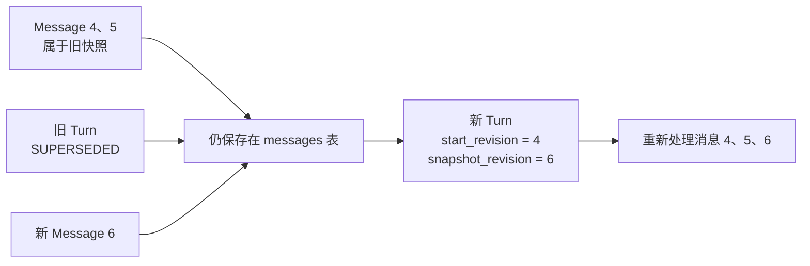

所以，`SUPERSEDED` 淘汰的是旧的处理结果和旧的执行任务，不是用户消息。只有成功回复或最终失败消息保存后，系统才推进 `answered_revision`，表示这批输入已经得到终态处理。

### 9.9 失败恢复流程图

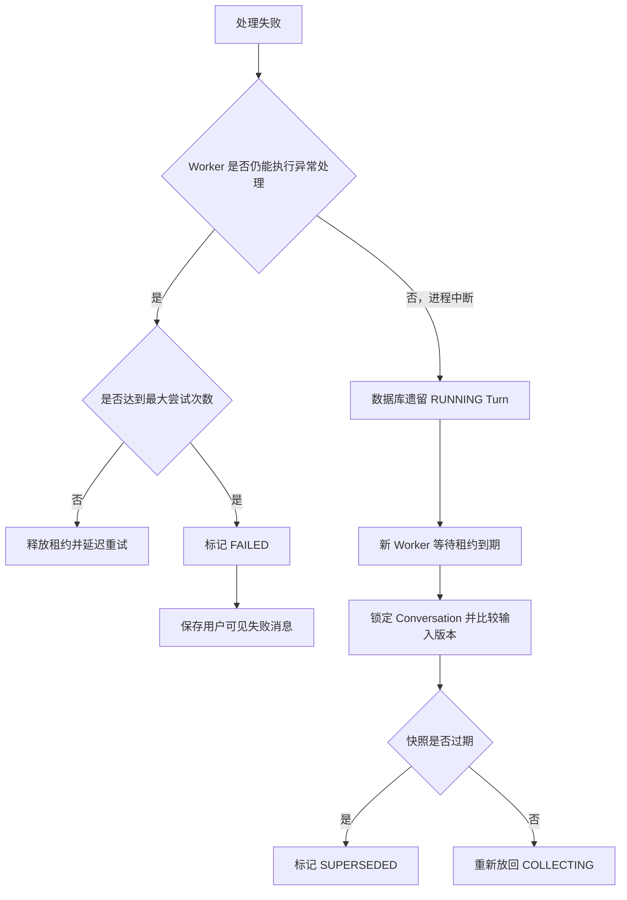

---

## 10. 后台任务的轮询运行

前面的章节描述了单个 Turn 如何处理。本章把领取、处理和恢复重新放回持续运行的后台循环中。

### 10.1 没有任务时短暂等待

`poll_and_process()` 没有领取到轮次时返回 `False`，主循环按照配置短暂休眠：

```python
await asyncio.sleep(
    settings.ai_worker_poll_interval_ms / 1000
)
```

这样既能及时发现新任务，又避免空队列时持续查询数据库造成忙循环。

### 10.2 每轮执行顺序

每轮固定执行：

```text
先回收租约过期的 RUNNING Turn
→ 再领取一个已经到期的 COLLECTING Turn
→ 构造请求数据
→ 交给 TurnProcessor 处理
```

一次只领取一轮，处理完成后再进入下一轮。

### 10.3 为什么远程调用不占用数据库事务

领取阶段使用短事务：

```text
锁定任务
→ 更新 RUNNING、快照和租约
→ 构造输入
→ commit
```

随后关闭 Session，再调用智能服务。最终结果返回后重新打开另一个短事务保存。

如果在数据库事务内等待远程调用，会长时间占用连接和行锁，阻塞用户继续发送消息。

### 10.4 后台任务完整流程图

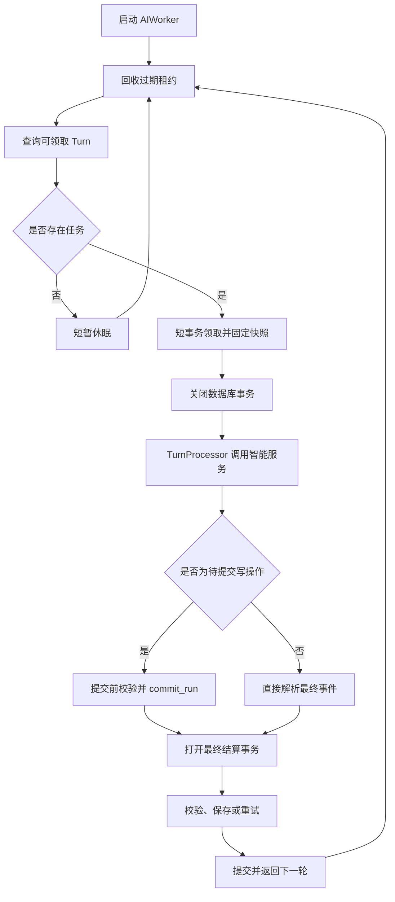

---

## 11. 本章总结

第四天把第三天创建的收集轮次接入后台处理链路，完成了从领取、调用到最终落库的闭环。

### 11.1 轮次生命周期总结

主要状态变化为：

```text
COLLECTING
→ 领取后 RUNNING
→ 成功后 COMPLETED
→ 可重试失败时重新 COLLECTING
→ 达到上限后 FAILED
→ 输入快照过期后 SUPERSEDED
```

`COMPLETED`、`FAILED` 和 `SUPERSEDED` 都是终态，不会再次被领取。

### 11.2 两阶段处理总结

普通回复与业务写操作的核心区别是是否产生外部副作用：

```text
普通回复、只读查询
→ 第一阶段直接得到结果
→ 最终保存前校验

取消、退款、修改等写操作
→ 第一阶段准备决策
→ 提交前校验
→ 第二阶段执行
→ 最终保存前再次校验
```

只有“已经准备但尚未确认提交”的业务决策需要调用 `cancel_run()`。

### 11.3 事务边界总结

第四天使用多个短事务：

```text
领取事务
→ 远程调用
→ 提交前校验事务（仅业务写操作）
→ 远程提交
→ 最终结算事务
```

远程调用期间不持有数据库连接和行锁。最终结算事务把 Turn 状态、Conversation 版本、AI Message 和 RealtimeOutbox 一起提交。

### 11.4 后续人工工单内容预告

当前协议已经预留 `RUN_HANDOFF_REQUESTED`，但尚未实现人工工单业务。后续需要继续完成：

```text
创建等待中的人工工单
→ 会话切换为 QUEUED
→ 通知用户端和管理端
→ 客服接单后切换 HUMAN
→ 人工回复与结束工单
```

至此，客服服务已经完成智能消息处理主链路，下一阶段可以围绕人工接管和智能服务自身的工具调用能力继续扩展。
