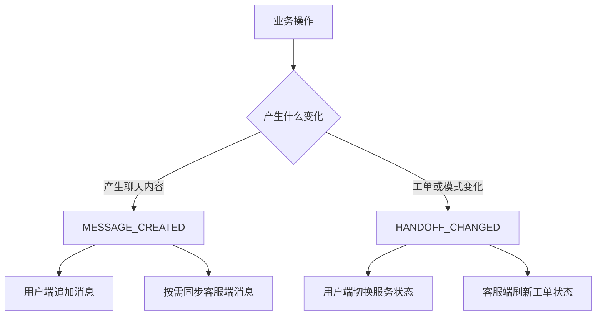
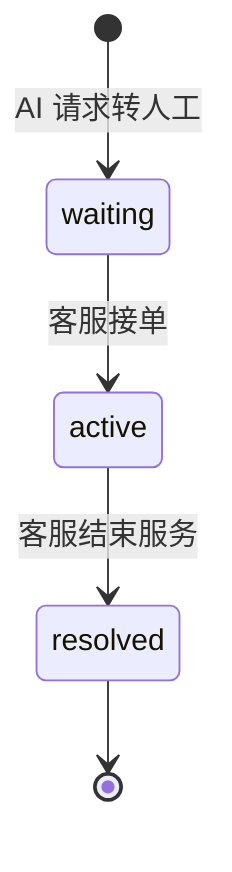
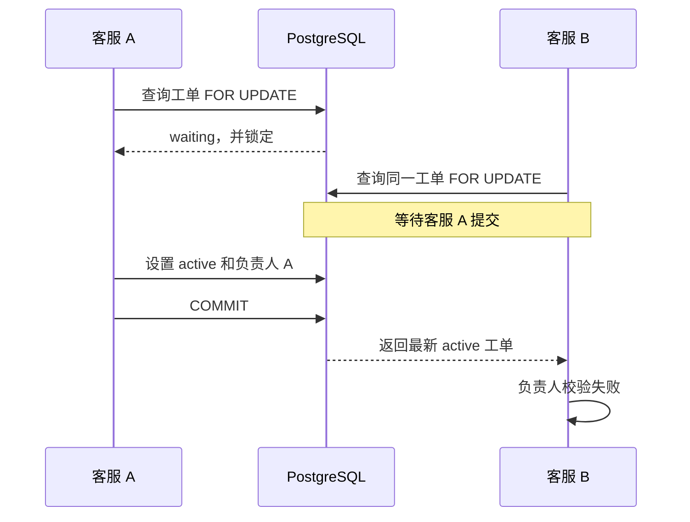
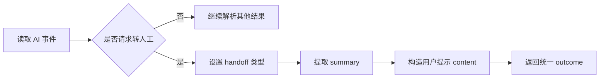
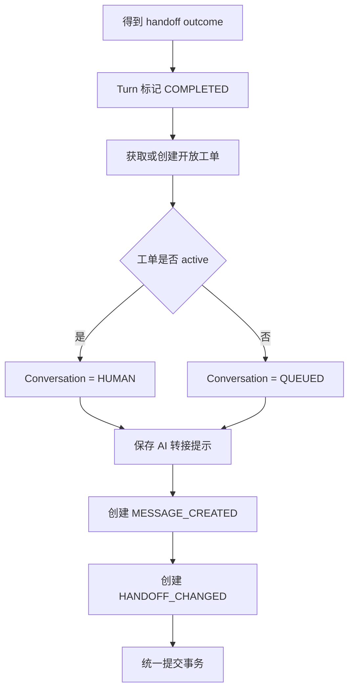
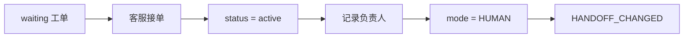
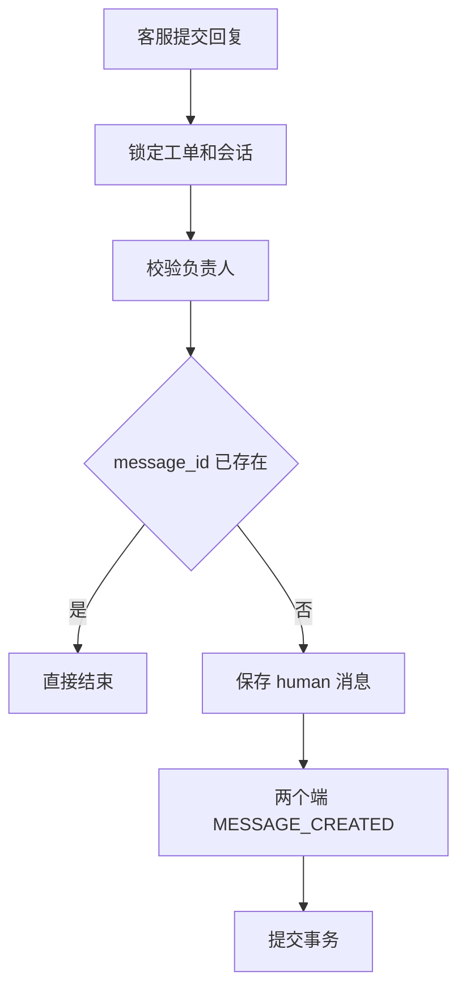
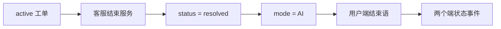
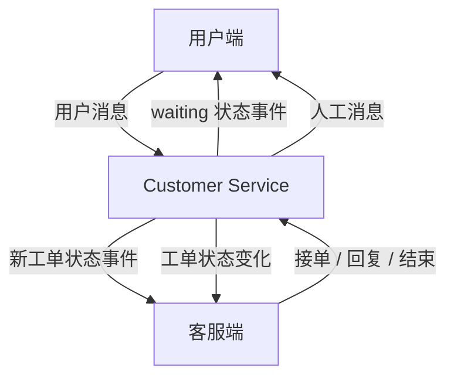

第五天：人工客服工单与前端状态处理

第四天已经完成 AI Turn 的领取、调用与结果保存。第五天继续处理 AI 无法独立完成的问题，实现**从 AI 请求转人工，到客服接单、回复、结束服务，再切回 AI**的完整业务闭环。

本章先说明**完整流程和事件职责**，再进入数据模型、并发控制与接口实现。<span style="color:red">Day05 只确定事件应当发给谁、前端收到后展示什么；Outbox Worker、Redis、WebSocket 和管理员监控指标留到 Day06。</span>

---

## 1. 从智能客服进入人工服务

### 1.1 本章学习目标

完成本章后，需要能够说明：

1. 人工工单和会话模式如何配合；
2. `MESSAGE_CREATED` 与 `HANDOFF_CHANGED` 分别表示什么；
3. AI 请求转人工后如何创建工单；
4. 客服如何接单、回复并结束服务；
5. 为什么工单和会话都需要加锁；
6. 两个前端收到事件后分别展示什么；
7. 消息、状态和 Outbox 如何保持事务一致。

### 1.2 本章范围与权限边界

```text
Day04：完成一次 AI Turn
Day05：接住转人工结果，完成人工服务流程
Day06：完成 Redis/WebSocket 实时传输和管理员监控指标
```

本章主要涉及：

- `Handoff` 数据模型；
- `HandoffRepository`；
- `HandoffService`；
- `AIEventParser` 与 `AIResultService`；
- `RealtimeService`；
- 工单 Schema、依赖和 Router；
- 用户端与客服端的事件处理。

- `customer`：发送消息，查看 AI 或人工回复；
- `agent`：查看开放工单、接单、回复和结束自己的工单；
- `admin`：只访问独立监控指标，不参与工单处理。

本章实现的是客服 `agent` 的工作台，不提供管理员接管工单功能。

---

## 2. 完整人工服务流程

### 2.1 流程概览

人工服务围绕两组核心状态变化展开：

```text
工单状态：waiting → active → resolved
会话模式：QUEUED  → HUMAN  → AI
```

<span style="color:red">Handoff 记录人工服务进度；Conversation.mode 决定新消息路由：`AI` 模式创建 AI Turn，`QUEUED` 或 `HUMAN` 模式不创建 AI Turn，只保存用户消息并通知客服端。</span>

### 2.2 顺序步骤

1. 用户消息进入 AI Turn；
2. AI 返回 `RUN_HANDOFF_REQUESTED`；
3. Customer Service 创建 `waiting` 工单；
4. 会话模式切换为 `QUEUED`；
5. 用户端显示“等待人工”，客服端显示新工单；
6. 客服接单，工单变为 `active`；
7. 会话模式切换为 `HUMAN`；
8. 用户和客服通过原会话继续发送消息；
9. 客服结束服务，工单变为 `resolved`；
10. 会话模式切回 `AI`，后续消息重新进入 AI 流程。

### 2.3 完整业务流程图

```mermaid
flowchart LR
    A["用户发送消息"] --> B["AI 处理"]
    B --> C["请求转人工"]
    C --> D["创建 waiting 工单"]
    D --> E["会话进入 QUEUED"]
    E --> F["客服接单"]
    F --> G["工单进入 active"]
    G --> H["会话进入 HUMAN"]
    H --> I["人工回复"]
    I --> J["客服结束服务"]
    J --> K["工单进入 resolved"]
    K --> L["会话切回 AI"]
```



---

## 3. 两种实时事件与前端展示

本章只保留两种前端实时事件：

- **`MESSAGE_CREATED`**：有一条聊天消息需要展示；
- **`HANDOFF_CHANGED`**：工单状态或会话模式发生变化。

<span style="color:red">产生聊天内容时使用 `MESSAGE_CREATED`，工单或会话状态变化时使用 `HANDOFF_CHANGED`；两者同时发生就创建两种事件。</span>

```text
用户频道：customer-service:user:{user_id}
客服频道：customer-service:staff
```

**用户频道属于单个用户；客服频道由所有客服工作台共同订阅。**

### 3.1 人工流程中的事件

#### 1. AI 请求转人工

```text
MESSAGE_CREATED → 用户端
展示“正在为你转接人工客服，请稍候”

HANDOFF_CHANGED → 用户端
显示“等待人工”

HANDOFF_CHANGED → 客服端
刷新列表并显示新的 waiting 工单
```

#### 2. 客服接单

```text
HANDOFF_CHANGED → 用户端
显示“人工服务中”

HANDOFF_CHANGED → 客服端
显示 active 状态和负责人
```

#### 3. 用户发送消息

```text
MESSAGE_CREATED → 客服端
同步用户在 QUEUED/HUMAN 模式下发送的新消息
```

**用户发送的消息已经由用户端直接显示，不需要再推送回用户频道。**

#### 4. 客服回复

```text
MESSAGE_CREATED → 用户端
追加人工客服回复

MESSAGE_CREATED → 客服端
同步当前会话消息
```

#### 5. 结束人工服务

```text
MESSAGE_CREATED → 用户端
展示人工服务结束语

HANDOFF_CHANGED → 用户端
切回“AI 客服”

HANDOFF_CHANGED → 客服端
从开放工单列表移除工单
```

### 3.2 事件与前端展示流程图



---

## 4. 人工工单的数据模型与状态

**Conversation 保存聊天上下文，Handoff 保存一次人工服务过程。**独立建模后，可以分别表达：

- 会话当前由谁处理；
- 工单是否等待、处理中或已结束；
- 当前负责人是谁；
- 何时接单、何时结束。

### 4.1 工单状态与会话模式

- **`waiting`**：已经请求转人工，尚未接单；
- **`active`**：客服已经接单，正在人工处理；
- **`resolved`**：人工服务已经结束。

- **`AI`**：新消息进入 AI Turn；
- **`QUEUED`**：正在等待人工客服；
- **`HUMAN`**：新消息交给人工客服。

```text
Handoff.waiting  ↔ Conversation.QUEUED
Handoff.active   ↔ Conversation.HUMAN
Handoff.resolved ↔ Conversation.AI
```

### 4.2 核心字段

```python
class Handoff(Base):
    id: Mapped[str]
    conversation_id: Mapped[str]
    user_id: Mapped[str]
    summary: Mapped[str]
    status: Mapped[str]
    assigned_agent_id: Mapped[str | None]
    created_at: Mapped[datetime]
    accepted_at: Mapped[datetime | None]
    resolved_at: Mapped[datetime | None]
```

### 4.3 状态流转图



---

## 5. 工单的数据访问与并发控制

`HandoffRepository` 只负责数据库访问：

```text
add()                         新增工单
find_open_by_user_id()        查询用户的 waiting/active 工单
list_open()                   查询客服工作台开放工单
find_and_lock_by_id()         查询并锁定指定工单
```

### 5.1 查询开放工单

客服工作台只关心尚未结束的工单：

```python
select(Handoff).where(
    Handoff.status.in_(["waiting", "active"])
)
```

### 5.2 锁定工单和会话

接单、回复和结束服务都会先执行：

```text
锁定 Handoff
→ 检查工单状态
→ 锁定 Conversation
→ 执行业务修改
→ 提交事务并释放锁
```

**Handoff 锁防止两个客服同时修改一个工单；Conversation 锁保证消息路由和会话模式不会被并发请求错误覆盖。**

<span style="color:red">两个锁都会一直保持到当前事务提交或回滚，因此状态校验、业务修改和 Outbox 写入必须在同一事务中完成；任一步失败都统一回滚。</span>

### 5.3 两个客服同时接单



---

## 6. AI 请求转人工的具体实现

<span style="color:red">AI 请求转人工属于一次正常的 AI 最终结果，不属于处理失败，因此当前 Turn 需要标记为 `COMPLETED`。</span> 后续等待、接单和人工处理由 Handoff 负责；Customer Service 还需要保存转接提示、创建工单、修改会话模式并创建状态事件。

### 6.1 转人工事件的解析

`AIEventParser` 按以下顺序解析事件：

1. 读取 `event_type` 和 `event_data`；
2. 判断事件是否为 `RUN_HANDOFF_REQUESTED`；
3. 设置 `outcome_type="handoff"`；
4. 提取工单摘要，缺失时使用默认摘要；
5. 提取面向用户的转接提示，缺失时使用默认提示；
6. 返回供 Worker 保存的统一结果。

```python
if event_type == AgentEventType.RUN_HANDOFF_REQUESTED:
    return {
        **event_data,
        "outcome_type": "handoff",
        "summary": str(
            event_data.get("summary") or "用户请求人工客服"
        ),
        "content": {
            "text": str(
                event_data.get("message")
                or "正在为你转接人工客服，请稍候。"
            )
        },
    }
```

解析过程可以概括为：



### 6.2 转人工结果的保存

Worker 得到 `handoff` 结果后，按以下顺序处理：

1. 在已经锁定当前 Turn 和 Conversation 的结算事务中，把 Turn 标记为 `COMPLETED`；
2. 查询用户现有的开放工单；
3. 没有开放工单时创建 `waiting` 工单，已有开放工单时复用原工单；
4. 根据工单状态设置 `QUEUED` 或 `HUMAN`；
5. 保存用户可见的 AI 转接提示；
6. 创建用户端 `MESSAGE_CREATED`；
7. 创建两个端的 `HANDOFF_CHANGED`；
8. 统一提交事务。

关键实现：

```python
handoff = await self.handoff_service.get_or_create_open_handoff(
    conversation,
    summary=str(outcome["summary"]),
)
conversation.mode = (
    "HUMAN" if handoff.status == "active" else "QUEUED"
)

self.save_ai_result(
    conversation,
    turn,
    outcome["content"],
    message_id=outcome.get("message_id"),
)

self.realtime_service.add_handoff_changed_events(
    conversation,
    handoff,
)
```

`get_or_create_open_handoff()` 可能返回：

```text
新建 waiting  → 会话设置为 QUEUED
已有 waiting  → 会话保持 QUEUED
已有 active   → 会话保持 HUMAN
```

<span style="color:red">这个判断可以防止重复事件把正在人工服务的会话错误退回排队状态。</span>

**Turn 表示一次 AI 处理任务。**AI 已经成功给出“转人工”结果，因此 AI Turn 已完成；后续等待和处理属于 Handoff 生命周期。

```text
ConversationTurn.status = COMPLETED
Handoff.status = waiting
```

结果保存流程如下：



---

## 7. HandoffService 与三个工单操作

### 7.1 公共处理逻辑

三个写操作都遵循相同的处理顺序：

```text
锁定工单
→ 排除 resolved 工单
→ 锁定所属会话
→ 校验业务条件
→ 修改数据并创建事件
→ 提交事务
```

<span style="color:red">人工回复和结束服务只能由当前工单负责人执行。</span>

```python
if handoff.assigned_agent_id != agent_id:
    raise HTTPException(
        status_code=403,
        detail="工单不属于当前客服",
    )
```

### 7.2 客服接单

顺序步骤：

1. 锁定工单和会话；
2. 如果已经是 `active`，原负责人重复接单时直接结束，其他客服接单时返回 `403`；
3. 把工单改为 `active`；
4. 保存当前客服 ID 和接单时间；
5. 把会话改为 `HUMAN`；
6. 给两个端创建 `HANDOFF_CHANGED`；
7. 提交事务。



### 7.3 客服回复

顺序步骤：

1. 锁定工单和会话；
2. 校验当前客服是负责人；
3. 根据 `message_id` 查询已有消息；
4. 已存在时直接结束，避免重复消息；
5. 不存在时保存 `role=human` 的消息；
6. 给用户端和客服端创建 `MESSAGE_CREATED`；
7. 提交事务。



### 7.4 结束人工服务

顺序步骤：

1. 锁定工单和会话；
2. 校验当前客服是负责人；
3. 把工单改为 `resolved`；
4. 记录结束时间；
5. 把会话模式切回 `AI`；
6. 保存服务端生成的结束语；
7. 只给用户端创建结束语 `MESSAGE_CREATED`；
8. 给两个端创建 `HANDOFF_CHANGED`；
9. 提交事务。



---

## 8. 工单接口与两个前端

### 8.1 工单接口

```text
GET  /api/v1/handoffs
查询 waiting 和 active 工单

POST /api/v1/handoffs/{handoff_id}/accept
当前客服接单

POST /api/v1/handoffs/{handoff_id}/messages
当前负责人发送人工回复

POST /api/v1/handoffs/{handoff_id}/resolve
当前负责人结束人工服务
```

**写接口成功后不返回额外业务数据。前端通过重新查询和状态事件获得最新结果。**

### 8.2 接口顺序

1. Router 校验当前身份为 `agent`；
2. 从令牌中取得当前客服 ID；
3. 调用 `HandoffService`；
4. Service 完成锁定、校验、保存和事件创建；
5. Router 返回成功状态。

### 8.3 用户端处理

用户端维护当前会话模式：

```javascript
function conversationModeLabel(mode) {
  return {
    AI: 'AI 客服',
    QUEUED: '等待人工',
    HUMAN: '人工服务中',
  }[mode] || mode
}
```

收到事件后：

```text
MESSAGE_CREATED → 追加聊天消息
HANDOFF_CHANGED → 更新 conversationMode，并刷新会话
```

**用户自己发送的消息由页面直接显示，不依赖 WebSocket 再推送一次。**

页面刷新时还会查询当前会话，从数据库恢复 `AI`、`QUEUED` 或 `HUMAN`。

### 8.4 客服端处理

客服端收到事件后：

```text
新建 waiting 工单 → 刷新开放工单列表
工单变为 active  → 显示负责人和处理中状态
用户发送新消息   → 刷新当前会话
收到人工消息     → 刷新当前会话
工单变为 resolved → 移除工单并关闭详情
```

<span style="color:red">只有 `assigned_agent_id` 等于当前客服 ID 时，前端才启用回复和结束操作；其他客服不能操作，后端仍会返回 `403`。</span>

### 8.5 前后端协作图



---

## 9. 事务一致性

### 9.1 工单与会话状态的一致性

接单和结束服务会同时修改 Handoff 与 Conversation：

```text
接单：waiting + QUEUED → active + HUMAN
结束：active + HUMAN → resolved + AI
```

<span style="color:red">Handoff 与 Conversation 的状态修改必须使用同一个 Session 和同一次事务提交。</span>

### 9.2 消息与 Outbox 的原子提交

人工回复必须保证：

```text
消息保存成功，事件也保存成功；
消息保存失败，事件也不能留下。
```

<span style="color:red">Message、Handoff、Conversation 和 RealtimeOutbox 必须在当前事务中写入，最后统一 `commit()`。</span>

### 9.3 Day06 预告

Day05 确定事件内容、接收频道和前端行为。Day06 继续完成实时传输和管理员监控：

```text
读取 RealtimeOutbox
→ 发布 Redis 消息
→ WebSocket 订阅频道
→ 把事件转发给用户端和客服端
→ 实现管理员监控指标查询与前端指标卡片
```

