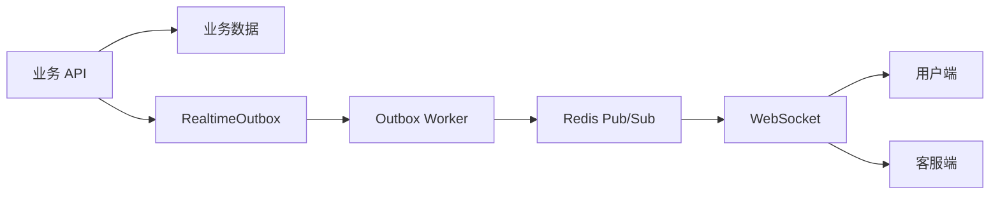
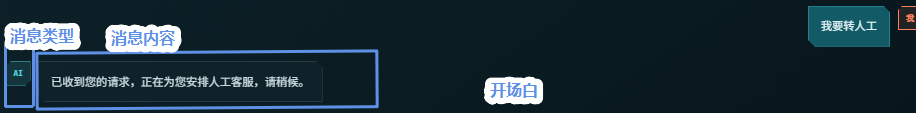
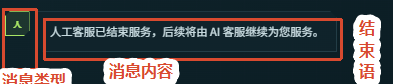
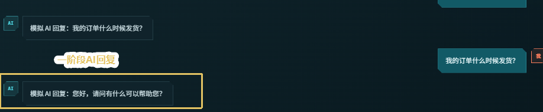
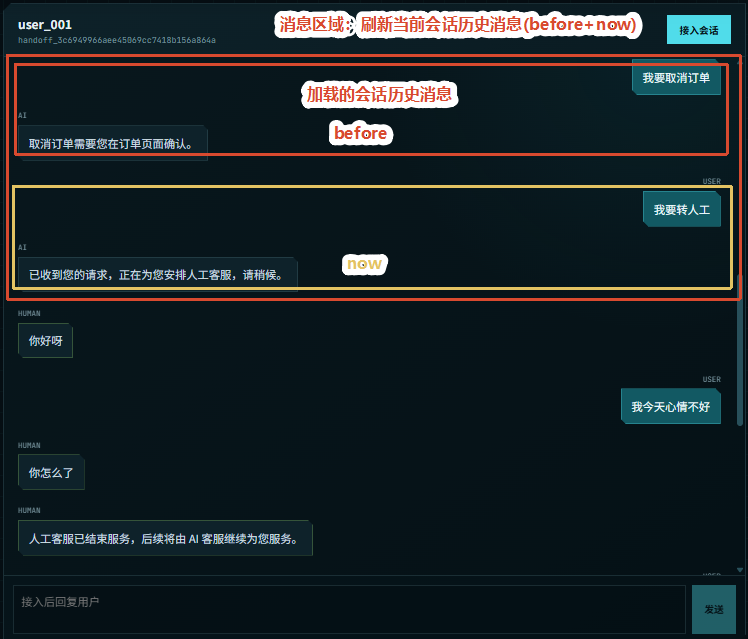
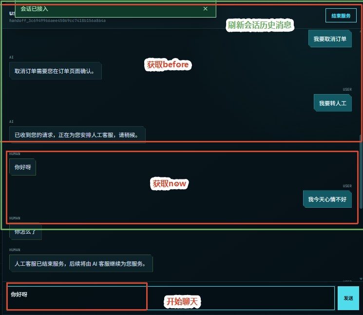
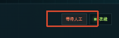
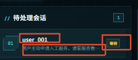
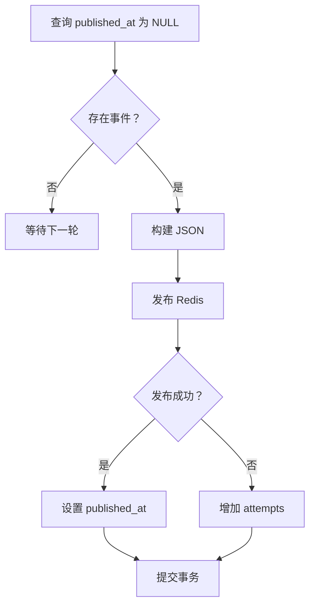

第六天：实时推送与监控

第五天已经完成人工工单流程，并在业务事务中创建了 `MESSAGE_CREATED` 和 `HANDOFF_CHANGED` 事件。第六天继续完成事件传输，让事件经过 **Outbox Worker、Redis Pub/Sub 和 WebSocket** 到达用户端与客服端，并补充历史消息和管理员监控指标。

---

## 1. 整体架构

### 1.1 本日目标

本日主要完成：

1. 将数据库中的 Outbox 事件发布到 Redis；
2. 通过 WebSocket 把 Redis 消息转发给前端；
3. 支持用户端和客服端订阅不同频道；
4. 支持历史消息的完整查询和增量查询；
5. 提供管理员监控指标接口。

### 1.2 核心组件

实时链路由四个组件组成：

- **RealtimeOutbox**：保存等待发布的事件；
- **Outbox Worker**：轮询并发布事件；
- **Redis Pub/Sub**：完成实时消息广播；
- **WebSocket Router**：把 Redis 消息转发给浏览器。

<span style="color:red">业务 Service 只负责写入 Outbox，不直接连接 Redis；Outbox Worker 只负责发布事件，不修改业务数据。</span>

### 1.3 完整链路

```text
业务 API
→ 保存 Message / Handoff / Conversation
→ 同一事务写入 RealtimeOutbox
→ Outbox Worker 查询待发布事件
→ Redis Pub/Sub
→ WebSocket
→ 用户端或客服端
```



---

## 2. 实时事件

### 2.1 事件结构

Outbox Worker 发布前，会把数据库记录转换成统一事件：

```python
def build_realtime_event(
    event_id: str,
    event_type: str,
    event_data: dict[str, Any],
    conversation_id: str,
    event_created_at: datetime
) -> dict[str, Any]:
    return {
        "event_id": event_id,
        "event_type": event_type,
        "event_data": event_data,
        "event_created_at": event_created_at.isoformat(),
        "conversation_id": conversation_id
    }
```

字段职责：

- `event_id`：事件唯一标识；
- `event_type`：事件类型；
- `event_data`：事件业务数据；
- `event_created_at`：事件创建时间；
- `conversation_id`：关联会话。

### 2.2 消息事件

`MESSAGE_CREATED` 表示有一条新消息需要处理：

```python
{
    "sequence": message.id,
    "message_id": message.message_id,
    "conversation_id": message.conversation_id,
    "role": message.role,
    "type": message.message_type,
    "content": message.content,
    "created_at": message.created_at.isoformat()
}
```

用户端收到后可以直接追加 **AI回复 或人工回复**；客服端收到后可以**刷新当前会话**。

<strong style='color:red'>用户端:</strong>

**人工回复**

AI转人工阶段（开场白）：



人工转AI阶段（结束语）：



**AI回复**




<strong style='color:red'>客服端:</strong>





### 2.3 工单事件

`HANDOFF_CHANGED` 表示工单状态或会话模式发生变化：

```python
{
    "handoff_id": handoff.id,
    "status": handoff.status,
    "summary": handoff.summary,
    "assigned_agent_id": handoff.assigned_agent_id,
    "conversation_mode": conversation.mode
}
```

前端主要使用：

- `status`：展示 `waiting`、`active` 或 `resolved`；
- `assigned_agent_id`：展示负责人；
- `conversation_mode`：展示 `AI`、`QUEUED` 或 `HUMAN`。

用户端收到后可以**更新会话模式**；客服端收到后可以**刷新工单列表和工单状态**。

<strong style="color:red">用户端</strong>：



<strong style="color:red">客服端</strong>：



### 2.4 事件频道

```python
STAFF_CHANNEL = "customer-service:staff"
USER_CHANNEL_PREFIX = "customer-service:user:"
```

频道规则：

```text
customer → customer-service:user:{user_id}
agent    → customer-service:staff
```

用户频道相互隔离；全部客服共享一个工作台频道。

---

## 3. Outbox 写入

### 3.1 Outbox 模型

`RealtimeOutbox` 保存事件发布需要的数据：

```text
channel       发布频道
event_type    事件类型
conversation_id 关联会话
data          业务数据
attempts      发布次数
created_at    创建时间
published_at  发布时间
```

新事件的 `published_at` 为 `NULL`，表示尚未发布。

### 3.2 事件创建

`RealTimeOutBoxService` 根据接收端确定频道：

```python
def add_message_created_events(
    self,
    conversation: Conversation,
    message: Message,
    *,
    notify_user: bool,
    notify_staff: bool
):
    channels = []
    if notify_user:
        channels.append(user_channel(conversation.user_id))
    if notify_staff:
        channels.append(STAFF_CHANNEL)

    for channel in channels:
        self._add_outbox_event(
            channel,
            RealTimeOutBoxType.MESSAGE_CREATED,
            build_message_created_data(message),
            conversation_id=conversation.id
        )
```

### 3.3 事务提交

业务数据和 Outbox 必须使用同一个 Session：

```text
保存消息
→ 修改会话或工单
→ 创建 Outbox 事件
→ 统一 commit
```

如果事务失败，消息和事件一起回滚；不会出现业务数据失败但事件仍然发布的情况。

<span style="color:red">Outbox 的核心作用是保证业务事务与事件记录的一致性。</span>

### 3.4 消息刷新

`Message.id` 是数据库自增序号，`created_at` 也会在写入时生成。因此构建消息事件前需要：

```python
await self.session.flush()
```

`flush()` 会执行 SQL 并回填数据库生成字段，但不会提交事务。

```text
创建 Message
→ flush
→ 获取 message.id 和 message.created_at
→ 构建 Outbox 事件
→ commit
```

---

## 4. 事件发布

### 4.1 Worker 轮询

Outbox Worker 独立运行：

```python
async def start(self):
    while True:
        published = await self.publish_next_event()
        if not published:
            await asyncio.sleep(
                self.settings.outbox_worker_poll_interval_seconds
            )
```

没有待发布事件时暂停一段时间，避免持续空查询数据库。

### 4.2 查询事件

```python
async def find_next_unpublished(self) -> RealtimeOutbox | None:
    return await self.session.scalar(
        select(RealtimeOutbox)
        .where(RealtimeOutbox.published_at.is_(None))
        .order_by(RealtimeOutbox.sequence)
        .limit(1)
    )
```

`published_at IS NULL` 表示查询待发送队列。

### 4.3 构建数据

Worker 将数据库记录转换成 JSON：

```python
event_json = json.dumps(
    build_realtime_event(
        event_id=event.id,
        event_type=event.event_type,
        event_data=event.data,
        conversation_id=event.conversation_id,
        event_created_at=event.created_at
    ),
    ensure_ascii=False
)
```

`ensure_ascii=False` 用于保留中文内容。

### 4.4 发布结果

```python
try:
    await self.redis.publish(event.channel, event_json)
except RedisError:
    outbox_repo.mark_publish_failed(event)
else:
    outbox_repo.mark_publish_succeeded(event)

await session.commit()
```

发布成功后设置 `published_at`；失败时只增加 `attempts`，事件仍保持待发布状态，下一轮继续处理。



---

## 5. Redis 通信

### 5.1 发布与订阅

Outbox Worker 是发布者：

```python
await redis_client.publish(channel, event_json)
```

WebSocket Router 是订阅者：

```python
pubsub = redis_client.pubsub()
await pubsub.subscribe(channel)
```

### 5.2 频道划分

同一条人工工单状态事件会写入两个频道：

```text
用户频道 → 更新用户端会话模式
客服频道 → 刷新客服工单列表
```

消息事件则根据业务场景选择接收端：

```text
AI 回复       → 用户频道
人工回复      → 用户频道 + 客服频道
人工阶段用户消息 → 客服频道
```

### 5.3 职责边界

```text
Message 表        保存聊天历史
RealtimeOutbox 表 保证服务端最终发布
Redis Pub/Sub     完成实时通知
History 接口      补充前端遗漏消息
```

<span style="color:red">Outbox 解决数据库到 Redis 的发布问题。</span>

---

## 6. WebSocket 推送

### 6.1 连接认证

浏览器建立连接后，先发送 Token：

```json
{
  "type": "authenticate",
  "token": "..."
}
```

服务端解析用户身份：

```python
auth_message = await websocket.receive_json()
current_user = auth_service.decode_access_token(
    str(auth_message["token"])
)
```

### 6.2 频道订阅

```python
channel = (
    user_channel(current_user.user_id)
    if current_user.role == "customer"
    else STAFF_CHANNEL
)
```

订阅完成后通知前端：

```python
await websocket.send_json({"event_type": "connected"})
```

### 6.3 消息转发

```python
async def forward_events():
    async for item in pubsub.listen():
        if item["type"] == "message":
            await websocket.send_text(item["data"])
```

Redis 中已经保存的是 JSON 字符串，因此可以直接通过 WebSocket 转发。

### 6.4 断开清理

服务端不接收业务消息，只等待浏览器断开：

```python
try:
    while True:
        await websocket.receive_text()
except WebSocketDisconnect:
    pass
finally:
    forward_task.cancel()
    await asyncio.gather(
        forward_task,
        return_exceptions=True
    )
    await pubsub.aclose()
```

`receive_text()` 的作用不是处理业务数据，而是及时感知前端断开。

---

## 7. 历史消息

### 7.1 历史页面

用户进入历史页面时调用：

```text
GET /api/v1/chat/history
```

接口返回当前用户的历史消息，前端再按照会话进行分组展示。

### 7.2 增量查询

历史页面再次查询时，可以携带上次最后一条消息的序号：

```text
GET /api/v1/chat/history?after_sequence=最后序号
```

Repository 增加条件：

```python
if after_sequence is not None:
    statement = statement.where(Message.id > after_sequence)
```

这样只返回新增的历史消息，减少数据库查询结果和网络传输量。

### 7.3 会话分组

历史响应保留：

```text
conversation_id
conversation_started_at
```

前端按 `conversation_id` 分组，使用 `conversation_started_at` 展示会话开始时间：

```text
今天 09:30 开始的会话
昨天 16:20 开始的会话
```

---

## 8. 监控指标

### 8.1 角色边界

```text
agent → 查看和处理人工工单
admin → 只查看监控指标
```

管理员不订阅客服频道，也不能接单、回复或结束工单。

### 8.2 指标统计

Customer Service 提供五个指标：

```text
conversations 会话总数
messages      消息总数
handoffs      工单总数
queued        当前等待人工的会话数
human         当前人工服务中的会话数
```

`handoffs` 包含历史工单；已经结束并切回 AI 的工单不会计入 `queued` 或 `human`。

### 8.3 指标接口

```text
GET /api/v1/admin/metrics
```

接口只允许 `admin` 访问。

```python
@router.get("/metrics", response_model=AdminMetricsResponse)
async def get_admin_metrics(...):
    auth_service.get_authorized_user(
        authorization,
        "admin"
    )
    return await metrics_service.get_metrics()
```

### 8.4 前端展示

管理员前端使用指标卡片展示：

```text
会话总量
消息总量
人工工单总量
等待人工数量
人工处理中数量
```

管理员页面只发起 HTTP 指标查询，不建立客服 WebSocket 连接。

---

## 9. 启动与预告

### 9.1 服务启动

Customer Service 需要启动三个进程：

```powershell
# Customer Service API
uvicorn atguigu.app.app:app --port 8000

# AI Worker
python -m atguigu.worker.ai.worker

# Outbox Worker
python -m atguigu.worker.realtime
```

同时需要保证 PostgreSQL 和 Redis 已经启动。

### 9.2 链路验证

```text
用户发送消息
→ Message 与 Turn 写入数据库
→ AI Worker 保存 AI 结果和 Outbox
→ Outbox Worker 发布 Redis
→ WebSocket 转发
→ 用户端显示 AI 回复
```

人工流程：

```text
AI 请求转人工
→ 创建 waiting 工单
→ 客服端收到状态事件
→ 客服接单并回复
→ 用户端收到人工消息
→ 客服结束服务
→ 会话切回 AI
```

### 10.  Day07 预告

Day07 上午先在 Customer Service 项目中启动 Mock AI Service：

```text
普通问题     → 模拟一阶段只读结果
我要取消订单 → 模拟两阶段写操作
我要转人工   → 模拟人工工单
```

完成 Customer Service 全链路验证后，下午开始搭建正式 AI Service。
