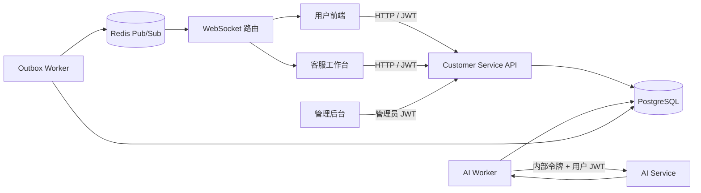
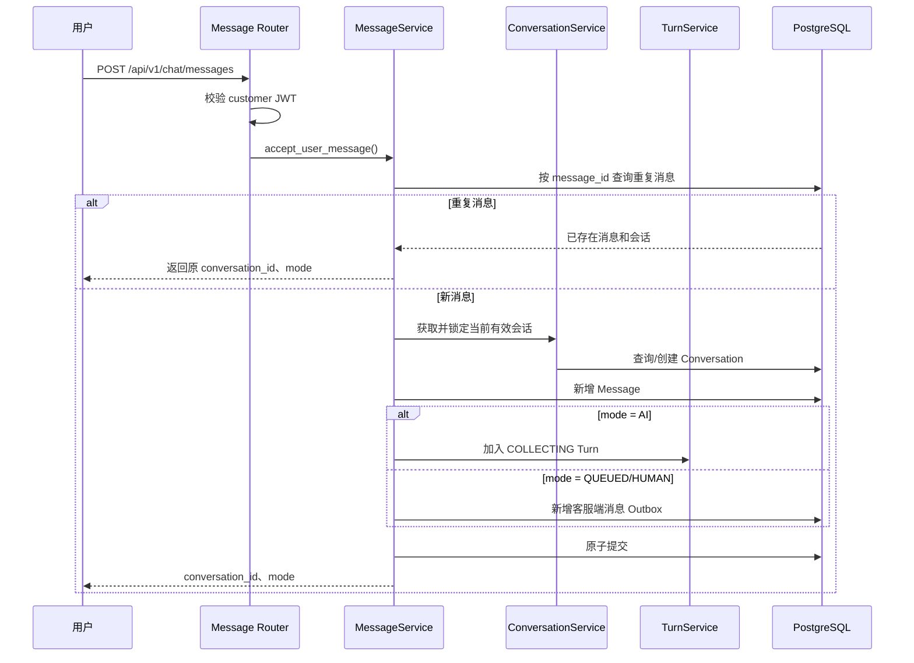
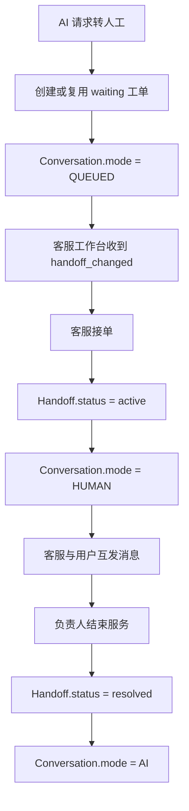
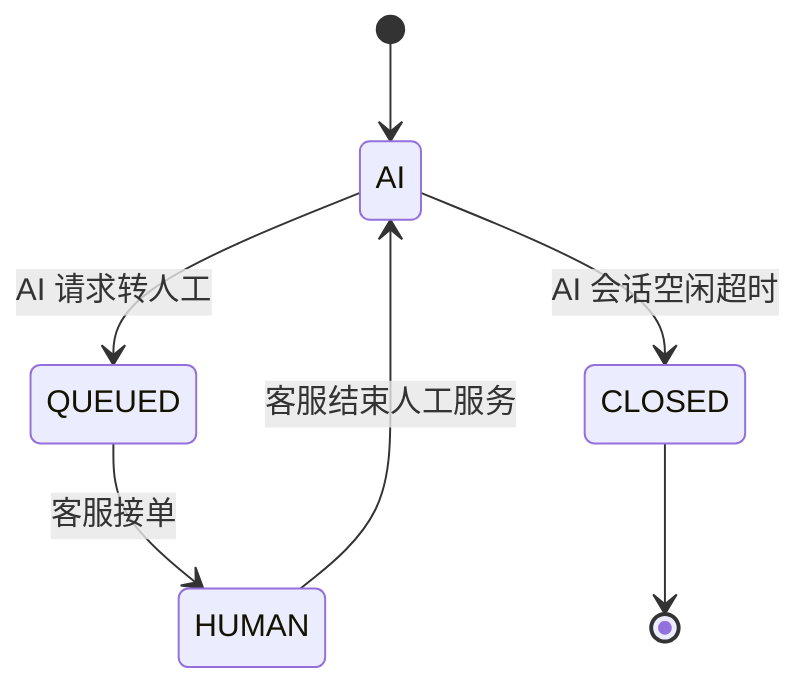
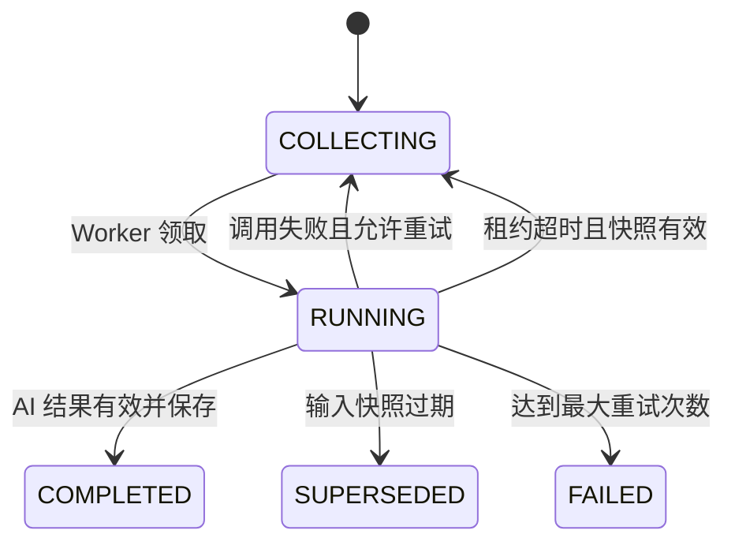
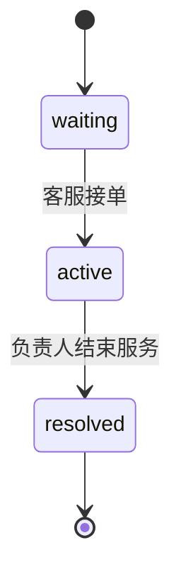
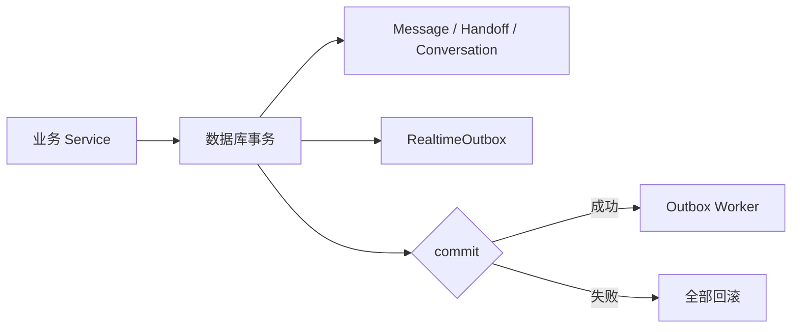
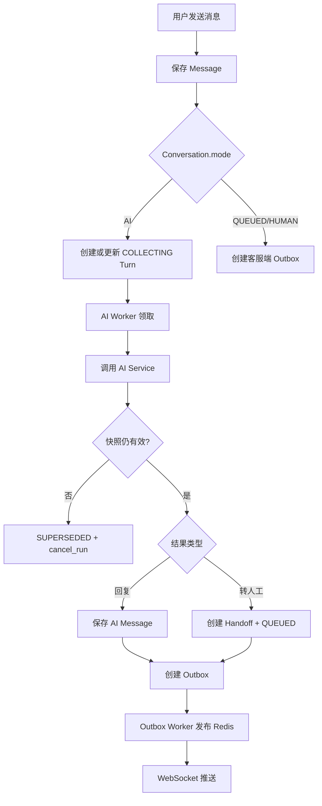
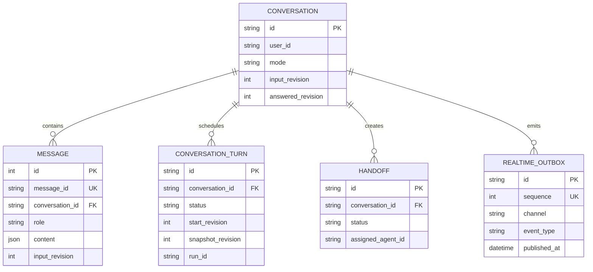

# Customer Service 项目总结与面试指南


## 目录

- [1. 项目概述](#1-项目概述)
- [2. 整体架构设计](#2-整体架构设计)
- [3. 核心数据模型与状态设计](#3-核心数据模型与状态设计)
- [4. 用户消息接收与会话管理](#4-用户消息接收与会话管理)
- [5. ConversationTurn 与 AI Worker](#5-conversationturn-与-ai-worker)
- [6. 人工客服转接](#6-人工客服转接)
- [7. 实时消息推送](#7-实时消息推送)
- [8. 管理后台与监控](#8-管理后台与监控)
- [9. 认证与内部服务安全](#9-认证与内部服务安全)
- [10. 事务、并发与一致性](#10-事务并发与一致性)
- [11. 异常处理与系统恢复](#11-异常处理与系统恢复)
- [12. 设计取舍与优化思路](#12-设计取舍与优化思路)
- [13. 面试高频问题](#13-面试高频问题)
- [附录](#附录)

---

## 1. 项目概述

### 1.1 项目背景

Customer Service 是电商智能客服系统中的会话中枢，负责连接用户端、人工客服端和 AI Service。

它不负责模型推理，也不直接修改订单、地址或售后单，而是负责：

1. 接收并持久化用户消息；
2. 管理用户当前会话；
3. 将连续用户消息合并为一个处理轮次；
4. 异步调用 AI Service；
5. 校验 AI 结果是否仍然有效；
6. 保存 AI 回复或创建人工工单；
7. 通过 Outbox、Redis 和 WebSocket 推送实时事件；
8. 为管理后台提供客服业务指标。

### 1.2 核心业务目标

- 用户发送消息后，接口快速完成处理，不同步等待 AI。
- 用户短时间连续发送的消息可以合并为一次 AI 请求。
- 同一会话中的 AI 回复保持顺序，避免并行生成导致答非所问。
- AI 处理期间出现新输入时，旧结果不能覆盖新上下文。
- AI 无法处理时，可以平滑转入人工客服。
- 消息、工单和实时事件保持事务一致。
- Worker 崩溃后，未完成的 Turn 可以重新处理。

### 1.3 技术选型

- Web 框架：FastAPI
- 数据校验：Pydantic
- ORM：SQLAlchemy 2.0 Async
- 数据库：PostgreSQL
- PostgreSQL 异步驱动：Psycopg 3
- 实时消息：Redis Pub/Sub + WebSocket
- 服务调用：httpx
- 身份认证：JWT
- 运行模型：API 服务、AI Worker、Outbox Worker 独立运行

### 1.4 项目主要功能

- 用户会话创建、超时关闭与当前会话查询；
- 文本消息和对象消息接收；
- 基于 `message_id` 的消息去重；
- 用户连续消息合并；
- Turn 领取、租约、重试和超时恢复；
- AI Service 的 `start`、`commit`、`cancel` 调用；
- AI 回复保存与转人工；
- 人工工单列表、接单、回复和结束；
- 消息事件和工单事件实时推送；
- 历史消息完整查询与增量查询；
- 管理员客服指标聚合。

### 1.5 项目技术亮点

1. 使用 `ConversationTurn` 将“消息写入”和“AI 执行”解耦。
2. 使用收集窗口合并用户短时间连续输入。
3. 使用输入版本和快照版本阻止过期 AI 结果落库。
4. 使用数据库行锁和部分唯一索引控制并发。
5. 使用租约机制恢复 Worker 中断遗留任务。
6. 使用 Transactional Outbox 保证业务数据与实时事件同时提交。
7. 使用双重身份信息保护 Customer Service 到 AI Service 的内部调用。

---

## 2. 整体架构设计

### 2.1 系统组成



API 服务、AI Worker 和 Outbox Worker 使用同一数据库，但承担不同职责：

- API 服务处理 HTTP、WebSocket、认证和业务事务；
- AI Worker 消费待处理 Turn；
- Outbox Worker 发布待推送事件；
- AI Service 独立负责模型执行和 AgentRun 生命周期。

### 2.2 Customer Service 分层架构

项目主要分为以下层次：

- `app/routers`：接收请求、读取 Header、执行角色校验；
- `app/schemas`：定义请求和响应结构；
- `app/services`：组织会话、消息、Turn、工单等业务流程；
- `app/respositories`：封装 SQLAlchemy 查询和持久化；
- `models/models.py`：定义数据库模型；
- `worker/ai`：异步 AI 处理；
- `worker/realtime.py`：Outbox 事件发布；
- `infrastucture`：数据库和 Redis 连接；
- `common`：配置、ID、时间和事件循环工具。

Router 不直接写 SQL，Repository 不负责决定业务状态，事务通常由 Service 或 Worker 在完整业务步骤结束后显式提交。

### 2.3 用户消息完整处理链路



### 2.4 AI 回复处理链路

1. API 保存用户消息并创建或更新 `COLLECTING` Turn。
2. AI Worker 查询收集时间已结束的 Turn。
3. Worker 将 Turn 更新为 `RUNNING` 并固定 `snapshot_revision`。
4. Worker 查询本轮消息和历史消息，构建 AI 请求。
5. Worker 调用 AI Service 的 `start_run()`。
6. 如果 AI 返回 `run_decision_prepared`，Customer Service 再校验输入快照。
7. 快照有效时调用 `commit_run()`；失效时调用 `cancel_run()`。
8. Worker 再次锁定会话，完成最终版本校验。
9. 保存 AI 消息或人工工单，同时写入 Outbox。

### 2.5 人工客服处理链路



### 2.6 实时事件推送链路

业务 Service 不直接连接 Redis，而是在当前事务中写入 `RealtimeOutbox`。Outbox Worker 再按顺序读取事件、发布到 Redis，WebSocket 路由订阅授权频道并转发给前端。

这样可以避免“数据库提交成功但实时通知丢失”或“通知已经发送但数据库事务回滚”的明显不一致。

### 2.7 Customer Service 与 AI Service 的职责边界

Customer Service 是会话状态和输入版本的权威来源：

- 管理 Conversation、Message、Turn、Handoff；
- 判断 AI 结果是否基于当前输入；
- 决定结果能否写回会话；
- 保存面向用户的最终消息。

AI Service 负责：

- 创建并执行 AgentRun；
- 调用模型和只读业务工具；
- 生成回复、转人工建议或页面操作引导；
- 保存 AgentRun 的执行状态和监控信息。

对于取消订单、修改地址等真正的业务写操作，AI 只返回受控页面链接，最终操作由用户进入业务页面后确认。

---

## 3. 核心数据模型与状态设计

### 3.1 Conversation 会话模型

`Conversation` 表示一个用户当前的客服会话，核心字段包括：

- `user_id`：会话所属用户；
- `mode`：当前处理模式；
- `last_active_at`：最后活跃时间；
- `input_revision`：已经接收的用户输入版本；
- `answered_revision`：已经完成回答的输入版本；
- `ended_at`：会话结束时间。

数据库通过部分唯一索引限制每个用户最多只有一个 `AI`、`QUEUED` 或 `HUMAN` 状态的开放会话。

### 3.2 Message 消息模型

`Message` 同时保存用户、AI 和人工客服消息：

- `role`：`user`、`ai` 或 `human`；
- `message_type`：`text` 或 `object`；
- `content`：JSONB 消息内容；
- `input_revision`：用户消息所属输入版本；
- `agent_run_id`：生成 AI 消息的 AgentRun；
- `agent_outcome_seq`：AgentRun 输出序号。

`message_id` 具有唯一约束，用于阻止同一业务消息被重复插入。

### 3.3 ConversationTurn 处理轮次

一个 Turn 表示“一批需要一起交给 AI 处理的用户输入”。

关键字段：

- `start_revision`：本轮第一条输入版本；
- `snapshot_revision`：Worker 领取时固定的最后输入版本；
- `collect_until`：最早可领取时间；
- `max_collect_until`：连续消息合并的最迟等待时间；
- `locked_by`、`locked_until`：Worker 租约；
- `attempts`、`last_error`：重试信息；
- `run_id`：对应的 AI Service AgentRun。

### 3.4 Handoff 人工工单

`Handoff` 保存人工转接过程：

- `waiting`：等待客服；
- `active`：已有负责人；
- `resolved`：已经结束。

部分唯一索引保证同一用户或同一会话最多只有一个开放工单。

### 3.5 RealtimeOutbox 实时事件

`RealtimeOutbox` 保存尚未发布或已经发布的实时事件：

- `sequence`：全局递增发布顺序；
- `channel`：Redis 频道；
- `event_type`：消息或工单事件；
- `data`：事件数据；
- `attempts`：发布尝试次数；
- `published_at`：成功发布时间。

### 3.6 会话模式状态流转



当前 `_close_timeout_conversation()` 只查询并关闭 `AI` 模式的超时会话，因此 `QUEUED` 和 `HUMAN` 不会被这段逻辑自动关闭。

### 3.7 Turn 状态流转



### 3.8 Handoff 状态流转



### 3.9 input_revision 与 answered_revision

每保存一条新的用户消息：

```text
conversation.input_revision += 1
message.input_revision = conversation.input_revision
```

Worker 领取 Turn 时：

```text
turn.snapshot_revision = conversation.input_revision
```

结果落库前比较：

```text
conversation.input_revision == turn.snapshot_revision
```

相等表示 AI 执行期间没有新输入，结果仍然有效；不相等表示旧结果已经过期，应将 Turn 标记为 `SUPERSEDED`。

最终结算完成后：

```text
conversation.answered_revision = turn.snapshot_revision
```

这里不仅包括正常 AI 回复和转人工，也包括重试耗尽后已经向用户保存失败提示的情况。因为该轮输入已经得到一个终结性响应，不应继续被后续 Turn 重复处理。

---

## 4. 用户消息接收与会话管理

### 4.1 用户身份校验

消息接口只允许 `customer` 角色访问。Router 从 Authorization Header 提取 Bearer Token，通过 `AuthService` 解码为 `CurrentUser`，业务层只接收已经认证的 `user_id`。

### 4.2 获取或创建当前会话

`ConversationService.ensure_activate_conversation()`：

1. 检查当前 AI 会话是否空闲超时；
2. 查询 `AI`、`QUEUED`、`HUMAN` 中的当前有效会话；
3. 没有有效会话时创建新的 `AI` 会话。

项目通过数据库部分唯一索引提供最终约束，防止一个用户出现多个开放会话。

### 4.3 消息幂等处理

`MessageService.accept_user_message()` 首先按照 `message_id` 查询消息。已经存在时不重复插入，而是直接返回原会话 ID 和模式。

这解决的是“防止重复写入”的基础幂等，不等于完整的请求结果重放。

当前 `message_id` 是全局唯一，查询重复消息时没有同时校验消息所属用户。生产环境应在返回原会话信息前核对会话所有者，避免不同用户复用同一 `message_id` 时泄露会话信息。

### 4.4 用户消息并发控制

当前代码在获得有效会话后，通过：

```text
session.refresh(conversation, with_for_update=True)
```

锁定会话行，使同一会话的后续消息依次修改 `input_revision`。

这个方案可以保护已经存在的会话行，但两个请求同时为新用户创建首个会话时仍可能竞争，最终依赖部分唯一索引阻止重复开放会话。生产版本可以增加用户维度的 PostgreSQL advisory lock，把“查询或创建会话”整体串行化。

### 4.5 消息序号与输入版本

`Message.id` 是数据库递增序号，负责稳定排序和增量历史查询；`input_revision` 是会话输入版本，负责判断 AI 结果是否过期。二者用途不同：

- sequence 回答“消息写入顺序是什么”；
- revision 回答“AI 处理的是哪一版用户输入”。

### 4.6 连续消息合并

第一条用户消息创建 `COLLECTING` Turn，默认在 800ms 后允许 Worker 领取。期间有新消息时延长 `collect_until`，但不能超过 `max_collect_until`，默认最大等待 2000ms。

这既能减少模型调用次数，也不会让用户因为持续输入而无限等待。

### 4.7 消息、Turn 与 Outbox 的原子提交

`MessageService` 在一个数据库事务中完成：

- 保存用户消息；
- 更新 Conversation；
- 创建或更新 Turn，或者创建客服端 Outbox；
- 最后统一 `commit()`。

其中任一步骤抛出异常，FastAPI 的 Session 依赖执行 `rollback()`。

### 4.8 历史消息查询

`GET /api/v1/chat/history` 支持：

- 不传 `after_sequence`：返回当前用户全部历史消息；
- 传入 `after_sequence`：只返回 `Message.id` 更大的消息。

历史接口读取 PostgreSQL 中已经保存的事实；WebSocket 负责推送连接期间的新事件。两者互相补充，但不是同一条连接。

---

## 5. ConversationTurn 与 AI Worker

### 5.1 为什么需要 ConversationTurn

如果消息接口直接调用 AI，会产生三个问题：

1. HTTP 请求需要长时间等待；
2. 用户连续消息会触发多次模型调用；
3. 多个模型请求可能乱序返回。

Turn 将用户消息先持久化为待处理任务，让 API 快速返回，由 Worker 异步执行。

### 5.2 COLLECTING 消息收集阶段

`COLLECTING` 表示 Turn 还可以继续接收用户消息。新消息到达时优先锁定并复用当前 `COLLECTING` Turn；如果当前 Turn 已经被 Worker 领取为 `RUNNING`，则创建下一轮 Turn。

部分唯一索引保证同一会话最多存在一个 `COLLECTING` Turn。

### 5.3 Worker 领取 Turn

Turn 可被领取必须同时满足：

- `status == COLLECTING`；
- `collect_until <= 当前时间`；
- Conversation 仍处于 `AI` 模式；
- 同一会话不存在 `RUNNING` Turn。

领取后写入：

- `status = RUNNING`；
- `snapshot_revision`；
- `locked_by`；
- `locked_until`；
- `attempts += 1`；
- `started_at`。

### 5.4 行锁领取

当前查询使用 `FOR UPDATE` 锁定候选记录，

因此多个 Worker 同时领取时，后来的 Worker 可能等待第一个 Worker 持有的候选行。业务正确性仍由行锁和唯一索引保护，但横向扩容能力有限。

生产环境可以使用：

```sql
FOR UPDATE SKIP LOCKED
```

让其他 Worker 跳过已经锁定的任务，继续领取下一条可执行 Turn。

### 5.5 Worker 租约机制

数据库行锁只存在于短事务中，不能覆盖整个模型调用。因此 Worker 领取后通过 `locked_by` 和 `locked_until` 保存逻辑租约。

租约让系统知道：

- 哪个 Worker 正在处理 Turn；
- 最晚应在什么时候完成；
- 超时后是否需要重新排队。

### 5.6 固定输入快照

Worker 领取 Turn 时固定 `snapshot_revision`，然后查询：

```text
start_revision <= Message.input_revision <= snapshot_revision
```

得到本轮用户消息。早于本轮第一条消息的记录作为 history，按正序交给 AI Service。

### 5.7 构建 AI Service 请求

- `conversation_id`
- `turn_id`
- `messages`
- `history`

`user_id` 不放在请求体中，而是由 Worker 从 Turn 单独取得并写入 JWT。`input_revision` 和重试次数仍由 Customer Service 自己管理，不再传给 AI Service。

### 5.8 AI Service Gateway

`AIServiceGateway` 使用 httpx 调用三个内部接口：

- `start_run()`：启动 AgentRun；
- `commit_run()`：确认快照仍然有效后发布结果；
- `cancel_run()`：取消已经过期或未完成确认的 Run。

请求同时携带用户 JWT 和 `X-Internal-Service-Token`。

### 5.9 AI 结果解析

`AIEventParser` 识别四类事件：

- `run_decision_prepared`
- `run_completed`
- `run_failed`
- `run_handoff_requested`

其中 `run_id` 必须返回，因为后续 `commit_run()`、`cancel_run()` 和 Turn 关联都需要它。

### 5.10 AI 结果有效性校验

Customer Service 在两个节点校验：

1. 调用 `commit_run()` 前，锁定 Conversation 并比较快照版本；
2. 最终写入结果前，再次比较 Conversation 与 Turn 的版本。

第二次校验用于覆盖 commit 返回到最终持久化之间又有新消息到达的情况。

### 5.11 两阶段结果确认

这里的两阶段不是数据库分布式事务：

1. AI Service 先生成并保存 `DECISION_PREPARED`；
2. Customer Service 校验输入快照；
3. 有效则调用 `commit_run()` 发布结果；
4. 失效则调用 `cancel_run()`。

`commit_run()` 不执行取消订单、修改地址等外部业务写操作。AI 返回的写操作只是页面引导，用户进入电商页面后再主动确认。

### 5.12 Turn 重试与失败处理

AI 调用失败时：

- `attempts < 最大次数`：释放租约，Turn 回到 `COLLECTING`，延迟后重试；
- 达到最大次数：Turn 进入 `FAILED`，保存一条面向用户的失败消息，并把 `answered_revision` 推进到本轮快照。

默认最大尝试次数为 3，重试延迟为 2 秒。

### 5.13 过期 Turn 恢复

AI Worker 每轮处理前查询 `RUNNING` 且 `locked_until` 已过期的 Turn：

- 会话版本已经变化：标记为 `SUPERSEDED`；
- 快照仍有效：重新放回 `COLLECTING`。

因此 Worker 进程意外退出后，任务不会永久停留在 `RUNNING`。

### 5.14 为什么同一会话不能并行执行多个 Turn

如果同一会话同时执行两个 Turn，后发送的消息可能先得到回复，导致对话顺序混乱。

项目同时使用：

- 查询条件中的“不存在 RUNNING Turn”；
- `RUNNING` 状态的部分唯一索引；

共同限制同一会话只能有一个正在执行的 Turn。

---

## 6. 人工客服转接

### 6.1 为什么需要人工兜底

AI 不适合处理所有问题。信息不足、规则复杂、需要人工判断或用户明确要求人工时，系统创建 Handoff，把 Conversation 从 AI 轨道切换到人工轨道。

### 6.2 AI 发起转人工

Worker 收到 `run_handoff_requested` 后，在同一事务中：

1. 创建或复用开放工单；
2. 将 Conversation 改为 `QUEUED`；
3. 保存 AI 的转人工提示；
4. 创建消息事件；
5. 创建工单状态事件。

### 6.3 工单排队

`waiting` 工单会显示在客服工作台。`list_open_handoffs()` 返回 `waiting` 和 `active` 工单，并按创建时间排序。

### 6.4 客服接入工单

客服调用 `/api/v1/handoffs/{id}/accept` 后：

- 工单改为 `active`；
- 写入 `assigned_agent_id` 和 `accepted_at`；
- Conversation 改为 `HUMAN`；
- 用户端和客服端都收到 `handoff_changed`。

### 6.5 多客服并发抢单

接单前通过 `find_and_lock_with_conversation_by_id()` 对工单和会话执行 `FOR UPDATE`。第一个事务提交后，第二个事务读取到最新的 `active` 状态，只允许原负责人幂等重复接单，其他客服得到 403。

### 6.6 客服回复消息

人工回复保存为 `role = human` 的 Message，并同时向：

- 用户频道；
- 客服公共频道；

写入 `message_created` Outbox。公共频道事件可以让其他打开同一会话的客服工作台同步刷新。

### 6.7 结束人工服务

只有当前负责人可以结束工单。结束时：

- Handoff 改为 `resolved`；
- Conversation 切回 `AI`；
- 保存一条人工服务结束提示；
- 用户收到消息事件；
- 用户端和客服端收到工单状态事件。

### 6.8 会话模式与工单状态的一致性

工单状态、会话模式、提示消息和 Outbox 事件在同一事务中提交。这样不会出现工单已经结束，但会话仍显示 `HUMAN` 的部分更新。

### 6.9 工单操作为什么需要行锁

工单操作都是“先判断旧状态，再修改新状态”。如果没有行锁，两个客服可能同时看到 `waiting` 并都认为自己接单成功。行锁将这段读改写过程串行化。

---

## 7. 实时消息推送

### 7.1 HTTP 与 WebSocket 的职责

- HTTP：提交命令、查询数据库事实；
- WebSocket：推送连接期间的新事件。

消息必须先写入 PostgreSQL。WebSocket 不是消息事实来源。

### 7.2 用户频道与客服频道

- 用户频道：`customer-service:user:{user_id}`
- 客服频道：`customer-service:staff`

customer 只能订阅自己的用户频道；agent 和 admin 订阅客服公共频道。

### 7.3 MESSAGE_CREATED 消息事件

消息事件包含序号、消息 ID、会话 ID、角色、类型、内容和创建时间。

用户端收到后可以追加 AI 回复或人工回复；客服端收到后可以刷新当前会话。

### 7.4 HANDOFF_CHANGED 工单事件

工单事件包含工单 ID、状态、摘要、负责人和会话模式。

用户端收到后可以更新“排队中、人工服务中”等状态；客服端收到后可以刷新工单列表和当前会话。

### 7.5 Transactional Outbox

业务数据和待发送事件写入同一个 PostgreSQL 事务：



### 7.6 Outbox Worker

Worker 按 `sequence` 查询最早的未发布事件：

1. 构建统一事件信封；
2. 发布到 Redis；
3. 成功时设置 `published_at`；
4. 失败时只增加 `attempts`，保留为待发布状态。

### 7.7 Redis Pub/Sub

Redis 负责低延迟广播，不负责长期保存消息。数据库中的 Message 和 Handoff 才是可恢复的业务事实。

### 7.8 WebSocket 连接与认证

连接建立后，客户端首先发送包含 token 的 JSON。服务端解码 JWT，根据角色选择唯一频道，随后启动后台任务转发 Redis 消息。

客户端与服务端通过接收循环维持连接；断开时取消转发任务并关闭 Pub/Sub。

### 7.9 为什么不能在业务事务中直接发送 WebSocket

直接发送会产生无法原子化的两个系统：

- 先发送、后回滚：前端看到数据库中不存在的数据；
- 先提交、发送失败：数据库有数据但前端没有通知。

Outbox 把“必须发送”先保存为数据库事实，再异步重试发布。

---

## 8. 管理后台与监控

### 8.1 管理员权限控制

`GET /api/v1/admin/metrics` 只允许 `admin` 角色访问。人工工单接口当前只允许 `agent` 角色，管理员没有自动继承客服操作权限。

### 8.2 会话统计

`conversations` 表示 Conversation 总数，包含已关闭会话。

### 8.3 消息统计

`messages` 表示 Message 总数，包括用户、AI 和人工消息。

### 8.4 人工工单统计

`handoffs` 表示历史工单总数；`queued` 和 `human` 分别统计当前排队与人工服务中的 Conversation。

### 8.5 AI Run 监控

Customer Service 当前只保存 Turn 的 `run_id`、尝试次数和错误，没有提供 AI Run 指标接口。AI Run 的模型名称、Prompt 版本、Token、耗时和错误应由 AI Service 保存并提供监控接口。

### 8.6 服务指标聚合

`AdminMetricsRepository.get_metrics()` 使用一个 SQL statement，通过多个标量子查询聚合核心指标，减少管理后台多次请求数据库。

当前指标是全量计数快照，还没有时间范围、waiting/active 工单分项、Turn 队列深度、Outbox 积压量和 Worker 健康状态。

### 8.7 部分监控接口失败时的降级处理

管理前端同时请求 Customer Service、AI Service 和电商服务指标时，应允许各请求独立成功。使用 `Promise.allSettled()` 或为每个请求单独捕获异常，可以避免单个服务不可用导致整个监控区域空白。

---

## 9. 认证与内部服务安全

### 9.1 JWT 用户认证

外部接口从 Authorization Header 读取：

```text
Authorization: Bearer <token>
```

JWT 载荷至少包含 `user_id` 和 `role`。

### 9.2 Customer、Agent 与 Admin 角色

- customer：发送消息、查询当前会话和历史消息；
- agent：查看、接入、回复和结束人工工单；
- admin：查看客服指标；
- WebSocket：customer 进入个人频道，agent/admin 进入客服频道。

### 9.3 Customer Service 生成内部 JWT

AI Worker 根据 Turn 的 `user_id` 创建内部用户 JWT，使 AI Service 能够知道本次 Run 代表哪个用户。

### 9.4 内部服务令牌

Gateway 同时发送：

```text
X-Internal-Service-Token: <internal token>
```

该令牌证明调用方是受信任的 Customer Service。

### 9.5 AI Service 用户身份校验

AI Service 应同时校验内部服务令牌和用户 JWT，并将 AgentRun 绑定到 JWT 中的用户，而不是信任请求体自行声明的用户。

### 9.6 AgentRun 所有者校验

`commit_run()` 和 `cancel_run()` 接收外部传入的 `run_id`，必须校验 Run 所属用户与 JWT 用户一致，防止用户操作其他人的 Run。

Customer Service 自身也存在资源级授权边界：当前会话详情接口只校验调用者是 `agent`，没有校验该客服是否为目标会话对应工单的负责人。若会话内容要求按负责人隔离，后续还需要补充归属校验。

### 9.7 JWT 与内部服务令牌为什么要同时存在

- 内部令牌回答“哪个服务发起调用”；
- 用户 JWT 回答“本次调用代表哪个用户”。

两者保护的身份维度不同，不能互相替代。

当前 `AuthService.decode_access_token()` 没有把 PyJWT 解码异常统一转换为 401，WebSocket 认证也只捕获了部分输入异常。这是后续需要补强的错误边界。

---

## 10. 事务、并发与一致性

### 10.1 AsyncSession 事务边界

FastAPI 每个请求获得独立 AsyncSession。Session 依赖负责异常回滚，Service 负责在业务操作完整完成时显式提交。

Worker 也为领取、校验、最终结算分别创建短 Session，避免模型调用期间长期持有数据库事务。

### 10.2 flush 与 commit 的区别

- `flush()`：把当前变更发送到数据库，使当前事务获得主键等数据，其他事务不可见；
- `commit()`：提交事务，使其他事务可见并释放事务锁。

创建消息后需要先 `flush()`，才能使用数据库生成的 Message 序号构建实时事件。

### 10.3 为什么采用显式提交

显式提交可以让业务代码清楚表达原子边界，例如：

- 用户消息 + Turn；
- AI 消息 + Turn 状态 + Outbox；
- 工单状态 + 会话模式 + Outbox。

如果 Session 依赖在请求结束时自动提交，耗时流程中间的持久化时机不够直观，也不适合 Worker 的多阶段事务。

### 10.4 行锁

当前版本主要使用 `FOR UPDATE` 或 `refresh(..., with_for_update=True)`：

- 锁定 Conversation，串行修改输入版本；
- 锁定 COLLECTING Turn，防止并发延长；
- 锁定 Handoff 和 Conversation，保护接单与结束；
- 最终结算时锁定 Conversation。

### 10.5 部分唯一索引

项目使用 PostgreSQL 部分唯一索引约束：

- 每个用户最多一个开放 Conversation；
- 每个会话最多一个 COLLECTING Turn；
- 每个会话最多一个 RUNNING Turn；
- 每个用户或会话最多一个开放 Handoff。

业务判断提升可读性，数据库唯一约束提供并发下的最终防线。

### 10.7 消息幂等与业务幂等

`message_id` 唯一约束防止消息重复插入；`agent_run_id + agent_outcome_seq` 唯一约束防止同一 AI 输出重复生成消息。

当前业务层在插入用户消息前主动查重，但并发请求仍必须依赖数据库唯一约束。若发生唯一冲突，还需要补充捕获异常并重查原记录的完整并发幂等流程。

### 10.8 数据库事务与 Redis 的一致性

项目不尝试让 PostgreSQL 与 Redis 参与同一个分布式事务，而是通过 Outbox 实现最终一致：

1. PostgreSQL 原子保存业务和事件；
2. Worker 至少尝试发布；
3. 发布失败继续保留事件。

### 10.9 常见并发场景分析

- 同一用户并发发消息：当前使用 Conversation 行锁、输入版本和唯一索引；首次创建会话时可增加 advisory lock。
- 多 Worker 领取 Turn：当前使用 `FOR UPDATE` 和 RUNNING 唯一索引；可增加 `SKIP LOCKED`。
- 用户在 AI 执行时继续输入：当前使用 `snapshot_revision` 二次校验；应保持最终校验与结果落库处于同一事务。
- 多客服抢同一工单：当前同时锁定 Handoff 和 Conversation；还可将不存在异常统一转换为 404。
- 多 Outbox Worker 发布：当前仅按顺序查询；应增加行锁和 `SKIP LOCKED`，防止重复发布。

---

## 11. 异常处理与系统恢复

### 11.1 AI Service 调用失败

Gateway 使用连接超时和总超时，并通过 `raise_for_status()` 把非成功响应转为异常。TurnProcessor 捕获异常后进入重试或失败结算。

### 11.2 Worker 执行超时

当前恢复依据是数据库租约到期，不是主动中断正在运行的模型协程。AI Gateway 自身的 httpx timeout 负责限制 HTTP 调用时间，租约负责处理 Worker 中断后的遗留状态。

### 11.3 Worker 意外退出

Turn 保持 `RUNNING`，但 `locked_until` 到期后会被恢复流程发现。快照有效则重排队，快照失效则淘汰。

### 11.4 Outbox 发布失败

Redis 发布失败时：

- `attempts += 1`；
- `published_at` 保持为空；
- 当前事务提交尝试次数；
- Worker 下轮再次选择该事件。

当前没有最大尝试次数、退避、死信队列和告警。

### 11.5 WebSocket 断开

断开后服务端取消转发任务并关闭 Pub/Sub。由于 Redis Pub/Sub 不重放离线消息，前端重新建立连接后应以历史消息接口中的数据库结果为准。

### 11.6 重复请求

顺序重复请求可以由 `message_id` 查询直接返回。完全并发的重复请求仍可能同时通过预查询，最终由唯一约束阻止重复写入，但当前 Service 尚未将唯一冲突转换为幂等成功响应。

### 11.7 输入快照过期

发现版本不一致时，Turn 进入 `SUPERSEDED`，释放租约，不保存旧 AI 回复。若 AI Service 已经生成 prepared 结果，Customer Service 调用 `cancel_run()`。

### 11.8 数据库事务回滚

FastAPI Session 依赖捕获业务异常并执行 rollback。Service 不应吞掉数据库异常后继续提交，否则可能把不完整状态写入数据库。

---

## 12. 设计取舍与优化思路

### 12.1 为什么采用分层架构

分层让接口、业务和 SQL 可以独立变化，也让复杂流程集中在 Service 和 Worker 中，而不是散落在 Router。

### 12.2 为什么业务逻辑不放在 Router

Router 只负责协议边界：

- 解析参数；
- 身份认证；
- 调用 Service；
- 返回响应。

这样 HTTP 接口、Worker 或未来消息队列消费者都能复用业务服务。

### 12.3 为什么引入 Repository

Repository 隔离 SQLAlchemy 查询细节，使 Service 可以用业务语言表达“查找开放工单”“领取可执行 Turn”“查询历史消息”。

### 12.4 为什么不在请求线程中直接调用 AI

模型调用耗时长且可能失败。异步 Worker 可以让消息接口快速返回，并提供合并、租约、重试和恢复能力。

### 12.5 为什么需要独立 AI Worker

独立 Worker 可以单独扩容，也不会让 API 服务的并发连接被模型调用占满。数据库 Turn 充当了可恢复任务队列。

### 12.6 为什么使用 Transactional Outbox

Outbox 用本地事务解决数据库与消息发布之间的双写问题，不要求 PostgreSQL 和 Redis 支持分布式事务。

---

## 13. 面试高频问题

### 13.1 你这个项目整体是怎么工作的？

用户消息先由 Customer Service 保存到 PostgreSQL，并加入一个可合并的 ConversationTurn。AI Worker 领取 Turn 后固定输入快照，再调用 AI Service。结果返回后，Customer Service 再次校验快照，保存 AI 回复或创建人工工单。业务变化同时写入 Outbox，由独立 Worker 经 Redis 和 WebSocket 推送给前端。

### 13.2 为什么需要 ConversationTurn？

Turn 把消息接收和 AI 执行解耦，同时提供连续消息合并、顺序控制、租约、重试、快照和故障恢复能力。没有 Turn，每条消息都直接调用 AI，容易重复调用和乱序回复。

### 13.3 为什么要合并用户连续消息？

用户经常把一个问题拆成多条消息。800ms 收集窗口可以把这些消息作为一次完整输入交给 AI，减少调用成本并提升语义完整性；最大等待时间防止无限延迟。

### 13.4 如何避免 AI 回复顺序错乱？

同一会话只允许一个 `RUNNING` Turn。查询条件排除已有 RUNNING 的会话，数据库部分唯一索引再提供最终约束。

### 13.5 input_revision 有什么作用？

它是会话输入版本。Worker 领取时保存快照，结果落库前比较当前版本。如果版本变化，说明 AI 基于旧输入生成结果，不能再写入当前会话。

### 13.6 Worker 如何避免重复消费？

领取 Turn 时使用数据库行锁，并立即将状态改为 `RUNNING`。同一会话还存在 RUNNING 部分唯一索引。不过当前没有 `SKIP LOCKED`，多 Worker 扩展仍可优化。

### 13.7 Worker 崩溃后如何恢复？

领取时写入 `locked_until`。恢复任务扫描租约过期的 RUNNING Turn，快照有效则重新进入 COLLECTING，快照失效则标记 SUPERSEDED。

### 13.8 为什么使用两阶段结果确认？

模型执行期间用户可能继续输入。AI Service 先准备结果，Customer Service 校验输入版本后再 commit；旧结果则 cancel。这样由掌握会话事实的 Customer Service 决定结果是否仍可发布。

### 13.9 为什么需要人工客服状态机？

waiting、active、resolved 可以明确表示等待、服务中和结束，配合 Conversation 的 QUEUED、HUMAN、AI 模式，避免用户消息被 AI 和人工同时处理。

### 13.10 多客服同时抢单如何处理？

接单前使用 `FOR UPDATE` 锁定 Handoff 和 Conversation。第一个事务提交后，其他事务读取最新状态，只有负责人可以继续操作。

### 13.11 为什么需要 Transactional Outbox？

因为数据库和 Redis 不能在普通本地事务中原子提交。Outbox 先把实时事件和业务数据一起提交，再由 Worker 异步发布，实现可重试的最终一致性。

### 13.12 如何保证消息幂等？

业务层先按 `message_id` 查询，数据库再用唯一约束兜底。AI 消息还通过 `agent_run_id + agent_outcome_seq` 防止同一输出重复落库。完整并发幂等还应捕获唯一冲突并重查原记录。

### 13.13 如何保证数据库与实时事件一致？

Message、Handoff、Conversation 和 RealtimeOutbox 在同一 PostgreSQL 事务中提交。事务失败时全部回滚，成功后 Outbox Worker 才发布事件。

### 13.14 项目中最大的技术难点是什么？

最大的难点不是调用模型，而是异步执行期间的状态一致性：用户可能继续输入、Worker 可能崩溃、多个客服可能抢单、项目通过输入快照、行锁、部分唯一索引、租约和 Outbox 分别解决这些问题。

---

## 附录

### A. 核心业务流程图



### B. 数据模型关系图



### C. 状态流转速记

```text
Conversation：
AI -> QUEUED -> HUMAN -> AI
AI -> CLOSED

Turn：
COLLECTING -> RUNNING -> COMPLETED
COLLECTING -> RUNNING -> COLLECTING（重试/租约恢复）
COLLECTING -> RUNNING -> FAILED
COLLECTING -> RUNNING -> SUPERSEDED

Handoff：
waiting -> active -> resolved
```

### D. 30 秒项目介绍

这是一个基于 FastAPI、PostgreSQL 和 Redis 构建的电商智能客服中台。它负责管理用户会话和消息，通过 ConversationTurn 异步合并并调度 AI 请求，使用输入版本快照防止过期回复，通过人工工单实现 AI 到人工客服的切换，并使用 Transactional Outbox 保证业务数据和 WebSocket 实时事件的一致性。

### E. 2 分钟项目介绍

项目的核心不是简单调用大模型，而是解决 AI 异步执行过程中的一致性问题。

用户消息先写入 PostgreSQL。如果会话处于 AI 模式，消息会进入 ConversationTurn。Turn 有短暂收集窗口，可以合并用户连续输入。AI Worker 领取 Turn 时固定输入版本并设置租约，然后调用独立 AI Service。

AI 返回结果后，Customer Service 会比较当前会话版本和 Turn 快照。如果执行期间用户又发送了新消息，旧结果会被淘汰；如果结果仍有效，则保存 AI 回复或创建人工工单。

转人工后，会话依次进入 QUEUED 和 HUMAN，工单使用行锁处理多客服并发抢单。所有消息、工单状态和实时事件都先在一个数据库事务中提交到业务表与 Outbox，再由独立 Worker 发布到 Redis，最后通过 WebSocket 推送给用户端和客服端。

### F. 5 分钟项目介绍

1. 我做的是一个电商智能客服系统中的 Customer Service。它位于用户前端、人工客服工作台和 AI Service 之间，主要负责会话管理、消息持久化、AI 任务调度、人工转接以及实时事件推送。这个服务本身不负责大模型推理，也不会直接执行取消订单、修改地址等业务写操作。AI Service 负责生成回复、转人工建议或者受控的业务操作链接，Customer Service 则负责判断这些结果能不能安全地写回当前会话。

   用户发送消息时，请求首先经过 JWT 认证，只有 customer 角色才能访问聊天接口。系统会根据 `message_id` 查询消息是否已经存在，重复请求直接返回原来的会话信息，避免重复插入。之后系统会获取用户当前的开放会话；如果没有，就创建一个 AI 模式的新会话。为了避免同一个用户并发发送消息时覆盖会话版本，保存消息前会对 Conversation 执行行锁。消息、会话状态以及后续创建的 Turn 或 Outbox 事件，最后都在一个数据库事务中提交。

   消息接口没有直接同步调用 AI，因为模型调用耗时较长，而且用户经常会把一个完整问题拆成多条消息连续发送。为了解决这个问题，我设计了 ConversationTurn。用户在 AI 模式下发送第一条消息时，系统创建一个 `COLLECTING` 状态的 Turn，并设置一个短暂的消息收集窗口。窗口内继续收到消息时，只延长 `collect_until`，但不能超过最大等待时间。这样既能把连续输入合并成一次完整的 AI 请求，也不会让用户一直等待。

   独立的 AI Worker 会轮询已经结束收集的 Turn。一个 Turn 只有在状态为 `COLLECTING`、收集时间已经到期、会话仍处于 AI 模式，并且同一会话不存在其他 `RUNNING` Turn 时才能被领取。领取后，Worker 会把状态改为 `RUNNING`，记录 Worker 标识和租约截止时间，同时把 Conversation 当前的 `input_revision` 保存为 `snapshot_revision`。数据库中还通过部分唯一索引限制同一会话最多只有一个 `COLLECTING` Turn 和一个 `RUNNING` Turn，避免并发处理导致回复顺序混乱。

   版本机制是这个项目中比较核心的设计。每收到一条新的用户消息，Conversation 的 `input_revision` 就会增加；Worker 领取 Turn 时固定 `snapshot_revision`；结果成功结算后，再把 `answered_revision` 推进到这次快照。AI 调用期间不会一直持有数据库锁，因为那样会占用连接并阻塞用户的新消息。等 AI 返回结果后，Customer Service 再比较当前 `input_revision` 和 Turn 的 `snapshot_revision`。如果两者不一致，就说明 AI 执行期间用户又发送了新消息，旧结果已经过期，Turn 会被标记为 `SUPERSEDED`，不会写入会话。

   Customer Service 与 AI Service 之间采用两阶段结果确认。Worker 先调用 `start_run()`，如果 AI Service 返回 `run_decision_prepared`，Customer Service 会先锁定会话并校验输入快照。快照仍然有效时调用 `commit_run()` 发布结果，已经过期时调用 `cancel_run()`。这里的 commit 只是确认并发布 AI 已准备的结果，不是直接执行外部业务写操作。像取消订单这样的操作，AI 只返回可信页面链接，最终仍由用户进入业务页面核对并确认。

   AI 结果最终分为普通回复和转人工两条路径。普通回复会保存为 `role=ai` 的 Message。如果 AI 请求转人工，系统会创建或复用一个 `waiting` 状态的 Handoff，把 Conversation 从 `AI` 切换为 `QUEUED`，同时保存一条面向用户的转人工提示。客服接单时，工单从 `waiting` 变为 `active`，Conversation 变为 `HUMAN`；客服结束服务后，工单变为 `resolved`，Conversation 再切回 `AI`。接单、回复和结束操作都会锁定 Handoff 与 Conversation，并校验 `assigned_agent_id`，防止多个客服同时抢到同一工单或者非负责人操作工单。

   实时推送部分使用了 Transactional Outbox。业务 Service 不会在数据库事务中直接发送 Redis 或 WebSocket，而是把 Message、Handoff、Conversation 的变化和 RealtimeOutbox 事件一起提交到 PostgreSQL。独立的 Outbox Worker 按事件序号读取尚未发布的记录，发送到 Redis Pub/Sub，成功后更新 `published_at`，失败则保留记录等待下次重试。WebSocket 根据用户角色订阅不同频道：普通用户订阅自己的用户频道，客服和管理员订阅公共客服频道。这样可以降低数据库事务与实时推送之间双写不一致的风险。

   系统还提供了历史消息和管理指标接口。历史消息以数据库中的 Message 为准，可以通过 `after_sequence` 增量查询。管理端目前可以统计会话总数、消息总数、工单总数，以及当前处于 `QUEUED` 和 `HUMAN` 模式的会话数量。Customer Service 调用 AI Service 时还会同时携带内部服务令牌和内部用户 JWT，前者证明调用方是 Customer Service，后者说明本次调用代表哪个用户。

   在异常恢复方面，AI 调用失败后 Turn 可以按配置重新进入 `COLLECTING`，达到最大次数后进入 `FAILED` 并向用户保存失败提示。Worker 领取 Turn 时还会设置 `locked_until`，如果进程意外退出，租约过期后系统会重新检查该 Turn：快照仍有效就重新排队，已经过期就标记为 `SUPERSEDED`。因此任务不会因为某个 Worker 崩溃而永久停留在 `RUNNING`。

   当前版本仍有一些可以继续优化的地方。例如 Turn 领取使用了 `FOR UPDATE`，但还没有使用 `SKIP LOCKED`，多个 Worker 横向扩展时可能互相等待；Outbox 领取还缺少行锁，多 Worker 部署时可能重复发布；并发重复消息主要依赖数据库唯一约束兜底，还没有把唯一冲突完整转换为幂等成功；后续我会从 Worker 并发领取与更完整的监控指标几个方向继续完善。

### G. 技术亮点速记

- Turn 异步解耦；
- 连续消息合并；
- 输入版本快照；
- 同会话单 RUNNING；
- Worker 租约恢复；
- AI 结果两阶段确认；
- 人工工单状态机；
- 行锁解决并发抢单；
- 部分唯一索引兜底；
- Transactional Outbox；
- 用户频道与客服频道隔离；
- 显式事务边界。

### H. STAR 面试回答模板

**Situation：** 用户可能连续发消息，AI 调用耗时较长，执行期间还可能产生新输入；同时 Worker、Redis 和人工客服都存在并发或故障场景。

**Task：** 保证用户消息不丢失、AI 回复不乱序、旧结果不覆盖新输入，并支持人工转接和实时推送。

**Action：** 引入 ConversationTurn、输入版本快照、租约、数据库行锁、部分唯一索引和 Transactional Outbox；把 API、AI Worker 和 Outbox Worker 拆分运行。

**Result：** 消息接口可以快速返回，连续输入能够合并，过期 AI 结果会被淘汰，Worker 崩溃后可以恢复，工单并发操作保持一致，实时事件失败后可以重试发布。

### I. 项目复习清单

- 能画出用户消息到 AI 回复的完整链路；
- 能解释 Conversation、Message、Turn、Handoff、Outbox 的职责；
- 能说明三个 revision 字段的关系；
- 能解释为什么模型调用期间不能持有数据库锁；
- 能说明租约和数据库行锁的区别；
- 能解释两阶段确认不是分布式事务；
- 能说明 AI 为什么只返回业务操作链接；
- 能解释工单抢单的并发控制；
- 能说明 Outbox 解决了什么、没有解决什么；
- 能指出当前代码至少三个真实不足及改进方案。
