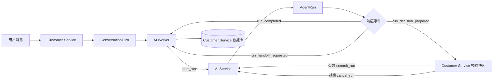
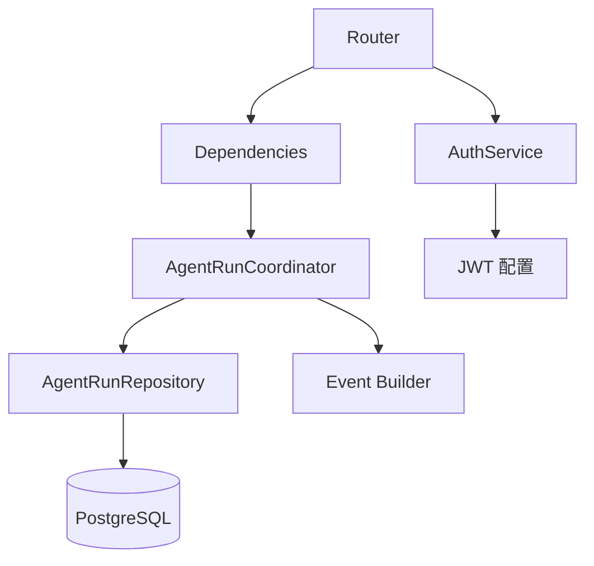
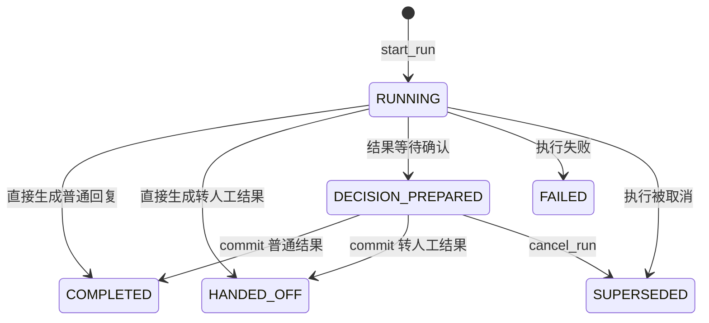
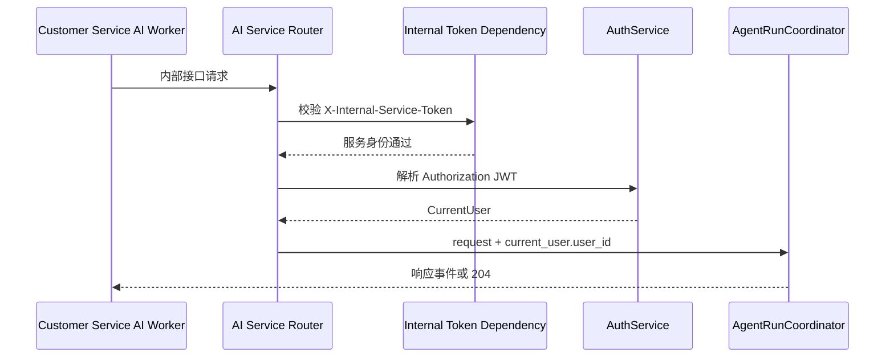
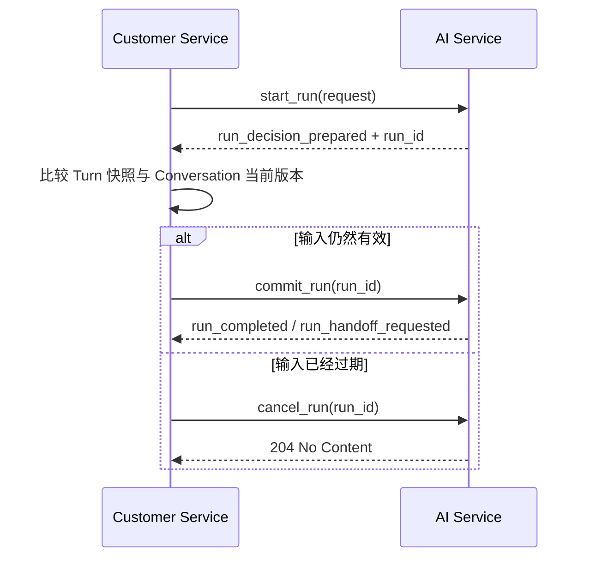

# Day07 AI Service 项目框架搭建

## 目录

- [1. 今日目标](#1-今日目标)
- [2. 服务边界](#2-服务边界)
- [3. 项目架构](#3-项目架构)
- [4. 运行设计](#4-运行设计)
- [5. 接口与认证](#5-接口与认证)
- [6. 服务协议](#6-服务协议)
- [7. 代码框架](#7-代码框架)
- [8. 本日总结](#8-本日总结)

---

## 1. 今日目标

### 1.1 独立AI Service

Customer Service 已经负责用户会话、消息、Turn、人工工单和实时事件。如果继续把模型调用、Agent 执行和运行监控都放在 Customer Service 中，会让会话业务与 AI 能力紧密耦合。

因此项目把 AI 能力拆分为独立的 AI Service：

- Customer Service 管理会话事实，决定某个 AI 结果是否仍然有效；
- AI Service 管理 AgentRun，负责后续的模型执行和结果生成；
- 两个服务通过内部 HTTP 接口和统一事件协议协作。

拆分以后，AI 模型、Prompt 和 Agent 工具可以独立迭代，不需要修改 Customer Service 的会话主流程。

### 1.2 实现边界

 先搭建可持续扩展的项目骨架，不急于实现真正的 AgentExecutor。

本日完成：

1. 创建 FastAPI 项目和分层目录；
2. 配置 PostgreSQL 异步连接；
3. 建立 AgentRun 模型和 Repository；
4. 建立 AgentRunCoordinator 生命周期框架；
5. 提供 `start`、`commit`、`cancel` 三个内部接口；
6. 校验内部服务令牌和用户 JWT；
7. 定义 Customer Service 可以解析的响应事件；
8. 为后续模型监控预留字段。

---

## 2. 服务边界

### 2.1 客服服务职责

Customer Service 是会话数据的权威来源，主要负责：

- 接收并保存用户消息；
- 管理 Conversation 和 ConversationTurn；
- 在 Worker 领取 Turn 时固定输入快照；
- 组织当前消息和历史消息；
- 调用 AI Service；
- 校验 AI 执行期间是否产生了新输入；
- 保存最终 AI 回复或人工工单。

### 2.2 智能服务职责

AI Service 主要负责：

- 为一次 Turn 创建 AgentRun；
- 保存本次运行的输入上下文；
- 后续调用 AgentExecutor；
- 保存执行结果、状态和监控数据；
- 根据 AgentRun 状态生成统一响应事件；
- 管理已经准备结果的发布或取消。

AI Service 不保存 Customer Service 的完整 Conversation，也不直接决定旧输入是否仍然有效。

### 2.3 调用流程



这条链路中，Customer Service 负责“结果能不能写入会话”，AI Service 负责“本次 Run 执行到了什么状态”。

---

## 3. 项目架构

### 3.1 技术选型

- Python 3.12+
- FastAPI：内部 HTTP 接口
- Pydantic：请求和身份数据校验
- SQLAlchemy 2.0 Async：异步 ORM
- PostgreSQL：AgentRun 持久化
- Psycopg 3：PostgreSQL 异步驱动
- PyJWT：用户 JWT 校验
- Uvicorn：ASGI 服务启动

### 3.2 分层设计



各层职责如下：

- Router：处理 HTTP 协议、Header 和参数；
- Dependencies：组装 Session、AuthService 和 Coordinator；
- Coordinator：协调 AgentRun 生命周期和事务；
- Repository：封装 AgentRun 数据访问；
- Event Builder：把持久化状态转换为响应事件；
- Models：定义 AgentRun 相关表；
- Infrastructure：管理数据库引擎和 Session；
- Common：管理配置、ID、时间和事件循环。

### 3.3 目录结构

```text
ai-srevice/
├── atguigu/
│   ├── agent/
│   │   └── harness/
│   │       └── run/
│   │           ├── coordinator.py
│   │           └── events.py
│   ├── app/
│   │   ├── repositories/
│   │   │   └── run.py
│   │   ├── routers/
│   │   │   └── run.py
│   │   ├── schemas/
│   │   │   ├── auth.py
│   │   │   └── run.py
│   │   ├── services/
│   │   │   └── auth.py
│   │   ├── app.py
│   │   └── dependencies.py
│   ├── common/
│   │   ├── config.py
│   │   ├── event_loop.py
│   │   └── utils.py
│   ├── infrastructure/
│   │   └── db.py
│   ├── models/
│   │   └── models.py
│   └── main.py
├── tests/
├── .env
└── pyproject.toml
```

---

## 4. 运行设计

### 4.1 数据模型

AgentRun 表示 AI Service 对一个 ConversationTurn 的一次处理过程。

核心关联字段：

- `id`：AI Service 生成的 Run ID；
- `conversation_id`：所属会话；
- `turn_id`：对应 Customer Service 的 Turn；
- `user_id`：从用户 JWT 中得到的 Run 所有者。

执行字段：

- `state`：当前运行状态；
- `input_context`：本次固定输入；
- `result`：最终回复、转人工或失败结果；
- `started_at`、`finished_at`：运行时间。

监控字段：

- `model_name`：本次使用的模型；
- `prompt_version`：本次使用的 Prompt 版本；
- `input_tokens`：模型输入 Token 数；
- `output_tokens`：模型输出 Token 数；
- `latency_ms`：执行耗时；
- `error`：内部错误详情。

### 4.2 状态流转



各状态含义：

- `RUNNING`：Agent 正在执行；
- `DECISION_PREPARED`：结果已经生成，等待 Customer Service 确认；
- `COMPLETED`：普通回复已经发布；
- `HANDED_OFF`：转人工结果已经发布；
- `FAILED`：执行失败；
- `SUPERSEDED`：结果被取消，不再允许发布。

### 4.3 输入与输出

`input_context` 保存 AI Service 收到的请求快照，包括：

- `conversation_id`
- `turn_id`
- `messages`
- `history`

`result` 保存的是 AI Service 生成的结构化结果。它可能包含：

- 普通回复的 `message_id` 和 `content`；
- 转人工所需的 `summary` 和 `message`；
- 失败信息。

### 4.4 监控字段

监控字段不会改变 AgentRun 的核心状态机，但可以支持后续管理后台：

- 按模型分析运行次数；
- 对比不同 Prompt 版本的效果；
- 统计 Token 使用量；
- 计算平均执行耗时；
- 查询失败 Run 的内部错误。

这些字段会在后续实现 `start_run()` 时写入。当前框架只完成字段定义。

---

## 5. 接口与认证

### 5.1 启动接口

接口：

```text
POST /internal/v1/agent/runs
```

后续完整流程：

1. 从 JWT 获取 `user_id`；
2. 创建 `RUNNING` AgentRun；
3. 保存输入快照、模型和 Prompt 信息；
4. 提交事务，使长时间执行期间可以查询该 Run；
5. 调用 AgentExecutor；
6. 重新查询并锁定 AgentRun；
7. 保存结果、终态和监控信息；
8. 构建 Customer Service 响应事件。

当前该接口返回 501，因为 AgentExecutor 尚未实现。

### 5.2 提交接口

接口：

```text
POST /internal/v1/agent/runs/{run_id}/commit
```

后续完整流程：

1. 查询并锁定 AgentRun；
2. 校验 Run 属于 JWT 用户；
3. 校验状态为 `DECISION_PREPARED`；
4. 将准备结果推进为 `COMPLETED` 或 `HANDED_OFF`；
5. 提交 AgentRun 状态；
6. 构建最终响应事件。

`commit_run()` 只确认并发布 AI 结果，不直接执行取消订单、修改地址等外部业务写操作。真正的写操作需要用户进入对应业务页面确认。

### 5.3 取消接口

接口：

```text
POST /internal/v1/agent/runs/{run_id}/cancel
```

后续完整流程：

1. 查询 AgentRun；
2. 不存在时返回 404；
3. 校验 Run 所有者；
4. 如果状态为 `DECISION_PREPARED`，改为 `SUPERSEDED`；
5. 保存结束时间并提交；

取消接口设计为幂等操作。Run 不处于 `DECISION_PREPARED` 时不会重复修改状态。

### 5.4 双重认证

三个接口都要求两种凭证：

```text
X-Internal-Service-Token: teaching-internal-token
Authorization: Bearer <user-jwt>
```

- 内部服务令牌证明请求来自 Customer Service；
- 用户 JWT 表示本次调用对应的用户。



---

## 6. 服务协议

### 6.1 请求结构

Customer Service 当前发送：

```json
{
  "conversation_id": "conv_001",
  "turn_id": "turn_001",
  "messages": [
    {
      "message_id": "msg_001",
      "type": "text",
      "content": {
        "text": "我的订单什么时候发货"
      }
    }
  ],
  "history": [
    {
      "message_id": "msg_history_001",
      "role": "ai",
      "type": "text",
      "content": {
        "text": "您好，请问需要什么帮助？"
      }
    }
  ]
}
```

请求体不再携带 `user_id`，因为用户身份已经包含在 JWT 中。它也不再携带 `input_revision` 和 `request_id`，会话版本与重试由 Customer Service 管理。

### 6.2 响应事件

统一事件结构：

```json
{
  "event_type": "run_completed",
  "event_data": {
    "run_id": "run_001",
    "message_id": "msg_ai_001",
    "content": {
      "text": "您的订单预计今天发货。"
    }
  }
}
```

支持的事件类型：

- `run_completed`
- `run_handoff_requested`
- `run_decision_prepared`
- `run_failed`

### 6.3 运行标识

`run_id` 必须包含在事件中，因为 Customer Service 会用它：

- 调用 `commit_run(run_id)`；
- 调用 `cancel_run(run_id)`；
- 写入 `ConversationTurn.run_id`；
- 关联最终 AI 消息和 AgentRun。

### 6.4 两阶段确认



Customer Service 掌握最新的 Conversation，因此由它判断即可。


## 7. 代码框架

### 7.1 配置与数据库

`Settings` 集中管理：

- AI Service 数据库地址；
- API Host 和 Port；
- 内部服务令牌；
- JWT Secret 和算法；
- 模型名称；
- Prompt 版本。

`infrastructure/db.py` 创建异步 Engine 和 SessionFactory。Session 依赖只负责生命周期和异常回滚，业务提交由 Coordinator 显式执行。

### 7.2 数据访问层

`AgentRunRepository` 当前提供：

- `add()`：把 AgentRun 加入当前事务；
- `find_by_id()`：按主键查询，找不到时返回 `None`。

Repository 只负责数据访问，不直接返回 HTTPException。404、403 和状态校验由 Coordinator 处理。

后续 commit 需要并发保护时，应增加带 `FOR UPDATE` 的查询方法。

### 7.3 生命周期协调

Coordinator 位于 `atguigu/agent/run/coordinator.py`，而不是普通 `app/services`，因为它负责的是 AgentRun 的完整执行生命周期。

它的核心职责是：

- 创建 Run；
- 控制事务提交时机；
- 调用后续 AgentExecutor；
- 校验状态；
- 保存结果；
- 处理发布和取消；
- 调用 Event Builder 构建响应。

### 7.4 事件构建

`events.py` 根据 AgentRun 当前状态选择事件类型，并把 `run.id` 放入 `event_data`。

```text
COMPLETED         -> run_completed
HANDED_OFF        -> run_handoff_requested
DECISION_PREPARED -> run_decision_prepared
FAILED            -> run_failed
```

`RUNNING` 还没有结果，不能构建最终响应事件。`SUPERSEDED` 由取消接口使用 204 表示，因此当前 Event Builder 也不为它生成事件。

### 7.5 路由与依赖注入

`dependencies.py` 负责组装：

- `SessionDep`
- `AuthServiceDep`
- `AgentRunCoordinatorDep`
- `require_internal_service`

Router 只完成以下工作：

1. 接收参数；
2. 校验内部服务令牌；
3. 从 JWT 获取当前用户；
4. 调用 Coordinator；
5. 返回结果。

数据库操作、状态变化和事务提交都不放在 Router 中。

---

## 8. 本日总结

### 8.1 已完成能力

Day07 已经建立了 AI Service 的核心边界：

- Customer Service 与 AI Service 的调用协议已经对齐；
- AgentRun 模型和状态已经确定；
- 数据库、Repository、Coordinator、Event Builder 和 Router 已经分层；
- 内部服务身份和用户身份都得到校验；
- `cancel_run()` 已经可以取消待发布结果；

### 8.2 后续扩展

下一阶段只需要沿着现有边界继续实现：

1. 在 `start_run()` 中创建并提交 RUNNING AgentRun；
2. 构建 Agent 运行上下文；
3. 调用 AgentExecutor；
4. 记录模型、Token、耗时和错误；
5. 保存普通回复、转人工或待确认结果；
6. 在 `commit_run()` 中发布 prepared 结果；
7. 增加 AI Run 管理指标接口。

后续重点将从“服务框架”转向“Agent 如何执行和生成可信结果”。
