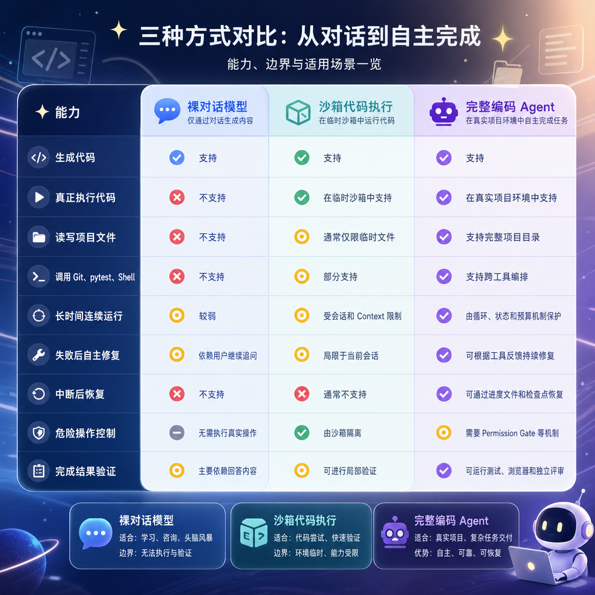
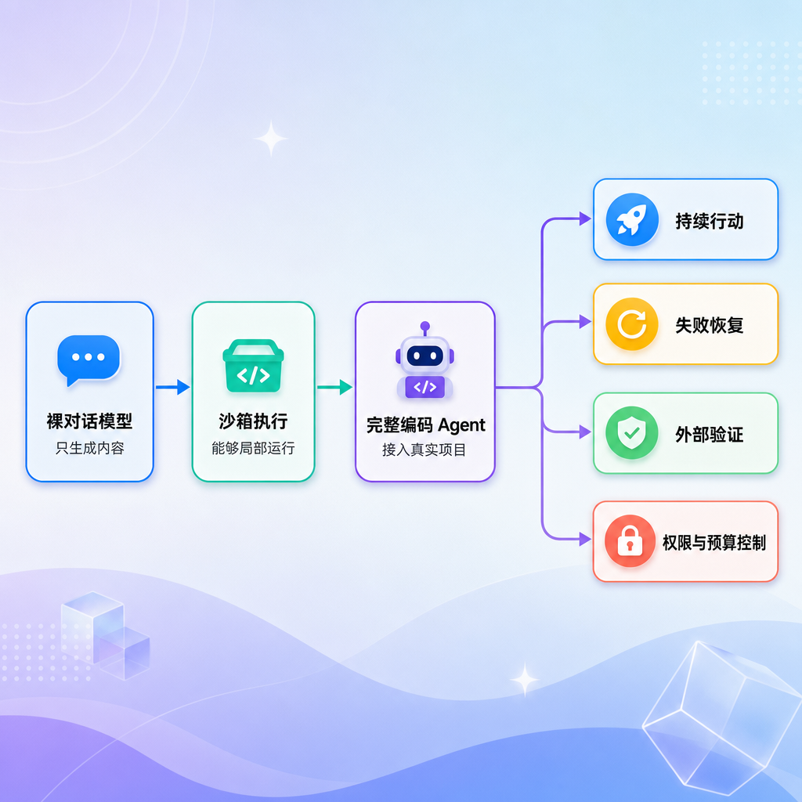
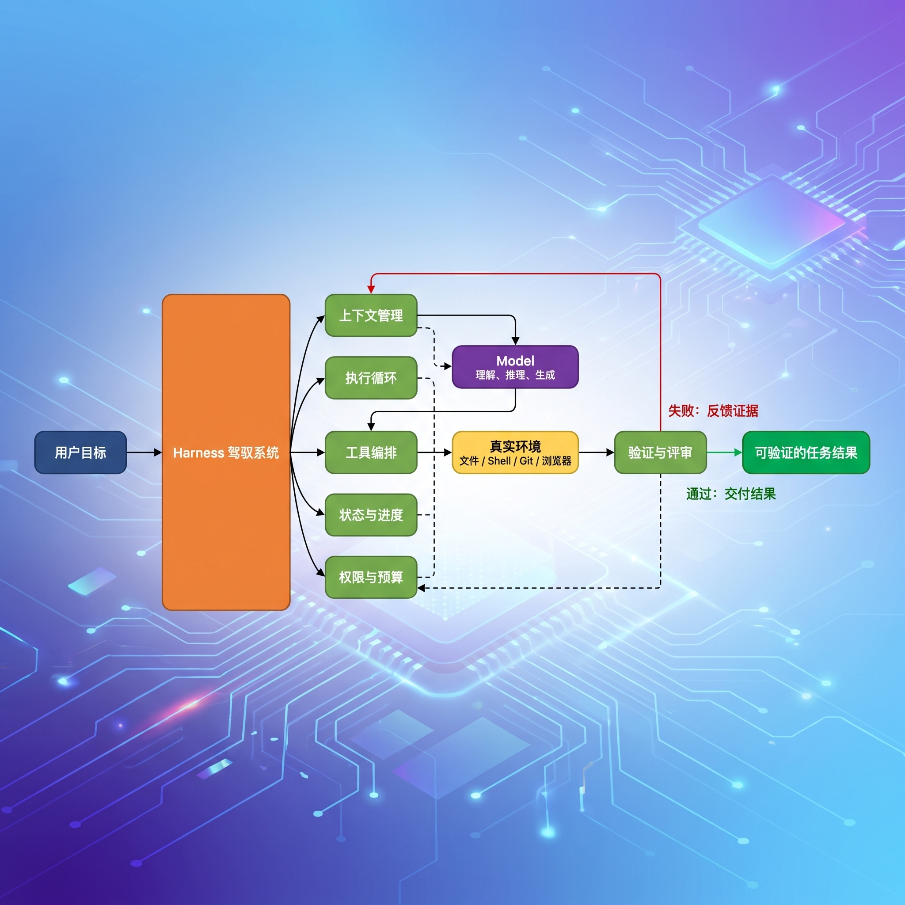
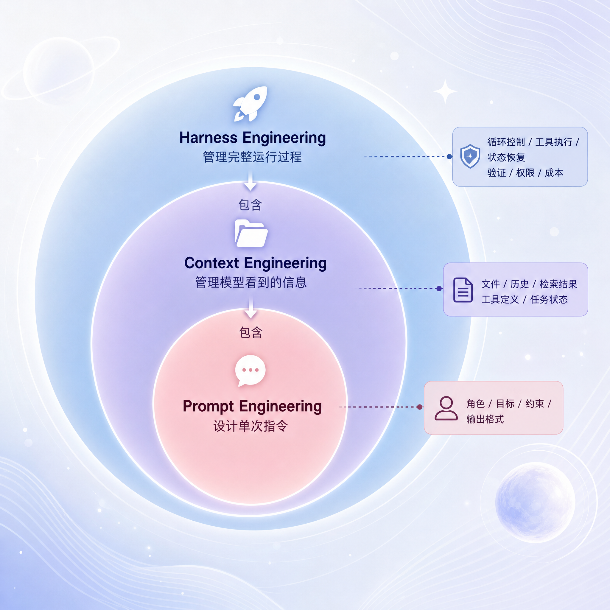
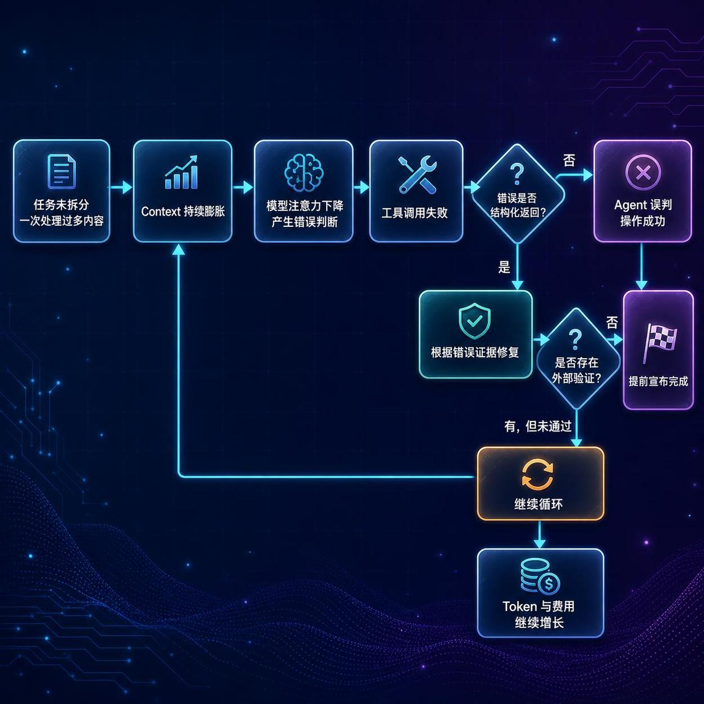
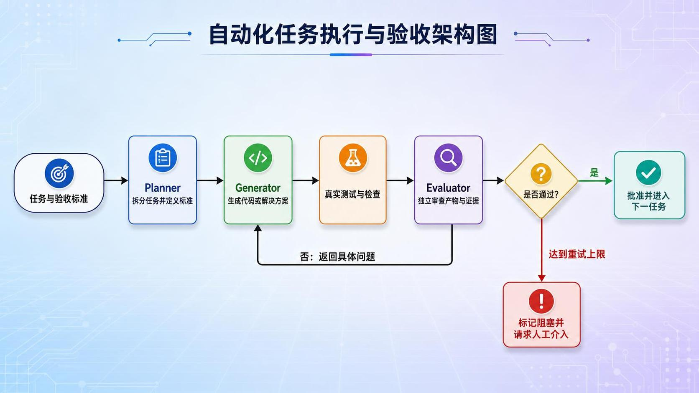
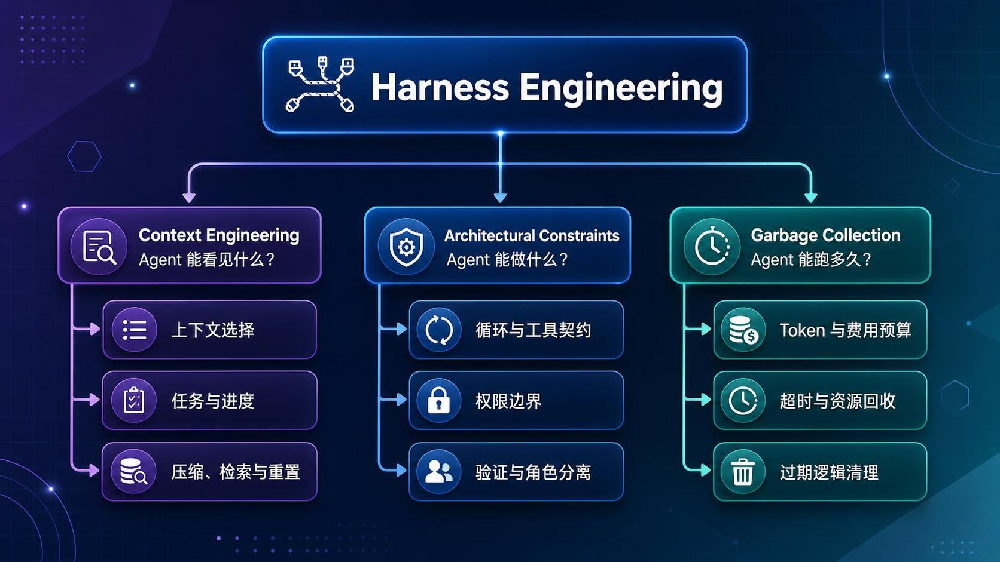
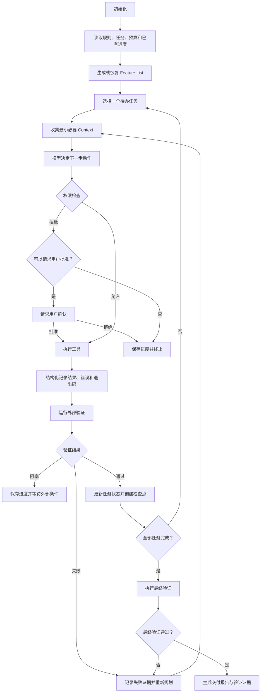
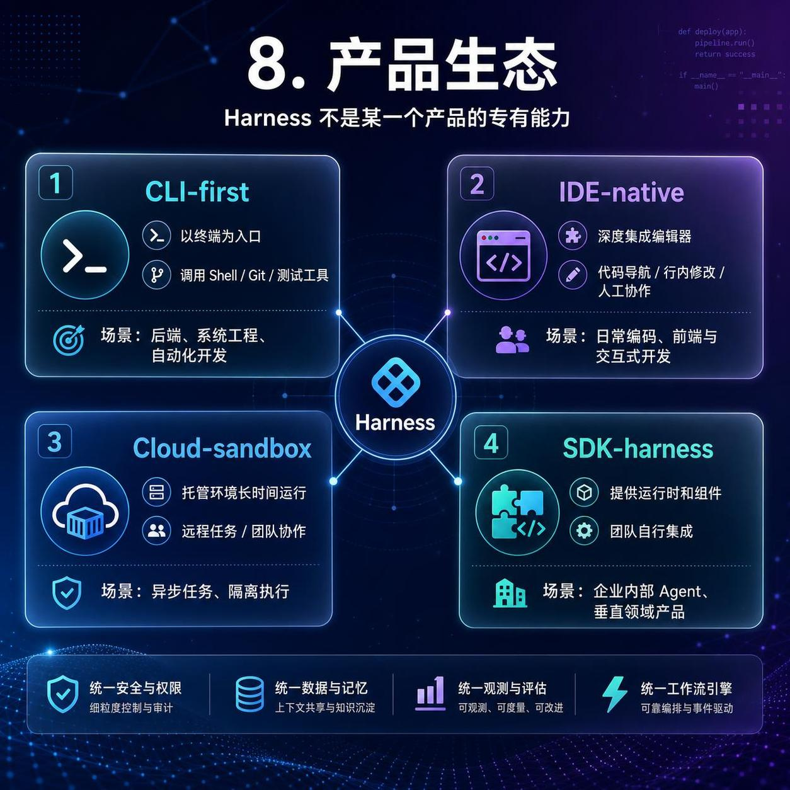

# Harness Engineering 概要

## 学习目标

阅读本文后，应当能够回答以下问题：

1. Harness Engineering 到底解决什么问题？
2. 为什么使用同一个模型，不同 Agent 产品的实际能力会相差很大？
3. Prompt Engineering、Context Engineering 和 Harness Engineering 有什么关系？
4. 一个朴素 Agent 会出现哪些典型故障？
5. Harness 通过哪些机制保证 Agent 可以长时间稳定运行？
6. 如何评估一个新的 Agent 产品或自研 Agent 系统？

## 1. 初识驾驭工程

今天我们聚焦的，是Claude Code、Codex、Cursor 这类产品背后共同的工程系统——**驾驭工程（Harness Engineering）**,也是 2025—2026 年 AI 工程领域逐渐形成共识的一门新兴工程学科。

这些产品看起来都只是在“调用大模型”，但实际使用时却表现出明显差异：

- 为什么有的 Agent 可以连续运行很长时间，有的执行几轮就开始偏离目标？
- 为什么使用同一个底层模型，裸 API 与 Claude Code、Codex、Cursor 的交付质量仍然不同？
- 为什么有的产品能够修改几十个文件、执行测试并持续修复，有的只能在对话框中生成一段看似正确的代码？
- 为什么模型明明足够强，真正放进项目后仍然会陷入死循环、忘记进度或错误地宣布完成？

答案通常不只在模型本身，而在模型外部是否存在一套成熟的 Harness。模型负责理解和推理，Harness 则负责把推理转化为受控行动，并为长任务提供上下文、工具、反馈、状态、验证和安全边界。

### 1.1 三层能力对比

先把裸对话、沙箱执行和完整编码 Agent 放在一起比较：




三层产品在“能不能生成代码”上差距并不大，真正的分水岭出现在**执行、反馈、恢复、验证和安全**上。

同一个任务在三种模式下会形成完全不同的结果：

1. **裸对话模式**：模型给出代码，但不会真正创建文件、运行测试或观察失败；
2. **沙箱执行模式**：模型能够临时运行代码，但通常无法完整接入本地项目、Git 历史和跨会话状态；
3. **完整 Agent 模式**：模型在 Harness 的支持下读取项目、修改文件、执行工具、验证结果，并根据失败证据继续迭代。

因此，Agent 的关键能力不是“生成更多内容”，而是形成完整行动闭环：

> **观察环境 → 采取行动 → 获取反馈 → 修正行动 → 验证完成**



### 1.2 Model、Agent 与 Harness

这三个概念分别位于不同层次：

| 概念 | 主要职责 | 自身不负责什么 |
|---|---|---|
| Model | 理解输入、推理并生成下一步内容 | 不直接管理文件、进程、权限和长期状态 |
| Agent | 围绕目标进行决策并调用工具 | 不代表天然具备可靠性和安全性 |
| Harness | 管理 Agent 的上下文、执行、状态、验证和边界 | 不替代模型本身的推理能力 |

可以把三者理解为：


Model 提供**大脑**，Agent 表现为**行动主体**，Harness 则为行动提供**轨道、反馈和护栏**。

### 1.3 Workflow 与 Agent 的区别

Workflow 和 Agent 都能完成多步骤任务，但控制方式不同：

| 对比项 | Workflow | Agent |
|---|---|---|
| 执行路径 | 由开发者预先定义 | 由模型根据当前状态动态决定 |
| 可预测性 | 较高 | 相对较低 |
| 灵活性 | 适合固定流程 | 适合开放性任务 |
| 失败处理 | 通常使用预设分支 | 可能由模型分析错误后调整 |
| **Harness** | 编排、重试和状态机 | 同时需要上下文、工具、安全、验证和预算控制 |

两者并不是互斥关系。一个成熟系统往往用 Workflow 固定关键边界，再让 Agent 在某些节点中进行动态决策。

### 1.4 Tool Calling 不等于 Harness

Tool Calling 只解决“模型如何表达一次工具调用”，例如让模型输出工具名称和参数。它没有自动解决：

- 工具是否允许执行；
- 参数是否安全；
- 执行失败后如何恢复；
- 多个工具如何持续编排；
- 任务进度如何保存；
- 最终结果如何验证；
- 运行成本如何限制。

因此：

> **Tool Calling 让模型能够行动，Harness Engineering 让行动变得可控、可持续、可恢复、可验证。**

### 1.5 Framework、Runtime 与 Harness

这三个术语也经常被混用：

- **Framework** 提供模型、工具、检索器等开发组件，相当于“积木”；
- **Runtime** 负责执行状态机、工作流、检查点和中断恢复，相当于“发动机”；
- **Harness** 把上下文、Runtime、工具、验证、安全和成本机制组合成完整运行系统，相当于“整车”。

使用了 LangChain、LangGraph 或其他 Agent 框架，不代表已经拥有成熟 Harness。只有当系统形成受控执行、错误反馈、状态恢复、外部验证和资源边界时，才真正进入 Harness Engineering 的范畴。

### 1.6 Harness判断标准

判断一个系统是在“调用模型”，还是已经具备 Harness，可以先问五个问题：

1. 它能否在真实环境中执行动作？
2. 动作失败后，错误是否会反馈给模型？
3. 任务中断后，是否可以恢复进度？
4. 模型声称完成后，是否有外部验证？
5. 危险操作和资源消耗是否受到硬性限制？

如果这些问题大多没有答案，那么它更接近一个带工具的模型调用，而不是完整的 Harness。

## 2. 核心概念

**概念**：harness 这个词本意是"马具"——套在马身上让人驾驭它的皮带、缰绳，通常被翻译成中文**驾驭工程**，也即现在常听的Harness Engineering。

Harness Engineering（驾驭工程）是围绕大模型构建的一套工程系统，用于让 Agent 能够安全、稳定、持续地完成真实任务。

其核心公式是：

> **Agent = Model + Harness**

- **Model** 负责理解、推理与生成；
- **Harness** 负责提供工具、上下文、执行循环、状态管理、验证机制和安全边界。

模型决定 Agent 的能力上限，Harness 决定这些能力能否稳定转化为结果。裸模型通常只能“给出答案”，具备完整 Harness 的 Agent 才能读取项目、修改文件、执行命令、验证结果，并在失败后继续调整。



### 2.1 F1 赛车类比

可以把 Model 理解为赛车的引擎，把 Harness 理解为底盘、变速箱、刹车、方向盘、仪表盘和维修系统。

- 引擎决定理论速度；
- 底盘决定动力能否稳定传递；
- 刹车决定系统是否能安全停止；
- 仪表盘决定驾驶者能否看到故障；
- 维修和进站系统决定长时间比赛能否继续。

只升级模型，相当于只升级引擎。如果执行循环、工具反馈、状态恢复和安全边界没有同步完善，Agent 仍然很容易在真实任务中失败。

## 3. 工程层次

三者是逐层扩展的包含关系，而不是互相替代：

1. **Prompt Engineering**：优化单次输入，让模型更准确地理解任务；
2. **Context Engineering**：管理模型当前能看到的信息，如历史消息、项目文件、工具定义和检索结果；
3. **Harness Engineering**：管理 Agent 的完整运行过程，使其能够长时间、多步骤地可靠执行。

可以简单理解为：

> Prompt 管“怎么问”，Context 管“让模型看到什么”，Harness 管“如何让模型持续行动并完成任务”。



### 3.1 包含关系

常见说法是“Context Engineering 取代了 Prompt Engineering”或“Harness Engineering 取代了 Context Engineering”。这种理解并不准确。

一个成熟 Agent 在运行时，三个层次通常同时存在：

- System Prompt 规定角色、行为原则与输出格式；
- Context 层选择项目规则、相关文件、工具说明和历史状态；
- Harness 层控制循环、工具执行、进度恢复、权限审批和结果验证。

例如，一个编码 Agent 实现登录功能时：

1. Prompt 层告诉模型它是编程助手，并规定编码规范；
2. Context 层读取项目说明、已有认证代码和工具 Schema；
3. Harness 层拆分任务、修改文件、执行测试、保存进度，并在危险操作前请求确认。

### 3.2 术语边界

| 术语 | 主要含义 | 与 Harness 的关系 |
|---|---|---|
| Agent | 能调用工具并执行任务的软件实体 | Agent 是最终产品形态，Harness 是其工程运行系统 |
| Scaffolding | Prompt 模板、Few-shot、工具描述等输入装配层 | 通常是 Harness 中偏上下文装配的一部分 |
| Framework | 提供模型、工具、检索器等开发抽象的类库 | Framework 提供积木，Harness 是组装后的运行系统 |
| Runtime | 执行状态机、工作流和检查点的运行引擎 | Runtime 是 Harness 的执行基础，但不等于完整 Harness |
| Harness | 覆盖上下文、执行、验证、恢复、安全和成本的机制组合 | 负责让 Agent 在真实环境中稳定完成任务 |

以 LangChain 生态为例，可以粗略理解为：

- `langchain-core` 提供 Framework 能力；
- LangGraph 提供有状态 Runtime；
- DeepAgents 在运行时之上组合长任务所需的 Harness 机制。

## 4. Harness 的必要性

一个只有“LLM + Tool Calling + while 循环”的 最小Agent，通常会出现以下问题：

1. **循环失控**：没有明确终止条件，持续调用模型和工具；
2. **上下文溢出**：历史消息不断累积，最终超过上下文窗口；
3. **缓存失效**：频繁修改提示词前缀，无法命中 Prompt Cache；
4. **工具错误被吞掉**：异常和退出码没有结构化返回，Agent 无法识别失败；
5. **状态丢失**：进程中断或会话关闭后，只能从头开始；
6. **缺少权限边界**：危险命令和敏感操作可以直接执行；
7. **缺少独立评审**：Agent 自己生成、自己宣布完成，容易产生自评偏差；
8. **成本失控**：没有迭代次数、Token 或费用预算。

Harness Engineering 的本质，就是为这些故障建立系统化防线。

### 4.1 最小 Agent

一个最简单的 Tool Calling Agent 往往只有以下逻辑：

```python
messages = [system_message, user_message]

while True:
    response = call_llm(messages, tools)
    messages.append(response)

    if not response.tool_calls:
        break

    for tool_call in response.tool_calls:
        result = run_tool(tool_call)
        messages.append(result)
```

这段逻辑能够演示 Agent 的基本原理，却不适合直接用于生产环境。它没有回答以下问题：

- 循环一直不结束怎么办？
- 工具执行失败，但模型没有察觉怎么办？
- 消息越来越多，超过上下文窗口怎么办？
- 进程被关闭后，任务从哪里恢复？
- 模型准备删除文件或强制推送时，谁来拦截？
- 模型说“完成了”，如何证明它真的完成了？
- 一个任务最多允许消耗多少时间和费用？

Harness 的价值就体现在这些“模型之外的问题”上。

### 4.2 八大故障

| 故障 | 常见触发方式 | 直接后果 |
|---|---|---|
| 循环失控 | 使用 `while True`，只依赖模型主动停止 | 无限调用、资源占用和不可预测行为 |
| Context 溢出 | 每轮无条件追加全部消息和工具输出 | 请求失败、注意力下降、成本增加 |
| Cache Miss | 在 System Prompt 中加入时间、任务 ID 等动态内容 | 前缀缓存失效，延迟和费用上升 |
| Tool 错误吞 | 捕获异常后返回空字符串，忽略进程退出码 | Agent 在错误结果上继续执行 |
| 状态丢失 | 所有进度只保存在内存和对话历史中 | 中断后从头开始，长任务无法恢复 |
| 缺权限闸 | 所有工具调用自动执行 | 删除数据、泄露信息或破坏 Git 历史 |
| 缺自动评审 | 生成者自行判断任务是否完成 | 测试未通过、需求遗漏却被宣布完成 |
| 成本失控 | 没有迭代、Token、时间和费用上限 | 单任务消耗大量预算 |

### 4.3 故障链

这些问题通常不是孤立发生的。例如：

1. Agent 没有拆分任务，导致一次处理过多内容；
2. 工具输出不断写入 Context，造成上下文膨胀；
3. 模型因信息过载做出错误判断；
4. 工具错误又被吞掉，模型误以为操作成功；
5. 验证缺失，Agent 提前宣布任务完成；
6. 如果模型没有宣布完成，则可能继续循环并消耗更多预算。

因此，成熟 Harness 不是只添加一个 `max_iterations`，而是建立多层、相互补充的防线。



## 5. 核心机制

### 5.1 Agent Loop

将运行过程拆分为：

> **Gather → Action → Verify → Iterate**

即收集上下文、执行动作、验证结果、继续迭代。同时设置最大迭代次数和明确的停止条件，保证循环一定能够退出。


**解决的问题**：循环失控。

**关键设计**：

- 使用最大迭代次数作为硬刹车；
- 设置任务完成、任务失败、用户取消和预算耗尽等明确状态；
- 每轮执行前检查剩余预算；
- 每轮执行后必须进入验证阶段；
- 循环退出时返回可解释的终止原因。

```python
for iteration in range(MAX_ITERATIONS):
    context = gather_context(state)
    action = take_action(context)
    result = execute(action)
    verification = verify(result)
    state = update_state(state, verification)

    if state.is_done or state.is_blocked:
        break
```

这里真正重要的不是 `for` 语法，而是系统拥有高于模型的控制权。即使模型不断要求继续，Harness 也能在达到边界时强制停止。

### 5.2 Tool Use

使用统一 Schema 描述工具名称、参数和返回值。工具失败时返回结构化错误，例如：

```json
{
  "status": "error",
  "error": "File not found"
}
```

失败信息必须对 Agent 可见，不能用空字符串掩盖异常。

**解决的问题**：工具错误不可见。

**关键设计**：

- 输入参数使用 Schema 校验；
- 返回值必须区分成功与失败；
- Shell 工具应保留 `stdout`、`stderr` 和 `returncode`；
- 设置超时、重试次数和可重试错误类型；
- 工具输出过长时进行截断或保存到文件，避免污染 Context；
- 未知工具和非法参数不能直接执行。

一个更完整的工具结果可以包含：

```json
{
  "status": "error",
  "tool": "run_tests",
  "exit_code": 1,
  "stdout": "3 passed, 1 failed",
  "stderr": "AssertionError",
  "retryable": true
}
```

结构化错误让模型能够区分“命令执行失败”“参数错误”“权限不足”和“暂时性网络故障”，从而选择不同的恢复策略。

### 5.3 Progress Tracking

把任务状态、已完成步骤和下一步计划保存到文件或数据库，并在重要节点创建 Git 提交。即使进程退出，也能从最近的检查点继续执行。

**解决的问题**：状态丢失。

进度记录至少应包含：

- 原始任务和验收条件；
- 已完成、进行中和待处理的子任务；
- 修改过的文件；
- 已执行的验证及结果；
- 当前阻塞原因；
- 下一步建议动作；
- 时间、费用和 Token 消耗。

长期任务通常需要两类检查点：

1. **逻辑检查点**：进度文件、数据库状态或工作流 Checkpoint；
2. **物理检查点**：Git Commit、生成物快照或可恢复的文件版本。

Context Window 不能代替 Progress Tracking。前者是当前请求的短期工作区，后者才是跨会话、跨进程的长期状态。

### 5.4 Context Management

持续监测上下文长度，在达到阈值时进行压缩、摘要或重置。同时保持 System Prompt 等稳定前缀不变，以提高缓存命中率。

上下文窗口是“临时工作区”，不是长期记忆；长期状态应持久化到外部存储。

**解决的问题**：Context 溢出与 Prompt Cache 失效。

Context 管理并不是简单删除旧消息，而是决定“下一轮模型真正需要看到什么”。常见策略包括：

- 只加载与当前子任务相关的文件；
- 对历史操作生成结构化摘要；
- 将完整日志保存到外部，只把索引和结论放入 Context；
- 对长工具输出截断，并保留错误附近的关键部分；
- 达到阈值时执行 Compaction；
- 在拥有可靠外部进度记录时重置会话；
- 保持稳定前缀不变，让 Prompt Cache 可以复用。

需要特别避免在 System Prompt 中写入时间戳、用户名、任务编号或实时状态。这些动态信息应进入 User Message 或状态区，否则每轮请求的前缀都会发生变化。

Compaction 和 Reset 各有代价：

- **Compaction** 保留连续性，但摘要可能遗漏细节或引入噪声；
- **Reset** 获得干净上下文，但强依赖外部进度记录才能恢复任务。

### 5.5 Feature List

把大任务拆分成可验证的小任务，并记录状态：

```json
[
  {"id": 1, "task": "读取测试文件", "status": "done"},
  {"id": 2, "task": "修复缺陷", "status": "in_progress"},
  {"id": 3, "task": "运行测试", "status": "pending"}
]
```

每次只处理一个任务，避免 Agent 同时做太多事情导致上下文和执行过程失控。

**解决的问题**：大任务带来的 Context 膨胀和执行混乱。

好的子任务应具有以下特点：

- 范围足够小，可以在有限轮次内完成；
- 输入和输出明确；
- 有可以执行的验收条件；
- 与其他任务的依赖关系清晰；
- 状态可以持久化；
- 失败后能够单独重试。

Feature List 本质上是 Agent 的外置工作记忆。它不应该只存在于模型生成的一段自然语言计划中，而应保存为 JSON、数据库记录或工作流状态。

推荐的状态流转是：

> `pending → in_progress → verifying → passed / failed / blocked`

只有验证通过后才能标记为 `passed`，不能以“代码已经写完”作为完成依据。

### 5.6 Verification Loop

Agent 声称“已完成”不等于任务真的完成。必须通过 pytest、Playwright、编译器、静态检查等外部工具验证结果。验证失败则继续修复，验证通过后才更新任务状态。

**解决的问题**：工具执行结果不可靠，以及模型自评偏差。

不同任务需要不同的验证器：

| 任务类型 | 推荐验证方式 |
|---|---|
| Python 后端 | pytest、类型检查、静态检查、接口测试 |
| 前端页面 | 单元测试、构建、Playwright 浏览器验证 |
| 数据任务 | 行数、Schema、空值、分布和业务约束检查 |
| 文档任务 | 链接检查、结构检查、读者测试 |
| 基础设施 | dry-run、配置校验、计划输出和健康检查 |

验证闭环必须防止“为了通过而修改标准”。例如，测试失败时 Agent 应优先修复实现，而不是删除测试、降低断言或跳过用例。

一个任务的真实完成条件应是：

> **产物存在 + 验收条件满足 + 验证证据可追溯**

### 5.7 Subagents

把复杂子任务交给拥有独立上下文的子 Agent。子 Agent 只向主 Agent 返回最终结论，避免大量中间过程污染主上下文。

**解决的问题**：主 Context 被搜索、试错和大量工具输出污染。

子 Agent 适合处理：

- 独立搜索某个模块的实现；
- 运行一组耗时测试并汇总结论；
- 分析日志或错误原因；
- 对多个候选方案进行并行研究；
- 从独立视角审查代码或文档。

使用 Subagents 时需要控制协调成本：

- 子任务必须边界清晰；
- 返回值应使用统一格式；
- 主 Agent 只接收结论、证据和必要引用；
- 避免多个子 Agent 同时修改同一文件；
- 为子 Agent 设置独立预算和超时；
- 不要把无法拆分的强依赖任务机械并行化。

多 Agent 并不天然优于单 Agent。它用隔离性换取了通信、协调和一致性成本。

### 5.8 Generator–Evaluator

将职责拆分为三个角色：

- **Planner**：拆分并规划任务；
- **Generator**：执行任务并生成产物；
- **Evaluator**：根据标准独立评审结果。

评审者不依赖生成者的自我解释，从架构上减少“自己给自己打分”的偏差。

**解决的问题**：缺少自动化评审和生成者自评偏差。

三角色之间可以形成如下流程：

1. Planner 根据需求和验收条件拆分任务；
2. Generator 只负责完成当前子任务；
3. Evaluator 不查看生成过程，只检查最终产物和证据；
4. 不通过时返回具体问题和修订标准；
5. Generator 根据反馈重新生成；
6. 达到评分阈值或重试上限后结束。



Evaluator 必须使用明确的评价标准，例如：

- 是否满足全部需求；
- 是否通过测试；
- 是否引入安全问题；
- 是否破坏已有行为；
- 是否存在未经验证的假设；
- 是否可以被维护者理解。

如果评价标准仍然只是“请看看做得好不好”，多角色架构不会自动带来高质量。

此外，生产级 Harness 通常还需要两个重要扩展：

- **Permission Gate**：拦截删除文件、强制推送、访问敏感数据等危险操作；
- **Token Budget**：限制迭代次数、Token 用量、执行时间和费用。

### 5.9 故障与机制

| 故障模式 | 主要防护机制 | 辅助机制 |
|---|---|---|
| 循环失控 | Agent Loop | Token Budget、人工中止 |
| Context 溢出 | Context Management | Feature List、Subagents |
| Cache Miss | 稳定提示词前缀 | Context 分层 |
| Tool 错误吞 | Tool Use | Verification Loop |
| 状态丢失 | Progress Tracking | Git Checkpoint、Runtime Checkpoint |
| 缺权限闸 | Permission Gate | 沙箱、最小权限工具 |
| 缺自动评审 | Generator–Evaluator | Verification Loop |
| 成本失控 | Token Budget | 最大迭代数、超时、Context 管理 |

这张表说明一条故障通常不应只依靠一道防线。例如，设置最大迭代次数可以阻止无限循环，但如果没有费用预算和上下文控制，Agent 仍可能在达到迭代上限前产生高额消耗。

## 6. 三大维度

可以从三个维度检查一套 Harness 是否完整：

### Context Engineering

**Agent 能看到什么：**关注信息选择、任务拆分、上下文压缩、进度记录和子任务隔离。

### Architectural Constraints

**Agent 能做什么：**关注执行循环、工具契约、权限边界、验证流程和多角色协作。

### Garbage Collection

**Agent 能运行多久：**关注过期上下文清理、状态回收、资源限制和成本控制。

对应三个检查问题：

> 信息是否准确？动作是否受控？资源是否可持续？



### 6.1 Context Engineering

这一层不只是“塞更多资料”，而是让 Agent 在正确的时间看到正确的信息。它包含：

- 项目规则和固定指令；
- 当前任务和验收条件；
- 相关代码与文档；
- 工具能力说明；
- 已完成步骤和外部进度；
- 历史错误与验证结果；
- Context 压缩、检索和重置策略。

衡量标准不是 Context 有多长，而是其中每一部分是否对下一步决策有用。

### 6.2 Architectural Constraints

这一层通过代码和架构限制 Agent 的动作空间，例如：

- 只能调用白名单工具；
- 工具参数必须通过 Schema 校验；
- 危险操作必须获得批准；
- 每轮必须经过验证；
- 生成与评审职责分离；
- 子 Agent 只能访问完成任务所需的最小资源。

真正可靠的约束必须由系统实现，而不能只写在 Prompt 中。Prompt 中的“不要执行危险命令”属于软约束，Permission Gate 的拒绝执行才是硬约束。

### 6.3 Garbage Collection

这里的 Garbage Collection 是课程为了便于理解使用的工程类比，重点是清理过期状态并控制资源：

- 清理无用的历史消息；
- 压缩过长工具输出；
- 回收失效会话和临时文件；
- 限制 Token、时间、迭代和费用；
- 结束无进展或重复执行的任务；
- 定期删除已经被新模型能力替代的 Harness 逻辑。

它回答的核心问题是：Agent 不只是能启动，还能否在有限资源中持续运行并最终收敛。

## 7. 基本流程

一套最小可用 Harness 可以按以下流程运行：

1. 读取任务、项目规则和已有进度；
2. 将任务拆成可独立验证的子任务；
3. 选择一个待处理任务；
4. 收集完成该任务所需的最小上下文；
5. 调用模型并执行工具；
6. 结构化记录工具结果和错误；
7. 使用测试或其他外部工具验证；
8. 通过后保存进度，失败则带着证据继续迭代；
9. 达到完成条件、预算上限或安全边界时停止。

### 7.1 完整状态流



### 7.2 最小 Harness

如果从零开始构建 Harness，不需要一次实现所有高级机制。一个最小版本至少应具有：

1. 有上限的 Agent Loop；
2. 结构化工具返回；
3. 可持久化任务清单；
4. 至少一种真实验证方式；
5. 危险操作拦截；
6. 时间或 Token 预算；
7. 明确的完成、失败和阻塞状态。

Subagents、复杂 Compaction 和多角色评审可以根据真实故障数据逐步增加。

## 8. 产品生态

Harness 不是某一个产品的专有能力。主流实现通常可以分成四种形态：




评估一个产品时，不应只看它使用什么模型，而应检查：

- 它如何获取项目上下文；
- 能调用哪些工具；
- 如何限制危险操作；
- 是否支持任务拆解和状态恢复；
- 如何验证任务完成；
- 如何处理长 Context；
- 是否支持预算、超时和人工接管；
- 运行在本地、IDE、云沙箱还是自建 Runtime 中。

## 9. 工程原则

1. **不要完全信任模型的自我判断**：循环必须有硬性出口，结果必须由外部证据验证。
2. **错误必须显性化**：异常、退出码和失败原因都应结构化返回。
3. **状态必须外置**：重要进度不能只保存在上下文窗口中。
4. **大任务必须拆分**：一次只完成一个可验证的小目标。
5. **安全边界由系统控制**：不能只依赖提示词要求模型“谨慎操作”。
6. **控制成本与资源**：为时间、迭代次数、Token 和费用设置预算。
7. **保持简单并准备删除**：Harness 会随着模型能力变化而过时，应持续评估、裁剪和重构。
8. **失败数据比复杂架构更有价值**：根据真实失败案例增加机制，不为假设中的问题提前堆叠复杂度。

### 9.1 Start Simple

先实现最小可靠闭环，再根据真实失败扩展。过早加入复杂工作流、多 Agent 协议和大量规则，可能增加故障点，并限制更强模型的能力。

### 9.2 Build to Delete

Harness 固化了对当前模型能力的假设。当模型升级后，旧的提示、重试逻辑和刚性流程可能从保护机制变成阻碍。

因此，Harness 代码应具备：

- 模块化；
- 可观测；
- 可通过 Benchmark 比较；
- 能够单独关闭某项机制；
- 能够快速删除或重写。

### 9.3 Harness Is the Dataset

真正重要的资产不只是 Harness 代码，还包括运行过程中积累的失败数据：

- 哪类任务最容易失败；
- 失败发生在哪个步骤；
- 哪些工具错误最常见；
- 哪些 Context 会误导模型；
- 哪种验证能发现真实缺陷；
- 哪些人工干预最终帮助任务恢复。

这些数据既能指导 Harness 迭代，也能用于回归测试、模型选型和评估。

## 10. 开放争议

### 10.1 多 Agent 还是单 Loop

- 多 Agent 的优势是 Context 隔离和专业分工；
- 缺点是通信协议、失败重试和一致性管理更复杂；
- 单 Loop 更简单、可观察，但所有上下文压力集中在一个会话中。

选择依据应是任务是否真正可拆分，而不是追求 Agent 数量。

### 10.2 Compaction 还是 Reset

- Compaction 适合需要保留会话连续性的任务；
- Reset 适合 Context 已被大量试错污染、且外部状态记录可靠的任务；
- 两者都不能替代 Progress Tracking。

### 10.3 CLI-first 还是 IDE-native

- CLI-first 更适合脚本化、长任务和系统工具编排；
- IDE-native 更适合可视化编辑、局部修改和实时人工反馈；
- 两者服务不同工作流，并不存在适用于所有人的唯一答案。

## 11. 成熟度检查

可以使用以下问题快速检查一套 Agent 系统：

### 循环与状态

- 是否存在最大迭代次数？
- 是否有 completed、failed、blocked、cancelled 等明确状态？
- 中断后是否可以从检查点恢复？
- 是否能识别多轮没有进展的循环？

### 工具与安全

- 工具输入是否经过 Schema 校验？
- 是否保留退出码、标准输出和错误输出？
- 是否设置执行超时？
- 危险操作是否需要审批？
- 工具权限是否遵循最小权限原则？

### Context

- 是否只加载当前任务需要的信息？
- System Prompt 前缀是否稳定？
- 长输出是否截断或外置？
- 是否有 Compaction 或 Reset 策略？
- 长期状态是否保存在 Context 之外？

### 验证与质量

- 每个子任务是否有明确验收条件？
- 是否执行真实测试，而不是只依赖模型自评？
- 是否禁止通过删除或弱化测试来制造“通过”？
- 最终交付是否包含验证证据？

### 成本与可观测性

- 是否限制 Token、时间、迭代和费用？
- 是否记录每轮调用、工具结果和终止原因？
- 是否能够比较不同 Harness 版本的成功率？
- 是否收集并分类失败案例？

## 12. 总结

Harness Engineering 不是单一框架或工具，而是一套让 Agent 从“能够推理”走向“能够可靠交付”的工程方法。

判断一套 Agent 系统是否具备成熟 Harness，可以检查四点：

- 是否有受控且可退出的执行循环；
- 是否能持久化状态并管理上下文；
- 是否通过外部工具验证真实结果；
- 是否具备权限、成本和资源边界。

最终目标不是让 Agent 无限自主，而是让它在明确边界内持续行动、识别失败、恢复进度，并交付可以验证的结果。

整套知识可以压缩为五个记忆点：

1. **一个公式**：`Agent = Model + Harness`；
2. **八类故障**：循环、Context、缓存、工具、状态、权限、评审、成本；
3. **八大机制**：Loop、Tool Use、Progress、Context、Feature List、Verification、Subagents、Generator–Evaluator；
4. **三个维度**：看见什么、能做什么、能跑多久；
5. **一种工程理性**：从真实失败出发，保持简单，并准备随模型进步删除旧 Harness。

Harness 的目标不是代替模型，也不是堆叠尽可能多的控制逻辑，而是在模型与真实世界之间建立一套可观察、可恢复、可验证、可约束的工程系统。
