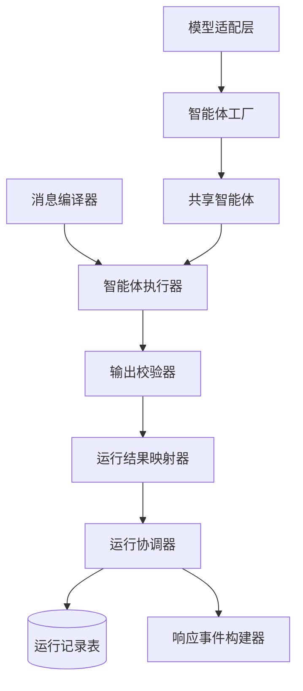
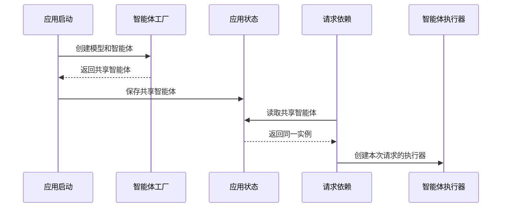
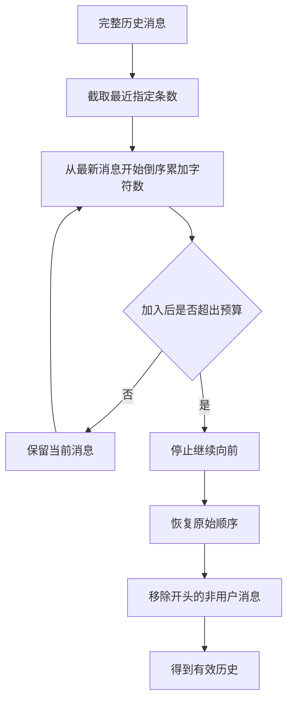
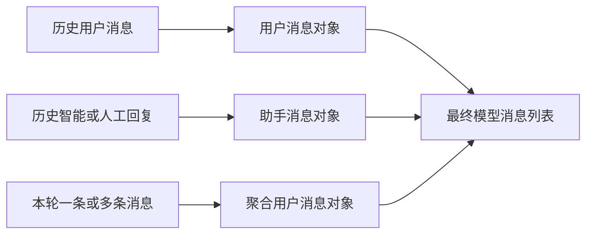
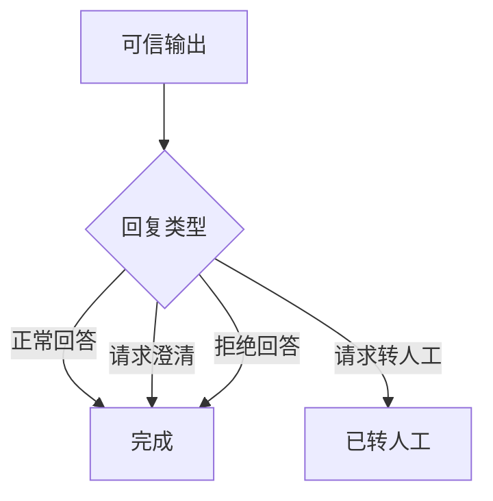
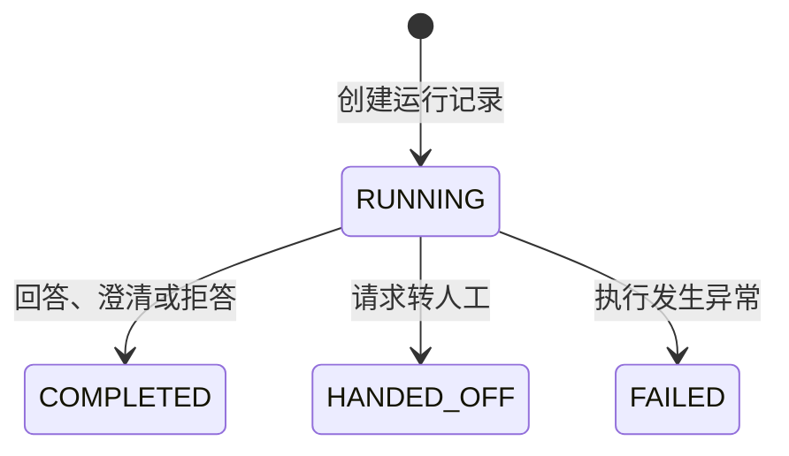
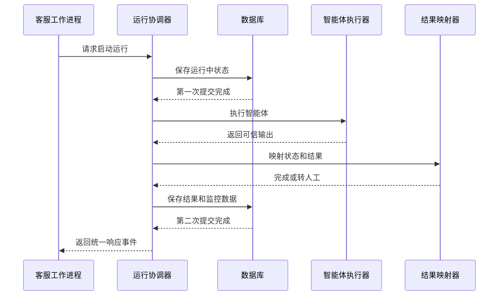

# 第八天 智能运行核心链路实现

## 目录

- [1. 今日目标](#1-今日目标)
- [2. 整体流程](#2-整体流程)
- [3. 模型准备](#3-模型准备)
- [4. 消息编译](#4-消息编译)
- [5. 执行与校验](#5-执行与校验)
- [6. 结果与状态](#6-结果与状态)
- [7. 启动运行](#7-启动运行)
- [8. 测试与总结](#8-测试与总结)

---

## 1. 今日目标

### 1.1 内容

上一阶段已经完成智能服务的项目骨架、运行记录、内部接口、身份认证和响应事件。本阶段继续实现启动运行接口，使服务能够真正调用大语言模型并返回结构化结果。

本日完成以下内容：

1. 配置并创建对话模型；
2. 创建只读客服智能体；
3. 在应用启动时创建并复用智能体；
4. 定义模型的结构化输出；
5. 编译历史消息和本轮消息；
6. 实现智能体的三步执行流程；
7. 建立校验前后的输出边界；
8. 将校验结果映射为运行状态和持久化结果；
9. 完成启动运行接口的核心闭环。

### 1.2 实现边界

本日重点是打通最小运行链路，不一次性实现全部生产能力。

本日暂不实现：

- 业务查询工具；
- 能力加载机制；
- 动态提示词；
- 运行时上下文；
- 页面动作校验；
- 澄清候选项构建；
- 待确认结果的提交与取消；
- 自定义纠错重试流程。

这些能力已经保留清晰的扩展位置，后续可以在不破坏当前主流程的前提下继续增加。

---

## 2. 整体流程

### 2.1 核心处理链路

用户消息首先由客服服务保存并形成一个固定输入快照。工作进程调用智能服务的启动接口后，智能服务创建运行记录、编译模型消息、调用智能体、校验结构化输出，最后保存结果并返回统一事件。


这条链路明确区分了三个阶段：

- 模型调用前：编译可信、有限的输入消息；
- 模型调用后：解析并校验结构化输出；
- 数据保存前：把输出转换成运行状态和稳定的结果结构。

### 2.2 模块职责划分



各模块职责如下：

- 模型适配层：隔离模型创建参数和结构化结果格式；
- 智能体工厂：组装模型、工具、提示词和输出协议；
- 消息编译器：将历史消息和本轮消息转换为模型消息；
- 智能体执行器：协调编译、调用和校验三个步骤；
- 输出校验器：建立模型输出与可信输出之间的边界；
- 运行结果映射器：生成运行状态和持久化结果；
- 运行协调器：管理事务、执行过程、监控字段和响应事件。

---

## 3. 模型准备

### 3.1 模型配置与适配

模型配置集中放在统一配置类中：

```python
llm_api_key: str = ""
llm_base_url: str | None = None
llm_model: str = ""
prompt_version: str = "customer-support-v1"
```

模型适配层负责检查配置并创建模型：

```python
class ModelAdapter:
    @classmethod
    def create_model(cls):
        settings = get_settings()
        model_kwargs: dict[str, Any] = {
            "model": settings.llm_model,
            "base_url": settings.llm_base_url,
            "api_key": settings.llm_api_key,
            "timeout": settings.llm_timeout_seconds,
            "temperature": 0,
            "retry": 1
        }
        if settings.llm_provider == "deepseek":
            return ChatDeepSeek(
                **model_kwargs,
                extra_body={"thinking": {"type": settings.llm_thinking_mode}}
            )
        if settings.llm_provider == "qwen":
            return ChatOpenAI(
                **model_kwargs,
                use_responses_api=False,
                extra_body={
                    "enable_thinking": settings.llm_thinking_mode == "enabled"
                }

            )

        return ChatOpenAI(**model_kwargs, use_responses_api=False)

```

它还负责从智能体执行结果中提取 `structured_response`，并转换成 `AgentOutput`：

```python
@staticmethod
def normalize_output(value: Any) -> AgentOutput:
    structured_output = (
        value.get("structured_response")
        if isinstance(value, dict)
        else value
    )
    if isinstance(structured_output, AgentOutput):
        return structured_output
    return AgentOutput.model_validate(structured_output)
```

执行器不需要理解不同模型的创建参数，也不需要了解框架返回值的具体结构。

### 3.2 智能体创建与复用

智能体工厂使用 `create_agent()` 组装只读客服智能体：

```python
def create_support_agent(
    settings: Settings | None = None
) -> Any:
    settings = settings or get_settings()
    model = ModelAdapter.create(settings)
    tools: list[BaseTool] = []
    return create_agent(
        model=model,
        tools=tools,
        system_prompt=SYSTEM_PROMPT,
        response_format=ToolStrategy(AgentOutput),
        name="ecommerce-customer-support"
    )
```

当前工具列表为空，后续接入业务查询工具时再进行扩展。

如果每次请求都重新创建模型和智能体，会重复组装执行结构。项目使用应用生命周期，在服务启动时完成一次创建：

```python
@asynccontextmanager
async def lifespan(app: FastAPI):
    await create_tables()
    app.state.agent = create_support_agent()
    yield
    await db_engine.dispose()
```

后续请求通过依赖获取共享智能体：

```python
def get_agent_executor(request: Request) -> AgentExecutor:
    return AgentExecutor(agent=request.app.state.agent)
```



共享的是无会话状态的智能体实例。每次调用使用独立消息，因此不同用户的对话不会写入同一个内存会话。

### 3.3 提示词与结构化输出

系统提示词首先明确只读边界：

```text
你是电商平台的只读智能客服。你的目标是使用可信数据回答问题，
并把所有业务变更引导到用户端的确定性页面。
```

当前提示词只包含两个章节：

1. 职责边界；
2. 终态输出。

后续实现能力加载、事实校验和页面动作后，再增加对应章节。

模型每次必须返回四种回复类型中的一种：

```python
class ReplyType(StrEnum):
    ANSWER = "ANSWER"
    CLARIFY = "CLARIFY"
    DECLINE = "DECLINE"
    REQUEST_HANDOFF = "REQUEST_HANDOFF"
```

四种类型分别表示：

- `ANSWER`：正常回答电商问题；
- `CLARIFY`：请求用户补充信息或选择业务对象；
- `DECLINE`：拒绝非电商问题或没有可靠依据的问题；
- `REQUEST_HANDOFF`：请求客服服务创建人工工单。

转人工信息与用户回复属于不同用途，因此使用独立结构：

```python
class HandoffReason(StrEnum):
    """转人工的业务原因。"""

    USER_REQUESTED = "USER_REQUESTED"
    COMPLAINT = "COMPLAINT"
    RISK_REVIEW = "RISK_REVIEW"

class HandoffRequest(BaseModel):
    """定义 Customer Service 创建人工工单需要的信息。"""
    reason_code: HandoffReason
    summary: str


class AgentOutput(BaseModel):
    """定义大语言模型必须返回的结构化结果。"""
    reply_type: ReplyType
    reply_content: str
    handoff_request: HandoffRequest | None = None
```

其中：

- `reply_content` 面向用户；
- `handoff_request.summary` 面向人工客服；
- `handoff_request.reason_code` 用于标记转人工原因。

只有 `REQUEST_HANDOFF` 可以携带 `handoff_request`。不能仅仅因为模型不知道答案就转人工；非电商问题应当拒答，信息不足应当澄清。

---

## 4. 消息编译

### 4.1 历史消息裁剪

客服服务发送的请求中，历史消息与本轮消息已经分开：

```python
class AgentRunRequest(BaseModel):
    conversation_id: str
    turn_id: str
    messages: list[CurrentMessage]
    history: list[HistoryMessage]
```

消息编译器先按照条数限制取得最近历史，再从最新消息向前计算字符预算：

```python
history_message_limit: int = 30
history_character_budget: int = 12000
```

历史裁剪采用“保留连续尾部”的方式。一旦继续加入更早消息会超过字符预算，就停止向前选择，避免历史上下文无限增长。

裁剪完成后还要保证第一条历史由用户发送。历史可能因为条数限制从一条智能回复开始，这种没有前置用户问题的孤立回复不应直接交给模型。



### 4.2 本轮消息聚合

一个对话轮次可能收集用户连续发送的多条消息。

单条消息直接返回原内容：

```text
查询我的订单
```

多条消息按照原顺序聚合：

```text
用户连续发送了以下内容，请作为一个整体理解，并以最新表达为准：
1. 查询我的订单
2. 是刚才购买的手机
```

这样既保留了连续输入，又明确要求模型以最新表达为准。

### 4.3 消息格式转换

历史中的用户消息转换为 `HumanMessage`，智能回复和人工回复转换为 `AIMessage`。本轮消息全部来自当前用户，因此聚合后转换为一个 `HumanMessage`。

文本消息直接读取文本内容。结构化对象转换成稳定的文本：

```text
[用户选择的业务对象]
{"object_id":"order_001","object_type":"order"}
```



当前阶段保留历史对象消息，让模型能够理解简单指代。等业务工具接入后，再建立确定性的对象焦点和运行时上下文，避免让模型自行猜测业务对象。

---

## 5. 执行与校验

### 5.1 三步执行流程

智能体执行器只负责三个步骤：

```python
async def execute(
    self,
    request: AgentRunRequest
) -> ValidatedAgentOutput:
    messages = self.context_compiler.compile_messages(request)

    raw_output = await self.agent.ainvoke(
        {"messages": messages}
    )
    output = ModelAdapter.normalize_output(raw_output)

    return self.output_validator.validate(output)
```


执行器不负责：

- 创建智能体；
- 数据库事务；
- 修改运行状态；
- 构建响应事件；
- 捕获并保存运行失败。

这些职责分别交给应用生命周期、运行协调器和事件构建器。

### 5.2 校验前后模型

`AgentOutput` 是大语言模型生成的结构化对象。字段格式正确并不代表业务内容已经可信，因此不能直接把它等同于最终结果。

```text
模型结构化输出
        ↓
AgentOutput
        ↓ 服务端校验
ValidatedAgentOutput
```

校验后的模型继承基础输出，并为后续可信数据预留位置：

```python
class PageAction(BaseModel):
    """定义服务端校验后生成的安全页面动作。"""

    action_id: str
    label: str
    description: str
    href: str


class ClarificationOption(BaseModel):
    """定义服务端根据真实业务数据生成的澄清选项。"""

    object_type: str
    object_id: str
    label: str
    description: str
        
class ValidatedAgentOutput(AgentOutput):
     """保存经过服务端校验并补充可信数据的 Agent 输出。"""
    page_action: PageAction | None = None
    clarification_options: list[ClarificationOption] = Field(
        default_factory=list
    )
```

- `page_action` 由服务端动作目录生成，不接受模型直接生成页面地址；
- `clarification_options` 由真实业务查询结果生成，不允许模型编造订单或商品编号。

### 5.3 后续校验边界

本日校验器只完成 `AgentOutput` 到 `ValidatedAgentOutput` 的类型转换：

```python
def validate(
    self,
    output: AgentOutput
) -> ValidatedAgentOutput:
    return ValidatedAgentOutput.model_validate(
        output.model_dump()
    )
```

后续将在这个边界逐步加入：

- 回答依据校验；
- 工具调用证据校验；
- 页面动作白名单校验；
- 页面资源编号校验；
- 澄清候选项构建；
- 转人工条件校验。

把这些规则集中到校验器，可以避免运行协调器和结果映射器承担模型安全职责。

---

## 6. 结果与状态

### 6.1 四种回复决策

四种回复决策并不等于四种运行状态。

当前对应关系如下：



正常回答、澄清和拒答最终都会向用户发送一条智能消息，所以当前都映射为 `COMPLETED`。请求转人工需要客服服务创建人工工单，因此映射为 `HANDED_OFF`。

### 6.2 结果映射

`AgentRunResultMapper` 将可信输出映射为两个值：

```python
tuple[AgentRunState, dict[str, Any]]
```

普通回复结果：

```json
{
  "message_id": "ai_msg_xxx",
  "content": {
    "text": "您的问题已经收到。",
    "reply_type": "ANSWER"
  }
}
```

转人工结果：

```json
{
  "reason_code": "USER_REQUESTED",
  "summary": "用户明确要求人工客服处理。",
  "message": "正在为您转接人工客服，请稍候。"
}
```

智能服务只返回转人工结果，不直接创建客服工单。客服服务收到 `run_handoff_requested` 后负责：

1. 创建或复用开放工单；
2. 将会话切换为等待人工；
3. 保存面向用户的转接提示；
4. 向用户端和客服工作台发送实时事件。

### 6.3 运行状态变化

当前启动接口会产生以下状态：



状态职责并不全部属于结果映射器：

- `RUNNING`：运行协调器创建记录时设置；
- `COMPLETED`：结果映射器处理普通回复时设置；
- `HANDED_OFF`：结果映射器处理转人工时设置；
- `FAILED`：运行协调器捕获执行异常时设置；
- `DECISION_PREPARED`：后续实现需要确认的页面动作时由结果映射器产生；
- `SUPERSEDED`：取消待发布结果时由运行协调器设置。

---

## 7. 启动运行

### 7.1 创建运行记录

启动接口收到请求后，首先创建 `RUNNING` 状态的运行记录：

```python
run = AgentRun(
    conversation_id=request.conversation_id,
    user_id=user_id,
    turn_id=request.turn_id,
    state=AgentRunState.RUNNING,
    model_name=self.settings.llm_model,
    prompt_version=self.settings.prompt_version,
    input_context=request.model_dump(mode="json")
)
```

输入快照会保存当前消息和历史消息，使后续能够知道本次模型执行基于什么输入。

### 7.2 调用智能体

运行记录创建后先提交一次事务，再调用智能体：

```python
self.run_repository.add(run)
await self.session.commit()

output = await self.executor.execute(request)
```

第一次提交用于：

- 让数据库能够查询正在运行的记录；
- 让管理后台观察运行中任务；
- 发生进程异常时保留运行痕迹；
- 避免模型调用期间长期占用数据库事务。

### 7.3 保存结果与监控数据

智能体执行成功时，结果映射器生成状态和结果：

```python
run.state, run.result = AgentRunResultMapper.map(output)
```

执行发生异常时，由运行协调器统一记录失败：

```python
except Exception as exc:
    run.state = AgentRunState.FAILED
    run.error = str(exc) or type(exc).__name__
    run.result = {
        "message": "AI Service 处理失败"
    }
```

最后记录耗时和结束时间，并进行第二次提交：

```python
run.latency_ms = int((perf_counter() - started) * 1000)
run.finished_at = get_utcnow()
await self.session.commit()
```

两次提交保存的是不同生命周期状态，并不是业务上的两阶段确认：

```text
第一次提交：RUNNING
第二次提交：COMPLETED、HANDED_OFF 或 FAILED
```

当前已经记录模型名称、提示词版本、执行耗时和错误信息。输入、输出令牌字段暂时保留默认值，后续接入模型用量信息后再写入。

### 7.4 构建响应事件

最终状态保存成功后，根据数据库中的运行状态构建客服服务能够解析的事件：

```text
COMPLETED  → run_completed
HANDED_OFF → run_handoff_requested
FAILED     → run_failed
```



页面动作尚未接入，因此本日不会产生 `DECISION_PREPARED`。提交和取消接口继续保留框架，等待后续页面动作课程完成。

### 8.2 本日总结

本日完成了智能服务从框架到可执行链路的关键跨越：

1. 模型创建与框架返回格式被适配层隔离；
2. 智能体在应用启动时创建，并由所有请求复用；
3. 只读职责和四种终态回复通过提示词与结构化模型固定；
4. 历史消息受到条数与字符预算控制；
5. 执行器只保留编译、调用、校验三个核心步骤；
6. 模型输出和服务端可信输出已经分层；
7. 结果映射、运行状态、失败处理和事件构建职责清晰；
8. 启动运行接口已经形成完整闭环。

后续将在当前边界上继续增加业务查询工具、运行时上下文、动态提示词、事实校验、澄清候选项和安全页面动作。
