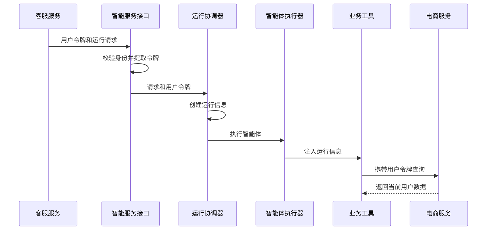
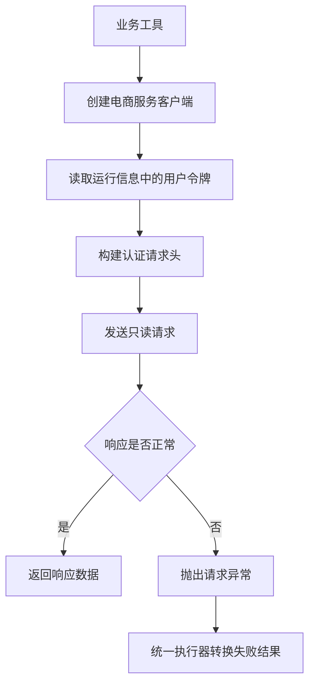
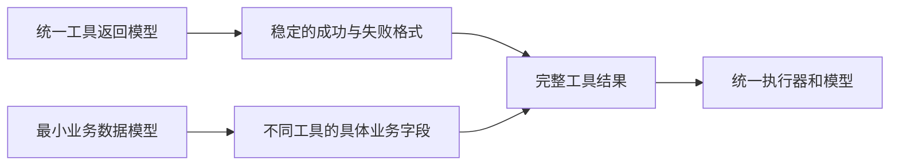
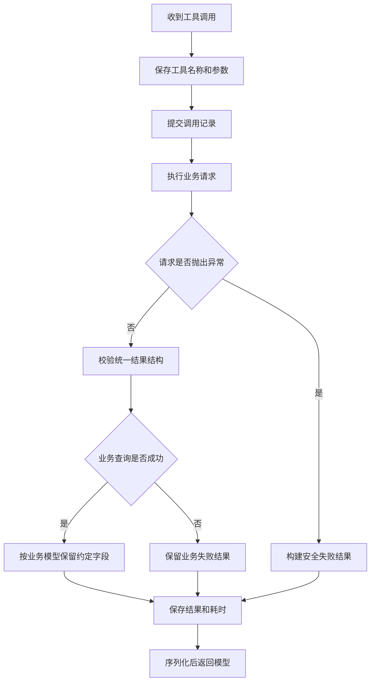
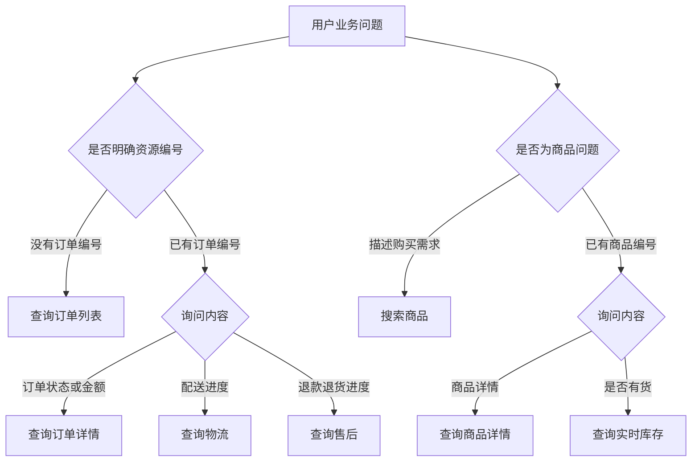
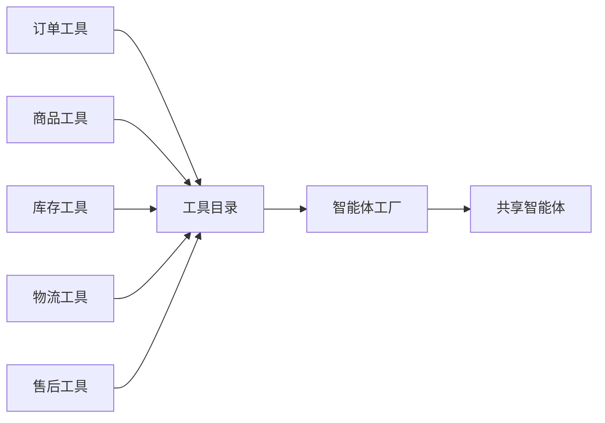

# day09 业务查询工具与运行上下文

## 目录

- [1. 本日概览](#1-本日概览)
- [2. 运行信息](#2-运行信息)
- [3. 服务访问](#3-服务访问)
- [4. 数据契约](#4-数据契约)
- [5. 执行与记录](#5-执行与记录)
- [6. 查询工具](#6-查询工具)
- [7. 工具管理](#7-工具管理)
- [8. 本日总结](#8-本日总结)

---

## 1. 本日概览

<span style="color:red">作用</span>：**说明本日建设目标、整体链路和实现边界。**

### 1.1 学习目标

<span style="color:red">作用</span>：**明确本日需要完成的功能以及这些功能解决的业务问题。**

上一阶段已经打通智能服务的核心运行链路。智能服务能够创建运行记录、编译消息、调用模型、解析结构化输出并返回统一事件。

但是模型只能根据消息内容回答，无法取得用户当前的订单、商品库存、物流和售后数据。模型训练数据也不能代替实时业务数据，否则容易产生过期或虚构的回答。

本日围绕业务查询完成以下内容：

2. 定义一次运行共享的可信运行信息；
3. 将用户访问令牌安全传递给业务工具；
3. 接入订单、商品、库存、物流和售后查询工具；
4. 使用统一执行器处理工具调用；
5. 建立工具目录并集中注册到智能体；

### 1.2 总体链路

<span style="color:red">作用</span>：**用户提出问题到模型获得真实业务数据的完整处理顺序。**

模型根据用户问题决定是否调用工具。工具从运行信息中取得用户令牌，通过电商服务访问层查询真实数据。统一工具执行器在调用前后保存工具记录，并将经过校验的结果返回模型。


这条链路形成了三个边界：

- **身份边界**：工具只能使用当前用户的访问令牌查询数据；
- **数据边界**：电商服务返回的数据必须经过业务数据模型校验；
- **证据边界**：每一次工具调用都要保存，后续才能判断模型回答是否有真实依据。


## 2. 运行信息

<span style="color:red">作用</span>：**说明业务工具执行时需要共享哪些可信信息，以及这些信息如何安全传递。**

### 2.1 操作请求

<span style="color:red">作用</span>：**衔接页面操作中的资源编号与后续业务工具查询结果。**

上一阶段已经定义页面操作请求。本日先回顾其中的资源编号，明确它与业务工具查询结果之间的关系，为下一阶段的页面动作校验做准备。

模型不能直接生成前端地址。它只能表达“希望用户执行什么操作”以及“操作哪个业务对象”。

```python
class PageActionRequest(BaseModel):
    action_code: str
    resource_id: str | None = None
```

例如，用户询问如何取消订单时，模型可以返回：

```json
{
  "action_code": "CANCEL_ORDER",
  "resource_id": "ORDER_001"
}
```

这里没有页面地址。后续由服务端完成以下工作：

1. 判断动作编码是否在白名单中；
2. 判断订单是否经过业务工具确认；
3. 判断动作与资源类型是否匹配；
4. 使用服务端路径模板生成页面地址。

**当前 `resource_id` 实际表示订单编号。**查看订单详情、取消订单、修改地址、申请售后和查看售后进度都属于订单页面动作，后续会使用成功的订单查询记录验证这个编号。

商品编号当前只作为商品查询工具的参数使用，还没有对应的商品页面动作，因此不会写入 `PageActionRequest`。这里保留通用名称 `resource_id`，是为了以后扩展商品详情等其他资源页面动作。

### 2.2 运行上下文

<span style="color:red">作用</span>：**定义一次智能运行中由协调器、执行器和业务工具共享的可信数据。**

业务工具不只需要模型传入的查询参数，还需要本次运行的可信信息。

```python
@dataclass(frozen=True)
class AgentRuntimeContext:
    run_id: str
    conversation_id: str
    user_id: str
    access_token: str
```

四个字段的职责如下：

- `run_id`：关联本次工具调用与运行记录；
- `conversation_id`：标记工具调用属于哪个会话；
- `user_id`：标记当前可信用户；
- `access_token`：以当前用户身份访问电商服务。

**运行信息由服务端创建，不由模型生成。**模型只能通过工具运行环境间接使用这些信息。

### 2.3 令牌传递

<span style="color:red">作用</span>：**保证业务工具能够以当前用户身份访问私有业务数据，同时避免令牌进入模型消息。**

接口收到请求后，先从请求头中提取用户令牌，再经过运行协调器和执行器传入智能体。

```text
接口请求
→ 提取用户访问令牌
→ 运行协调器
→ 创建运行信息
→ 智能体执行器
→ 工具运行环境
→ 电商服务访问层
```

**令牌不能拼接到提示词或用户消息中。**它只保存在运行信息中，由工具代码读取。

### 2.4 传递流程

<span style="color:red">作用</span>：**用调用顺序展示令牌和运行信息从接口进入业务工具的过程。**



运行信息还通过 `context_schema` 注册到智能体：

```python
return create_agent(
    model=model,
    tools=TOOL_CATALOG.get_agent_tools(),
    system_prompt=SYSTEM_PROMPT,
    context_schema=AgentRuntimeContext,
    response_format=ToolStrategy(AgentOutput),
    name="ecommerce-customer-support"
)
```

这样每个工具都可以从 `ToolRuntime` 中取得同一份可信运行信息。

---

## 3. 服务访问

<span style="color:red">作用</span>：**建立智能服务访问电商业务接口的统一边界。**

### 3.1 访问职责

<span style="color:red">作用</span>：**明确电商服务客户端负责的请求工作以及不应承担的业务决策。**

`EcommerceClient` 负责访问电商服务，只处理以下职责：

- 拼接电商服务地址；
- 添加用户认证请求头；
- 添加查询参数；
- 设置请求超时时间；
- 检查响应状态；
- 返回响应中的数据。

```python
class EcommerceClient:
    def __init__(
        self,
        access_token: str,
        settings: Settings | None = None,
        http_transport: httpx.AsyncBaseTransport | None = None
    ):
        self.access_token = access_token
        self.settings = settings or get_settings()
        self.http_transport = http_transport
```

### 3.2 请求链路

<span style="color:red">作用</span>：**业务工具通过访问层请求电商服务并处理响应过程。**



## 4. 数据契约

<span style="color:red">作用</span>：**统一工具结果格式，并限定模型能够读取的业务数据字段。**

### 4.1 模型分层

<span style="color:red">作用</span>：**解释统一工具返回模型与最小业务数据模型之间的职责分工。**

业务工具需要两类数据模型，它们解决的问题不同。

**第一类是统一工具返回模型** `ToolResult`。它负责描述一次工具调用是否成功、返回什么结果编码、向模型提供什么说明，以及是否携带业务数据。

如果每个工具分别设计成功和失败格式，模型、统一执行器以及后续校验器都需要编写不同的解析逻辑。使用 `ToolResult` 后，所有工具都遵守同一个外层结构：

```text
工具调用
→ success 表示是否成功
→ code 表示稳定结果编码
→ message 表示安全说明
→ data 保存具体业务数据
```

**第二类是最小业务数据模型。**不同工具的 `data` 内容不同，因此仍然需要订单、商品、库存、物流和售后模型分别描述真实业务字段。

例如：

```text
查询订单详情
→ ToolResult[OrderData]

查询商品库存
→ ToolResult[ProductStockData]

查询物流信息
→ ToolResult[LogisticsData]
```

两类模型组合后形成稳定结构：



### 4.2 统一结果

<span style="color:red">作用</span>：**定义所有业务工具共同使用的成功、失败和业务数据外层结构。**

所有业务工具使用同一个结果外壳：

```python
class ToolResult[ResultData](BaseModel):
    success: bool
    code: str
    message: str
    data: ResultData | None = None
```

字段职责如下：

- `success`：本次查询是否成功；
- `code`：稳定的业务结果编码；
- `message`：安全、可理解的结果说明；
- `data`：成功时返回的业务数据。

成功结果示例：

```json
{
  "success": true,
  "code": "OK",
  "message": "订单查询成功",
  "data": {
    "id": "ORDER_001",
    "status": "pending_shipment",
    "total_amount": "899.00"
  }
}
```

失败结果示例：

```json
{
  "success": false,
  "code": "TOOL_CALL_FAILED",
  "message": "暂时无法取得可靠的业务数据",
  "data": null
}
```

### 4.3 业务模型

<span style="color:red">作用</span>：**定义订单、商品、库存、物流和售后工具需要的最小数据字段。**

商品基础信息与实时库存使用不同模型：

```python
class ProductData(BaseModel):
    id: str
    name: str
    category: str
    price: Decimal = Field(ge=0)
    status: str
    description: str
    specs: dict[str, Any]


class ProductStockData(BaseModel):
    product_id: str
    stock: int = Field(ge=0)
    status: str
```

订单模型由订单基础信息和商品项组成：

```python
class OrderItemData(BaseModel):
    product_id: str
    product_name: str
    quantity: int = Field(gt=0)
    unit_price: Decimal = Field(ge=0)


class OrderData(BaseModel):
    id: str
    status: str
    total_amount: Decimal = Field(ge=0)
    created_at: datetime
    items: list[OrderItemData]
```

物流模型由物流基础信息和轨迹事件组成：

```python
class LogisticsEventData(BaseModel):
    time: str
    description: str


class LogisticsData(BaseModel):
    order_id: str
    company: str
    tracking_number: str
    status: str
    latest_event: str
    events: list[LogisticsEventData]
```

售后模型保存客服回答处理进度需要的字段：

```python
class AfterSaleData(BaseModel):
    id: str
    order_id: str
    kind: str
    reason: str
    status: str
    created_at: datetime
```

工具为不同业务请求指定对应的数据模型：

```text
商品搜索        → list[ProductData]
商品详情        → ProductData
商品库存        → ProductStockData
订单列表        → list[OrderData]
订单详情        → OrderData
物流信息        → LogisticsData
售后记录        → list[AfterSaleData]
```

---

## 5. 执行与记录

<span style="color:red">作用</span>：**统一业务工具的执行过程，并保存后续审计和可信校验需要的调用记录。**

### 5.1 调用记录

<span style="color:red">作用</span>：**记录工具名称、调用参数、执行结果、成功状态和耗时。**

每次工具调用都保存到 `AgentToolCall`：

```python
class AgentToolCall(Base):
    id: Mapped[str]
    run_id: Mapped[str]
    tool_call_id: Mapped[str]
    tool_name: Mapped[str]
    arguments: Mapped[dict[str, Any]]
    result: Mapped[dict[str, Any] | None]
    success: Mapped[bool | None]
    latency_ms: Mapped[int | None]
    created_at: Mapped[datetime]
```

其中：

- `run_id`：关联本次智能运行；
- `tool_call_id`：关联模型产生的具体工具调用；
- `tool_name`：记录调用了哪个工具；
- `arguments`：记录模型传入并规范化后的参数；
- `result`：记录成功或失败的统一结果；
- `success`：便于统计成功率；
- `latency_ms`：记录工具调用耗时。

**工具记录有两个用途：**

1. 审计与监控：知道模型调用了什么、是否成功以及耗时多久；
2. 后续校验：判断模型回答中的订单号、金额、状态和页面动作是否有真实工具数据支持。

### 5.2 统一执行

<span style="color:red">作用</span>：**把各业务工具重复的记录、调用、校验和保存流程集中到一个执行入口。**

所有业务工具都通过 `ToolExecutor.execute()` 执行：

```python
async def execute(
    self,
    runtime_context: AgentRuntimeContext,
    tool_call_id: str,
    tool_name: str,
    arguments: dict[str, Any],
    operation: ToolOperation,
    output_schema: Any
) -> str:
    ...
```

调用方只需要提供：

- 本次运行信息；
- 工具调用编号；
- 工具名称；
- 规范化后的参数；
- 真正访问业务服务的异步函数；
- 成功结果对应的数据模型。

工具执行器负责：

1. 在请求业务服务前创建工具调用记录；
2. 执行传入的业务请求函数；
3. 将请求异常转换成安全失败结果；
4. 校验统一结果结构；
5. 校验成功结果中的业务数据；
6. 保存结果、成功状态和耗时；
7. 序列化成模型可以读取的JSON字符串。

### 5.3 结果处理

<span style="color:red">作用</span>：**校验工具结果结构和业务数据，并将可信结果保存到工具调用记录。**

统一执行器先验证外层结果，再验证成功结果中的 `data`：

```python
tool_result = ToolResult[Any].model_validate(response_data)
if not tool_result.success:
    return tool_result

data_adapter = TypeAdapter(output_schema)
validated_data = data_adapter.validate_python(tool_result.data)
return tool_result.model_copy(
    update={
        "data": data_adapter.dump_python(
            validated_data,
            mode="json"
        )
    }
)
```

`model_copy()` 不修改原对象，而是根据原结果创建一个新对象，并用经过业务模型校验和裁剪的数据替换原始 `data`。

统一执行器还会把两类异常转换成失败结果：

- 业务请求抛出异常时，返回 `TOOL_CALL_FAILED`；
- 返回数据不符合业务模型时，返回 `INVALID_TOOL_RESULT`。

成功结果、业务失败结果和异常转换后的失败结果都会保存到工具调用记录，原因包括：

1. 保留本次运行调用过哪些工具、传入什么参数以及最终是否成功；
2. 为管理指标提供工具调用次数、失败次数和执行耗时；
3. 为后续可信校验提供依据，失败结果不能作为业务事实和页面动作的证据。

工具结果还需要返回给模型，原因包括：

1. 让模型明确知道本次查询是否取得可靠数据，避免把失败调用误认为查询成功；
2. 让模型根据成功或失败结果组织最终回复；
3. 只向模型提供安全的结构化失败信息，不暴露原始异常和内部服务细节。

工具记录分两次保存：

```text
执行前：保存工具名称和调用参数
执行后：保存结果、成功状态和耗时
```

先保存调用记录可以保留调用痕迹。即使业务请求长时间阻塞或进程异常退出，也能知道本次运行曾经开始执行哪个工具。

### 5.4 执行流程

<span style="color:red">作用</span>：**展示工具从创建调用记录到返回模型结果的完整生命周期。**



“按业务模型保留约定字段”是指使用当前工具指定的数据模型验证返回值，并只留下模型中已经定义的字段。

工具调用记录使用独立数据库会话，避免模型调用工具时与启动运行接口长期共享同一个数据库事务。

---

## 6. 查询工具

<span style="color:red">作用</span>：**按照订单、商品、库存、物流和售后场景提供只读业务查询能力。**

### 6.1 订单查询

<span style="color:red">作用</span>：**根据用户是否提供订单编号选择订单列表或订单详情查询。**

订单工具包括：

- `list_orders`：用户没有明确订单编号时查询订单列表；
- `get_order`：用户已经明确订单编号时查询订单详情。

工具参数通过注解描述给模型：

```python
order_id: Annotated[
    str,
    "用户明确提供或订单列表返回的订单编号，例如 ORDER_001"
]
```

订单编号进入业务请求前进行规范化：

```python
def _normalize_resource_id(resource_id: str) -> str:
    return resource_id.strip().upper().replace("-", "_")
```

规范化只处理空格、大小写和连接符，不负责猜测或创造订单编号。

订单详情工具的核心结构如下：

```python
@tool
async def get_order(
    order_id: Annotated[str, "用户明确提供或订单列表返回的订单编号"],
    runtime: ToolRuntime[AgentRuntimeContext]
) -> str:
    normalized_order_id = _normalize_resource_id(order_id)
    ecommerce_client = EcommerceClient(
        runtime.context.access_token
    )

    async def request_order() -> object:
        return await ecommerce_client.get_json(
            f"/orders/{quote(normalized_order_id, safe='')}"
        )

    return await tool_executor.execute(
        runtime_context=runtime.context,
        tool_call_id=runtime.tool_call_id,
        tool_name="get_order",
        arguments={"order_id": normalized_order_id},
        operation=request_order,
        output_schema=OrderData
    )
```

### 6.2 商品查询

<span style="color:red">作用</span>：**根据用户需求查询商品信息，并在需要时单独取得实时库存。**

商品工具包括：

- `search_products`：根据名称、分类、规格或购买需求搜索商品；
- `get_product`：根据商品编号查询基础详情；
- `get_product_stock`：查询具体商品的实时库存和销售状态。

商品详情与库存拆成两个工具，是因为基础商品信息和实时库存具有不同更新频率。用户只询问商品介绍时，不需要额外查询库存；用户询问是否有货时，必须调用库存工具。

工具用途写在函数文档和参数注解中，不重复堆积到系统提示词：

```python
@tool
async def get_product_stock(...):
    """查询一个商品的实时库存和销售状态。

    用户询问具体商品是否有货或剩余库存时调用，不用于查询其他
    商品详情。
    """
```

### 6.3 物流售后

<span style="color:red">作用</span>：**查询指定订单的配送进度以及当前用户的售后处理记录。**

物流与售后工具包括：

- `get_logistics`：查询物流公司、运单号、配送状态和轨迹；
- `list_after_sales`：查询当前用户的退款、退货或换货记录。

物流查询必须提供明确订单编号。售后查询的订单编号是可选参数：

```text
提供订单编号 → 只查询该订单的售后记录
没有订单编号 → 查询当前用户全部售后记录
```

**所有工具都是只读工具。**即使用户表达“取消订单”或“申请退款”，模型也不能把查询工具当作写操作工具，只能查询真实状态并返回页面操作意图。

### 6.4 查询流程

<span style="color:red">作用</span>：**展示模型根据资源编号和用户意图选择业务工具的基本路径。**



---

## 7. 工具管理

<span style="color:red">作用</span>：**集中管理工具、数据类别和智能体注册，避免多处维护工具列表。**

### 7.1 工具分类

<span style="color:red">作用</span>：**标记工具返回业务数据还是知识数据，为后续可信校验提供依据。**

工具目录使用 `ToolCategory` 标记工具返回的数据类别：

```python
class ToolCategory(StrEnum):
    BUSINESS = "BUSINESS"
    KNOWLEDGE = "KNOWLEDGE"
```

当前所有工具都属于业务工具。知识类别为后续知识库检索预留。

工具分类不是为了决定模型是否能调用，而是为了让后续校验器知道某条工具记录属于业务事实还是平台知识。

### 7.2 工具目录

<span style="color:red">作用</span>：**集中保存工具对象和所属类别，并提供统一查询入口。**

一个工具定义组合工具本身和数据类别：

```python
@dataclass(frozen=True)
class ToolDefinition:
    tool: BaseTool
    category: ToolCategory
```

`ToolCatalog` 集中提供：

- 获取全部智能体工具；
- 根据工具名称取得定义；
- 根据工具名称取得数据类别；
- 拒绝重复工具名称。

```python
TOOL_CATALOG = ToolCatalog(
    (
        ToolDefinition(search_products, ToolCategory.BUSINESS),
        ToolDefinition(get_product, ToolCategory.BUSINESS),
        ToolDefinition(get_product_stock, ToolCategory.BUSINESS),
        ToolDefinition(list_orders, ToolCategory.BUSINESS),
        ToolDefinition(get_order, ToolCategory.BUSINESS),
        ToolDefinition(get_logistics, ToolCategory.BUSINESS),
        ToolDefinition(list_after_sales, ToolCategory.BUSINESS),
    )
)
```

**工具只需要在目录中注册一次。**智能体创建和后续工具分类都使用同一份定义。

### 7.3 工具注册

<span style="color:red">作用</span>：**将工具目录中的全部工具一次性注册到共享智能体。**

智能体工厂不再维护单独工具列表，而是直接读取工具目录：

```python
return create_agent(
    model=model,
    tools=TOOL_CATALOG.get_agent_tools(),
    system_prompt=SYSTEM_PROMPT,
    context_schema=AgentRuntimeContext,
    response_format=ToolStrategy(AgentOutput),
    name="ecommerce-customer-support"
)
```



智能体工厂负责注册工具。下一阶段的回答校验器也会使用同一目录判断哪些调用属于业务工具，避免两套分类规则产生差异。

---

## 8. 本日总结

本日完成了智能服务从“只根据消息回答”到“能够查询真实业务数据”的关键扩展：

1. 页面操作请求中的资源编号与业务工具结果建立了清晰衔接；
2. 运行信息在不污染模型消息的前提下传递用户身份；
3. 电商服务访问层统一处理用户认证和只读请求；
4. 工具结果通过统一外壳和最小数据模型建立安全契约；
5. 每一次工具调用都保存参数、结果、状态和耗时；
6. 统一执行器消除了各业务工具中的重复流程；
7. 订单、商品、库存、物流和售后查询已经接入；
8. 工具调用异常会转换成模型能够理解的安全失败结果；
9. 工具目录成为智能体注册和后续校验的统一来源。

下一阶段将在这些工具调用记录之上建立可信输出校验：**提取回答中的业务事实，与成功工具结果比较，拒绝没有证据支持的回答**，并根据经过确认的业务对象生成安全页面动作。
