# Day10 生产级 Agent Harness：校验与异常治理

本日目标：在 Agent 已经能够调用模型和业务工具的基础上，建立“结果有依据、动作可验证、错误可纠正、失败可追踪”的服务端治理链路。

Day08 打通了 Agent 的基础执行链路，Day09 让 Agent 能够查询真实业务数据。即使没有 Day10，Agent 仍然可以运行：

```text
用户提问 → 模型判断 → 调用工具 → 组织回答 → 返回结果
```

但是，“能够返回结果”不等于“结果可以直接用于生产”。模型可能引用工具中不存在的订单状态，可能为没有查询成功的订单生成取消入口，也可能在工具失败后继续编造业务结论。

Day10 在模型和最终业务结果之间增加 Agent Harness。Harness 不代替模型回答问题，而是负责验证 Agent 的待校验输出、限制危险行为、组织有限纠正，并把无法恢复的异常保存为稳定的运行结果。

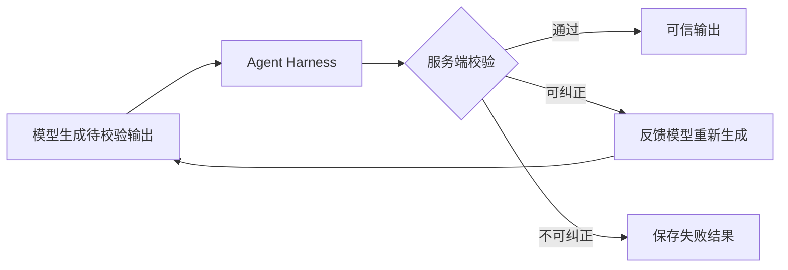

**目录**

- [一、校验](#一校验)
  - [1. 事实校验](#1-事实校验)
  - [2. 页面动作校验](#2-页面动作校验)
- [二、异常](#二异常)
  - [1. 异常边界](#1-异常边界)
  - [2. Tool 执行层](#2-tool-执行层)
  - [3. Output 校验层](#3-output-校验层)
  - [4. Agent 执行层](#4-agent-执行层)
  - [5. Run 协调层](#5-run-协调层)
  - [6. 完整异常处理流程](#6-完整异常处理流程)

---

## 一、校验

<span style="color:red">目标</span>：服务端为什么不能直接信任 Agent 的待校验输出，并掌握回答事实与页面动作的两条可信校验链路。</span>

模型生成的 `AgentOutput` 属于**待校验输出**。即使它满足 JSON 结构，也只能说明字段格式正确，不能证明回答中的订单号、金额和状态来自真实业务数据，更不能证明某个页面动作可以安全返回给前端。

因此，Day10 把输出分成两个阶段：

1. 模型生成 `AgentOutput`，表达回复内容和页面动作意图；
2. 服务端读取当前 Run 的工具证据，生成 `ValidatedAgentOutput`。

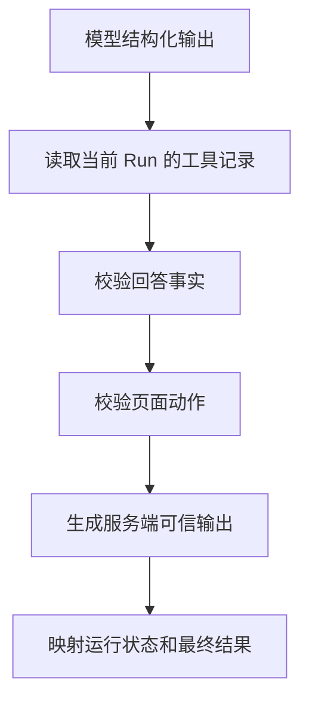

### 1. 事实校验

<span style="color:red">目标</span>：保证回答中的**业务编号、数字和状态**都能在当前 Run 的**成功工具结果**中找到依据。

结构化输出只能解决“模型是否按照约定返回字段”的问题，**不能解决“字段内容是否真实”的问题**。

例如：

```text
模型回答：
订单 ORDER_001 当前已发货，总金额为 399 元。

真实工具结果：
订单 ORDER_001 当前待发货，总金额为 899.00 元。
```

虽然订单号正确，但“已发货”和“399”都没有工具证据，不能直接返回给用户。

```text
结构正确：reply_type、reply_content 等字段完整
语言通顺：回答符合自然语言表达
业务真实：订单号、金额、状态来自本次成功查询
```

生产环境真正需要的是第三层。大模型具有生成能力，可能根据上下文补全一个看似合理但并不存在的金额或状态。服务端必须把真实业务系统返回的数据作为最终依据。

采用**“允许模型组织语言，限制模型创造业务事实”**的原则：

- 普通解释性文本可以由模型生成；
- 订单号、商品号、售后编号需要工具支持；
- 金额、价格、库存和数量需要工具支持；
- 订单、物流和售后状态需要工具支持。

#### 1.1 校验依据

<span style="color:red">目标</span>：理解工具调用记录为什么既是**审计数据**，也是**回答校验的证据**。

Day09 已经在每次工具调用前后保存以下信息：

- 工具名称；
- 模型传入的参数；
- 工具返回的结果；
- 是否成功；
- 失败类型；
- 调用耗时。

Day10 按 `run_id` 读取这些记录，并转换成 `ToolCallSnapshot`，形成当前 Run 的工具证据集合。使用快照有两个目的：

1. **固定当前 Run 的证据范围** 
   只使用相同 `run_id` 下已经保存的工具调用，避免其他 Run 的数据被用于当前回答。

2. **形成统一的校验证据** 
   将工具名称、参数、结果、成功状态和失败类型组合成完整证据，同时供事实校验和页面动作校验使用。

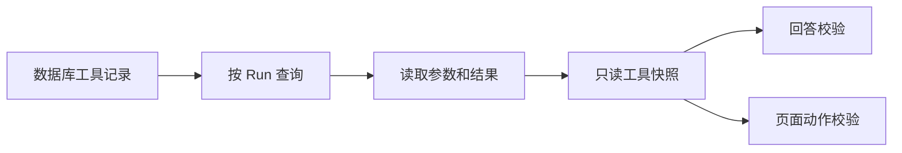


#### 1.2 事实范围

<span style="color:red">目标</span>：**三类关键业务事实**及其**边界**。

当前实现提取**三类事实**：

| 类别 | 典型内容 | 示例 |
|---|---|---|
| 业务编号 | 订单、商品、售后编号 | `ORDER_001`、`PRODUCT_001`、`AS_001` |
| 业务数字 | 金额、价格、库存、数量 | `899 元`、`剩余 5 件` |
| 业务状态 | 订单、物流、售后状态 | `待发货`、`运输中`、`已退款` |

`FactCategory` 使用 `IDENTIFIER`、`NUMBER` 和 `STATUS` 表示这三类事实。

当前实现不会提取所有自然语言中的数字，数字只有带有金额、总价、价格、库存、数量等标签，或者带有元、件、个、台、套等单位时才参与校验。这种设计是有意控制范围：**先覆盖客服回答中风险最高、规则最清晰的事实，再逐步扩展**

#### 1.3 提取事实

<span style="color:red">目标</span>：理解如何把一段**自然语言回答**转换成可逐项比较的**业务事实**。

`FactExtractor` **按以下顺序提取事实**：

1. 使用模式匹配查找订单、商品和售后编号；
2. 统一编号大小写和连接符；
3. 提取带业务标签的数字；
4. 提取带货币或数量单位的数字；
5. 查找预先支持的中文业务状态；
6. 在保持顺序的同时去除重复事实。

例如：

```text
订单 ORDER-001 当前待发货，总金额为 899 元，
其中商品 PRODUCT_001 共 1 件。
```

会得到：

```text
业务编号：ORDER_001
业务编号：PRODUCT_001
业务数字：899
业务数字：1
业务状态：待发货
```

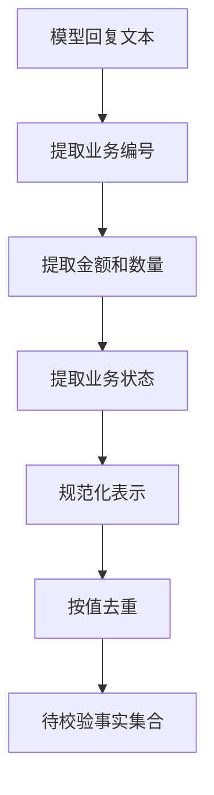

提取阶段只回答“回复中出现了哪些关键事实”，还不会判断事实是否正确。

#### 1.4 整理证据

<span style="color:red">目标</span>：把嵌套的**工具参数和结果**整理成可以统一比较的**证据集合**。

工具结果可能包含字典、列表和多层嵌套结构：

```json
{
  "id": "ORDER_001",
  "status": "pending_shipment",
  "total_amount": "899.00",
  "items": [
    {
      "product_id": "PRODUCT_001",
      "quantity": 1
    }
  ]
}
```

校验器递归读取成功工具调用中的两部分数据：

```text
工具参数 arguments
工具结果 result.data
```

**工具参数也属于证据。**例如 `get_order(order_id="ORDER_001")` 成功后，参数可以证明本次调用查询的是哪个订单；结果数据则证明订单的金额、状态和商品项。

读取到的标量值会进入两个集合：

- 文本证据集合：用于比较编号和状态；
- 数字证据集合：用于比较金额、库存和数量。

文本会统一 Unicode 宽窄字符、大小写以及 `-`、`_` 分隔符。数字使用 `Decimal` 比较，所以回答中的 `899` 可以与工具结果中的 `"899.00"` 匹配。

#### 1.5 匹配证据

<span style="color:red">目标</span>：理解不同事实为什么需要采用不同的**等价比较规则**。

**三类事实的匹配方式不同：**

```text
业务编号 → 规范化后进行文本匹配
业务数字 → 转成 Decimal 后进行数值匹配
业务状态 → 同时匹配中文标签和服务端状态编码
```

例如：

```text
ORDER-001       等价于 ORDER_001
899             等价于 899.00
待发货          等价于 pending_shipment
```

**状态需要建立中文标签和服务端编码之间的映射**，是因为模型通常使用“待发货”回答用户，而电商服务返回的可能是 `pending_shipment`。

`FactChecker.get_unsupported_facts()` 最终只返回无法匹配的事实。调用方不需要知道内部如何提取和归一化，只需要判断返回集合是否为空。

#### 1.6 识别无依据内容

<span style="color:red">目标</span>：在发现模型引用了工具中不存在的**业务事实**时，生成**可识别、可纠正的校验错误**。

如果所有事实都能匹配，原始回答继续进入页面动作校验。如果存在不受支持的事实，则抛出稳定错误：

```text
错误码：UNSUPPORTED_FACT
错误消息：回复中的业务事实缺少工具支持：399、已发货
```

**稳定错误码用于程序判断，具体错误消息用于日志和下一轮模型纠正。**不能只返回模糊的“回答错误”，否则模型不知道应该删除或修改哪些内容。

这里不会立即把整个 Run 标记为失败，因为“模型第一次回答引用了错误事实”属于可能通过重新生成修复的输出问题。

#### 1.7 生成安全回答

<span style="color:red">目标</span>：根据**业务失败、服务失败和契约失败**选择不同的**安全降级方式**。

事实校验前，回答校验器会先查看本次 Run 的业务工具调用结果。

**当业务工具全部失败时，分为两种情况：**

第一种是业务系统明确返回的业务失败，例如：

```text
订单尚未产生物流信息
没有找到该订单的售后记录
```

这类结果本身是可信业务结论。服务端使用最后一条业务失败消息生成 `ANSWER`，同时清除转人工请求和页面动作请求。

第二种是技术或数据契约失败，例如：

```text
电商服务连接失败
请求超时
返回字段不符合约定
```

这时无法确认真实业务状态。服务端生成固定的 `DECLINE`：

```text
暂时无法取得可靠的订单、商品、物流或售后信息，
因此现在不能确认结果，请稍后重试。
```

如果当前 Run 中同时存在成功和失败的业务调用，则**只允许成功调用支持回答事实**，不会让失败结果污染证据集合。

#### 1.8 完整流程

<span style="color:red">目标</span>：串联**工具快照、失败降级、事实提取和证据匹配**的完整顺序。

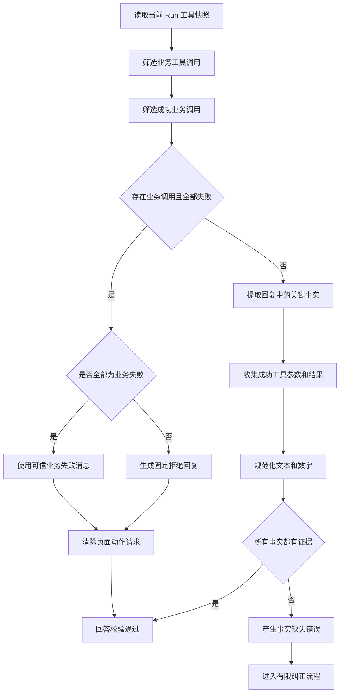

**这条链路保证：**

- 失败工具不能支持业务事实；
- 技术失败不会被解释成业务结论；
- 业务系统明确返回的“无数据”可以安全回答；
- 模型引用错误事实时有机会根据证据重新生成。

### 2. 页面动作校验

<span style="color:red">目标</span>：保证返回给前端的**页面动作**来自**服务端白名单**，并且具体业务对象已经由成功工具调用确认。

页面动作会影响用户下一步操作，比普通文本具有更高风险。**模型可以表达“建议用户去取消订单”，但不能直接决定前端地址，也不能为未经查询的订单生成操作入口。**

如果允许模型直接返回 URL，可能出现：

- 跳转到不存在的页面；
- 拼接错误订单编号；
- 生成服务端未允许的操作；
- 将一个用户提供但未确认的编号直接写入操作地址；
- 在工具查询失败后仍返回取消或售后入口。

因此，模型只返回页面动作请求：

```json
{
  "action_code": "CANCEL_ORDER",
  "resource_id": "ORDER_001"
}
```

服务端校验通过后才生成前端页面动作：

```json
{
  "label": "前往取消订单",
  "description": "进入订单页面核对状态并确认取消",
  "href": "/me/orders/ORDER_001/cancel"
}
```

**模型负责表达意图，服务端负责授权动作、验证资源并构建地址。**

#### 2.1 区分请求与结果

<span style="color:red">目标</span>：区分模型可以提出的**最小意图**与前端可以执行的**可信结果**。

`PageActionRequest` 属于模型输出协议，只包含：

- `action_code`：模型希望引导用户执行的动作；
- `resource_id`：具体订单动作引用的订单编号。

`PageAction` 属于服务端可信输出，只包含：

- `label`：前端按钮文案；
- `description`：动作说明；
- `href`：服务端构建的页面地址。


**两层模型避免模型同时控制“做什么”和“跳到哪里”。**

#### 2.2 建立动作目录

<span style="color:red">目标</span>：把**允许的动作、展示文案和路径模板**集中在**服务端维护**。

服务端动作目录当前允许：

| 动作 | 是否需要订单编号 | 页面用途 |
|---|---:|---|
| 查看订单列表 | **否** | 进入个人订单列表 |
| 查看订单详情 | 是 | 查看订单状态和可用操作 |
| 取消订单 | 是 | 进入取消确认页 |
| 修改地址 | 是 | 进入地址修改页 |
| 申请售后 | 是 | 进入售后申请页 |
| 查看售后进度 | 是 | 查看订单售后记录 |

每个动作定义保存动作编码、固定文案、路径模板和资源类型。**模型不能在动作目录之外创造新的动作。**

集中目录还有两个好处：

1. 前端路径变化时只修改服务端定义；
2. 文案和路径不会被模型提示注入影响。

#### 2.3 定义动作要求

<span style="color:red">目标</span>：在待校验输出进入**业务校验**前，先拒绝明显不合法的**字段组合**。

页面动作请求首先经过结构规则：

```text
查看订单列表 → 不允许携带 resource_id
具体订单动作 → 必须携带 resource_id
未知动作编码 → 直接拒绝
额外字段       → 直接拒绝
```

这层规则回答的是“字段组合是否合法”，**还不能证明订单真实存在。**

例如：

```json
{
  "action_code": "CANCEL_ORDER",
  "resource_id": "ORDER_999"
}
```

结构上是合法的，但只有当前 Run 成功调用订单详情工具确认 `ORDER_999` 后，才能生成页面动作。

#### 2.4 查找动作证据

<span style="color:red">目标</span>：明确具体订单动作必须满足的**成功工具证据条件**。

订单列表页不关联具体业务对象，可以直接由服务端目录生成。

**具体订单动作必须同时满足三个条件：**

1. 当前 Run 调用过订单详情工具；
2. 该工具调用明确成功；
3. 工具参数中的订单编号与动作请求一致。

```text
页面动作：取消 ORDER_001

有效证据：
get_order(order_id="ORDER_001") 且 success=true

无效证据：
get_order(order_id="ORDER_002") 且 success=true
get_order(order_id="ORDER_001") 且 success=false
list_orders() 中曾经出现 ORDER_001
```

当前规则要求订单详情工具，是因为具体订单页面动作需要对目标订单做明确确认。**订单列表只能说明用户可能拥有该订单，不能证明详情查询已经成功完成。**

#### 2.5 校验资源编号

<span style="color:red">目标</span>：避免**大小写和连接符差异**造成误判，同时禁止服务端**猜测资源编号**。

比较前会对订单编号执行有限规范化：

```text
去除首尾空格
统一为大写
将连接符 - 转换为 _
```

所以 `order-001` 可以与 `ORDER_001` 匹配。

**规范化不是模糊搜索，也不会创造编号。**`ORDER_001` 与 `ORDER_002` 仍然是两个不同订单。

如果没有找到匹配的成功订单详情调用，则产生：

```text
错误码：UNVERIFIED_ACTION_RESOURCE
错误消息：页面动作引用的订单未经工具确认：ORDER_001
```

该错误允许进入模型纠正，让模型删除页面动作，或者基于已经确认的订单重新生成。

#### 2.6 生成可信动作

<span style="color:red">目标</span>：使用**服务端固定定义**生成**展示文案和安全页面地址**。

校验通过后，**服务端从动作目录取得定义**，并执行两步操作：

1. 对资源编号进行 URL 路径编码；
2. 将编码后的编号填入固定路径模板。

例如：

```text
动作编码：CANCEL_ORDER
资源编号：ORDER_001
路径模板：/me/orders/{resource_id}/cancel

最终地址：/me/orders/ORDER_001/cancel
```

**返回给前端的结果不再包含动作编码，而是可以直接展示的 `label`、`description` 和 `href`。**

#### 2.7 统一校验

<span style="color:red">目标</span>：先**校验回答**，再校验回答中保留下来的**页面动作请求**。

统一输出校验器**按照固定顺序执行**：

1. 根据 `run_id` 读取工具快照；
2. 校验工具失败降级和回答事实；
3. 从降级后的回答中读取页面动作请求；
4. 校验并生成可信页面动作；
5. 合并为 `ValidatedAgentOutput`。

#### 2.8 完整流程

<span style="color:red">本节目标</span>：串联**结构约束、服务端目录、工具证据**和最终页面动作生成过程。

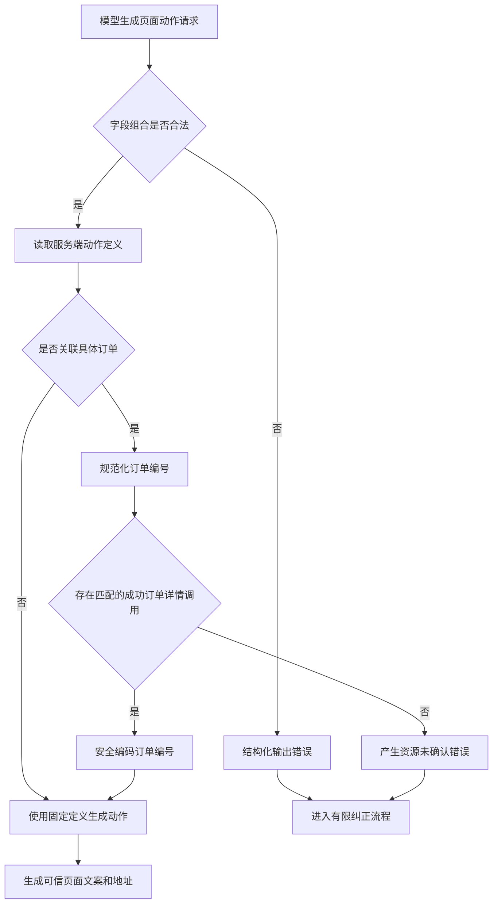

最终输出不再是“模型建议的页面动作”，而是**“经过服务端白名单和工具证据验证的页面动作”**。

---

## 二、异常

<span style="color:red">本章目标</span>：从工具调用、输出校验、有限纠正到运行失败持久化的分层异常处理机制。

异常治理的目标不是把所有异常都捕获后返回同一句话，而是先判断异常发生在哪一层、是否可以恢复、应该告诉模型什么、应该告诉用户什么，以及最终需要保存什么。

### 1. 异常边界

<span style="color:red">目标</span>：建立**四层异常边界**和**三组错误码**的整体视图，理解异常如何从底层向上层传播。

下面三种情况都表现为“没有得到正常答案”，但**处理方式完全不同**：

```text
订单没有物流信息       → 可信业务结果，可以直接回答
电商服务连接失败       → 内部服务故障，不能回答业务状态
模型把 899 回答成 399  → 输出错误，可以让模型重新生成
```

如果不分类：

- 业务上的“没有数据”可能被错误地当成系统故障；
- 服务故障可能被模型误认为业务结论；
- 可纠正的模型错误会直接导致整次 Run 最终失败；
- 真正的程序异常可能被反复重试并掩盖。

问题在最接近来源的位置被识别，再转换成上层能够理解的稳定语义。底层不越权决定 Run 终态，上层也不重新猜测底层技术细节。

#### 1.1 四层职责

<span style="color:red">目标</span>：掌握 **Tool 执行层、Output 校验层、Agent 执行层和 Run 协调层**各自负责的问题。

**Tool 执行层**把工具失败转换成安全 `ToolResult`；**Output 校验层**检查结构、事实和页面动作；**Agent 执行层**负责模型调用、有限纠正和调用上限；**Run 协调层**保存最终失败状态并返回统一事件。

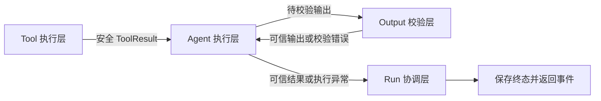

#### 1.2 三组错误码

<span style="color:red">目标</span>：区分 **CorrectableErrorCode、TerminalErrorCode 和 ToolFailureCode**，避免**三套协议混用**。

三组错误码不属于同一层，它们分别回答三个问题：

- **`CorrectableErrorCode`：待校验输出哪里不可信？** 
  包含 `MODEL_OUTPUT_INVALID`、`UNSUPPORTED_FACT`、`UNVERIFIED_ACTION_RESOURCE`。这类错误由 `AgentOutputValidationError` 携带，用**于判断是否让模型重新生成**。

- **`TerminalErrorCode`：当前 Run 为什么无法继续？** 
  包含 `MODEL_CALL_FAILED`、`OUTPUT_VALIDATION_FAILED`、`AGENT_EXECUTION_FAILED`。这类错误由 `AgentExecutionError` 携带，并交**给协调器保存失败状态**。

- **`ToolFailureCode`：工具执行层生成了哪种统一失败结果？** 
  包含 `TOOL_CALL_FAILED`、`INVALID_TOOL_RESULT`，保存在 `ToolResult.code` 中并返回模型。业务服务正常返回失败时不使用这两个代码，而是保留 Ecommerce Service 的业务码，例如 `LOGISTICS_NOT_AVAILABLE`。

`ToolFailureCode` 表示**具体失败代码**，`ToolFailureType` 则表示**失败性质**：

| 失败类型 | 含义 | 示例 |
|---|---|---|
| `BUSINESS` | 业务服务明确返回的正常失败 | 尚未产生物流信息 |
| `SERVICE_CALL` | 调用业务服务时发生技术异常 | 连接失败、超时 |
| `CONTRACT` | 返回数据不符合约定 | 字段缺失、类型错误 |

因此，三组错误码分别服务于**输出纠正、Run 终止和工具失败结果**，不能互相替代。

| 错误码类型 | 所属层 | 主要载体 | 核心作用 | 是否触发输出纠正 | 最终处理 |
|---|---|---|---|---|---|
| `CorrectableErrorCode` | Output 校验层 | `AgentOutputValidationError` | 描述待校验输出中的可纠正问题 | 是 | 在次数上限内让模型重新生成，次数耗尽后终止 Run |
| `TerminalErrorCode` | Agent 执行层 | `AgentExecutionError` | 描述当前 Run 无法继续的原因 | 否 | 交给协调器保存 `FAILED` 状态 |
| `ToolFailureCode` | Tool 执行层 | `ToolResult.code` | 描述工具执行层生成的统一失败结果 | 否 | 保存调用记录并返回模型，由模型生成安全回复 |

#### 1.3 异常传播方向

<span style="color:red">目标</span>：理解具体失败如何逐层转换成**稳定语义**，并始终沿**工具、校验、执行、协调**方向向上传播。

三类失败沿不同路径传播：

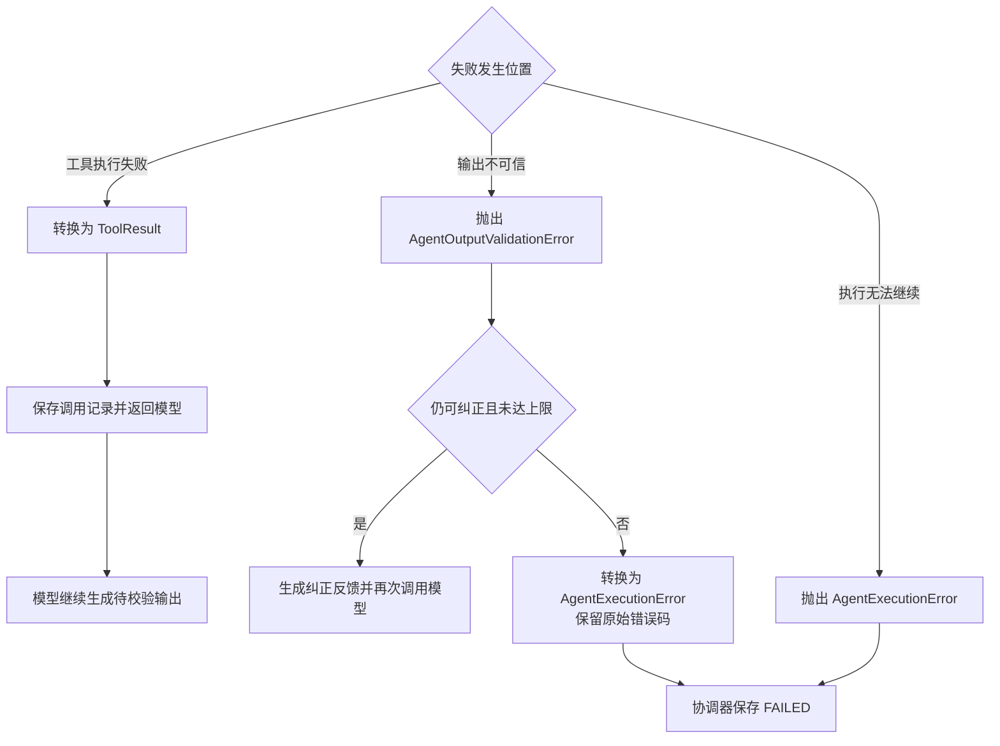

工具失败是**返回给模型的结构化结果**，不会直接终止 Run；输出校验失败先尝试有限纠正；只有无法继续执行的错误，才由 `AgentExecutionError` 交给协调器保存为 `FAILED`。

整个传播过程遵守同一原则：**下层负责把原始失败转换成稳定语义，上层负责纠正、终止或持久化，任何一层都不越权处理。**

### 2. Tool 执行层

<span style="color:red">目标</span>：把 AI Service 调用 Ecommerce Service 时的**三类失败**统一保存并安全返回模型，同时排除**不可信证据**。

#### 2.1 三种工具失败

<span style="color:red">目标</span>：使用相同模板区分 **SERVICE_CALL、BUSINESS 和 CONTRACT** 三种**工具失败**。

AI Service 的工具调用 Ecommerce Service 后，只有三种失败情况。

**第一种：调用过程直接抛出异常。**

触发条件：连接失败、请求超时或 HTTP 请求异常。

统一结果：

```json
{
  "success": false,
  "code": "TOOL_CALL_FAILED",
  "message": "暂时无法取得可靠的业务数据",
  "data": null,
  "failure_type": "SERVICE_CALL"
}
```

含义：业务服务调用失败，没有取得可用业务响应。原始异常只记录到服务端日志。

**第二种：调用正常完成，但业务结果为 `success=false`。**

触发条件：Ecommerce Service 明确返回业务失败，例如订单尚未产生物流信息。

统一结果：

```json
{
  "success": false,
  "code": "LOGISTICS_NOT_AVAILABLE",
  "message": "订单尚未产生物流信息",
  "data": null,
  "failure_type": "BUSINESS"
}
```

含义：调用过程正常，这是业务服务明确返回的可信业务结论。

**第三种：调用正常返回，但响应数据不符合契约。**

触发条件：外层结果不符合统一 `ToolResult`，或者 `success=true` 时的 `data` 不符合当前工具的业务模型。

统一结果：

```json
{
  "success": false,
  "code": "INVALID_TOOL_RESULT",
  "message": "业务工具返回的数据不符合约定",
  "data": null,
  "failure_type": "CONTRACT"
}
```

含义：业务服务已经返回响应，但字段缺失、类型错误或结构变化导致响应不可使用，原始无效数据不会保留在 `data` 中。

#### 2.2 统一失败结果

<span style="color:red">目标</span>：理解三类工具失败为什么都要转换成**结构一致、安全可见的 ToolResult**。

统一结果固定包含 `success=false`、稳定 `code`、安全 `message`、`data=null` 和 `failure_type`。其中服务调用失败使用 `TOOL_CALL_FAILED`，契约失败使用 `INVALID_TOOL_RESULT`，业务失败保留 Ecommerce Service 给出的业务码与安全消息。

字段职责如下：

- `success`：是否得到成功业务数据；
- `code`：稳定结果编码；
- `message`：可以安全提供给模型的说明；
- `data`：成功时的业务数据，失败时固定为 `null`；
- `failure_type`：失败原因分类。

**统一的是失败外壳，而不是抹平失败性质。**服务端仍根据 `BUSINESS`、`SERVICE_CALL`、`CONTRACT` 选择不同的证据和降级策略。

#### 2.3 保存并返回模型

<span style="color:red">目标</span>：清晰区分**模型能够看到的工具结果**与**服务端能够采信的业务证据**。

三种工具失败虽然原因不同，但后续都经过三个阶段。

**模型可见**表示安全 `ToolResult` 会进入完整消息轨迹，模型能够读取错误码、消息和失败类型。**服务端可信**表示结果能够支持回答事实或页面动作；所有 `success=false` 结果都不具备这种资格。

**第一阶段：保存记录。**

统一执行器保存本次工具的参数、失败结果、失败类型和耗时。保存记录是为了后续审计、监控和服务端校验。

**第二阶段：通知模型。**

统一执行器把安全 `ToolResult` 返回模型，让模型知道本次查询没有取得成功数据。返回内容不包含原始异常和无效业务数据。

模型收到失败结果后，可以组织回复，也可以决定再次调用工具，但不会由框架自动重试，并且仍然受工具调用次数限制。

**第三阶段：服务端决定最终结果。**

模型能看到工具结果，不代表服务端会信任该结果。回答校验器按照以下规则处理：

```text
没有调用业务工具
→ 不进入工具失败降级
→ 按普通输出继续校验

调用过业务工具，并且至少有一个 success=true
→ 只使用成功调用校验回答事实

调用过业务工具，并且所有调用都是 success=false
→ 继续判断失败类型

    全部属于 BUSINESS
    → 使用最后一条可信业务失败消息回答

    存在 SERVICE_CALL 或 CONTRACT
    → 生成固定拒绝回复，说明暂时无法确认业务结果
```

所有 `success=false` 的结果都不能支持回答事实和页面动作。

因此，这一流程可以归纳为：

```text
工具失败
→ 保存失败记录
→ 返回安全结果给模型
→ 服务端根据成功证据和失败类型决定最终回复
```

**模型负责理解失败信息并生成待校验回复，服务端负责决定哪些数据可信以及最终能否返回。**

#### 2.4 排除无效证据

<span style="color:red">目标</span>：根据是否调用业务工具、是否存在**成功调用**以及**失败类型**选择证据与降级策略。

没有业务工具调用时，不进入工具失败降级；至少存在一次成功调用时，只有成功结果能够进入证据集合；调用过但全部失败时，全为 `BUSINESS` 就使用最后一条业务消息，否则返回固定 `DECLINE`。

回答事实可以使用成功业务调用中的数据，页面动作还要进一步满足动作规则，例如具体订单动作必须存在订单编号一致的成功 `get_order` 调用。

失败记录可以保存、可以被模型看到，但不能污染证据集合。

#### 2.5 工具失败流程

<span style="color:red">目标</span>：用一条流程展示**三种工具失败**及其共同的**后续处理**。

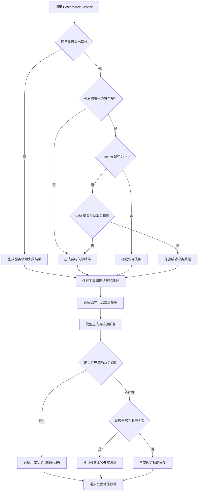

### 3. Output 校验层

<span style="color:red">目标</span>：把**结构化输出、事实和页面动作问题**转换成准确错误码，并隔离**校验器自身的未知失败**。

#### 3.1 处理输出格式错误

<span style="color:red">目标</span>：把结构化输出解析时的 **Pydantic ValidationError** 转换成 **MODEL_OUTPUT_INVALID**。

待校验输出缺少字段、类型错误、枚举非法或字段组合不满足 `AgentOutput` 协议时，Pydantic 会抛出 `ValidationError`。该异常准确转换为 `CorrectableErrorCode.MODEL_OUTPUT_INVALID`。

#### 3.2 处理事实校验错误

<span style="color:red">目标</span>：在待校验回答包含成功工具结果无法支持的**业务事实**时产生 **UNSUPPORTED_FACT**。

事实校验只使用 `success=true` 的工具调用形成证据。发现价格、订单状态或物流状态等内容没有成功证据支持时，产生 `CorrectableErrorCode.UNSUPPORTED_FACT`。

#### 3.3 处理页面动作错误

<span style="color:red">目标</span>：在页面动作引用未经成功工具结果确认的**资源**时产生 **UNVERIFIED_ACTION_RESOURCE**。

页面动作只能引用成功工具调用已经确认的业务资源。资源仅出现在用户文本、待校验输出或失败工具结果中时，产生 `CorrectableErrorCode.UNVERIFIED_ACTION_RESOURCE`。

#### 3.4 处理校验内部失败

<span style="color:red">目标</span>：把**已知规则错误**与**校验器自身故障**分开，避免未知异常被误判为可纠正问题。

三种 `CorrectableErrorCode` 保留原错误码向上传播；事实或动作校验过程中出现的其他未知异常统一转换为 `TerminalErrorCode.OUTPUT_VALIDATION_FAILED`，因为重新生成文本无法修复校验器故障。

已知 `AgentOutputValidationError` 原样抛给 Agent 执行层，由执行策略判断是否纠正。

#### 3.5 输出校验流程

<span style="color:red">目标</span>：用流程展示**结构、事实、动作校验**以及**校验器内部失败**的准确分流。

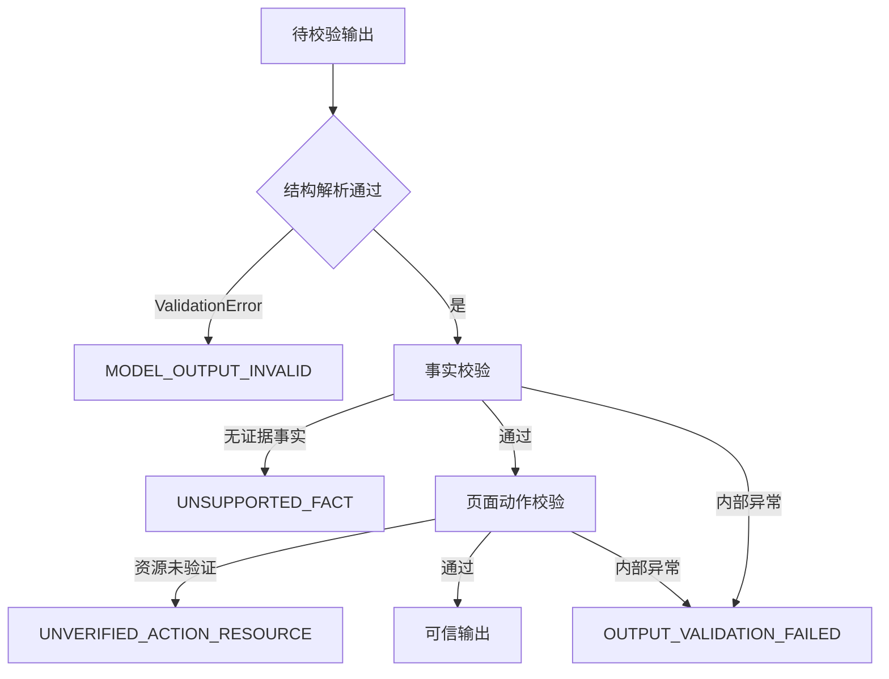

### 4. Agent 执行层

<span style="color:red">目标</span>：管理**模型调用、可纠正错误的有限重生成、纠正耗尽**和**工具调用总量边界**。

#### 4.1 处理模型调用失败

<span style="color:red">目标</span>：将模型服务或 Agent 调用中的**未知异常**统一转换成**稳定执行错误**。

Agent 调用边界会保留工具超限异常，让主循环生成固定安全结果。**其他模型调用异常统一转换为：**

```text
TerminalErrorCode.MODEL_CALL_FAILED
```

**它不进入输出纠正**，因为模型服务调用本身已经失败，再要求同一个执行流程重新组织答案没有可靠基础。

#### 4.2 判断是否允许纠正

<span style="color:red">目标</span>：只让 **CorrectableErrorCode** 且仍有**剩余次数**的输出问题进入纠正流程。

执行层只会把携带 `CorrectableErrorCode` 的 `AgentOutputValidationError` 交给纠正流程，并继续判断是否还有剩余纠正次数。

`TerminalErrorCode` 会直接终止当前 Run。`ToolFailureCode` 不属于输出校验异常，它会随安全 `ToolResult` 返回模型，由 Agent 继续正常推理，但不会自动触发服务端输出纠正。

#### 4.3 执行有限纠正

<span style="color:red">目标</span>：在保留**完整消息轨迹**的前提下追加**校验反馈**，并限制重新生成次数。

执行器根据错误原因构建明确反馈，说明上一轮未通过的具体问题，并要求模型只使用成功工具结果、删除无依据事实和未经确认的页面动作。反馈以系统消息追加，不伪造新的用户意图。

纠正时保留完整 `messages`，包括原始用户问题、模型工具调用、工具结果、上一轮生成过程和服务端反馈。这样模型可以直接复用已有成功证据，不必重新开始 Run。默认 `correction_limit=1`，即**首次生成加最多一次纠正**

#### 4.4 处理纠正次数耗尽

<span style="color:red">目标</span>：在最后一次待校验输出仍未通过时**终止纠正**，并保留最能说明**根因的错误码**。

纠正次数耗尽后，输出校验错误转换成 `AgentExecutionError`。其 `code` 可以继续保留原始 `CorrectableErrorCode`.

#### 4.5 处理工具调用超限

<span style="color:red">目标</span>：在**工具调用失控**时停止 Agent，并返回不依赖业务事实的**固定安全回复**。

模型可能因业务结果暂不可用、服务持续失败或在多个工具之间循环而反复调用。 Agent 因此限制一次 Run 中**所有工具的总调用次数**，默认上限为 8。

达到上限时抛出 `ToolCallLimitExceededError`。执行器直接生成固定、可信的 `DECLINE`，不再调用模型，也不进入输出校验。

工具调用超限描述的是整个 Run 的资源边界，**不属于 `ToolFailureCode`，也不会保存为 `FAILED`**。

#### 4.6 Agent 执行流程

<span style="color:red">目标</span>：用流程串联**模型调用、输出校验、有限纠正、纠正耗尽和工具调用超限**。

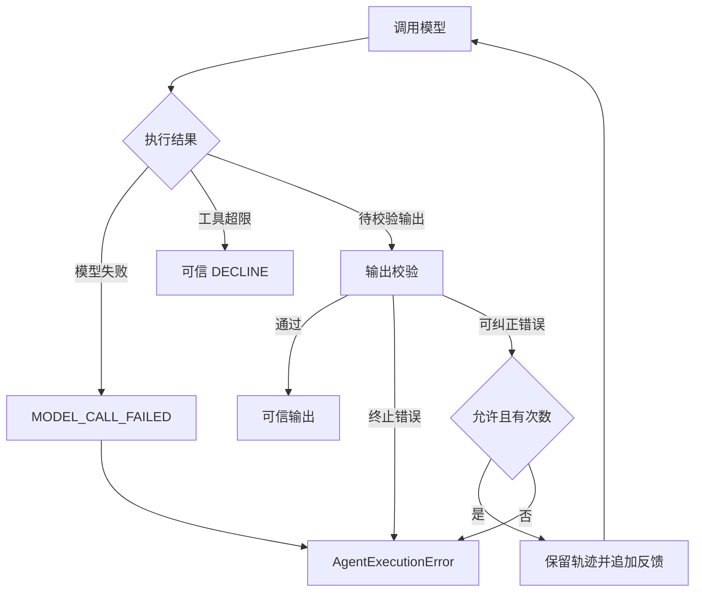

### 5. Run 协调层

<span style="color:red">目标</span>：在最外层区分**已知与未知异常**、保留**稳定错误码**、保存失败终态并返回统一事件。

#### 5.1 区分已知与未知异常

<span style="color:red">目标</span>：保证执行边界之外的**意外异常**不会让 Run 永久停留在**运行中状态**。

**运行协调器捕获最终异常后先判断：**

```text
AgentExecutionError → 使用异常自带的稳定错误码
其他 Exception      → 使用 TerminalErrorCode.AGENT_EXECUTION_FAILED
```

两类异常使用不同日志，便于区分已知执行失败和未知程序失败，但最终共用同一套失败状态保存逻辑。

#### 5.2 保留稳定错误码

<span style="color:red">目标</span>：确保错误经过**多层传播**后仍能表达最初的**可诊断原因**。

已知 `AgentExecutionError` 保留异常自带的 `code`，包括纠正耗尽后的 `CorrectableErrorCode` 和已有 `TerminalErrorCode`。只有未知 `Exception` 才统一使用 `AGENT_EXECUTION_FAILED`。

#### 5.3 保存运行失败状态

<span style="color:red">目标</span>：无论失败发生在哪一层，都为当前 Run 保存**统一终态、错误信息、结果和耗时**。

**运行失败时统一保存：**

```text
state       = FAILED
error       = 原始错误消息
result.code = 稳定错误码
result.message = AI Service 处理失败
latency_ms  = 本次执行耗时
finished_at = 完成时间
```

`run.error` 面向内部排查，`result.message` 面向服务调用方。对外消息不直接暴露原始异常。

**最终状态和监控字段在同一次提交中保存**，调用方收到的是统一响应事件，而不是未处理的内部异常。

#### 5.4 返回统一失败事件

<span style="color:red">目标</span>：让调用方收到**结构一致、安全**且与**落库错误码一致**的失败事件。

协调器保存失败状态后返回统一事件。调用方无需识别内部异常类，也不会看到调用栈、数据库异常或无效工具响应。

### 6. 完整异常处理流程

<span style="color:red">目标</span>：把**四层边界**组合成一条从工具调用到最终事件的**完整异常治理链路**。

#### 6.1 四层协作流程

<span style="color:red">目标</span>：从**工具失败、待校验输出错误**到最终 Run 状态，建立完整的**异常传播视图**。

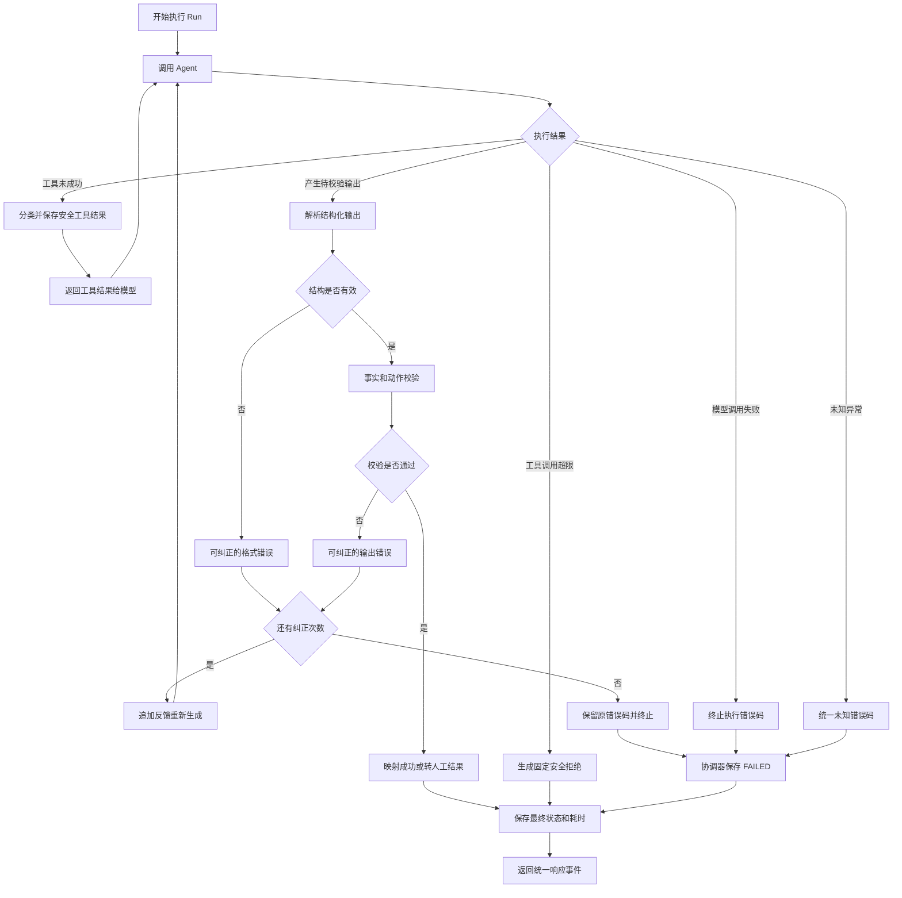

#### 6.2 最终处理结果

<span style="color:red">目标</span>：归纳**四层异常治理**最终形成的**稳定处理结果**。

最终结果只有三类：校验通过后返回可信业务结果；工具调用超限后返回可信 `DECLINE` 且不保存 `FAILED`；执行无法恢复时保存统一 `FAILED` 终态并返回失败事件。

完成 Day10 后，**AI Service 的核心链路从“模型能够回答”升级为：**

```text
模型能够回答
→ 工具数据能够追踪
→ 关键事实能够验证
→ 页面动作能够约束
→ 输出错误能够有限纠正
→ 工具失败能够安全降级
→ 未知异常能够保存终态
```

这就是 Agent Harness 在当前项目中的核心价值：**模型负责生成，业务系统提供事实，服务端规则建立信任，运行协调器保证结果最终可控。**
