# Day11 生产级 Harness 全链路打通

本日目标：把全局提示词、领域 Skill、工具说明、输出协议、中间件、Run 生命周期和运行观测组合成一条完整的 Agent Harness 链路。

Day10 建立了事实校验、页面动作校验和异常治理，但 Agent 仍然一次看到全部业务工具。随着商品、订单、物流、售后和平台规则不断增加，工具选择会越来越困难，领域提示也会相互干扰。

Day11 采用**单 Agent + 动态 Skill + 中间件**完成能力治理：

```text
用户问题
→ 识别领域
→ 加载 Skill
→ 注入领域提示
→ 限制可见工具
→ 查询业务数据
→ 生成结构化输出
→ 服务端校验
→ 保存 Run
→ 管理端观测
```

<span style="color:black"><strong>Prompt 负责说明规则，Skill 负责组织领域能力，中间件负责限制执行范围，Validator 负责建立最终信任。</strong></span>

**目录**

- [一、认识 Harness 全链路](#一认识-harness-全链路)
  - [1. 本章学习目标](#1-本章学习目标)
  - [2. 为什么需要完整 Harness](#2-为什么需要完整-harness)
  - [3. Harness 整体架构](#3-harness-整体架构)
  - [4. 一次请求的完整链路](#4-一次请求的完整链路)
  - [5. 核心组件与代码结构](#5-核心组件与代码结构)
  - [6. 本章实现路线](#6-本章实现路线)
- [二、建立提示与协议体系](#二建立提示与协议体系)
  - [1. 提示与协议整体设计](#1-提示与协议整体设计)
  - [2. 四层约束的协作流程](#2-四层约束的协作流程)
  - [3. Prompt 定义全局行为](#3-prompt-定义全局行为)
  - [4. SkillCatalog 定义领域流程](#4-skillcatalog-定义领域流程)
  - [5. 工具描述定义调用条件](#5-工具描述定义调用条件)
  - [6. 数据模型定义输出协议](#6-数据模型定义输出协议)
  - [7. 提示与协议完整链路](#7-提示与协议完整链路)
- [三、实现动态 Skill 路由](#三实现动态-skill-路由)
  - [1. 动态 Skill 整体设计](#1-动态-skill-整体设计)
  - [2. Skill 路由执行流程](#2-skill-路由执行流程)
  - [3. 建立 Skill 目录](#3-建立-skill-目录)
  - [4. 使用 load_skill 加载领域](#4-使用-load_skill-加载领域)
  - [5. 保存当前 Skill 状态](#5-保存当前-skill-状态)
  - [6. 使用 Agent 一级中间件](#6-使用-agent-一级中间件)
  - [7. 根据 Skill 过滤工具](#7-根据-skill-过滤工具)
  - [8. 动态生成系统提示词](#8-动态生成系统提示词)
  - [9. 在一次 Run 中切换 Skill](#9-在一次-run-中切换-skill)
  - [10. 组装动态 Skill Agent](#10-组装动态-skill-agent)
- [四、完成 Run 闭环与观测](#四完成-run-闭环与观测)
  - [1. Run 闭环整体设计](#1-run-闭环整体设计)
  - [2. Run 完整执行流程](#2-run-完整执行流程)
  - [3. 执行并校验 Agent 输出](#3-执行并校验-agent-输出)
  - [4. 限制工具调用次数](#4-限制工具调用次数)
  - [5. 生成页面动作决策](#5-生成页面动作决策)
  - [6. 确认与取消页面动作](#6-确认与取消页面动作)
  - [7. 统计并保存 Token 用量](#7-统计并保存-token-用量)
  - [8. 提供管理员观测接口](#8-提供管理员观测接口)
  - [9. 前端展示运行详情](#9-前端展示运行详情)
  - [10. 测试单 Skill 与跨 Skill 查询](#10-测试单-skill-与跨-skill-查询)
  - [11. 回顾 Harness 全链路](#11-回顾-harness-全链路)

---

## 一、认识 Harness 全链路

### 1. 本章学习目标

<span style="color:red">目标</span>：建立完整认知，再逐层理解 Harness 中的提示、协议、路由、执行和观测。

本章完成以下能力：

1. 使用四层信息指导模型；
2. 使用 Skill 拆分领域能力；
3. 使用中间件限制工具范围；
4. 使用动态提示词注入当前领域流程；
5. 在一次 Run 中切换多个 Skill；
6. 完成页面动作的两阶段状态流转；
7. 统计 Token 并提供运行观测接口。

最终形成：

```text
表达规则
→ 限制能力
→ 执行业务查询
→ 校验最终结果
→ 保存运行状态
→ 提供审计信息
```

### 2. 为什么需要完整 Harness

<span style="color:red">目标</span>：理解仅有 Prompt、工具或结构化输出为什么都不足以独立保证 Agent 可靠运行。

如果把全部信息写入一个 Prompt，会出现三个问题：

- 全局规则、领域流程和工具细节混在一起；
- 工具数量增加后，模型更容易选错工具。

如果只注册工具，只完成了能力接入：

- 全部工具同时暴露，无法按当前领域收敛能力范围；
- 工具描述只定义单次调用，不定义跨工具的领域处理流程；

```text
注册工具
→ 让模型能够调用

完整 Harness
→ 决定工具何时可见、如何调用
```

如果只使用数据模型，只能保证返回结构合法：

```text
字段存在 ≠ 业务事实真实
动作编码合法 ≠ 页面动作可信
```

因此，生产级 Harness 需要同时回答四个问题：

```text
模型应该遵守什么规则？
当前问题属于哪个领域？
当前允许调用哪些工具？
最终结果是否具有服务端证据？
```

<span style="color:black"><strong>完整 Harness 不是增加一个组件，而是让多个组件各自承担一种稳定职责。</strong></span>

### 3. Harness 整体架构

<span style="color:red">目标</span>：从整体上认识一次 Agent 请求经过的核心层次。

这条链路可以归纳为五层：

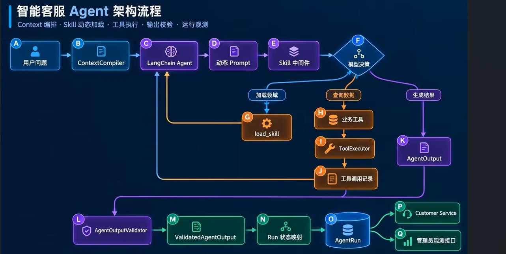

1. **输入层**：编译对话和当前请求；
2. **路由层**：选择 Skill 并限制工具；
3. **执行层**：调用模型和业务工具；
4. **信任层**：校验事实与页面动作；
5. **运行层**：保存状态、Token、耗时和结果。

### 4. 一次请求的完整链路

<span style="color:red">目标</span>：按照执行顺序串联动态 Skill、业务工具、输出校验和 Run 状态。

一次请求按以下顺序运行：

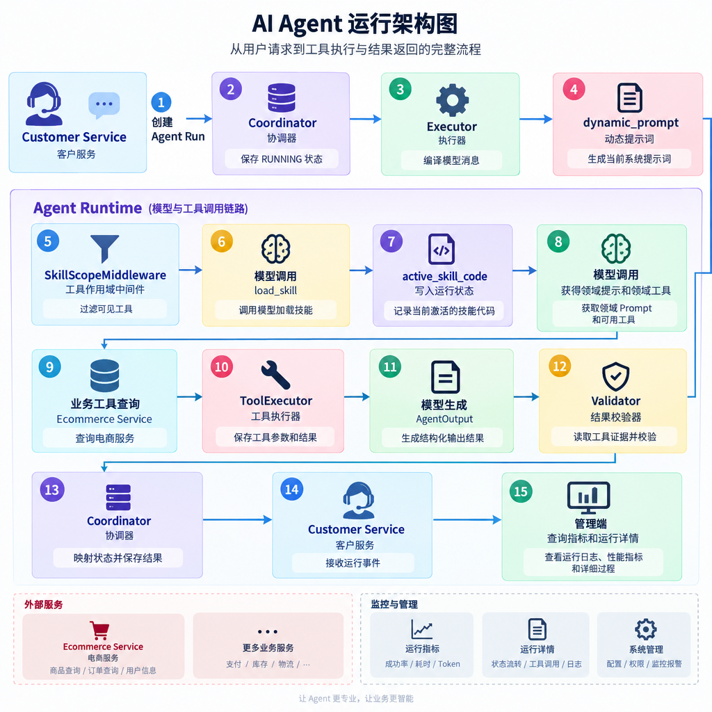

其中，第 4 至第 11 步可以在同一个 `agent.ainvoke()` 中循环多次。模型可以加载 Skill、调用工具、切换 Skill，最后再生成结构化输出。

### 5. 核心组件与代码结构

核心代码分布如下：

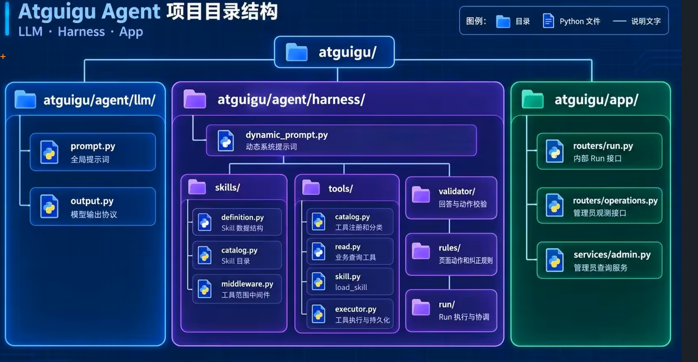

各目录只解决一类问题：

```text
llm       → 模型协议
skills    → 领域能力
tools     → 外部数据
validator → 结果可信
run       → 生命周期
app       → HTTP 接口
```

### 6. 本章实现路线

<span style="color:red">目标</span>：按依赖顺序完成实现，避免先写中间件却没有状态和 Skill 定义。

实现顺序如下：

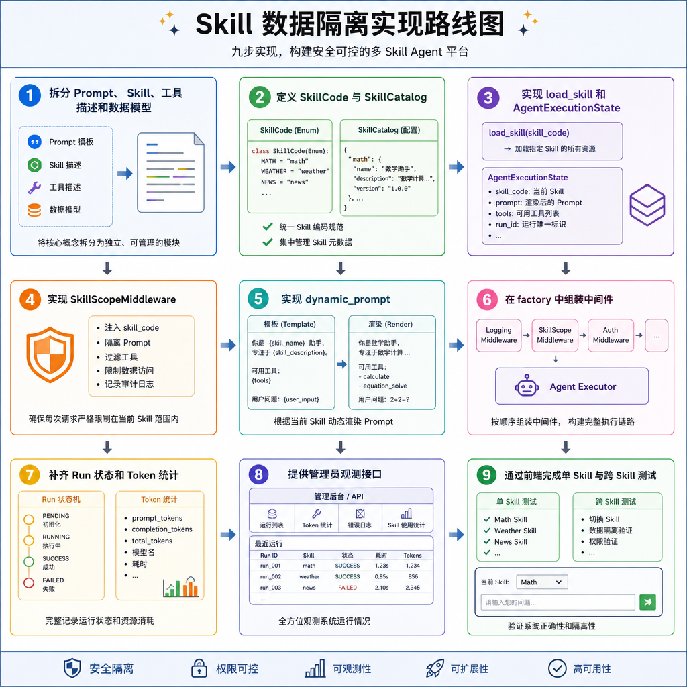

先建立协议，再实现运行机制，最后验证完整链路。

---

## 二、建立提示与协议体系

### 1. 提示与协议

<span style="color:red">目标</span>：先理解四层信息的整体分工，再分别实现每一层。

Agent 需要四层信息：

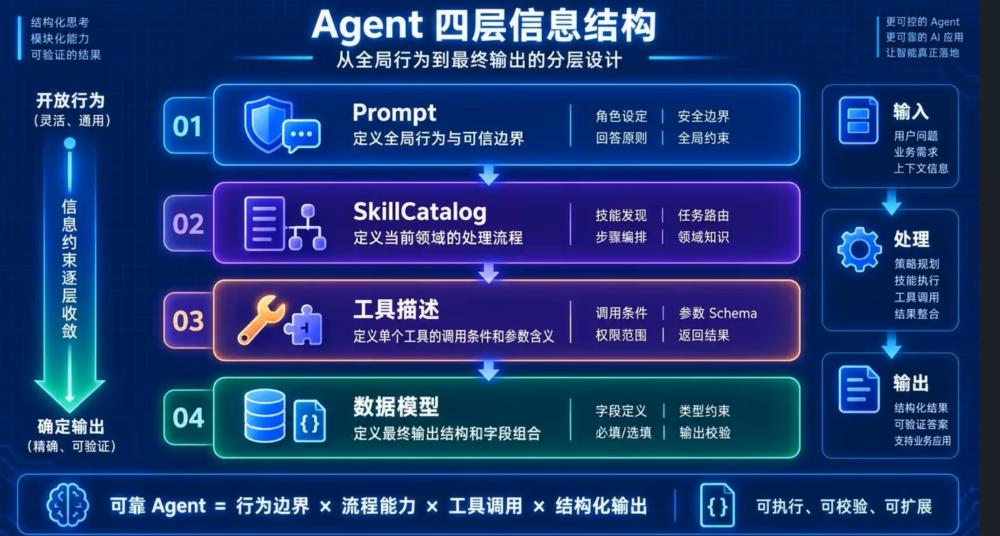

<span style="color:black"><strong>全局规则保持稳定，领域规则按需加载，工具规则靠近实现，输出规则由模型强制校验。</strong></span>

### 2. 四层约束

<span style="color:red">目标</span>：理解四层约束不是重复描述，而是在不同阶段回答不同问题。

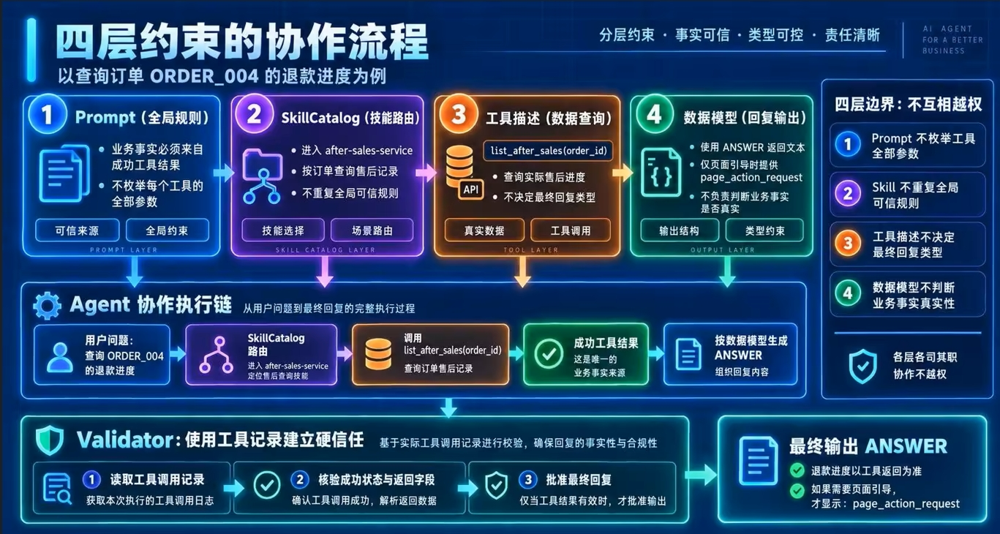

### 3. Prompt 全局行为

<span style="color:red">目标</span>：把跨领域、长期稳定的行为规则集中在 `BASE_PROMPT`。

`prompt.py` 只保存全局规则：

```python
BASE_PROMPT = """你是电商平台的只读智能客服。

一、职责边界
...

二、信息来源与工具结果
...

三、回复决策
...

四、页面引导
...

五、最终回复
...
"""
```

全局 Prompt 负责五类规则：

1. **职责边界**：只处理电商问题，不声称已经执行写操作；
2. **事实来源**：实时业务事实必须来自成功工具结果；
3. **回复决策**：选择回答、澄清、拒绝或转人工；
4. **页面引导**：只在用户明确需要时请求页面动作；
5. **最终回复**：不承诺稍后查询或执行。

这里不写具体 Skill 指导，也不拼接页面地址。原因是：

```text
Skill 会变化
页面路径由服务端维护
全局 Prompt 应保持稳定
```

Prompt 属于行为引导。模型仍可能不遵守，因此后续必须使用中间件和 Validator 建立硬约束。

### 4. Skill 领域流程

<span style="color:red">目标</span>：把商品、订单、物流、规则和售后拆成边界清晰的领域能力。

一个 Skill 包含四项信息：

```python
@dataclass(frozen=True)
class SkillDefinition:
    code: SkillCode
    description: str
    guidance: tuple[str, ...]
    tools: tuple[str, ...]
```

字段职责如下：

- `code`：稳定领域编码；
- `description`：模型选择 Skill 时看到的简短说明；
- `guidance`：Skill 激活后的处理流程；
- `tools`：当前领域允许使用的工具名称。

例如物流 Skill：

```python
SkillDefinition(
    code=SkillCode.LOGISTICS_SERVICE,
    description="具体订单的发货状态、承运公司、运单号和物流轨迹",
    guidance=(
        "查询入口：用户没有提供订单编号时，先使用 list_orders 查询订单列表。",
        "工具选择：订单基础信息使用 get_order，配送进度和物流轨迹使用 get_logistics。",
        "可信依据：物流公司、运单号、状态和轨迹只能来自 get_logistics 的成功结果。",
        "边界处理：物流工具失败或没有结果时不得猜测配送进度。"
    ),
    tools=("list_orders", "get_order", "get_logistics")
)
```

所有 Skill 使用相同 guidance 结构：

```text
查询入口
→ 工具选择
→ 可信依据
→ 边界处理
```

`SkillCatalog` 负责保存和读取定义：

```python
class SkillCatalog:
    def get_skill(self, skill_code: SkillCode) -> SkillDefinition:
        return self.definitions[skill_code]

    def render_index(self) -> str:
        return "\n".join(
            f"- {skill.code}: {skill.description}"
            for skill in self.definitions.values()
        )
```

`render_index()` 只输出编码和描述，用于首次路由；完整 guidance 只在 Skill 激活后注入。

### 5. Tool Call 调用

<span style="color:red">目标</span>：让每个工具准确说明“什么时候调用、需要什么参数、返回什么数据”。

工具描述由两部分组成：

```python
@tool
async def get_order(
    order_id: Annotated[
        str,
        "用户明确提供或订单列表返回的订单编号，例如 ORDER_001"
    ],
    runtime: ToolRuntime[AgentRuntimeContext]
) -> str:
    """
    查询当前用户的一条订单详情。
    用户已经明确订单编号，并询问该订单的状态、金额、
    创建时间或商品信息时调用。
    只读取数据，不取消订单、退款或修改地址。
    """
```

其中：

- docstring 说明调用场景和能力边界；
- `Annotated` 说明参数来源和格式；
- 返回模型说明业务结果；
- `ToolExecutor` 负责执行、校验和保存记录。

**工具描述与 Skill guidance 的区别是：**

```text
Skill guidance → 当前领域如何完成一个用户目标
工具描述       → 当前工具如何完成一个具体查询
```

### 6. BaseModel数据模型

<span style="color:red">目标</span>：使用 Pydantic 定义模型必须返回的字段，并约束字段之间的组合关系。

模型最终返回 `AgentOutput`：

```python
class AgentOutput(BaseModel):
    reply_type: ReplyType
    reply_content: str
    handoff_request: HandoffRequest | None = None
    page_action_request: PageActionRequest | None = None
```

<span style="color:black"><strong>数据模型保证“结构正确”，Validator 继续保证“业务可信”。</strong></span>

### 7. 提示与协议完整链路

<span style="color:red">目标</span>：把 Prompt、Skill、工具描述和数据模型重新组合成一条连续链路。

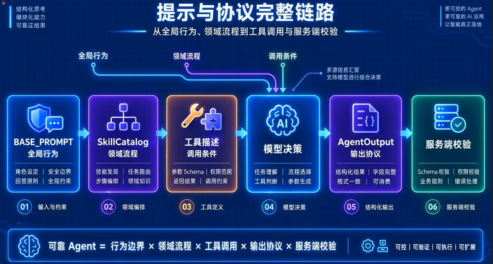

四层设计可以归纳为：

```text
Prompt 管长期规则
Skill 管当前领域
工具描述管单次调用
数据模型管最终结构
```

完成协议分层后，下一步不是继续增加 Prompt，而是使用状态和中间件让这些协议在运行时生效。

---

## 三、实现动态 Skill 路由

### 1. 动态 Skill 整体设计

<span style="color:red">目标</span>：先理解动态 Skill 如何在一个共享 Agent 中按需切换领域能力。

当前方案不是创建多个 Agent，而是创建一个 Agent：

```text
共享模型
+ 全量工具注册
+ 当前 Skill 状态
+ 动态 Prompt
+ 工具过滤中间件
```

运行时只激活一个 Skill：

```text
未加载 Skill
→ 只允许 load_skill

已加载 Skill
→ 允许 load_skill + 当前 Skill 工具
```

需要处理其他领域时，再次调用 `load_skill` 覆盖当前 Skill。

<span style="color:black"><strong>Skill 是能力切片，不是新的 Agent 实例。</strong></span>

### 2. Skill 路由执行流程

<span style="color:red">目标</span>：从整体看Skill 选择、状态更新、提示注入和工具过滤。

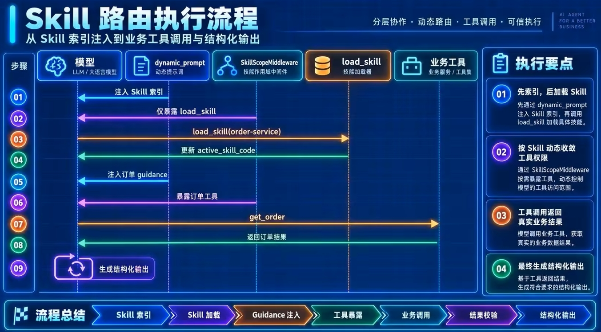

每次模型调用前都会重新执行动态 Prompt 和中间件，因此状态更新可以立即影响下一步模型调用。

### 3. 建立 Skill 目录

<span style="color:red">目标</span>：通过固定目录集中管理可用 Skill，避免模型创造不存在的领域编码。

系统当前定义五个 Skill：

```text
product-service
→ 商品搜索、详情、规格、价格和库存

order-service
→ 订单列表、详情、状态和金额

logistics-service
→ 发货状态、承运公司、运单号和物流轨迹

policy-service
→ 平台规则、服务政策和帮助说明

after-sales-service
→ 用户实际售后记录、状态和进度
```

每个 Skill 同时提供：

```text
路由描述
领域指导
工具白名单
```

Skill 之间需要保持边界清晰。例如：

```text
policy-service
→ 解释平台通用规则

after-sales-service
→ 查询用户实际售后记录
```

这样可以避免把知识内容当作实时业务状态，也避免使用售后记录解释平台通用政策。

### 4. load_skill 加载领域

<span style="color:red">目标</span>：通过工具调用把模型选择的领域写入 Agent 执行状态。

`load_skill` 是未激活 Skill 时唯一可见的工具：

```python
@tool
async def load_skill(
    skill_code: Annotated[
        SkillCode,
        "与当前用户问题最匹配的客服领域技能编码"
    ],
    runtime: ToolRuntime[
        AgentRuntimeContext,
        AgentExecutionState
    ]
) -> Command:
```

它完成三件事：

1. 从 `SKILL_CATALOG` 读取固定定义；
2. 把 Skill 内容作为 `ToolMessage` 返回模型；
3. 使用 `Command` 更新 `active_skill_code`。

```python
return Command(
    update={
        "active_skill_code": skill_code,
        "messages": [
            ToolMessage(
                content=result_json,
                tool_call_id=runtime.tool_call_id
            )
        ]
    }
)
```

`load_skill` 不查询业务数据，也不参与业务事实校验。它只负责切换运行能力。

### 5. 保存当前 Skill 状态

<span style="color:red">目标</span>：单次 Run 内可变化的执行状态与始终不变的运行上下文。

运行上下文保存固定信息：

```python
@dataclass(frozen=True)
class AgentRuntimeContext:
    run_id: str
    conversation_id: str
    user_id: str
    access_token: str
```

执行状态保存运行过程中会变化的信息：

```python
class AgentExecutionState(AgentState[AgentOutput]):
    active_skill_code: NotRequired[SkillCode]
```

两者职责不同：

```text
AgentRuntimeContext
→ 谁在执行、属于哪个 Run、使用哪个令牌

AgentExecutionState
→ 当前执行到哪个 Skill
```

`active_skill_code` 只在本次 `agent.ainvoke()` 中生效。新的 Run 会重新从未加载 Skill 开始。

### 6.  Agent 中间件

<span style="color:red">目标</span>：中间件在模型调用前统一修改请求，不侵入业务工具。

`SkillScopeMiddleware` 继承 `AgentMiddleware`：

```python
class SkillScopeMiddleware(
    AgentMiddleware[
        AgentExecutionState,
        AgentRuntimeContext,
        AgentOutput
    ]
):
```

三个泛型分别描述：

```text
AgentExecutionState
→ 中间件可以读取的 Agent 状态

AgentRuntimeContext
→ 当前 Run 的上下文

AgentOutput
→ Agent 的结构化输出类型
```

中间件实现 `awrap_model_call()`，表示它在每次异步模型调用前包装请求：

```python
async def awrap_model_call(
    self,
    request: ModelRequest[AgentRuntimeContext],
    handler: Callable[..., Awaitable[ModelResponse[AgentOutput]]]
) -> ModelResponse[AgentOutput]:
```

它不直接调用业务服务，只负责调整模型可见的工具和调用设置。

### 7. Skill 过滤工具

<span style="color:red">目标</span>：使用工具可见性建立比 Prompt 更强的领域边界。

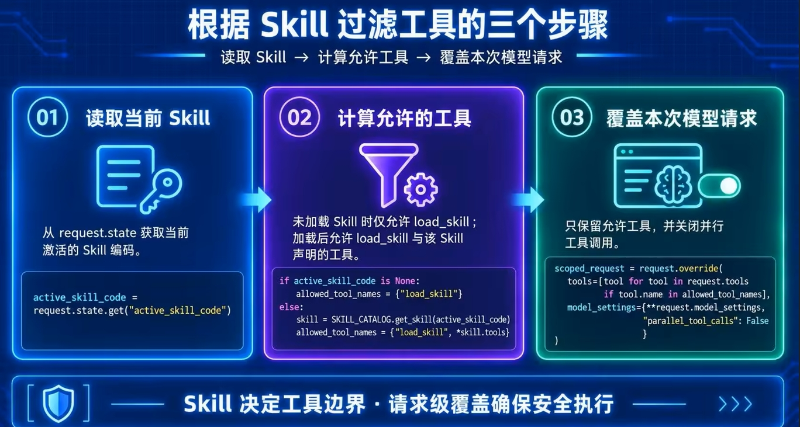

这里形成两个关键约束：

1. 模型看不到当前 Skill 之外的工具；
2. 模型一次只能串行调用一个工具。

```text
Prompt：告诉模型不要越界
中间件：让模型无法越界
```

### 8. 动态提示词

<span style="color:red">目标</span>：根据当前 Skill 在每次模型调用前生成不同的系统提示词。

系统提示词由三部分组成：

```text
BASE_PROMPT
+ 当前 Skill 提示
+ 白名单页面动作
```

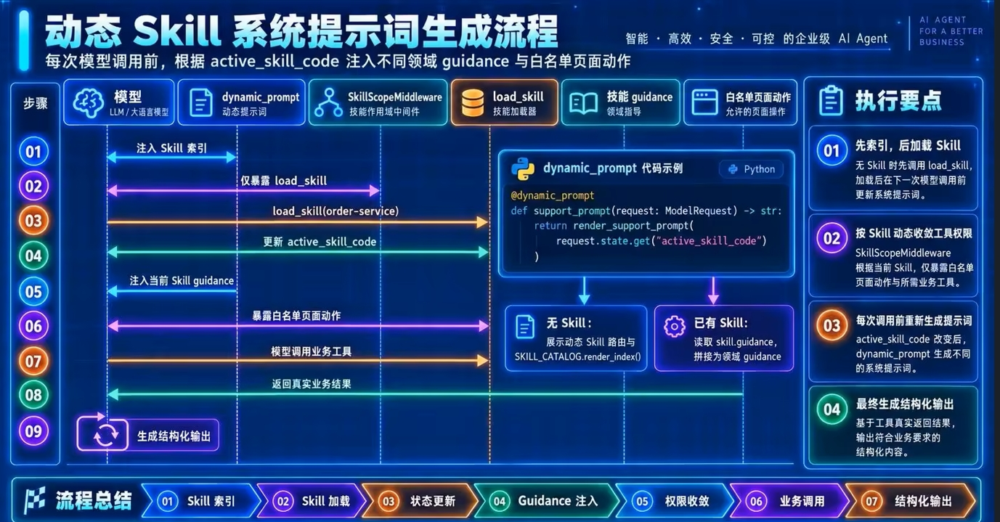

`@dynamic_prompt` 会在每次模型调用前执行，而不是只在 Run 开始时执行一次。这是 Skill 切换后提示词能够同步变化的关键。

### 9.Agent切换 Skill

<span style="color:red">目标</span>：跨领域问题如何在同一个 `ainvoke` 中串行完成。

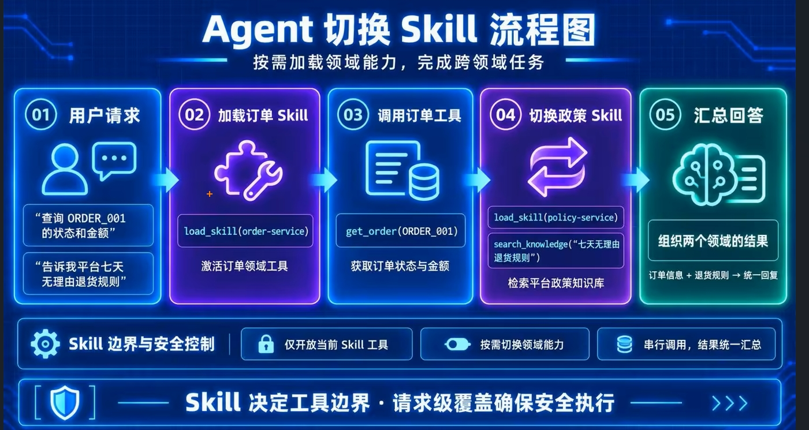

系统始终只开放一个领域的工具，避免多个 Skill 同时扩大工具范围。

### 10. 组装动态 Skill Agent

<span style="color:red">目标</span>：在 Agent 工厂中统一注册工具、状态、输出协议和中间件。

```python
def create_support_agent():
    return create_agent(
        model=ModelAdapter.create_model(),
        tools=TOOL_CATALOG.get_agent_tools(),
        response_format=ToolStrategy(AgentOutput),
        state_schema=AgentExecutionState,
        context_schema=AgentRuntimeContext,
        middleware=[
            support_prompt,
            SkillScopeMiddleware(),
            ToolCallLimitMiddleware(
                run_limit=8,
                exit_behavior="error"
            )
        ],
        name="智能客服专家"
    )
```

组装关系如下：

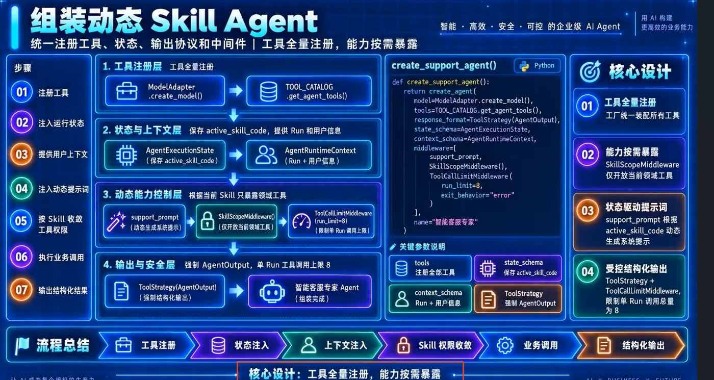

<span style="color:black"><strong>工具全量注册，能力按需暴露，是动态 Skill Agent 的核心设计。</strong></span>

---

## 四、完成 Run 闭环与观测

### 1. Run 闭环整体设计

<span style="color:red">目标</span>： Coordinator、Executor、Validator 和 Mapper 共同完成一次 Run。

四个组件分别负责：

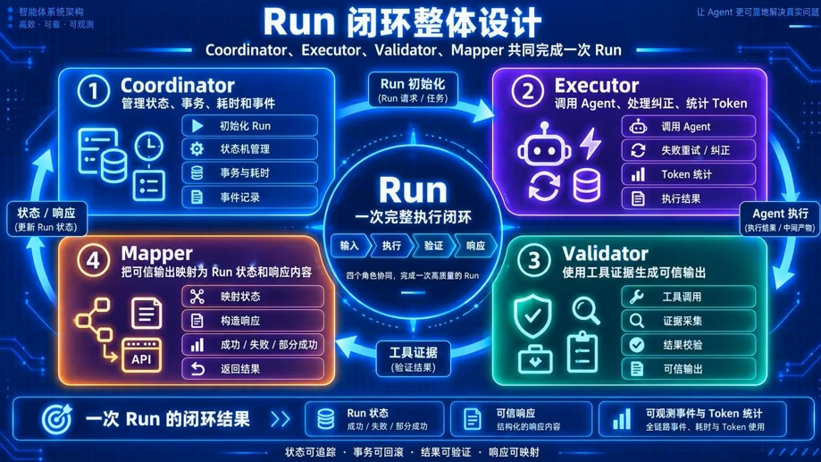

它们共同形成：

```text
运行开始
→ Agent 推理
→ 工具调用
→ 输出校验
→ 状态映射
→ 结果持久化
→ 事件返回
```

### 2. Run 完整执行流程

<span style="color:red">目标</span>：按照状态变化理解普通回答、页面决策和执行失败的不同出口。

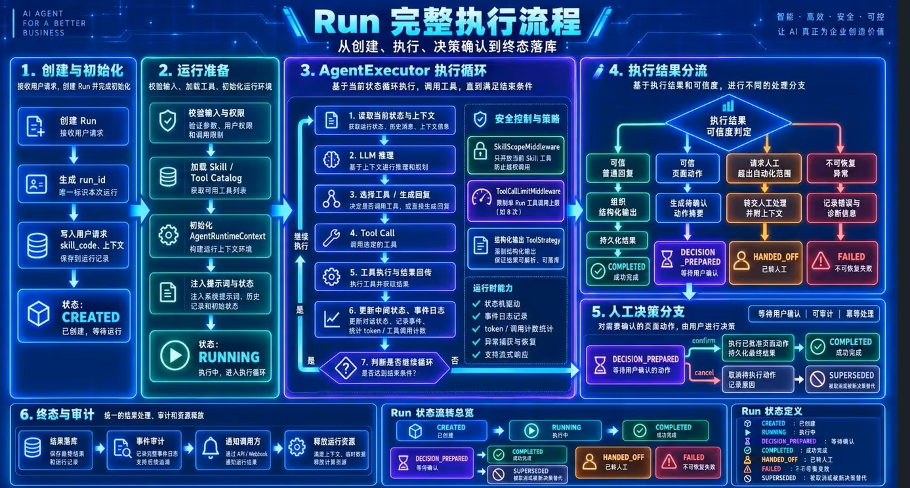

### 3. 执行并校验 Agent 输出

<span style="color:red">目标</span>：明确 AgentExecutor 负责执行，AgentOutputValidator 负责建立信任。

`AgentExecutor.execute()` 先编译消息，再创建 Token 回调：

```python
messages = self.context_compiler.compile_messages(request)
usage_callback = UsageMetadataCallbackHandler()
```

随后调用 Agent：

```python
raw_agent_output = await self.agent.ainvoke(
    {"messages": messages},
    context=runtime_context,
    config={"callbacks": [usage_callback]}
)
```

模型结果经过三步处理：

```text
原始 Agent 结果
→ ModelAdapter 解析 AgentOutput
→ AgentOutputValidator 校验
→ ValidatedAgentOutput
```

`ValidatedAgentOutput` 在模型协议上增加：

```python
class ValidatedAgentOutput(AgentOutput):
    page_action: PageAction | None = None
    token_usage: dict[str, int] = ...
```

其中：

- `page_action_request` 是模型意图；
- `page_action` 是服务端可信动作；
- `token_usage` 是执行器统计结果。

如果输出错误允许纠正，Executor 会保留当前轨迹并追加反馈，再调用一次模型。默认最多执行两次生成。

### 4. 限制工具调用次数

<span style="color:red">目标</span>：在模型发生工具循环时及时终止，避免一次 Run 无限消耗资源。

Agent 工厂注册：

```python
ToolCallLimitMiddleware(
    run_limit=8,
    exit_behavior="error"
)
```

达到上限时，LangChain 抛出 `ToolCallLimitExceededError`。Executor 不继续调用模型，而是返回固定结果：

```python
ValidatedAgentOutput(
    reply_type=ReplyType.DECLINE,
    reply_content=(
        "本次查询调用业务工具次数过多，"
        "暂时无法完成查询。"
    )
)
```

该结果是可安全展示的降级回复，因此 Run 最终进入 `COMPLETED`，而不是 `FAILED`。

```text
工具超限
→ 停止循环
→ 返回固定 DECLINE
→ 正常结束 Run
```

### 5. 生成页面动作决策

<span style="color:red">目标</span>：把模型提出的动作意图转换成服务端可信页面动作。

模型只能输出：

```json
{
  "action_code": "CANCEL_ORDER",
  "resource_id": "ORDER_001"
}
```

`PageActionValidator` 继续校验：

1. 动作编码必须存在于 `ACTION_CATALOG`；
2. 具体订单动作必须携带订单编号；
3. 当前 Run 必须成功调用过相同订单的 `get_order`；
4. 页面地址由服务端固定模板生成。

校验后得到：

```json
{
  "label": "前往取消订单",
  "description": "进入订单页面核对状态并确认取消",
  "href": "/me/orders/ORDER_001/cancel"
}
```

Mapper 将动作写入：

```text
result.content.action
```

只要可信输出中存在 `page_action`，Run 状态就映射为：

```text
DECISION_PREPARED
```

### 6. 确认与取消页面动作

<span style="color:red">目标</span>：使用两阶段状态流转表达“AI 提出页面引导，客户端决定是否采用”。

生成动作后，Run 尚未真正结束：

```text
RUNNING
→ DECISION_PREPARED
```

此时不设置 `finished_at`，表示仍在等待客户端决定。

客户端确认：

```text
POST /internal/v1/agent/runs/{run_id}/confirm
→ state = COMPLETED
→ 设置 finished_at
→ 返回 run_completed
```

客户端取消：

```text
POST /internal/v1/agent/runs/{run_id}/cancel
→ state = SUPERSEDED
→ 设置 finished_at
→ 返回 204
```

<span style="color:black"><strong>AI 只准备决策，客户端负责确认决策。</strong></span>

### 7. 统计并保存 Token 用量

<span style="color:red">目标</span>：统计一次 Run 中全部模型调用消耗，而不是只记录最后一次生成。

`UsageMetadataCallbackHandler` 挂载在整个 Agent 调用上，因此可以覆盖：

- Skill 路由；
- 工具调用后的继续推理；
- 结构化输出；
- 输出纠正。

执行完成后汇总：

```python
return {
    "input_tokens": sum(
        item.get("input_tokens", 0)
        for item in usage_items
    ),
    "output_tokens": sum(
        item.get("output_tokens", 0)
        for item in usage_items
    )
}
```

Token 先写入 `ValidatedAgentOutput`，再由 Coordinator 保存到 `AgentRun`：

```text
input_tokens
output_tokens
```

这种设计让 Token 与当前 Run 保持同一统计边界。

### 8. 提供管理员观测接口

<span style="color:red">目标</span>：通过汇总、列表和详情三个层次观测 Agent 运行情况。

管理员接口统一要求：

```python
get_auth_service().get_authorized_user(
    authorization,
    "admin"
)
```

系统提供三个接口：

```text
GET /api/v1/admin/metrics
→ Run 数量、平均耗时、输入 Token、输出 Token

GET /api/v1/runs
→ 最近 Run 的状态、模型、耗时和 Token

GET /api/v1/runs/{run_id}
→ Run 结果和工具调用详情
```

### 9. 前端展示运行详情

<span style="color:red">目标</span>：把后端观测数据组织成可用于联调和排查的管理界面。

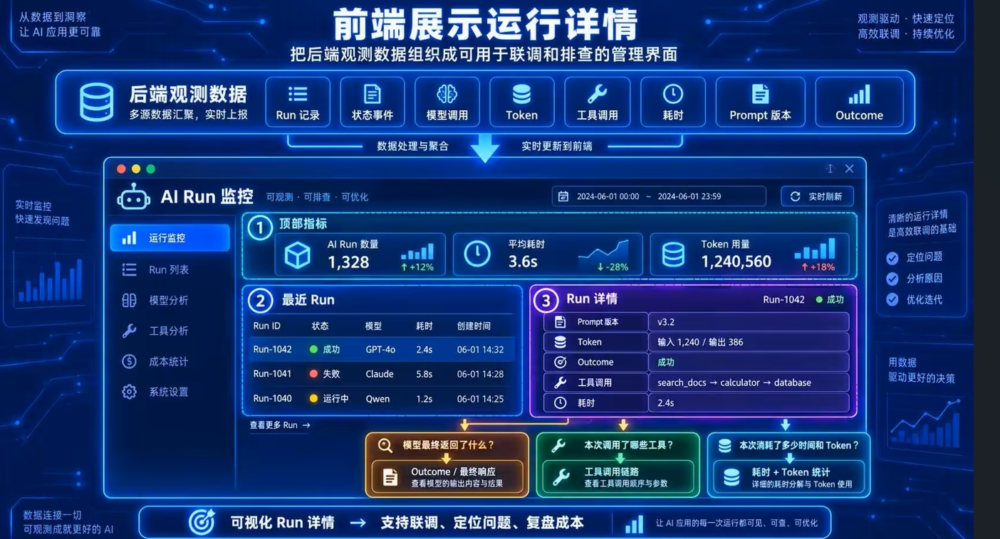

Run 详情用于回答三个问题：

```text
模型最终返回了什么？
本次调用了哪些工具？
本次消耗了多少时间和 Token？
```

### 10. 总结 Harness 全链路

<span style="color:red">目标</span>：从整体重新归纳 Day11 完成的生产级 Harness。

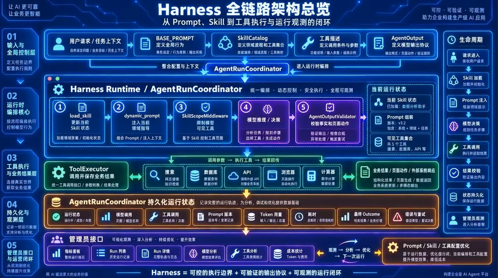

完整信任边界可以归纳为三层：

```text
第一层：提示边界
BASE_PROMPT + Skill guidance + 工具描述

第二层：执行边界
SkillScopeMiddleware + ToolCallLimitMiddleware

第三层：结果边界
数据模型 + AgentOutputValidator + Run 状态机
```

<span style="color:black"><strong>模型负责理解和生成，Skill 负责组织能力，中间件负责限制执行，工具负责提供事实，Validator 负责建立信任，Coordinator 负责完成闭环。</strong></span>

这就是生产级 Harness 全链路打通后的核心结构。
